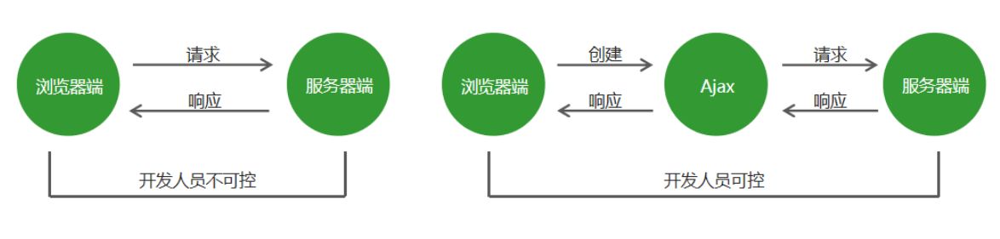
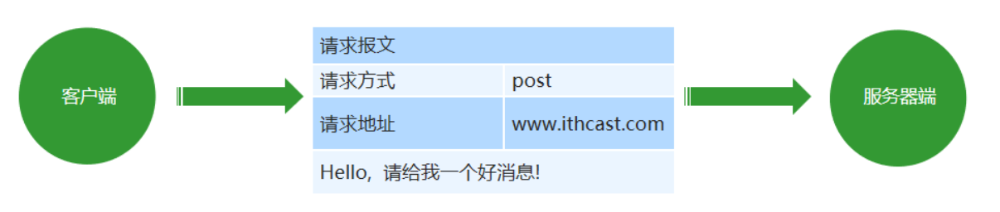
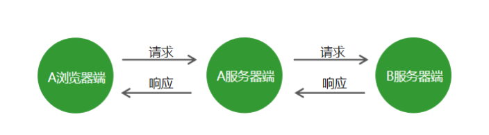

# 一、Ajax 基础

## 传统网站中存在的问题

-  网速慢的情况下，页面加载时间长，用户只能等待
- 表单提交后，如果一项内容不合格，需要重新填写所有表单内容
-  页面跳转，重新加载页面，造成资源浪费，增加用户等待时间

## Ajax 概述

Ajax：标准读音 [ˈeɪˌdʒæks] ，中文音译：阿贾克斯

它是浏览器提供的一套方法，可以实现页面无刷新更新数据，提高用户浏览网站应用的体验。

## Ajax 的应用场景

1. 页面上拉加载更多数据
2. 列表数据无刷新分页
3. 表单项离开焦点数据验证
4. 搜索框提示文字下拉列表

## Ajax 的运行环境

Ajax 技术需要运行在网站环境中才能生效，当前课程会使用Node创建的服务器作为网站服务器。


# 二、Ajax 运行原理及实现

## Ajax 运行原理

Ajax 相当于浏览器发送请求与接收响应的代理人，以实现在不影响用户浏览页面的情况下，局部更新页面数据，从而提高用户体验。




## Ajax 的实现步骤

### 1.创建 Ajax 对象

```
 var xhr = new XMLHttpRequest();
```

### 2.告诉 Ajax 请求地址以及请求方式

```
 xhr.open('get', 'http://www.example.com');
```

### 3.发送请求

```
 xhr.send();
```

### 4.获取服务器端给与客户端的响应数据

```
 xhr.onload = function () {
     console.log(xhr.responseText);
 }
```


```
<script type="text/javascript">
		// 1.创建ajax对象
		var xhr = new XMLHttpRequest();
		// 2.告诉Ajax对象要向哪发送请求，以什么方式发送请求
		// 1)请求方式 2)请求地址
		xhr.open('get', 'http://localhost:3000/first');
		// 3.发送请求
		xhr.send();
		// 由于客户端发送数据的时间是不确定的
		// 所以不能直接接受服务器发送过来的数据
		// 当接受完服务器发送结束后，会触发onload方法
		// 4.获取服务器端响应到客户端的数据
		xhr.onload = function (){
			//responseText属性存储的就是  服务器发送给客户端的相应数据
			console.log(xhr.responseText)
		}
</script>
```


## 服务器端响应的数据格式

在真实的项目中，服务器端大多数情况下会以 JSON 对象作为响应数据的格式。当客户端拿到响应数据时，要将 JSON 数据和 HTML 字符串使用**DOM的方式**进行拼接，然后将拼接的结果展示在页面中。

在 http 请求与响应的过程中，无论是请求参数还是响应内容，如果是对象类型，最终都会被转换为对象字符串进行传输。

```
 JSON.parse() // 将 json 字符串转换为json对象
```


```
<script type="text/javascript">
	// 1.创建ajax对象
	var xhr = new XMLHttpRequest();
	// 2.告诉Ajax对象要向哪发送请求，以什么方式发送请求
	// 1)请求方式 2)请求地址
	xhr.open('get', 'http://localhost:3000/responseData');
	// 3.发送请求
	xhr.send();
	// 4.获取服务器端响应到客户端的数据
	xhr.onload = function (){
		// console.log(typeof xhr.responseText)
		// 将JSON字符串转换为JSON对象
		var responseText = JSON.parse(xhr.responseText);
		// 测试：在控制台输出处理结果
		console.log(responseText)
		// 将数据和html字符串进行拼接
		var str = '<h2>'+ responseText.name +'</h2>';
		// 将拼接的结果追加到页面中
		document.body.innerHTML = str;
	}
</script>
```


## 请求参数传递

传统网站表单提交

```
 <form method="get" action="http://www.example.com">
     <input type="text" name="username"/>
     <input type="password" name="password">
 </form>
 <!– http://www.example.com?username=zhangsan&password=123456 -->
```

GET 请求方式

```
xhr.open('get', 'http://www.example.com?name=zhangsan&age=20');
```


```
<p>
		<input type="text" id="username">
	</p>
	<p>
		<input type="text" id="age">
	</p>
	<p>
		<input type="button" value="提交" id="btn">
	</p>
	<script type="text/javascript">
		// 获取按钮元素
		var btn = document.getElementById('btn');
		// 获取姓名文本框
		var username = document.getElementById('username');
		// 获取年龄文本框
		var age = document.getElementById('age');
		// 为按钮添加点击事件
		btn.onclick = function () {
			// 创建ajax对象
			var xhr = new XMLHttpRequest();
			// 获取用户在文本框中输入的值
			var nameValue = username.value;
			var ageValue = age.value;
			// 拼接请求参数
			var params = 'username='+ nameValue +'&age=' + ageValue;
			// 配置ajax对象
			xhr.open('get', 'http://localhost:3000/get?'+params);
			// 发送请求
			xhr.send();
			// 获取服务器端响应的数据
			xhr.onload = function () {
				console.log(xhr.responseText)
			}
		}
	</script>
```


POST 请求方式

POST请求参数不是放在地址栏中的，而是放在请求体中，在Ajax中，我们只需要将参数放在send方法中即可，

get请求方式和POST请求方式最大的不同是：POST请求必须在请求报文中明确设置请求参数内容的类型，也就是Content-Type属性，对于参数名称等于参数值，多个参数之间用&隔开的形式，内容的类型是application/x-www-form-urlencoded

```
// setRequestHeader用来设置请求报文
// 第一个参数是 报文请求名称  第二个参数是   报文属性对应的值
xhr.setRequestHeader('Content-Type', 'application/x-www-form-urlencoded') xhr.send('name=zhangsan&age=20');
```


```
<script type="text/javascript">
		// 获取按钮元素
		var btn = document.getElementById('btn');
		// 获取姓名文本框
		var username = document.getElementById('username');
		// 获取年龄文本框
		var age = document.getElementById('age');
		// 为按钮添加点击事件
		btn.onclick = function () {
			// 创建ajax对象
			var xhr = new XMLHttpRequest();
			// 获取用户在文本框中输入的值
			var nameValue = username.value;
			var ageValue = age.value;
			// 拼接请求参数
			var params = 'username='+ nameValue +'&age=' + ageValue;
			// 配置ajax对象
			xhr.open('post', 'http://localhost:3000/post');
			// 设置请求参数格式的类型（post请求必须要设置）
			xhr.setRequestHeader('Content-Type', 'application/x-www-form-urlencoded');
			// 发送请求
			xhr.send(params);
			// 获取服务器端响应的数据
			xhr.onload = function () {
				console.log(xhr.responseText)
			}
		}
	</script>
```


## 请求报文

在 HTTP 请求和响应的过程中传递的数据块就叫报文，包括要传送的数据和一些附加信息，这些数据和信息要遵守规定好的格式。



## 请求参数的格式

### 1.application/x-www-form-urlencoded

```
 name=zhangsan&age=20&sex=男
```

### 2.application/json

```
 {name: 'zhangsan', age: '20', sex: '男'}
```

在请求头中指定 Content-Type 属性的值是 application/json，告诉服务器端当前请求参数的格式是 json。

```
 JSON.stringify() // 将json对象转换为json字符串
```

**注意：get 请求是不能提交 json 对象数据格式的，传统网站的表单提交也是不支持 json 对象数据格式的。**


```
<script type="text/javascript">
		// 1.创建ajax对象
		var xhr = new XMLHttpRequest();
		// 2.告诉Ajax对象要向哪发送请求，以什么方式发送请求
		// 1)请求方式 2)请求地址
		xhr.open('post', 'http://localhost:3000/json');
		// 通过请求头告诉服务器端客户端向服务器端传递的请求参数的格式是什么
		xhr.setRequestHeader('Content-Type', 'application/json');
		// JSON.stringify() 将json对象转换为json字符串
		// 3.发送请求
		xhr.send(JSON.stringify({name: 'lisi', age:50}));
		// 4.获取服务器端响应到客户端的数据
		xhr.onload = function (){
			console.log(xhr.responseText)
		}
	</script>
```


## 获取服务器端的响应

### Ajax 状态码

在创建ajax对象，配置ajax对象，发送请求，以及接收完服务器端响应数据，这个过程中的每一个步骤都会对应一个数值，这个数值就是ajax状态码。

0：请求未初始化(还没有调用open())
1：请求已经建立，但是还没有发送(还没有调用send())
2：请求已经发送
3：请求正在处理中，通常响应中已经有部分数据可以用了
4：响应已经完成，可以获取并使用服务器的响应了

```
 xhr.readyState // 获取Ajax状态码
```

### onreadystatechange 事件

当 Ajax 状态码发生变化时将自动触发该事件。

在事件处理函数中可以获取 Ajax 状态码并对其进行判断，当状态码为 4 时就可以通过 xhr.responseText 获取服务器端的响应数据了。

```
 // 当Ajax状态码发生变化时
 xhr.onreadystatechange = function () {
     // 判断当Ajax状态码为4时
     if (xhr.readyState == 4) {
         // 获取服务器端的响应数据
         console.log(xhr.responseText);
     }
 }
```


```
<script type="text/javascript">
		var xhr = new XMLHttpRequest();
		// 0 已经创建了ajax对象 但是还没有对ajax对象进行配置
		console.log(xhr.readyState);
		xhr.open('get', 'http://localhost:3000/readystate');
		// 1 已经对ajax对象进行配置 但是还没有发送请求
		console.log(xhr.readyState);

		// 当ajax状态码发生变化的时候出发
		xhr.onreadystatechange = function() {
			// 2 请求已经发送了
			// 3 已经接收到服务器端的部分数据了
			// 4 服务器端的响应数据已经接收完成
			console.log(xhr.readyState);
			// 对ajax状态码进行判断 如果状态码的值为4就代表数据已经接收完成了
			if (xhr.readyState == 4) {
				console.log(xhr.responseText);
			}
		} 

		xhr.send();
		
	</script>
```


两种获取服务器端响应方式的区别

| **区别描述**           | **onload事件** | **onreadystatechange事件** |
| ---------------------- | -------------- | -------------------------- |
| 是否兼容IE低版本       | 不兼容         | 兼容                       |
| 是否需要判断Ajax状态码 | 不需要         | 需要                       |
| 被调用次数             | 一次           | 多次                       |

## Ajax 错误处理

在服务器端使用 res.status(400)进行设置http状态码

1.   网络畅通，服务器端能接收到请求，服务器端返回的结果不是预期结果。
     可以判断服务器端返回的状态码，分别进行处理。xhr.status 获取http状态码
2.   网络畅通，服务器端没有接收到请求，返回404状态码。
     检查请求地址是否错误。

3.   网络畅通，服务器端能接收到请求，服务器端返回500状态码。
服务器端错误，找后端程序员进行沟通。

4.   网络中断，请求无法发送到服务器端。
会触发xhr对象下面的onerror事件，在onerror事件处理函数中对错误进行处理。

```
<script type="text/javascript">
		var btn = document.getElementById('btn');

		btn.onclick = function () {
			// 1.创建ajax对象
			var xhr = new XMLHttpRequest();
			// 2.告诉Ajax对象要向哪发送请求，以什么方式发送请求
			// 1)请求方式 2)请求地址
			xhr.open('get', 'http://localhost:3000/error');
			// 3.发送请求
			xhr.send();
			// 4.获取服务器端响应到客户端的数据
			xhr.onload = function (){
				// xhr.status 获取http状态码
				console.log(xhr.responseText);

				if (xhr.status == 400) {
					alert('请求出错')
				}
			}
			// 当网络中断时会触发onerrr事件
			xhr.onerror = function () {
				alert('网络中断, 无法发送Ajax请求')
			}
		}

		// Ajax状态码: 表示Ajax请求的过程状态 ajax对象返回的
		// Http状态码: 表示请求的处理结果 是服务器端返回的
	</script>
```


**Ajax状态码: 表示Ajax请求的过程状态 ajax对象返回的**
**Http状态码: 表示请求的处理结果 是服务器端返回的**


## 低版本 IE 浏览器的缓存问题

问题：在低版本的 IE 浏览器中，Ajax 请求有严重的缓存问题，即在请求地址不发生变化的情况下，只有第一次请求会真正发送到服务器端，后续的请求都会从浏览器的缓存中获取结果。即使服务器端的数据更新了，客户端依然拿到的是缓存中的旧数据。

解决方案：在请求地址的后面加请求参数，保证每一次请求中的请求参数的值不相同。 

```
 xhr.open('get', 'http://www.example.com?t=' + Math.random());
```


```
<script type="text/javascript">
		var btn = document.getElementById('btn');

		btn.onclick = function () {
			// 1.创建ajax对象
			var xhr = new XMLHttpRequest();
			// 2.告诉Ajax对象要向哪发送请求，以什么方式发送请求
			// 1)请求方式 2)请求地址
			xhr.open('get', 'http://localhost:3000/cache?t=' + Math.random());
			// 3.发送请求
			xhr.send();
			// 4.获取服务器端响应到客户端的数据
			xhr.onreadystatechange = function (){
				if (xhr.readyState == 4 && xhr.status == 200) {
					alert(xhr.responseText);
				}
			}
			
		}
	</script>
```


# 三、Ajax 异步编程

## 同步异步概述

**同步**

-  一个人同一时间只能做一件事情，只有一件事情做完，才能做另外一件事情。
- 落实到代码中，就是上一行代码执行完成后，才能执行下一行代码，即代码逐行执行。

```
 console.log('before'); 
 console.log('after');
```


**异步**

- 一个人一件事情做了一半，转而去做其他事情，当其他事情做完以后，再回过头来继续做之前未完成的事情。
- 落实到代码上，就是异步代码虽然需要花费时间去执行，但程序不会等待异步代码执行完成后再继续执行后续代码，而是直接执行后续代码，当后续代码执行完成后再回头看异步代码是否返回结果，如果已有返回结果，再调用事先准备好的回调函数处理异步代码执行的结果。

```
 console.log('before');
 setTimeout(
    () => { console.log('last');
 }, 2000);
 console.log('after');
```


```
<script type="text/javascript">
		// 1.创建ajax对象
		var xhr = new XMLHttpRequest();
		// 2.告诉Ajax对象要向哪发送请求，以什么方式发送请求
		// 1)请求方式 2)请求地址
		xhr.open('get', 'http://localhost:3000/first', false);
		// 3.发送请求
		xhr.send();
		// 4.获取服务器端响应到客户端的数据
		xhr.onreadystatechange = function (){
			if (xhr.readyState == 4) {
				console.log('2')
				console.log(xhr.responseText)
			}
			
		}

		console.log('1');
	</script>
//输出结果
//1
//2
//请求参数
```


## Ajax 封装

问题：发送一次请求代码过多，发送多次请求代码冗余且重复。

解决方案：将请求代码封装到函数中，发请求时调用函数即可。

```
 ajax({ 
     type: 'get',
     url: 'http://www.example.com',
     success: function (data) { 
         console.log(data);
     }
 })
```


```
function ajax(options) {
    // 存储的是默认值
    var defaults = {
        type: 'get',
        url: '',
        data: {},
        header: {
            'Content-Type': 'application/x-www-form-urlencoded'
        },
        success: function () { },
        error: function () { }
    };

    // 使用options对象中的属性覆盖defaults对象中的属性
    Object.assign(defaults, options);

    // 创建ajax对象
    var xhr = new XMLHttpRequest();
    // 拼接请求参数的变量
    var params = '';
    // 循环用户传递进来的对象格式参数
    for (var attr in defaults.data) {
        // 将参数转换为字符串格式
        params += attr + '=' + defaults.data[attr] + '&';
    }
    // 将参数最后面的&截取掉
    // 将截取的结果重新赋值给params变量
    params = params.substr(0, params.length - 1);

    // 判断请求方式
    if (defaults.type == 'get') {
        defaults.url = defaults.url + '?' + params;
    }

    /*
    {
    name: 'zhangsan',
    age: 20
    }
    
    name=zhangsan&age=20
    
    */

    // 配置ajax对象
    xhr.open(defaults.type, defaults.url);
    // 如果请求方式为post
    if (defaults.type == 'post') {
        // 用户希望的向服务器端传递的请求参数的类型
        var contentType = defaults.header['Content-Type']
        // 设置请求参数格式的类型
        xhr.setRequestHeader('Content-Type', contentType);
        // 判断用户希望的请求参数格式的类型
        // 如果类型为json
        if (contentType == 'application/json') {
            // 向服务器端传递json数据格式的参数
            xhr.send(JSON.stringify(defaults.data))
        } else {
            // 向服务器端传递普通类型的请求参数
            xhr.send(params);
        }

    } else {
        // 发送请求
        xhr.send();
    }
    // 监听xhr对象下面的onload事件
    // 当xhr对象接收完响应数据后触发
    xhr.onload = function () {

        // xhr.getResponseHeader()
        // 获取响应头中的数据
        var contentType = xhr.getResponseHeader('Content-Type');
        // 服务器端返回的数据
        var responseText = xhr.responseText;

        // 如果响应类型中包含applicaition/json
        if (contentType.includes('application/json')) {
            // 将json字符串转换为json对象
            responseText = JSON.parse(responseText)
        }

        // 当http状态码等于200的时候
        if (xhr.status == 200) {
            // 请求成功 调用处理成功情况的函数
            defaults.success(responseText, xhr);
        } else {
            // 请求失败 调用处理失败情况的函数
            defaults.error(responseText, xhr);
        }
    }
}

ajax({
    type: 'post',
    // 请求地址
    url: 'http://localhost:3000/responseData',
    success: function (data) {
        console.log('这里是success函数');
        console.log(data)
    }
})

/*
请求参数要考虑的问题

1.请求参数位置的问题

将请求参数传递到ajax函数内部, 在函数内部根据请求方式的不同将请求参数放置在不同的位置

get 放在请求地址的后面

post 放在send方法中

2.请求参数格式的问题

application/x-www-form-urlencoded

参数名称=参数值&参数名称=参数值

name=zhangsan&age=20

application/json

{name: 'zhangsan', age: 20}

1.传递对象数据类型对于函数的调用者更加友好
2.在函数内部对象数据类型转换为字符串数据类型更加方便

*/
```


# 四、模板引擎（客户端）

## 模板引擎概述   

作用：使用模板引擎提供的模板语法，可以将数据和 HTML 拼接起来。

官方地址： https://aui.github.io/art-template/zh-cn/index.html

## 使用步骤

1. 下载 art-template 模板引擎库文件并在 HTML 页面中引入库文件

```
 <script src="./js/template-web.js"></script>
```

2. 准备 art-template 模板

```
 <script id="tpl" type="text/html">
     <div class="box"></div>
 </script>
```

3. 告诉模板引擎将哪一个模板和哪个数据进行拼接

```
 var html = template('tpl', {username: 'zhangsan', age: '20'});
```

4. 将拼接好的html字符串添加到页面中

```
 document.getElementById('container').innerHTML = html;
```

5. 通过模板语法告诉模板引擎，数据和html字符串要如何拼接

```
 <script id="tpl" type="text/html">
     <div class="box"> {{ username }} </div>
 </script>
```


```
<!DOCTYPE html>
<html lang="en">
<head>
	<meta charset="UTF-8">
	<title>Document</title>
	<!-- 1. 将模板引擎的库文件引入到当前页面 -->
	<script src="/js/template-web.js"></script>
</head>
<body>
	<div id="container"></div>
	<!-- 2.准备art-template模板 -->
	<script type="text/html" id="tpl">
		<h1>{{username}} {{age}}</h1>
	</script>
	<script type="text/javascript">
		// 3.告诉模板引擎将那个数据和哪个模板进行拼接
		// 1) 模板id 2)数据 对象类型
		// 方法的返回值就是拼接好的html字符串
		var html = template('tpl', {username: 'zhangsan', age: 30});
		document.getElementById('container').innerHTML = html;
	</script>
</body>
</html>
```


# 五、案例


# 六、FormData

## FormData 对象的作用

1.模拟HTML表单，相当于将HTML表单映射成表单对象，自动将表单对象中的数据拼接成请求参数的格式。

2.异步上传二进制文件

## FormData 对象的使用

1. 准备 HTML 表单

```
 <form id="form">
     <input type="text" name="username" />
     <input type="password" name="password" />
     <input type="button"/>
</form>
```

2. 将 HTML 表单转化为 formData 对象

```
var form = document.getElementById('form'); 
var formData = new FormData(form);
```

3. 提交表单对象

```
  xhr.send(formData);
```

注意：

- Formdata 对象不能用于 get 请求，因为对象需要被传递到 send 方法中，而 get 请求方式的请求参数只能放在请求地址的后面。

- 服务器端 bodyParser 模块不能解析 formData 对象表单数据，我们需要使用 formidable 模块进行解析。

## FormData 对象的实例方法

1. 获取表单对象中属性的值

```
 formData.get('key');
```

2. 设置表单对象中属性的值

```
 formData.set('key', 'value');
```

3. 删除表单对象中属性的值

```
 formData.delete('key');
```

4. 向表单对象中追加属性值

```
 formData.append('key', 'value');
```

注意：set 方法与 append 方法的区别是，在属性名已存在的情况下，set 会覆盖已有键名的值，append会保留两个值。

FormData 二进制文件上传

```
<input type="file" id="file"/>
```


```
 var file = document.getElementById('file')
// 当用户选择文件的时候
 file.onchange = function () {
     // 创建空表单对象
     var formData = new FormData();
     // 将用户选择的二进制文件追加到表单对象中
     formData.append('attrName', this.files[0]);
     // 配置ajax对象，请求方式必须为post
     xhr.open('post', 'www.example.com');
     xhr.send(formData);
 }
```


## FormData 文件上传进度展示

```
 // 当用户选择文件的时候
 file.onchange = function () {
     // 文件上传过程中持续触发onprogress事件
     xhr.upload.onprogress = function (ev) {
         // 当前上传文件大小/文件总大小 再将结果转换为百分数
         // 将结果赋值给进度条的宽度属性 
         bar.style.width = (ev.loaded / ev.total) * 100 + '%';
     }
 }
```

## FormData 文件上传图片即时预览

在我们将图片上传到服务器端以后，服务器端通常都会将图片地址做为响应数据传递到客户端，客户端可以从响应数据中获取图片地址，然后将图片再显示在页面中。

```
 xhr.onload = function () {
     var result = JSON.parse(xhr.responseText);
     var img = document.createElement('img');
     img.src = result.src;
     img.onload = function () {
         document.body.appendChild(this);
     }
 }
```


# 七、同源政策

## Ajax请求限制

Ajax 只能向自己的服务器发送请求。比如现在有一个A网站、有一个B网站，A网站中的 HTML 文件只能向A网站服务器中发送 Ajax 请求，B网站中的 HTML 文件只能向 B 网站中发送 Ajax 请求，但是 A 网站是不能向 B 网站发送 Ajax请求的，同理，B 网站也不能向 A 网站发送 Ajax请求。

## 什么是同源

如果两个页面拥有相同的协议、域名和端口，那么这两个页面就属于同一个源，其中只要有一个不相同，就是不同源。
`http://www.example.com/dir/page.html`

`http://www.example.com/dir2/other.html`：同源
`http://example.com/dir/other.html`：不同源（域名不同）
`http://v2.www.example.com/dir/other.html`：不同源（域名不同）
`http://www.example.com:81/dir/other.html`：不同源（端口不同）
`https://www.example.com/dir/page.html`：不同源（协议不同）

## 同源政策的目的

同源政策是为了保证用户信息的安全，防止恶意的网站窃取数据。最初的同源政策是指 A 网站在客户端设置的 Cookie，B网站是不能访问的。

随着互联网的发展，同源政策也越来越严格，在不同源的情况下，其中有一项规定就是无法向非同源地址发送Ajax 请求，如果请求，浏览器就会报错。

## 使用 JSONP 解决同源限制问题

jsonp 是 json with padding 的缩写，它不属于 Ajax 请求，但它可以模拟 Ajax 请求。

1. 将不同源的服务器端请求地址写在 script 标签的 src 属性中

```
 <script src="www.example.com"></script>
```


```
 <script src=“https://cdn.bootcss.com/jquery/3.3.1/jquery.min.js"></script>
```


2. 服务器端响应数据必须是一个函数的调用，真正要发送给客户端的数据需要作为函数调用的参数。

```
 const data = 'fn({name: "张三", age: "20"})';
 res.send(data);
```

3. 在客户端全局作用域下定义函数 fn

```
 function fn (data) { }
```

4. 在 fn 函数内部对服务器端返回的数据进行处理

```
 function fn (data) { console.log(data); }
```


```
//客户端代码
<!DOCTYPE html>
<html lang="en">
<head>
	<meta charset="UTF-8">
	<title>Document</title>
</head>
<body>
	<script type="text/javascript" src="/js/ajax.js"></script>
	<script type="text/javascript">
		ajax({
			url: 'http://localhost:3001/test',
			type: 'get',
			success: function (result) {
				console.log(result);
			}
		})
	</script>
</body>
</html>
```


```
//服务器端代码
app.get('/test', (req, res) => {
	const result = 'fn({name: "张三"})';
	res.send(result);
});
```


```
<!DOCTYPE html>
<html lang="en">
<head>
	<meta charset="UTF-8">
	<title>Document</title>
</head>
<body>
	<button id="btn">点我发送请求</button>
	<script>
		function fn2 (data) {
			console.log('客户端的fn函数被调用了')
			console.log(data);
		}
	</script>
	<script type="text/javascript">
		// 获取按钮
		var btn = document.getElementById('btn');
		// 为按钮添加点击事件
		btn.onclick = function () {
			// 创建script标签
			var script = document.createElement('script');
			// 设置src属性
			script.src = 'http://localhost:3001/better?callback=fn2';
			// 将script标签追加到页面中
			document.body.appendChild(script);
			// 为script标签添加onload事件
			script.onload = function () {
				// 将body中的script标签删除掉
				document.body.removeChild(script);
			}
		}
	</script>
</body>
</html>
```


## JSONP 代码优化

1. 客户端需要将函数名称传递到服务器端。

```
//客户端代码
<!DOCTYPE html>
<html lang="en">
<head>
	<meta charset="UTF-8">
	<title>Document</title>
</head>
<body>
	<button id="btn">点我发送请求</button>
	<script>
		function fn2 (data) {
			console.log('客户端的fn函数被调用了')
			console.log(data);
		}
	</script>
	<script type="text/javascript">
		// 获取按钮
		var btn = document.getElementById('btn');
		// 为按钮添加点击事件
		btn.onclick = function () {
			// 创建script标签
			var script = document.createElement('script');
			// 设置src属性
			script.src = 'http://localhost:3001/better?callback=fn2';
			// 将script标签追加到页面中
			document.body.appendChild(script);
			// 为script标签添加onload事件
			script.onload = function () {
				// 将body中的script标签删除掉
				document.body.removeChild(script);
			}
		}
	</script>
</body>
</html>
```


```
//服务器代码
app.get('/better', (req, res) => {
	// 接收客户端传递过来的函数的名称
	const fnName = req.query.callback;
	// 将函数名称对应的函数调用代码返回给客户端
	const data = JSON.stringify({name: "张三"});
	const result = fnName + '('+ data +')';
	res.send(result);
});
```


1. 将 script 请求的发送变成动态请求。
2. 封装 jsonp 函数，方便请求发送。
3. 服务器端代码优化之 res.jsonp 方法。


## CORS 跨域资源共享

CORS：全称为 Cross-origin resource sharing，即跨域资源共享，它允许浏览器向跨域服务器发送 Ajax 请求，克服了 Ajax 只能同源使用的限制。


```
 origin: http://localhost:3000
```


```
 Access-Control-Allow-Origin: 'http://localhost:3000'
 Access-Control-Allow-Origin: '*'
```


Node 服务器端设置响应头示例代码：

```
 app.use((req, res, next) => {
     res.header('Access-Control-Allow-Origin', '*');
     res.header('Access-Control-Allow-Methods', 'GET, POST');
     next();
 })
```


同源政策是浏览器给予Ajax技术的限制，服务器端是不存在同源政策限制。




## withCredentials属性

在使用Ajax技术发送跨域请求时，默认情况下不会在请求中携带cookie信息。

withCredentials：指定在涉及到跨域请求时，是否携带cookie信息，默认值为false

Access-Control-Allow-Credentials：true 允许客户端发送请求时携带cookie


# 八、jQuery 中的 Ajax

## $.ajax()

### $.ajax()方法概述

作用：发送Ajax请求。

```
 $.ajax({
     type: 'get',
     url: 'http://www.example.com',
     data: { name: 'zhangsan', age: '20' },
     contentType: 'application/x-www-form-urlencoded',
     beforeSend: function () { 
         return false
     },
     success: function (response) {},
     error: function (xhr) {}
});
```


```
 {
     data: 'name=zhangsan&age=20'
 }
```


```
 {
     contentType: 'application/json'
 }
```


```
JSON.stringify({name: 'zhangsan', age: '20'})
```


作用：发送jsonp请求。

```
$.ajax({
    url: 'http://www.example.com',
    // 指定当前发送jsonp请求
    dataType: 'jsonp',
    // 修改callback参数名称
    jsonp: 'cb',
    // 指定函数名称
    jsonCallback: 'fnName',
    success: function (response) {} 
})
```

### serialize方法

作用：将表单中的数据自动拼接成字符串类型的参数

```
var params = $('#form').serialize();
// name=zhangsan&age=30
```


```
<script type="text/javascript">
		$('#form').on('submit', function () {
			// 将表单内容拼接成字符串类型的参数
			// var params = $('#form').serialize();
			// console.log(params)
			serializeObject($(this));
			return false;
		});

		// 将表单中用户输入的内容转换为对象类型
		function serializeObject (obj) {
			// 处理结果对象
			var result = {};
			// [{name: 'username', value: '用户输入的内容'}, {name: 'password', value: '123456'}]
			var params = obj.serializeArray();

			// 循环数组 将数组转换为对象类型
			$.each(params, function (index, value) {
				result[value.name] = value.value;
			})
			// 将处理的结果返回到函数外部
			return result;
		}

	</script>
```


## $.get、$.post

作用：$.get方法用于发送get请求，$.post方法用于发送post请求。

```
$.get('http://www.example.com', {name: 'zhangsan', age: 30}, function (response) {}) $.post('http://www.example.com', {name: 'lisi', age: 22}, function (response) {})
```


## Todo案例

### 数据驱动DOM

就是先将数据存储在数组中，因为数组增删改查非常方便，只需要调用对应的方法即可，然后在使用模板引擎将数据显示在页面中。

## 全局事件

只要页面中有Ajax请求被发送，对应的全局事件就会被触发

```
.ajaxStart()     // 当请求开始发送时触发
.ajaxComplete()  // 当请求完成时触发
//这两个事件必须绑定在document下
// 当页面中有ajax请求发送时触发
$(document).on('ajaxStart', function () {
	NProgress.start() 
})

// 当页面中有ajax请求完成时触发
$(document).on('ajaxComplete', function () {
	NProgress.done() 
})
```


## nprogress进度条插件

官宣：纳米级进度条，使用逼真的涓流动画来告诉用户正在发生的事情！

### 安装

NPM

```
npm install nprogress
```

Yarn

```
yarn add nprogress
```

直接引入js、css或者通过cdn引入。

```
<script src='nprogress.js'></script>
<link rel='stylesheet' href='nprogress.css'/>
```

### 使用

直接调用 `start()`或者`done()`来控制进度条。

```
NProgress.start();
NProgress.done();
```

可以通过调用 `.set(n)`来设置进度，n是0-1的数字。

```
NProgress.set(0.0);     // Sorta same as .start()
NProgress.set(0.4);
NProgress.set(1.0);     // Sorta same as .done()
```

可以使用`inc()`随机增长进度条，注意，这个方法永远不会让进度条达到100%。

```
NProgress.inc();
```

通过使用`done()`让进度条关闭。

```
NProgress.done(true);
```


# 九、RESTful 风格的 API

## 传统请求地址回顾

```
GET http://www.example.com/getUsers         // 获取用户列表
GET http://www.example.com/getUser?id=1     // 比如获取某一个用户的信息
POST http://www.example.com/modifyUser      // 修改用户信息
GET http://www.example.com/deleteUser?id=1  // 删除用户信息
```

## RESTful API 概述

一套关于设计请求的规范。

GET：      获取数据
POST：    添加数据
PUT：      更新数据
DELETE： 删除数据

users => /users
articles => /articles 

## RESTful API 的实现

GET：http://www.example.com/users 获取用户列表数据

POST：http://www.example.com/users 创建(添加)用户数据

GET：http://www.example.com/users/1  获取用户ID为1的用户信息

PUT：http://www.example.com/users/1 修改用户ID为1的用户信息

DELETE：http://www.example.com/users/1 删除用户ID为1的用户信息

```
// 服务器端代码
// 获取用户列表信息
app.get('/users', (req, res) => {
	res.send('当前是获取用户列表信息的路由');
});

// 获取某一个用户具体信息的路由
app.get('/users/:id', (req, res) => {
	// 获取客户端传递过来的用户id
	const id = req.params.id;
	res.send(`当前我们是在获取id为${id}用户信息`);
});

// 删除某一个用户
app.delete('/users/:id', (req, res) => {
	// 获取客户端传递过来的用户id
	const id = req.params.id;
	res.send(`当前我们是在删除id为${id}用户信息`);
});

// 修改某一个用户的信息
app.put('/users/:id', (req, res) => {
	// 获取客户端传递过来的用户id
	const id = req.params.id;
	res.send(`当前我们是在修改id为${id}用户信息`);
});
```


```
// 客户端代码
<script type="text/javascript">
    // 获取用户列表信息
    $.ajax({
        type: 'get',
        url: '/users',
        success: function (response) {
        	console.log(response)
        }
    })

    // 获取id为1的用户信息
    $.ajax({
        type: 'get',
        url: '/users/1',
        success: function (response) {
        	console.log(response)
        }
    })

    // 获取id为1的用户信息
    $.ajax({
        type: 'delete',
        url: '/users/10',
        success: function (response) {
        	console.log(response)
        }
    })

    // 获取id为1的用户信息
    $.ajax({
        type: 'put',
        url: '/users/10',
        success: function (response) {
       		console.log(response)
        }
    })
</script>
```


# 十、XML 基础

## XML是什么

XML 的全称是 extensible markup language，代表可扩展标记语言，它的作用是传输和存储数据。

```
 <students> 
     <student>
         <sid>001</sid>
         <name>张三</name>
         </student>
     <student>
         <sid>002</sid>
         <name>王二丫</name>
         </student>
 </students>
```

## XML DOM

XML DOM 即 XML 文档对象模型，是 w3c 组织定义的一套操作 XML 文档对象的API。浏览器会将 XML 文档解析成文档对象模型。

```
// 客户端代码
<script type="text/javascript">
	var btn = document.getElementById('btn');
	var container = document.getElementById('container');
	btn.onclick = function () {
		var xhr = new XMLHttpRequest();
		xhr.open('get', '/xml');
		xhr.send();
		xhr.onload = function () {
			// xhr.responseXML 获取服务器端返回的xml数据
			var xmlDocument = xhr.responseXML;
			var title = xmlDocument.getElementsByTagName('title')[0].innerHTML;
			container.innerHTML = title;
		}
	}
</script>
```


```
// 服务器端代码
app.get('/xml', (req, res) => {
	res.header('content-type', 'text/xml');
	res.send('<message><title>消息标题</title><content>消息内容</content></message>')
});

```

