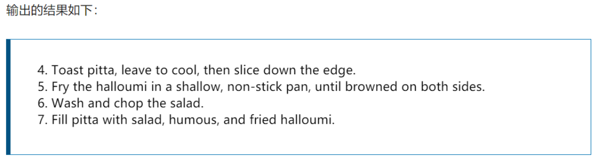

# 一、css简介

css是层叠样式表的（**Cascading Style Sheets**）的简称

也成为css样式表或者级联样式表

## 1.语法规范

选择器{

​	属性名：属性值；

}

选择器：用于指定css样式的html标签

属性和属性值以键值对的形式出现

属性是对指定的对象设置的样式属性   例如：字体大小、文本颜色等等

属性和属性值之间用":"分开

多个键值对之间用英文;进行区分

## 2.样式分格

### （1）紧凑格式

h3{ color:red; font-size:10px;}

### （2）展开格式

h3 {

​	color:red; 

​	font-size:10px;

}

### （3）样式大小写

属性和属性值全部使用小写字母有   特殊情况除外

### （4）空格规范

1.属性值前面，冒号后面，保留一个空格

2.选择器和花括号之间保留空格

# 二、css基础选择器

## 1.选择器分类

选择器分为基础选择器和复合选择器    

基础选择器：标签选择器、类选择器、id选择器和通配符选择器

## 2.标签选择器

标签选择器是指用html标签作为选择器，按标签名称分类，为页面标签指定统一的css样式

优点：可以把html页面某一类标签统一设置样式。

缺点：不能设计差异化样式   只能选择全部的当前标签

语法：

标签名 {

​	属性1：属性值；

​	属性2：属性值；

}

## 3.类选择器

可以差异化选择不同的标签     单独一个或者多个标签，都可以使用类选择器

语法：

.类名 {

​	属性1：属性值；

}

/<div class="属性1"></div>>

注意：

1.类选择器使用"."进行标识    后面紧跟类名

2.长名称或词组可以使用中横线来为选择器命名

3.不要使用纯数字、中文等命名

4.命名要有意义，使他人能看懂这个类名的意思

5.命名规范：查看规范手册

**6.可以定义多个类名**

## 4.id选择器

id选择器跟类选择器差不多

使用#加id名字定义的

id类似于身份证   在html文档中不能出现相同的id名字

## 5.通配符选择器

用通配符"*"来定义   它表示html页面中所有元素

语法

/ * {

​	属性1：属性值1；

}

# 三、字体属性

## 3.1 字体系列

css使用font-family属性定义文本的字体系列

尽量使用系统默认自带的字体  保证任何用户的浏览器都能正常显示

font-family：'字体种类名'；

### 1. 字体栈

由于你无法保证你想在你的网页上使用的字体的可用性 (甚至一个网络字体可能由于某些原因而出错), 你可以提供一个**字体栈** (**font stack**)，这样的话，浏览器就有多种字体可以选择了。只需包含一个`font-family属性`，其值由几个用逗号分离的字体名称组成。比如

```
p {
  font-family: "Trebuchet MS", Verdana, sans-serif;
}
```


## 3.2文字大小

font-size：xx  px；

谷歌浏览器字体默认大小16px

## 3.3字体粗细

font-weight：xxx；

属性值                     描述

normal                   默认值（不加粗）

bold                        定义粗体（加粗的）

100-900                  400等同于normal，700等同于bold   **后面不加单位**

实际开发中我们习惯使用数字表示粗细

## 3.4文字样式

font-style：

- normal： 

  指定文本字体样式为正常的字体 

- italic： 

  指定文本字体样式为斜体。对于没有设计斜体的特殊字体，如果要使用斜体外观将应用oblique 

- oblique： 

  指定文本字体样式为倾斜的字体。人为的使文字倾斜，而不是去选取字体中的斜体字 

## 3.5 font复合属性

font：font-style   font-weight    font-size/line-height    font-family；

**必须保留font-size 和font-family属性**

# 四、文本属性

## 4.1文本颜色

1.预定义的颜色值    red、green、blue、还有pink等等

2.十六进制     #fffff

3.RGB代码      rgb（255，0，0）或者rgb（100%，0%，0%）

## 4.2对齐文本

text-align   属性用于设置元素内文本内容的水平对齐方式

属性值                                 解释

left                                    左对齐（默认值）

right                                 右对齐

center                              居中对齐

justify							使文本展开，改变单词之间的差距，使所有文本行的宽度相同。你需要仔细使用，它可以										看起来很可怕。

## 4.3文字阴影text-shadow

你可以为你的文本应用阴影，使用 text-shadow 属性。

**取值：**

none： 无阴影

length ： 第1个长度值用来设置对象的阴影水平偏移值。可以为负值 

length ： 第2个长度值用来设置对象的阴影垂直偏移值。可以为负值 

length ：模糊半径 -提供了第3个长度值则用来设置对象的阴影模糊值。不允许负值 ；如果不包含此值，则默认为0，这意味着没有模糊。

color ：设置对象的阴影的颜色。阴影的基础颜色

```
text-shadow: -1px -1px 1px #aaa,
             0px 4px 1px rgba(0,0,0,0.5),
             4px 4px 5px rgba(0,0,0,0.7),
             0px 0px 7px rgba(0,0,0,0.4);
```


## 4.6.3装饰文本

### （1）text-decoration   简写属性

**text-decoration**：text-decoration-line || text-decoration-style || text-decoration-color

在css2.1中text-decoration相当于text-decoration-line

### （2）text-decoration-line   指定文本装饰的种类。

none：                          指定文字无装饰 

underline：                  指定文字的装饰是下划线 

overline：                    指定文字的装饰是上划线 

line-through：             指定文字的装饰是贯穿线 

blink：                          指定文字的装饰是闪烁。 

### （3）text-decoration-style    指定文本装饰的样式

solid：          实线 

double：      双线 

dotted：      点状线条 

dashed：     虚线 

wavy：         波浪线 

### （4）**text-decoration-color **     **指定元素文本装饰线条的颜色。** 

## 4.4文本缩进

text-indent   属性指定文本的第一行的缩进    段落的首行缩进

div {

​	text-indent：10px；

}

p  {

​	text-indent:  2em;

}

em是一个相对单位    相当当前元素（font-size）1个文字的大小     如果当前元素没有设置文字大小   则会按照父元素的1个文字大小

## 4.5 行间距   重点

line-height   用于设置行间的距离   也就是行高   可以控制文字行与行之间的距离


## 4.6 处理不同方向的文本

### 1. 书写模式

CSS中的书写模式是指文本的排列方向是横向还是纵向的。

`writing-mode`的三个值分别是：

| 属性值        | 含义                                     |
| ------------- | ---------------------------------------- |
| horizontal-tb | 块流向从上至下。对应的文本方向是横向的。 |
| vertical-rl   | 块流向从右向左。对应的文本方向是纵向的。 |
| vertical-lr   | 块流向从左向右。对应的文本方向是纵向的   |

当我们切换书写模式时，我们也在改变块和内联文本的方向。`horizontal-tb`书写模式下块的方向是从上到下的横向的，而 `vertical-rl`书写模式下块的方向是从右到左的纵向的。因此，块维度指的总是块在页面书写模式下的显示方向。而内联维度指的总是文本方向。 

这张图展示了在水平书写模式下的两种维度。


这张图片展示了纵向书写模式下的两种维度。


## 4.7 逻辑属性和逻辑值

### 1. 内联尺寸和块级尺寸

横向书写模式下，映射到`width`的属性被称作**内联尺寸**（`inline-size`）——内联维度的尺寸。而映射`height`的属性被称为**块级尺寸**（`block-size`），这是块级维度的尺寸。下面的例子展示了替换掉`width`的`inline-size`是如何生效的。

```
<div class="wrapper">
  <div class="box horizontal">
    <h2>Heading</h2>
    <p>A paragraph. Demonstrating Writing Modes in CSS.</p>
    <p>These boxes have inline-size.</p>
  </div>
  <div class="box vertical">
    <h2>Heading</h2>
    <p>A paragraph. Demonstrating Writing Modes in CSS.</p>
    <p>These boxes have inline-size.</p>
  </div>
</div>

<style>
.box {
  inline-size: 150px;
}

.horizontal {
  writing-mode: horizontal-tb;
}

.vertical {
  writing-mode: vertical-rl;
}
</style>
```


### 2.逻辑外边距、边框和内边距属性

`margin-top`、 `padding-left`、 `border-bottom`、width等属性属于物理属性

`margin-top`属性的映射是`margin-block-start`——总是指向块级维度开始处的边距。

`padding-left`，这是应用到内联开始方向（这是该书写模式文本开始的地方）上的内边距。`border-bottom`属性映射到的是`border-block-end`，也就是块级维度结尾处的边框。

### 3. 逻辑值

## 5. word-break 指定单词怎样断行

| 值             | 意义                                                         |
| -------------- | ------------------------------------------------------------ |
| **normal**     | 默认，不会中断英文单词（中文类型文字会换行）                 |
| **break-all**  | 所有文字都可以断开换行                                       |
| **keep-all**   | 所有文字都不会断开换行（包括中文类型）                       |
| **break-word** | 他的效果是`word-break: normal` 和 `overflow-wrap: anywhere` 的合，不论 overflow-wrap的值是多少。（如果一行能完整显示一个单词就显示，显示不了就中断换行） |

## 6. overflow-wrap 指定字符串怎样中断换行

​		是用来说明当一个不能被分开的字符串太长而不能填充其包裹盒时，为防止其溢出，浏览器是否允许这样的单词中断换行。

| 值             | 含义                                                         |
| -------------- | ------------------------------------------------------------ |
| **normal**     | 行只能在正常的单词断点处中断。（例如两个单词之间的空格）。不会将一个完整的单词断开。 |
| **anywhere**   | 在任何位置都会中断换行                                       |
| **break-word** | 表示如果行内没有多余的地方容纳该单词到结尾，则那些正常的不能被分割的单词会被强制分割换行。 |


# 五、css引入方式（**嵌入式引入**）

## 5.1内部样式表

将所有css代码抽取出来，单独放到一个<style>标签中

特点：

1.style：style标签理论上可以放在html文档的任何地方，一般放在head标签中

2.代码结构清晰     适用于平常练习时的方式

3.也被叫做**嵌入式引入**

## 5.2行内样式表**（行内式引入）**

行内样式表（内联样式表）实在元素标签内部的style属性中设定css样式    适用于修改简单的样式

/<div style="color:red; font-size:20px;">

特点：

1.style其实就是标签的属性

2.也叫做**行内式引入**

## 5.3外部样式表 （链接式引入）

/<link rel="stylesheet" href="文件路径">

属性                                   作用

rel                                    定义当前文档与被链接文档之间的关系，在这里需要指定为"stylesheet"  表示被链接的文										档是一个样式表文档

href                                 定义所链接外部样式表文件的URL，

# 六、Emmet语法

Emmet的前身时Zen coding   它使用缩写   来提高html/css的编写速度   Vscode内部集成了该语法

## （1）快速生成html结构语法

1.生成标签    直接输入标签名按tab键或者回车

2.如果想要生成多个相同标签可以加上*   比如div*3   

3.如果有父子级关系的标签，可以用>      比如ul>li

4.如果是兄弟关系  使用+   例如   div+p

5.如果生成带以后类名或者id名字的   可以直接写.demo或者 #two   回车键就可以

6.如果生成的div类名有顺序   可以使用自增符号$    .demo$*5

7.如果想要在生成的标签内部写内容可以用{}表示    div{dasdsa}   div{$}*5

## （2）快速生成css样式写法

css基本采用简写形式即可

1.比如w200    加回车    可以生成   width：200px；

2.比如lh26     加回车    可以生成    line-height:26px;

# 七、复合选择器

## 1.什么是复合选择器

css把选择器分为基础选择器和复合选择器     复合选择器就是在基础选择器之上  对基础选择器进行组合形成的

## 2.后代选择器

后代选择器又称为包含选择器   可以选择父元素里面的子元素 

语法

元素1 元素2 {

​	样式声明

}

特点 

1.元素1和元素2用空格隔开

2.元素1是父级，元素2是子级 

3.元素2可以是儿子，也可以是孙子等    只要是元素1的后代即可

4.元素1和元素2可以是任意基础选择器

## 3.子选择器（亲儿子选择器）

子元素选择器（子选择器）只能选择作为某元素最近一级子元素，简单理解就是只能选择亲儿子元素

语法：

元素1>元素2{

​	元素声明

}

特点：
1.元素1和元素2中间用大于号隔开

2.元素1是父级，元素2是子级，最终选择的是元素2

3.元素2必须是亲儿子，其孙子，重孙子类都选不了   也可以叫他亲儿子选择器

## 4.并集选择器

并集选择器可以选择多组标签        通常用于集体声明

语法：

元素1，元素2 {

​	样式声明

}

特点：

1.元素1和元素2中间用逗号隔开

2.逗号可以理解为和的意思

3.并集选择器通常用于集体声明

## 5.伪类选择器

伪类选择器用于向某些选择器添加特殊的效果   例如  给链接添加特殊效果  或选择第一个  第n个元素

### 5.1链接伪类选择器

a:link                    //选择所有未被访问的链接

a:visited               //选择所有已经被访问的链接

a:hover                //选择鼠标指针位于其上的链接

a:active               //选择活动链接（鼠标按下为弹起的链接）

注意事项：

再写链接伪类选择器时要按照LVHA的顺序声明：link、visited、hover、active

### 5.2 :focus伪类选择器    （表单元素）

:focus  伪类选择器用于选取获得焦点的表单元素

焦点就是光标    一般情况下input类表单元素才能获取   

语法：

input:focus {

​	background-color: red;

}

# 八、css元素显示模式

## 1.什么是元素显示模式

元素显示模式就是**元素（标签）以什么方式进行显示**    

html元素一般分为块元素和行内元素两种

## 2.块元素

常见的块元素 h标签、p标签、div标签、ul标签、ol标签、li标签  

特点：

1.比较霸道   自己独占一行

2.高度、宽度、外边距以及内边距都可以控制

3.宽度默认是容器（父级宽的）的100%

4.是一个容器及盒子，里面可以放行内或者块级元素

注意：

文字类的元素不能使用块级元素

p标签主要用于存放文字   因此p标签里面不能放块级元素   特别是不能放div

## 3.行内元素

常见的标签有a、strong、b、em、i、del、s、ins、u、span等   span是最典型的行内元素

有些地方也把行内元素称为内联元素

特点：

1.相邻元素在一行  一行可以显示多个

2.宽、高直接设置是无效的

3.默认宽度就是它本身内容的宽度

4.行内元素只能容纳文本或者其他行内元素

注意；

链接里面不能在放链接

特殊情况链接a里面可以放块级元素   但是给a转换一下块级模式最安全

## 4.行内块元素

在行内元素中有几个特殊的标签    img、input、td   他们同时拥有块元素和行内元素的特点

特点：

1.和相邻元素（行内块）在一行上  但是他们之间会有空白缝隙    一行可以显示多个

2.默认宽度就是它本身内容的宽度

3.高度、行高、外边距以及内边距都可以控制

## 5.元素显示模式转换

display：block   转换成块元素

display：inline   转换成行内元素

display：inline-block  转换成行内块元素

# 九、单行文字居中

使行高等于盒子的高度   就可以让当前盒子内文字水平居中

# 十、css的背景

## 1.背景颜色

background-color  属性定义元素的背景颜色

一般情况下元素背景颜色的默认值是   transparent（透明）  

## 2.背景图片

background-image   属性定义了元素的背景图像     

参数值                             作用

none                              无背景图

url                                  使用绝对路径或者相对路径指定背景图像

## 3.背景平铺

background-repeat    属性对背景图片进行平铺

参数值                                                       作用

repeat                                                  背景图像在纵向和横向上平铺

no-repeat                                            背景不平铺

repeat-x                                               背景图像在横向上平铺

repeat-y                                               背景图像在纵向上平铺44

## 4.背景图片位置

使用background-position  属性来改变图片在背景中的位置

background-position:   x     y;

参数代表的意思：x坐标    y坐标             可以使用方位名词或者精确单位

参数值                                       说明

length                                   百分数|由浮点数和单位标识符组成的长度值

position                                top|center|bottom|left|right方位名词

特点：

**使用方位名词时**

一般指定两个方位名词      方位名词顺序无关

如果指制定了一个方位名词  另一个省略    则第二个会默认居中对齐

**使用精确单位**

使用两个参数   第一个是x坐标   第二个是y坐标

如果只指定一个数值    那么该数值一定是x坐标    另一个默认垂直居中

**使用混合单位**

还可以使用混合单位

background-position：方位名词  精确单位   或者两个换一个位置都可以

一样    第一个是x坐标  第二个是y坐标

## 5.背景图像固定（背景附着）

background-attachment   属性设置背景图像是否固定或者随着页面的其余部分滚动

后期可以制作视差滚动的效果

background-attachment：scroll  |   fixed

| 属性名 | 属性值                                                       |
| ------ | ------------------------------------------------------------ |
| scroll | 背景图像随对象内容滚动                                       |
| fixed  | 背景图像固定                                                 |
| local  | IE9以上支持局部值将背景固定在设置的元素上，因此当您滚动元素时，背景也随之滚动。 |


## 6.背景符合写法

background  ： 背景颜色   背景图片地址   背景平铺   背景图像滚动    背景图片位置

## 7.背景色半透明

background：rgba（0，0，0，0.3）

最后一个参数是alpha透明度    取值范围在0-1之间

我们习惯把0.3的0去掉    写成.3

注意  ： 背景半透明是指盒子背景半透明  盒子里面的内容不受影响

css3新增属性      是 IE9+版本浏览器才支持

## 8.渐变背景

```
.a {
  background-image: linear-gradient(105deg, rgba(0,249,255,1) 39%, rgba(51,56,57,1) 96%);
}

.b {
  background-image: radial-gradient(circle, rgba(0,249,255,1) 39%, rgba(51,56,57,1) 96%);
  background-size: 100px 50px;
}
```


## 9. 多个背景图像

```
.box {
  background-image: url(big-star.png),url(star.png);
  background-repeat: no-repeat,no-repeat;
}
```


​	先写的图片在上方

# 十一、css的三大特性

## 1.层叠性

相同选择器设置相同的样式    另外一个样式就会覆盖（层叠）另一个冲突的样式    层叠性主要解决样式冲突的问题

层叠性原则：

样式冲突。遵循的原则是**就近原则**  那个样式距离结构近  就执行哪个样式

样式不冲突   不会层叠

## 2.继承性

css的继承：子标签会继承父标签的某些样式    如文本颜色 和字号   简单理解：子承父业

特点：

恰当的使用继承可以简化代码  降低css样式的复杂性

子元素可以继承父元素的样式（text-、font-、line-、这些元素开头的都可以继承  以及color属性）

## 3.行高的继承性

```
body{

	font: 12px/1.5 Microsoft YaHei ;

}
```

特点：

行高可以跟单位也可以不跟单位    

如果子元素没有设置行高   则会继承父元素的行高为1.5

此时的子元素的行高是：当前子元素的文字大小*1.5

body行高1.5  这样写法最大的优势是里面的子元素可以根据自己文字大小自动调整行高

## 4.优先级

当同一个元素指定多个选择器   就会由优先级的产生

选择器相同    执行层叠性

选择器不同      根据选择器权重执行

| 选择器               | 选择器权重 |
| -------------------- | ---------- |
| 继承或者*            | 0          |
| 元素选择器           | 1          |
| 类选择器、伪类选择器 | 10         |
| ID选择器             | 100        |
| 行内样式style=""     | 1000       |
| !important  重要的   | 无穷大     |

```
div {
	color: pink!important;
}                
```

注意：

继承的权重是0      如果该元素没有直接选中    不管父元素权重多高    子元素得到的权重都是0

# 十二、盒子模型

## 1.网页布局的本质

网页布局过程：

1.先准备好相关的网页元素     网页元素基本都是盒子Box

2.利用css设置好盒子样式   然后摆放到相应位置

3.往盒子里面装内容

本质就是   利用css摆盒子

## 2.盒子模型组成

所谓盒子模型   就是把html页面中的布局元素看成一个矩形的盒子    也就是一个装内容的容器

css盒子模型本质上是一个盒子    封装周围的html元素   它包括：边框、外边距、内边距、和实际内容

## 3.边框（border）

border： border-width     border-style    border-color

border-style    solid   实线边框           dashed   虚线边框      dotted   点线边框

## 4.表格的细线边框

border-collapse    属性控制浏览器绘制表格边框的样式     控制相邻单元格的边框

语法：

border-collapse ：collapse ；//表示相邻边框合并在一起

collapse 是合并的意思

## 5.内边距（padding）

padding属性用于设置内边距    即边框与内容之间的距离

padding-left               padding-right    padding-top     padding-bottom

符合写法：

padding  ：5px                                    一个值   代表上下左右都是5px内边距

padding：5px    10px                         两个值    代表上下内边距是5px   左右内边距是10px

padding：5px     10px   20px             三个值     代表上内边距是5px   左右内边距是10px  下内边距是20px

padding：5px  5px  5px  5px             四个值      代表上右下左    顺时针的方向

## 6.内边距不会撑大盒子的情况

如果盒子本身没有指定width/height  属性    则此时padding不会撑大盒子

## 7.外边距（margin）

margin属性用于设置外边距     控制盒子和盒子之间的距离

margin和padding写法一样

### 外边距典型应用

#### 1. 块级盒子水平居中

**外边距可以让块级盒子水平居中**      需要满足两个条件

1.盒子必须有宽度

2.盒子左右外边距都设置为auto

```
常见的写法：
margin-left: auto; margin-right:auto;
margin: auto;
margin: 0 auto;
```

#### 2. 行内元素、行内块元素水平居中

可以将行内元素、行内块元素看成文字。	

**如果给行内元素或者行内块元素进行水平居中    可以给父级元素添加text-align:center即可**

#### 3. 外边距合并

##### 相邻块元素垂直外边距的合并

当上下相邻的两个块元素（兄弟关系）相遇时，如果上面的元素有下外边距margin-bottom，下面的元素有上外边距margin-top，则它们之间的垂直间距不是margin-bottom与margin-top之和。取两个值中的较大值这个现象称为**相邻块元素垂直外边距的合并**

解决方案：**只给一个盒子添加margin值**

##### 嵌套块元素垂直外边距的塌陷

对于两个嵌套关系（父子关系）的块元素    父元素有上外边距同时子元素也有上外边距     此时父元素会塌陷较大的外边距值

解决方案

1. 可以为父级元素添加上边框

2. 可以为父元素定义上内边距

3. 可以为父元素添加overflow:hidden

   还有其他方法   比如浮动、固定、绝对定位的盒子不会有塌陷问题  

## 8. 清除内外边距

```
* {
	padding: 0;
	margin: 0;
}
```

注意：行内元素为了照顾兼容性，尽量只设置左右内外边距，不要设置上下内外边距。可以转换成块级元素或者行内块元素就可以了。

## 9. 圆角边框 css3

border-radius 属性用于设置元素的外边框圆角

```
border-radius: length;
```

radius 半径（圆的半径）：（椭）圆与边框的交集形成圆角效果

- 参数值可以为数值或者百分比的形式
- 圆角矩形：半径为高度的一般即可，或者直接写50%
- 该属性是一个简写属性，四个值分别为：左上角、右上角、右下角、左下角。（顺时针）
- 分开写：border-top-left-radius等等

## 10. 盒子阴影

语法：

```
box-shadow: h-shadow v-shadow blur spread color inset;
```

| 值       | 描述                                   |
| -------- | -------------------------------------- |
| h-shadow | 必需。水平阴影的位置，允许负值         |
| v-shadow | 必需。垂直阴影的位置，允许负值         |
| blur     | 可选。模糊距离                         |
| spread   | 可选。阴影的尺寸                       |
| color    | 可选。阴影颜色                         |
| inset    | 可选。将外部阴影（outset）改为内部阴影 |

注意：

1. 默认的是外阴影（outset），但是不可以写这个单词，否则会导致阴影无效
2. 盒子阴影不占用空间，不会影响其他盒子排列

## 11. 文字阴影

```
text-shadow: h-shadow v-shadow blur color
```

| 值       | 描述                           |
| -------- | ------------------------------ |
| h-shadow | 必需。水平阴影的位置，允许负值 |
| v-shadow | 必需。垂直阴影的位置，允许负值 |
| blur     | 可选。模糊距离                 |
| color    | 可选。阴影颜色                 |

# 十三、浮动

## 1. 传统网页布局的三种方式

css提供了三种传统布局方式（简单来说就是盒子如何进行排列顺序）

- 普通流
- 浮动
- 定位

### 标准流

所谓标准流：就是标签按照规定好的默认方式排列

1. 块级元素会独占一行，从上向下顺序排列
   - 常用元素：div、hr、p、h1-h6、ul、ol、dl、form、table
2. 行内元素会按照顺序，从左到右排列，碰到父元素边缘会自动换行
   - 常用元素：span、a、i、em等

## 2. 浮动

float 属性用于创建浮动框，将其移动到一边，直到左侧边缘或者右侧边缘触及包含块和另一个浮动框的边缘

语法：

```
选择器 {
	float: 属性值;
}
```

| 属性值 | 描述                 |
| ------ | -------------------- |
| none   | 元素不移动（默认值） |
| left   | 元素向左移动         |
| right  | 元素向右侧移动       |

## 3. 浮动特性

### 1. 浮动元素会脱离标准流（脱标）

- ​	脱离标准普通流的控制（浮）移动到指定位置（动），（俗称脱标）
- ​	浮动的盒子**不再保留原先的位置**

### 2. 浮动的元素会一行内显示并且元素顶部对齐

浮动的元素是互相贴靠在一起的（不会有缝隙），如果父级宽度装不下这些浮动的盒子，多出的盒子会另起一行对齐

### 3. 浮动的元素会具有行内块的特性

任何元素都可以浮动。不管原先是什么模式，添加浮动之后都具有**行内块元素**相似的特性

如果行内元素设置了浮动，则不需要转换成块级元素 / 行内块元素

### 4. 浮动元素经常和标准流父级搭配使用

为了越是浮动元素位置，我们网页布局一般采取的策略是：

**先用标准流的父级元素排列上下位置，之后内部子元素采取浮动排列左右位置，符合网页布局第一准则**

## 4.浮动布局注意点

### 1. 浮动和标准流的父盒子搭配

**先用标准流的父级元素排列上下位置，之后内部子元素采取浮动排列左右位置**

### 2. 一个元素浮动了，理论上其余的兄弟元素也要浮动

**浮动的盒子只会影响浮动盒子后面的标准流，不会影响前面的标准流**

## 5. 清除浮动

### 1. 为什么清除浮动？

由于父级盒子在很多时候不方便给高度，但是子盒子浮动又不占有位置，最后父级盒子高度为0时，就会影响下面的标准流盒子。


- 由于浮动元素不在占有原文档流的位置，所以它会对后面的元素排版产生影响

### 2. 清楚浮动本质

- 清除浮动的本质是清除浮动元素造成的影响
- 如果父级盒子本身有高度，则不需要清除浮动
- **清除浮动之后，父级就会根据浮动的子盒子自动检测高度。父级有了高度，就不会影响下面的标准流了**

```
选择器{
	clear: 属性值;
}
```

| 属性值 | 描述                                       |
| ------ | ------------------------------------------ |
| left   | 不允许左侧有浮动元素（清除左侧浮动的影响） |
| right  | 不允许右侧有浮动元素（清除右侧浮动的影响） |
| both   | 同时清除左右两侧浮动的影响                 |

### 3. 清除浮动方法

1. 额外标签法（隔墙法），是w3c推荐的做法

   额外标签法会在浮动元素末尾添加一个空的标签。例如`<div style="clear:both"></div>`或者其他标签

   ```
   <style>
   	div {
   		float: left;
   	}
   	.last {
   		clear: both;
   	}
   </style>
   <div>
       <div></div>
       <div></div>
       <div class="last"></div>
   </div>
   ```

   - 优点：通俗易懂，书写方便
   - 缺点：添加许多无意义的标签，结构化较差
   - 注意：**要求这个新的空标签必须是块级元素**

   

2. 父级添加overflow属性

   可以为父级元素添加**overflow属性**，将其属性值设置为hidden、auto或scroll

   - 优点：代码简洁
   - 缺点：无法显示溢出的部分

3. 父级添加after伪元素

   :alter 方式是额外标签发的升级版。也是给父元素添加

   ```
   .clearfix:after {
   	context: ""; //伪元素必须要写的属性
   	display: block;   //插入的元素必须是块级
   	height: 0;  //不要看见这个元素
   	clear: both;  //核心代码清除浮动
   	visibility: hidden;  //不要看见这个元素
   }
   .ckearfix {
   	//IE6、7专有
   	*zoom: 1;
   }
   ```

   - 优点：没有增加标签，结构更简单
   - 缺点：照顾低版本浏览器
   - 代表网站：百度、淘宝、网易

4. 父级添加双伪元素

```
.clearfix:before, .clearfix:after {
	content: "";
	display: table; //不能转换成跨级元素，因为如果是块级元素，它们就会摞起来显示，table是将它们转换为表格，一行内显示。相当于转换为块级元素并且一行内显示
}
.clearfix:after {
	clear: both;
}
.ckearfix {
	//IE6、7专有
	*zoom: 1;
}
```

- 优点：代码更简洁
- 缺点：照顾低版本浏览器
- 代表网站：小米、腾讯等

# 十四、定位

## 1. 为什么需要定位

1. 浮动可以让多个块级盒子一行没有缝隙的排列显示，经常用于横向排列盒子
2. 定位则是可以让盒子自由的在某个盒子内移动位置或者固定屏幕中的某个位置，可以压住其他盒子

## 2. 定位组成

定位：将盒子定在某一个位置，所以定位也是在摆放盒子，按照定位的方式移动盒子

定位 = 定位模式 + 边偏移

定位模式用于指定一个元素在文档中的定位方式。边偏移决定了改元素的最终位置

### 定位模式

通过position属性来设置

| 值       | 语义     |
| -------- | -------- |
| static   | 静态定位 |
| relative | 相对定位 |
| absolute | 绝对定位 |
| fixed    | 固定定位 |

### 边偏移

边偏移就是定位的盒子移动到的最终位置。有top、bottom、left、right 四个属性

## 3. 静态定位 static

静态定位是元素的默认定位方式，没有定位的意思

- 静态定位按照标准流特性摆放位置，没有边偏移

## 4. 相对定位relative

相对定位是元素在移动位置的时候，相对于它原来的位置来进行移动的

- 他是相对于自身来移动的（**移动位置参照点是自身原来的位置**）
- 原来在标准流的位置继续占有，后面的盒子仍然以标准流的方式对待它（不脱标，继续保留原先的位置）

## 5. 绝对定位

绝对定位是元素在移动位置的时候，相对于它的祖先元素来说的

- 如果祖先元素没有定位，则以浏览器为准进行定位（Document文档）
- 如果祖先元素有定位，则以最近一级有定位祖先元素为参考点移动位置
- 绝对定位不在占有原先的位置（脱标）

## 6. 子绝父相

- 子级绝对定位，不会占有位置，可以放到父级盒子任何一个地方，不会影响其他的兄弟盒子
- 父子需要加定位限制子盒子在父盒子内显示
- 父盒子布局时，需要占有位置，因此父亲只能是相对定位

总结：父级需要占有位置，因此是相对定位，子盒子不需要占有位置，则是绝对定位

## 7. 固定定位 fixed

固定定位是元素固定于浏览器可视区的位置。主要应用场景：可以在浏览器页面滚动时元素的位置不会改变

- 以浏览器的可视窗口为参考点移动元素
- 跟父元素没有任何关系
- 不随滚动条滚动
- 固定定位不在占有原先位置

固定定位小技巧：固定在版心右侧位置

- 让固定定位的盒子left：50%
- 让固定定位的盒子margin-left: 版心宽度的一半距离

## 8. 粘性定位 sticky  （IE不支持）

粘性定位可以被认为是相对定位和固定定位的混合

- 以浏览器的可视窗口为参考点移动元素（固定定位特点）
- 粘性定位占有原先的位置
- 必须添加top、left、right、bottom其中一个才有效

```
<div></div>
<div class="s"></div>
<div></div>
<div></div>

<style>
    div {
        width: 500px;
        height: 500px;
        margin: 10px;
        background-color: pink;
    }

    .s {
        position: sticky;
        top: 0px;
    }
</style>
```

## 9. 定位叠放次序 z-index

使用z-index来控制盒子的前后次序   决定谁在上面，谁在下面

```
选择器 {
	z-index: 1;
}
```

- 数值可以是正整数、负整数或者0；默认值是auto，数值越大，盒子越靠上
- 如果属性值相同，则按照书写顺序，后来居上
- 数值后面不可以加单位
- 只有定位的盒子才有z-index属性

## 10. 定位拓展

### 1. 定位盒子的居中

#### 绝对定位的盒子居中

加了绝对定位的盒子不能通过margin: 0 auto水平居中，但是可以通过一下计算方法实现水平和垂直居中

- left: 50%;  让盒子左侧移动到父级元素的水平中心位置
- margin-left:-100px;  让盒子向左移动自身宽度的一半

### 2.定位特殊特性

绝对定位和固定定位也和浮动类似

- 行内元素添加绝对或者固定定位，可以直接设置宽度和高度
- 块级元素添加绝对或者固定定位，如果不给宽度或者高度，默认大小是内容的大小

### 3. 脱标的盒子不会触发外边距塌陷

浮动元素、绝对定位（固定定位）元素都不会触发外边距合并的问题

### 4. 绝对定位（固定定位）会完全压住盒子

浮动元素不同，只会压住它下面标准流的盒子，但是不会压住下面标准流盒子里面的文字（图片）

但是绝对定位（固定定位）会压住下面标准流所有的内容

浮动之所以不会压住文字，因为浮动产生的目的最初是为了做文字环绕效果的。文字会围绕浮动元素

# 十五、元素的显示与隐藏

## 1. display 属性

display属性用于设置一个元素应该如何显示。

- display:none  隐藏对象
- display:block  除了转换为块级元素之外，还有显示元素的意思

display隐藏元素之后，不在占有原来的位置

## 2. visibility 可见性

visibility  属性用于指定一个元素应可见还是隐藏

- visibility:visible;   元素可视
- visibility: hidden; 元素隐藏

如果隐藏元素想要占有原来的位置，就用visibility: hidden 

如果隐藏元素不想占有原来的位置，就用display:none

## 3. overflow 溢出隐藏

overflow 属性指定了如果内容溢出一个元素的框（超过其指定高度及宽度）时，会发生什么

| 属性值  | 描述                                       |
| ------- | ------------------------------------------ |
| visible | 不剪切内容也不添加滚动条                   |
| hidden  | 不显示超过对象尺寸的内容，超出的部分隐藏掉 |
| scroll  | 不管超出内容否，总是显示滚动条             |
| auto    | 超出自动显示滚动条，不超出不显示滚动条     |

一般情况下，我们都不想让溢出的内容显示出来，因为溢出的部分会影响布局

但是如果有定位的盒子，请慎用overflow: hidden  因为它会隐藏多余的部分

可以使用`overflow-y`属性，设置`overflow-y: scroll`来仅在`y`轴方向滚动。

# 十六、单位

## 1. 长度

### 1. 绝对长度单位

它们与其他任何东西都没有关系，通常被认为总是相同的大小。

| 单位 | 名称         | 等价换算            |
| :--- | :----------- | :------------------ |
| `cm` | 厘米         | 1cm = 96px/2.54     |
| `mm` | 毫米         | 1mm = 1/10th of 1cm |
| `Q`  | 四分之一毫米 | 1Q = 1/40th of 1cm  |
| `in` | 英寸         | 1in = 2.54cm = 96px |
| `pc` | 十二点活字   | 1pc = 1/16th of 1in |
| `pt` | 点           | 1pt = 1/72th of 1in |
| `px` | 像素         | 1px = 1/96th of 1in |

### 2. 相对长度单位

相对长度单位相对于其他一些东西，比如父元素的字体大小，或者视图端口的大小。

| 单位   | 相对于                                                       |
| :----- | :----------------------------------------------------------- |
| `em`   | 在 font-size 中使用是相对于父元素的字体大小，在其他属性中使用是相对于自身的字体大小，如 width |
| `ex`   | 字符“x”的高度                                                |
| `ch`   | 数字“0”的宽度                                                |
| `rem`  | 根元素的字体大小                                             |
| `lh`   | 元素的line-height                                            |
| `vw`   | 视窗宽度的1%                                                 |
| `vh`   | 视窗高度的1%                                                 |
| `vmin` | 视窗较小尺寸的1%                                             |
| `vmax` | 视图大尺寸的1%                                               |

## 2. 调整大小

###  1.设置具体大小

我们当然可以给设计中的元素指定具体大小。 当给元素指定尺寸（然后其内容需要适合该尺寸）时，我们将其称为**外部尺寸**。以 `<div>` 举例 — 我们可以给它一个具体的 `width` 和 `height` 值, 然后不论我们放什么内容进去它都是该尺寸。 

# 十七、列表特定样式

## 1. list-style-type

设置用于列表的项目符号的类型，例如无序列表的方形或圆形项目符号，或有序列表的数字，字母或罗马数字。

## 2.list-style-position

属性指定标记框在主体块框中的位置。设置在每个项目开始之前，项目符号是出现在列表项内，还是出现在其外。

## 3.list-style-image 

允许您为项目符号使用自定义图片，而不是简单的方形或圆形。

```
ul {
  list-style: square url(example.png) inside; //合写属性
}
```

## 4.管理列表计数

### start 属性允许你从1 以外的数字开始计数。

```
<ol start="4">
  <li>Toast pitta, leave to cool, then slice down the edge.</li>
  <li>Fry the halloumi in a shallow, non-stick pan, until browned on both sides.</li>
  <li>Wash and chop the salad.</li>
  <li>Fill pitta with salad, humous, and fried halloumi.</li>
</ol>
```



### reversed 属性将启动列表倒计数。

```
<ol start="4" reversed>
  <li>Toast pitta, leave to cool, then slice down the edge.</li>
  <li>Fry the halloumi in a shallow, non-stick pan, until browned on both sides.</li>
  <li>Wash and chop the salad.</li>
  <li>Fill pitta with salad, humous, and fried halloumi.</li>
</ol>
```


### value属性允许设置列表项指定数值

```
<ol>
  <li value="2">Toast pitta, leave to cool, then slice down the edge.</li>
  <li value="4">Fry the halloumi in a shallow, non-stick pan, until browned on both sides.</li>
  <li value="6">Wash and chop the salad.</li>
  <li value="8">Fill pitta with salad, humous, and fried halloumi.</li>
</ol>
```


