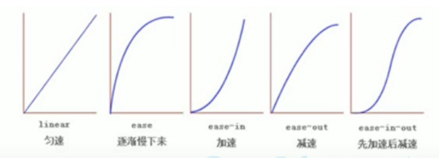
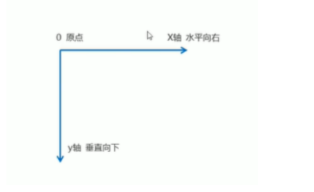

# css3新特性

## 1. 属性选择器

属性选择器可以根据元素特定属性来选择元素。

|                |      |                                                              |
| -------------- | ---- | ------------------------------------------------------------ |
| E[att]         | CSS2 | 选择具有att属性的E元素。                                     |
| E[att="val"]   | CSS2 | 选择具有att属性且属性值等于val的E元素。                      |
| E[att~="val"]  | CSS2 | 选择具有att属性且属性值为一用空格分隔的字词列表，其中一个等于val的E元素。 |
| E[att^="val"]  | CSS3 | 选择具有att属性且属性值为以val开头的字符串的E元素。          |
| E[att$="val"]  | CSS3 | 选择具有att属性且属性值为以val结尾的字符串的E元素。          |
| E[att*="val"]  | CSS3 | 选择具有att属性且属性值为包含val的字符串的E元素。            |
| E[att\|="val"] | CSS2 | 选择具有att属性且属性值为以val开头并用连接符"-"分隔的字符串的E元素，如果属性值仅为val，也将被选择。 |

注意：**类选择器、属性选择器、伪类选择器，权重为10**

```
div[att]   权重是11   
```

## 2. 结构伪类选择器

结构伪类选择器主要依据文档结构来选择元素，常用于根据父级选择器里面的子元素

| E:first-child         | CSS2 | 匹配父元素的第一个子元素E。                 |
| --------------------- | ---- | ------------------------------------------- |
| E:last-child          | CSS3 | 匹配父元素的最后一个子元素E。               |
| E:only-child          | CSS3 | 匹配父元素仅有的一个子元素E。               |
| E:nth-child(n)        | CSS3 | 匹配父元素的第n个子元素E。                  |
| E:nth-last-child(n)   | CSS3 | 匹配父元素的倒数第n个子元素E。              |
| E:first-of-type       | CSS3 | 匹配父元素下第一个类型为E的子元素。         |
| E:last-of-type        | CSS3 | 匹配父元素下的所有E子元素中的倒数第一个。   |
| E:only-of-type        | CSS3 | 匹配父元素的所有子元素中唯一的那个子元素E。 |
| E:nth-of-type(n)      | CSS3 | 匹配父元素的第n个子元素E。                  |
| E:nth-last-of-type(n) | CSS3 | 匹配父元素的倒数第n个子元素E。              |

**E:nth-child(n)**选择某个父元素中的一个或者多个子元素

- n可以是数字，关键字和公式
- n如果是数字，就是选择第n个子元素，里面数字从1开始
- n可以是关键字：even 偶数，odd 奇数
- n可以是公式：常见的公式如下（如果n是公式，则从0开始计算，但是第0个元素或者超出元素的个数会被忽略）

| 公式 | 取值                           |
| ---- | ------------------------------ |
| 2n   | 偶数                           |
| 2n+1 | 奇数                           |
| 5n   | 5   10   15 ...                |
| n+5  | 从第5个开始（包含第5个）到最后 |
| -n+5 | 前5个（包含第5个）             |

`E:nth-child(n)`和`E:nth-of-type(n)`的区别：

```
.section div:nth-child(1) {
	color: pink; 
}
<div class="section">
    <p>hello</p>
    <div></div>
    <div></div>
    <div></div>
</div>
```

这里不能把第一个div选出来。因为

div:nth-child(1)：这句话的执行顺序是，先把section这个盒子里面所有的子元素排序，第一个元素是p，然后在跟div比较，如果第一个元素是div才能选出来。

div:nth-of-type(1):  这句话的执行顺序是，先把section盒子里面所有div元素选出来，然后在排序，选出来第一个div元素

区别：

1. E:nth-child(n) 对父元素里面所有孩子排序选择（序号是固定的）先找到第n个孩子，然后在看是否和E匹配
2. E:nth-of-type(n) 对父元素里面指定资源进行排序选择。先匹配E，在根据E找第n个孩子

小结：

- 结构伪类选择器一般用于选择父级里面第几个孩子
- nth-child 对父元素里面所有孩子排序选择（序号是固定的）先找到第n个孩子，然后在看是否和E匹配
- nth-of-type 对父元素里面指定资源进行排序选择。先匹配E，在根据E找第n个孩子
- 关于nth-child(n) 我们要知道n是从0开始计算的，记住常用公式
- 如果是无序列表我们使用nth-child更多
- 类选择器、属性选择器、伪类选择器，权重为10

## 3. 伪元素选择器

伪元素选择器是利用css创建新的标签元素，而不需要HTML标签，从而简化HTML结构

| 选择符   | 简介                     |
| -------- | ------------------------ |
| ::before | 在元素内部的前面插入内容 |
| ::after  | 在元素内部的后面插入内容 |

注意：

- before和after 创建一个元素，但是属于行内元素
- 新创建的这个元素在文档树是找不到的，所以我们称为伪元素
- 语法：element::before{}
- before和after必须有content属性
- before 在父元素内容的前面创建元素，after在父元素内容的后面插入元素
- 伪元素选择器和标签选择器一样，权重都是1
- **div::before 的权重是2**

使用场景：

1. 可以利用伪元素选择器创建字体图标
2. 伪元素清除浮动

## 4. CSS3盒子模型

css2中可以通过box-sizing来指定盒子模型，有2个值；

可以分为两种情况情况：

1. `box-sizing:content-box`盒子大小为width + padding + border （默认的）
2. `box-sizing`:border-box 盒子大小为width

如果盒子模型我们改为了`box-sizing`:border-box 那padding和border就不会撑大盒子了（前提padding和border不会超过width宽度）

## 5. css3滤镜filter

filter  css属性将模糊或颜色偏移等图形效果应用于元素

```
filter:函数();   例如：filter:blur(5px);  blur模糊处理   数值越大越模糊
```

## 6. css3   calc 函数：

calc()  此css3函数让你在声明css属性值时执行一些计算

```
width:calc(100%-80px);  //永远比父盒子小80px
```

## 7. CSS3过渡

过渡时css3中具有颠覆性的特征之一，我们可以在不适用Flash 动画或JavaScript的情况下，当元素从一种样式变换为另一种样式时为元素添加效果。

过渡动画：是从一个状态，渐渐的过渡到另外一个状态

可以让我们页面更加好看，更动感十足，虽然 低版本浏览器不支持（IE9以下）但是不会影响页面布局

**我们经常和:hover 一起搭配使用**

```
transition: 要过渡的属性   花费时间  运动曲线  何时开始;
```

1. 属性：想要变化的css属性，宽度高度  背景颜色  内外边距都可以   如果想要所有的属性都变化过渡    写一个all就可以
2. 花费时间：单位是秒（必须写单位）比如0.5s
3. 运动曲线：默认是ease（可以省略）
4. 合适开始：单位是秒（必须写单位）可以设置延迟触发时间   默认是0s （可以省略）



**记住：谁做过渡给谁加**

```
<style>
    div {
        width: 200px;
        height: 200px;
        background-color: pink;
        transition: width .5s, height .5s; //合并
        transition: all .5s;  //跟上面的代码一个意思
    }
    div:hover {
        width: 400px;
        height: 300px;
    }
</style>
```

## 8. 2D转换

转换（transform）是css3中具有颠覆性的特征值意，可以实现元素的位移、旋转、缩放等效果

### 1. 二维坐标系




