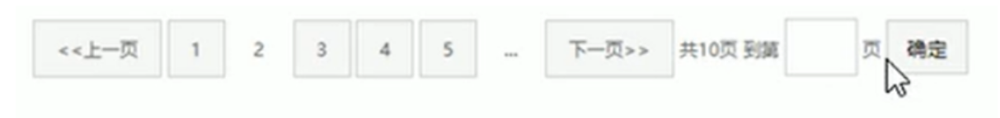

# 一、精灵图

## 1. 为什么需要精灵图技术

为了有效较少服务器接受和发送请求的次数，提高页面的加载速度，出现了css精灵技术（也成为css Sprites、css雪碧）

核心原理：将网页中的一些小背景图像整合到一张大图中，这样服务器只需要一次请求就可以了

## 2. 精灵图（sprites）的使用

1. 精灵技术主要针对背景图片使用。就是把多个小背景图片整合到一张大图片中
2. 这个大图片也成为sprites 精灵图 或者 雪碧图
3. 移动背景图片位置，此时可以使用 background-position
4. 移动的距离就是这个目标图片的x和y坐标。注意网页中的坐标有所不同
5. 因为一般情况下都是往上往左移动，所以数字是负值。（x轴右边走是正值，左边走是负值，往上走负值）
6. 使用精灵图需要精确测量，每个小背景图片的大小和位置

# 二、字体图标

## 1. 字体图标的产生

使用场景：主要用于显示网页中通用、常用的一些小图标

精灵图的缺点：

1. 图片文件还是比较大的
2. 图片本身放大和缩小会失真
3. 一旦图片制作完毕想要更换非常复杂

此时，出现了字体图标

字体图标展示的是图标，本质属于字体。

## 2. 字体图标的优点

- 轻量级：一个字体图标要比一系列的图像要小。一旦字体加载完毕，图标马上渲染出来，减少服务器请求
- 灵活性：本质是字体，可以很随意的改变颜色、产生阴影、透明效果、旋转等
- 兼容性：几乎支持所有浏览器，放心使用
- 字体图标不能代替精灵技术，只是对工作中的图标部分技术的提升和优化

总结：

1. 如果遇到一些结构和样式比较简单的小图标，就用字体图标
2. 如果遇到一些结构和样式比较复杂的小图片，就用精灵图

## 3. 字体图标的使用

### 1. 字体图标的下载

推荐网站：

- https://icomoon.io/
- https://www.iconfont.cn

### 2. 字体图标的引入

下载完毕之后，文件不要删除。

1. 把下载后里面的fonts 文件夹放入页面根目录下
2. 在css样式中全局申明字体：简单理解就是把这些字体文件通过css引入我们的页面中
3. html 标签中添加小图标

注意字体文件路劲问题

将下面代码复制到css文件中

```
<style>
    @font-face {
        font-family: 'icomoon';
        src:  url('fonts/icomoon.eot?zhv9wd');
        src:  url('fonts/icomoon.eot?zhv9wd#iefix') format('embedded-opentype'),
          url('fonts/icomoon.ttf?zhv9wd') format('truetype'),
          url('fonts/icomoon.woff?zhv9wd') format('woff'),
          url('fonts/icomoon.svg?zhv9wd#icomoon') format('svg');
        font-weight: normal;
        font-style: normal;
        font-display: block;
    }
    span {
    	font-family: 'icomoon';
    }
</style>

<span>/ed52</span>
```

### 3.字体图标的追加

将压缩包里面的selection.json从新上传，然后选中自己想要新的图标，重新下载压缩包，替换原来的文件即可

# 三、css三角

网页中一些三角形，使用css直接画出来就可以，不必做成图片或者字体图标


```
div {
    width: 0;
    height: 0;
    line-height: 0;  //兼容性考虑
    font-size: 0;   //兼容性考虑
    border: 50px solid transparent;
    border-left-color: pink;
}
```


# 四、css用户界面样式

## 1. 鼠标样式 cursor

```
li  {
	cursor: pointer
}
```

设置或检索在对象上移动的鼠标指针采用何种系统预定义的光标形状

| 属性值      | 描述       |
| ----------- | ---------- |
| default     | 小白  默认 |
| pointer     | 小手       |
| move        | 移动       |
| text        | 文本       |
| not-allowed | 禁止       |

## 2. 轮廓线 outline

给表单添加outline: 0;    或者  outline: none;   样式之后，就可以去掉表单默认的蓝色边框

## 3. 防止拖拽文本域 resize

实际开发中，我们文本域的右下角是不允许拖拽的

```
textarea {
	resize: none;
}
```


# 五、vertical-align 属性应用

使用场景： 经常用于设置图片或者表单（行内块元素）和文字垂直对齐

语法：

```
vertical-align: baseline  |  top  |   middle  |  bottom
```

| 值       | 描述                                   |
| -------- | -------------------------------------- |
| baseline | 默认。元素放置在父元素的基线上         |
| top      | 把元素的顶端与行中最高元素的顶端对齐   |
| middle   | 把此元素放置在父元素的中部             |
| bottom   | 把元素的顶端与行中最低的元素的顶端对齐 |


## 1. 图片、表单和文字对齐

图片、表单都属于行内块元素，默认的vertical-align 是基线对齐

此时可以给图片、表单这些行内块元素的vertical-align 属性设置为 middle  就可以让文字和图片垂直居中对齐了

```
img {
	//让图片和文字垂直居中
	vertical-align: middle;
}
```

## 2. 解决图片底部默认空白缝隙问题

bug：图片底侧会有一个空白缝隙，原因是行内块元素会和文字的基线对齐

解决办法有两种：

1. 给图片添加vertical-align: baseline  |  top  |   middle  |  bottom 等（提倡使用）
2. 把图片转换为块级元素 ：display: block;


# 六、溢出的文字省略号显示

## 1. 单行文字溢出显示省略号---必须满足三个条件

```
//1.先强制一行内显示文本
white-space: nowrap;  (默认  normal  自动换行)
//2.超出部分隐藏
overflow: hidden;
//3.文字用省略号替代超出的部分
text-overflow: ellipsis;
```

## 2. 多行文本溢出显示省略号

多行文本溢出显示省略号，有较大兼容性问题，适合于webKit浏览器或者移动端

```
overflow: hidden;
text-overflow: ellipsis;
/* 弹性伸缩盒子模型显示 */
display: -webkit-box;
/* 限制在一个块元素显示的文本的行数 */
-webkit-line-clamp: 2;
/* 设置或检索伸缩盒对象的子元素的排列方式 */
-webkit-box-orient: vertical;
```

更推荐让后台人员写这个效果，因为后台人员设置显示多少个字，更加简单

# 七、常见布局技巧

## 1. margin 负值运用


当有很多个盒子每个都挨在一起时，给每个盒子添加边框，会出现一侧边框叠加的情况，边框变粗，我们可以这么做

- 让每个盒字margin 往左侧移动 边框的宽度 -1px  正好压住相邻盒子边框
- 鼠标经过某个盒子的时候，想让它的边框变成红色，可以采用提高当前盒子的层级即可（如果没有定位，则加相对定位（保留位置）），如果有定位，则加z-index

## 2. 文字环绕浮动元素


巧妙利用浮动元素不会压住文字的特性

## 3. 行内块元素的巧妙运用

利用行内块元素设置页码跳转



可以利用text-align: center; 设置水平居中

## 4. css 三角强化


只要上边框和右侧边框就可以。

```
width: 0;
height: 0;
border-color: transparent red transparent transparent;
border-style: solid;
border-width: 22px 8px 0 0;
```

# 八、css初始化

```
/* 把我们所有标签的内外边距清零 */
* {
    margin: 0;
    padding: 0
}
/* em 和 i 斜体的文字不倾斜 */
em,
i {
    font-style: normal
}
/* 去掉li 的小圆点 */
li {
    list-style: none
}

img {
    /* border 0 照顾低版本浏览器 如果 图片外面包含了链接会有边框的问题 */
    border: 0;
    /* 取消图片底侧有空白缝隙的问题 */
    vertical-align: middle
}

button {
    /* 当我们鼠标经过button 按钮的时候，鼠标变成小手 */
    cursor: pointer
}

a {
    color: #666;
    text-decoration: none
}

a:hover {
    color: #c81623
}

button,
input {
    /* "\5B8B\4F53" 就是宋体的意思 这样浏览器兼容性比较好 */
    font-family: Microsoft YaHei, Heiti SC, tahoma, arial, Hiragino Sans GB, "\5B8B\4F53", sans-serif
}

body {
    /* CSS3 抗锯齿形 让文字显示的更加清晰 */
    -webkit-font-smoothing: antialiased;
    background-color: #fff;
    font: 12px/1.5 Microsoft YaHei, Heiti SC, tahoma, arial, Hiragino Sans GB, "\5B8B\4F53", sans-serif;
    color: #666
}

.hide,
.none {
    display: none
}
/* 清除浮动 */
.clearfix:after {
    visibility: hidden;
    clear: both;
    display: block;
    content: ".";
    height: 0
}

.clearfix {
    *zoom: 1
}
```

# 九、处理长单词怎样换行

## 1. word-break

 属性 `word-break` 指定了怎样在单词内断行。

| 值         | 含义                                                         |
| ---------- | ------------------------------------------------------------ |
| normal     | 使用默认的断行规则。英文类单词不换行，对于non-CJK (CJK 指中文/日文/韩文) 文本，可在任意字符间断行。 |
| break-all  | 所有单词或者文字换行                                         |
| keep-all   | 所有语言不换行，显示完一句话                                 |
| break-word | 他的效果是`word-break: normal` 和 `overflow-wrap: anywhere` 的合，不论 `overflow-wrap`的值是多少 |

## 2. overflow-wrap

属性 **overflow-wrap**是用来说明当一个不能被分开的字符串太长而不能填充其包裹盒时，为防止其溢出，浏览器是否允许这样的单词中断换行。

| 值         | 含义                                                         |
| ---------- | ------------------------------------------------------------ |
| normal     | 行只能在正常的单词断点处中断。（例如两个单词之间的空格）。   |
| anywhere   | 任何位置都可能中断。                                         |
| break-word | 表示如果行内没有多余的地方容纳该单词到结尾，则那些正常的不能被分割的单词会被强制分割换行。 |

# 十、处理图片溢出问题

## 1.给img元素加入max-width:100%; 

这将会允许图骗尺寸上小于但不大于盒子，这个技术也会对其他替换元素（例如：vidio或者iframe元素起作用）

## 2.使用object-fit属性

指定可替换元素的内容应该如何适应到其使用的高度和宽度确定的框。

您可以通过使用 object-position属性来切换被替换元素的内容对象在元素框内的对齐方式。

| 值             | 含义                                                         |
| -------------- | ------------------------------------------------------------ |
| **contain**    | 被替换的内容将被缩放，以在填充元素的内容框时保持其宽高比。 整个对象在填充盒子的同时保留其长宽比，因此如果宽高比与框的宽高比不匹配，该对象将被添加“黑边”。 |
| **cover**      | 被替换的内容在保持其宽高比的同时填充元素的整个内容框。如果对象的宽高比与内容框不相匹配，该对象将被剪裁以适应内容框。 |
| **fill**       | 被替换的内容正好填充元素的内容框。整个对象将完全填充此框。如果对象的宽高比与内容框不相匹配，那么该对象将被拉伸以适应内容框。 |
| **none**       | 被替换的内容将保持其原有的尺寸。                             |
| **scale-down** | 内容的尺寸与 `none` 或 `contain` 中的一个相同，取决于它们两个之间谁得到的对象尺寸会更小一些。 |

```
<div class="wrapper">
  <div class="box"></div>
  <div class="box"></div>
</div>
.box {
  width: 200px;
  height: 200px;
}

img {
  height: 100%;
  width: 100%;
}

.cover {
  object-fit: cover;
}

.contain {
  object-fit: contain;
}
```


