# 一、移动WEB开发 

## 1. 移动端基础

### 1. 浏览器现状

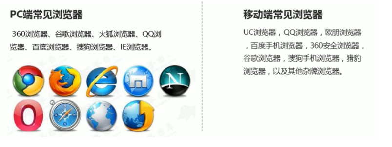

国内的浏览器都是根据webkit修改过来的内核，国内尚无自主研发的内核，就像国内的手机操作系统都是基于Android修改开发的一样

总结：**兼容移动端主流浏览器，处理webkit内核浏览器即可**

### 2.手机屏幕现状

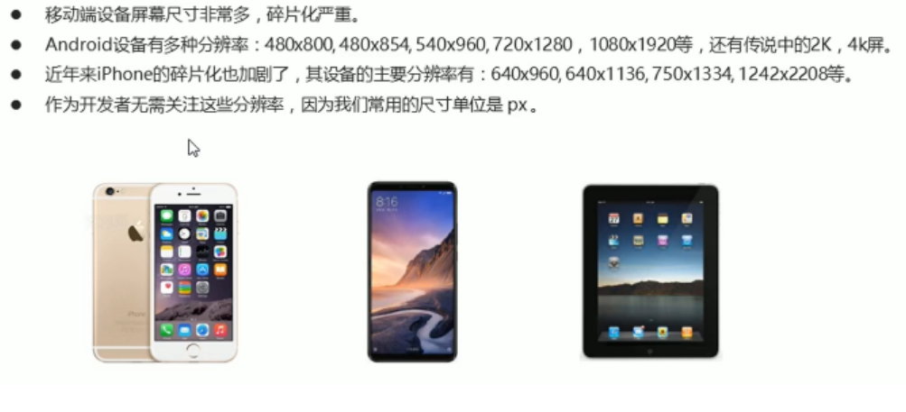


## 2. 视口

视口（viewport）就是浏览器显示页面内容的屏幕区域，视口分为布局视口、视觉视口、理想视口

### 1. 布局视口 layout viewport

- 一般移动设备的浏览器都默认设置了一个布局视口，用于解决早期PC端页面在手机显示的问题
- IOS、Android基本都将这个视口分辨率设置为980px，所以PC上的网页大多能在手机上呈现，只不过元素看上去很小，一般默认可以通过手动缩放网页

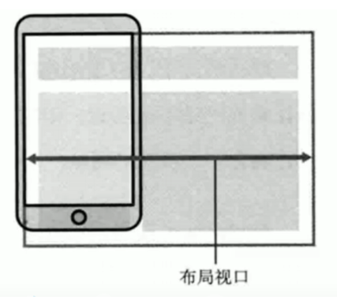

### 2. 视觉视口 visual viewport

- 字面意思，就是用户正在看到的网站的区域，**注意：是网站的区域**
- 我们可以通过缩放去操作视觉视口，但不会影响布局视口，布局视口仍保持原来的宽度

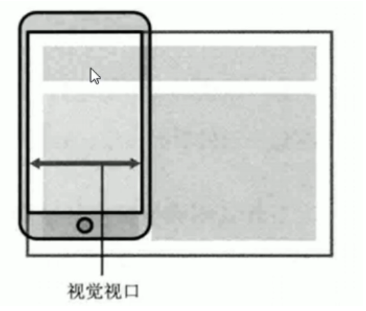

### 3. 理想视口 ideal viewport

- 为了使网站在移动端有最理想的浏览和阅读宽度而设定
- 理想视口，对设备来说，是最理想的视口尺寸
- 需要手动写meta视口标签通知浏览器操作
- meta视口标签的主要目的：布局视口的宽度应该与理想视口的宽度一致，简单理解就是设备有多宽，我们布局的视口就多宽

### 4. meta视口标签

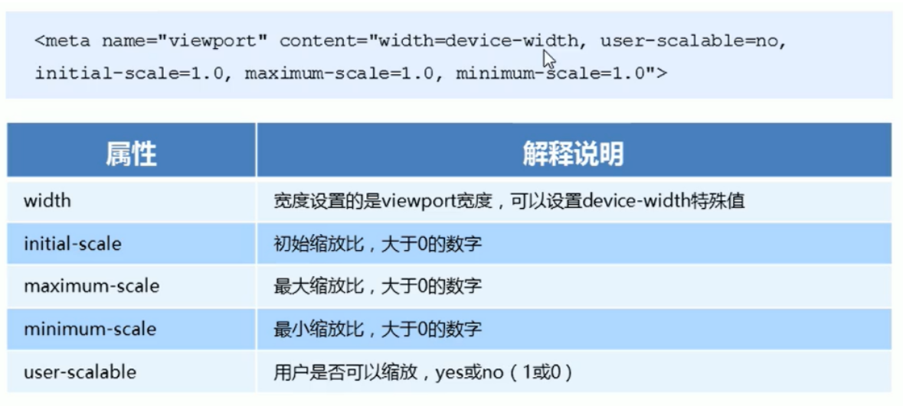

### 5. 标准的viewport设置

- 视口宽度和设备保持一致
- 视口的默认缩放比例1.0
- 不允许用户自行缩放
- 最大允许的缩放比例1.0
- 最小允许的缩放比例1.0

## 3. 二倍图

### 1. 物理像素&物理像素比

- 物理像素点指的是屏幕显示的最小颗粒，是物理真实存在的。这是厂商在出厂时就设置好了，比如苹果6/7/8是750*1334
- 我们开发时候的1px不是一定等于1个物理像素的
- pc端页面，1px等于1个物理像素的，但是移动端就不尽相同
- **一个px的能显示的物理像素点的个数，称为物理像素比或屏幕像素比**

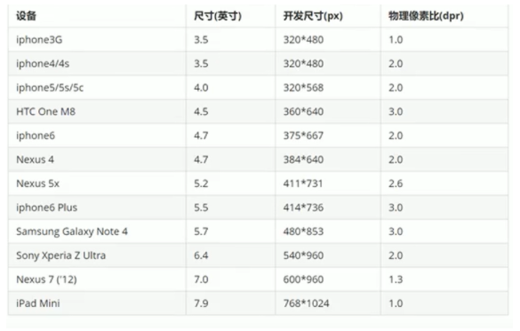

- pc端和早期的手机屏幕/普通手机屏幕：1CSS像素 = 1 物理像素
- Retina（视网膜屏幕）是一种显示技术，可以把更多的物理像素点压缩至一块屏幕里，从而达到更高的分辨率，并提高屏幕显示的细腻程度

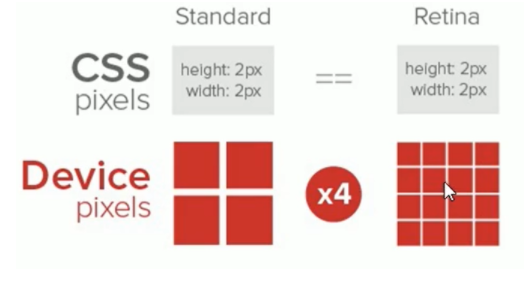

### 2. 多倍图

- 对于一张50px*50px的图片，在手机Retina屏中打开，按照刚才的物理像素比会放大倍数，这样会造成图片模糊
- 在标准viewport设置中，使用多倍图来提高图片质量，解决在高清设备中的模糊问题
- 通常使用二倍图，因为iPhone6/7/8的影响，但是现在还存在3倍图4倍图的情况，这个看实际开发公司需求
- 背景图片  注意缩放问题


### 3. 背景缩放 background-size

background-size 属性规定背景图像的尺寸

```
background-size: 背景图片宽度  背景图片高度;
```

- 单位：   长度|百分比|cover|contain
- 只写一个参数  肯定是宽度  高度省略   会等比例缩放
- 里面的单位可以跟%  相对于父盒子来说
- cover 把背景图像扩展足够大，一使背景图像完全覆盖背景区域   可能有部分背景图片显示不全
- contain 把背景图像扩展至最大尺寸，以使其宽度和高度完全适应内容区域   当宽度或者高度   铺满整个盒子就不在进行拉伸了

### 4. 多倍图切图 cutterman


## 4. 移动端调试

## 5. 移动端技术解决方案

### 1. 移动端主流方案


### 2. 单独移动端页面（主流）

通常情况下，网址域名前面加m（mobile）可以打开移动端。通过判断设备，如果是移动设备打开，则跳转至移动端页面


### 3. 响应式兼容px端移动端

三星电子官网：www.samsung.com/cn，通过判断屏幕宽度来改变样式，以适应不同终端

缺点：制作麻烦，需要花很大精力去调式兼容性问题

### 4. 移动端浏览器

移动端浏览器基本以webkit内核为主。因此我们就考虑webkit兼容性问题

我们可以很放心的使用H5标签和CSS3样式

### 5. CSS初始化   normalize.css

移动端css初始化推荐使用normalize.css/

- Normalize.css: 保护了有价值的默认值
- Normalize.css：修复了浏览器的bug
- Normalize.css：是模块化的
- Normalize.css：拥有详细的文档

官网地址: http://necolas.github.io/normalize.css

### 6. css3盒子模型 box-sizing

- 传统模式宽度计算：盒子的宽度 = css中设置的width + border + padding
- css3盒子模型：盒子的宽的 = css中设置的宽度width 里面包含了border和padding

也就是说，我们的css3中的盒子模型，padding和border不会撑大盒子了


- 移动端可以全部使用css3盒子模型
- pc端如果完全需要兼容，我们就用传统模式，如果不开率兼容性，我们就选择css3盒子模型

### 7. 特殊样式


## 6. 移动端常见布局


### 1. 流式布局（百分比布局）

- 流式布局，就是百分比布局，也称为非固定像素布局
- 通过盒子的宽的设置成百分比来根据屏幕的宽度来进行伸缩，不受固定像素的限制，内容向两侧填充
- 流式布局方式是移动web开发使用的比较常见的布局方式
- max-width 属性  最大宽度（max-height 最大高度）
- min-width  属性 最小宽度（min-height 最小高度）

### 2. flex 布局

#### 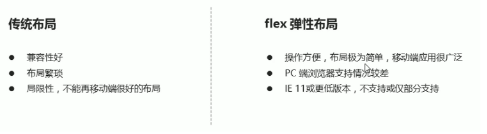

建议：

1. 如果是pc端页面布局，我们还是传统布局
2. 如果是移动端或者不考虑兼容性问题的pc端页面布局，我们还是使用flex弹性布局

#### 1. 布局原理

flex 是 flexible Box 的缩写，意为“弹性布局”，用来为盒状模型提供最大的灵活性，任何一个容器都可以指定为flex布局

- 当我们为父盒子设为flex布局以后，子元素的float、clear和vertical-align属性将失效
- 伸缩布局 = 弹性布局 = 伸缩盒布局 = 弹性盒布局 = flex布局

采用flex布局的元素，称为flex容器（flex container），简称“容器”。他所有子元素自动称为容器成员，称为flex项目（flex item），简称“项目”

- 体验中div就是flex父容器
- 体验中span就是子容器 flex项目
- 子容器可以横向排列也可以纵向排列

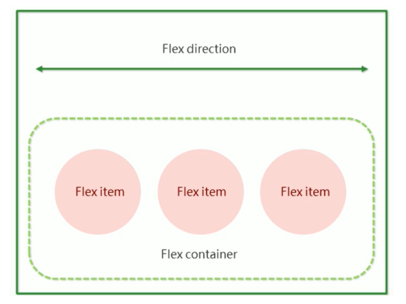


总结：**就是通过给父盒子添加flex属性，来控制子盒子的位置和排列方式**

#### 2. 常见父项属性

- flex-direction:设置主轴的方向
- justify-content:设置主轴上的子元素排列方式
- flex-wrap：设置子元素是否换行
- align-content：设置测轴上的子元素的排列方式（多行）
- align-items：设置测轴上的子元素排列方式（单行）
- flex-flow：复合属性，相当于同时设置了flex-direction和flex-wrap

##### flex-direction:设置主轴的方向

1. 主轴和测轴

在flex布局中，是分为主轴和测轴两个方向，同样的叫法有：行和列、x轴和y轴

- 默认主轴方向就是x轴方向，水平向右y
- 默认测轴方向就是y轴方向，垂直向下

2. 属性值

flex-direction  属性决定主轴的方向（即项目的排列方向）

注意：主轴和测轴是会变化的，就看flex-direction设置谁为主轴，剩下的就是测轴。

**我们的子元素就是跟着主轴来排列的**

| 属性值         | 说明           |
| -------------- | -------------- |
| row            | 默认值从左到右 |
| row-reverse    | 从右到左       |
| column         | 从上到下       |
| column-reverse | 从上到下       |

##### justify-content:设置主轴上的子元素排列方式

justify-content  属性定义了项目在主轴上的对齐方式

注意：**使用这个属性之前一定要确定好主轴是哪个**

| 属性值        | 说明                                        |
| ------------- | ------------------------------------------- |
| flex-start    | 默认值  从头开始  如果主轴是x轴  则从左到右 |
| flex-end      | 从尾部开始排列                              |
| center        | 从主轴居中对齐（如果主轴是x轴则水平居中）   |
| space-around  | 评分剩余空间                                |
| space-between | 先两边贴边  在平分剩余空间（重要）          |

##### flex-wrap 设置子元素是否换行

默认情况下，项目都排在一条线（又称“轴线”）上。flex-wrap 属性定义，flex布局中默认是不换行的

| 属性值 | 说明                                                         |
| ------ | ------------------------------------------------------------ |
| nowrap | 默认值，不换行（当一行内元素显示不下的情况，会缩小元素的宽度或者高度） |
| wrap   | 换行                                                         |

##### align-items：设置测轴上的子元素排列方式（单行）

该属性是控制子项在测轴（默认是y轴）上的排列方式。在子项为单项的时候使用

| 属性值     | 说明                     |
| ---------- | ------------------------ |
| flex-start | 从上到下                 |
| flex-end   | 从下到上                 |
| center     | 挤在一起居中（垂直居中） |
| stretch    | 拉伸（默认值）           |

##### align-content：设置测轴上的子元素的排列方式（多行）

设置子项在测轴上的排列方式并且只能用于子项出现换行的情况（多行），在单行下是没有效果的

| 属性值        | 说明                                   |
| ------------- | -------------------------------------- |
| flex-start    | 默认值在测轴的头部开始排列             |
| flex-end      | 在测轴的尾部开始排列                   |
| center        | 在测轴中间显示                         |
| space-around  | 子项在测轴评分剩余空间                 |
| space-between | 子项在测轴先分布在两头，在平分剩余空间 |
| stretch       | 设置子项元素高度平分父元素高度         |

##### flex-flow：复合属性，相当于同时设置了flex-direction和flex-wrap

### 3. 常见子项属性

#### 1. flex 属性	

flex属性 定义子项目分配剩余空间，用flex来表示占多少份数

```
.item {
	flex: <number>;  // default 0
}
```

#### 2. align-self 控制子项自己在测轴上的排列方式

align-self 属性允许单个项目有与其他项目不一样的对齐方式，可覆盖align-items 属性

默认值auto，表示继承父元素的align-items 属性，如果没有父元素，则等同于stretch

```
span:nth-child(2) {
	//设置自己在测轴上的排列方式
	align-self:flex-end;
}
```

#### 3. order属性定义项目的排列顺序

数值越小，排列越靠前，默认是0

注意：和z-index不一样

## 3. rem适配布局

### 1. rem基础

rem(root em)是一个相对单位，类似于em，em是父元素字体大小

不同的是rem的基准是相对于html元素的字体大小

比如，根元素（html）设置font-size=12px;非根元素设置width:2rem;则换成px表示就是24px

### 2. 媒体查询

#### 1. 什么是媒体查询

媒体查询（Media Query）是css3新的语法

- 使用@media查询，可以针对不同的媒体类型定义不同的样式
- @media 可以针对不同的屏幕尺寸设置不同的样式
- 当你重置浏览器大小的过程中，页面也会根据浏览器的宽度和高度重新渲染页面
- 目前针对很多苹果手机、Android手机，平板等设备都用得到多媒体查询

#### 2. 语法规范

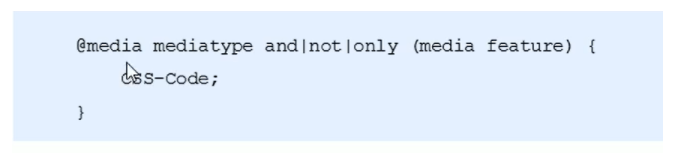

-  用@media开头  注意@符号
- mediatype  媒体查询
- 关键字 and not only
- media feature  媒体特性   必须有小括号包含

##### 1.mediatype  查询类型

将不同的终端设备划分成不同的类型，称为媒体类型

| 值    | 解释说明                           |
| ----- | ---------------------------------- |
| all   | 用于所有设备                       |
| print | 用于打印机和打印预览               |
| scree | 用于电脑屏幕，平板电脑，智能手机等 |

##### 2.关键字

关键字将媒体类型或多个媒体特性连接到一起作为媒体查询的条件

- and：可以将多个媒体特性连接到一起，相当于"且"的意思
- not：排除某个媒体类型，相当于"非"的意思，可以省略
- only：指定某个特定的媒体类型，可以省略

##### 3. 媒体特性

每种媒体特性都具有各自不同的特性，根据不同媒体类型的媒体特性设置不同的展示风格。注意它们要加小括号包含

| 值        | 解说说明                           |
| --------- | ---------------------------------- |
| width     | 定义输出设备中页面可见区域的宽度   |
| min-width | 定义输出设备中页面最小可见区域宽度 |
| max-width | 定义输出设备中页面最大可见区域宽度 |

```
// 这句话的意思是   在我们屏幕上  并且  最大的宽度是  800px  设置我们想要的样式
//媒体查询可以根据不同的屏幕尺寸改变不同的样式
@media screen and (max-width: 800px) {
    body {
        background-color: #ccc;
    }
}
```

### 3. 媒体查询+rem实现元素动态变化

```
//从小到大的顺序
@media screen and (min-width: 320px) {
    html {
        font-size: 50px;
    }
}
@media screen and (min-width: 640px) {
    html {
        font-size: 100px;
    }
}
.box {
	height: 1rem;
	font-size: 0.5rem;
}
```

### 4. 引入资源

当样式比较繁多的时候，我们可以针对不同的媒体使用不同的stylesheets（样式表）

原理，就是直接在link中判断设备的尺寸，然后引用不同的css文件

```
//当我们屏幕大于等于640px 以上的，执行style640.css
//当我们屏幕小于640px   执行style320.css
<link rel="stylesheet" href="style320.css" media="screen and (min-width: 320px)">
<link rel="stylesheet" href="style640.css" media="screen and (min-width: 640px)">
```

### 5. rem适配方案

#### 1.rem实际开发适配方案

1. 按照设计稿与设备宽度的比例，动态计算并设置html根标签font-size 大小（媒体查询）
2. css中，设计稿元素的宽、高、相对位置等取值，按照同等比例换算为rem为单位的值

#### 2.rem适配方案技术使用（市场主流）

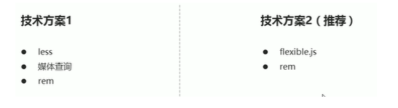

总结：

1. 两种方案现在都存在
2. 方案2更加简单


