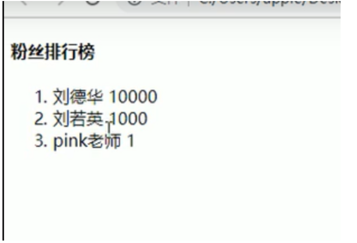
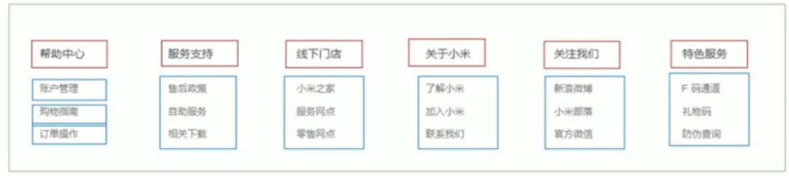

# 一、HTML简介

## 1.什么是网站？什么是网页？

​		**网站**时指在因特网上根据一定的规则，使用HTML等制作的用于展示特定内容相关的网页集合。

​		**网页**是网站中的一页，通常是HTML格式的文件，它通过浏览器来阅读。

​		网页是构成网站的基本元素，它通常由图片、链接、文字、声音、视频等元素组成。

## 2.什么是HTML

**HTML**（超文本标记语言——HyperText Markup Language）是构成 Web 世界的一砖一瓦。它定义了网页内容的含义和结构。除 HTML 以外的其它技术则通常用来描述一个网页的表现与展示效果（如 [CSS](https://developer.mozilla.org/zh-CN/docs/Web/CSS)），或功能与行为（如 [JavaScript](https://developer.mozilla.org/zh-CN/docs/Web/JavaScript)）。

“超文本”（hypertext）是指连接单个网站内或多个网站间的网页的链接。链接是网络的一个基本方面。只要将内容上传到互联网，并将其与他人创建的页面相链接，你就成为了万维网的积极参与者。

[HTML](https://developer.mozilla.org/en-US/docs/Glossary/HTML) (HyperText Markup Language) 不是一门编程语言，而是一种用来告知浏览器如何组织页面的**标记语言**。HTML 可复杂、可简单，一切取决于开发者。它由一系列的**元素（[elements](https://developer.mozilla.org/en-US/docs/Glossary/Element)）**组成，这些元素可以用来包围不同部分的内容，使其以某种方式呈现或者工作。 一对标签（ [tags](https://developer.mozilla.org/en-US/docs/Glossary/Tag)）可以为一段文字或者一张图片添加超链接，将文字设置为斜体，改变字号，等等。 例如下面一行内容：。

剖析一个 HTML 元素

让我们进一步探讨我们的段落元素：


这个元素的主要部分有：

1. **开始标签**（Opening tag）：包含元素的名称（本例为 p），被左、右角括号所包围。表示元素从这里开始或者开始起作用 —— 在本例中即段落由此开始。
2. **结束标签**（Closing tag）：与开始标签相似，只是其在元素名之前包含了一个斜杠。这表示着元素的结尾 —— 在本例中即段落在此结束。初学者常常会犯忘记包含结束标签的错误，这可能会产生一些奇怪的结果。
3. **内容**（Content）：元素的内容，本例中就是所输入的文本本身。
4. **元素**（Element）：开始标签、结束标签与内容相结合，便是一个完整的元素。、

# 二、WEB标准

web标准是由W3C组织和其他标准化组织制定的一系列标准的集合。W3C（万维网联盟）是国际最著名的标准化组织。

## 2.1为什么需要web标准

因为浏览器不同，它们显示页面或者排版就会有些许差异。

#### 使用web标准有哪些好处？

1.让we的发展更广阔

2.内容能被更广泛的设备访问

3.更容易被搜索引擎访问

4.降低网站流量费用

5.使网站更易于维护

6.提高页面浏览速度

## 2.2Web标准的构成

主要由结构（Structure）、表现（Presentation）和行为（Behavior）三个方面。

#### 2.2.1结构

​	结构用于对网页元素进行整理和分类，主要是指HTML

#### 2.2.2表现

​	表现用于设置网页元素的版式、颜色、大小等外观样式，主要是指CSS

#### 2.2.3行为

​	行为是指网页模型的定义及交互的编写，现阶段主要学的是JavaScript

web标准提出的最佳体验方案：结构、样式、行为相分离。

简单理解：结构写道HTML文件中，表现写到CSS文件中，行为写到JavaScript文件中。

# 三、HTML标签

## 3.1基本语法规范

1.HTML标签由尖括号包围的关键词，例如<html>。

2.HTML标签通常是成对出现的，例如<html></html>，我们称为双标签。标签对中的第一个标签是开始标签，第二个是结束标签。

3.有些特殊标签必须是单个标签，例如<br/>，我们称为单标签。

### 3.1.1标签关系

#### 3.1.1.1包含关系

​    也叫父子关系

#### 3.1.1.2并列关系

​	也叫兄弟关系

## 3.2 HTML基本结构标签

每个网页都有一个基本的结构标签（也成为骨架标签），页面内容也是在这些标签上书写。

HTML页面也成为HTML文档

<html></html>    html标签   页面中最大的标签     也叫做根标签

‘<head></head>’    文档的头部      在head标签中我们必须要设置的标签是title

‘<title></title>’   文档的标题    网页标题

<body></body>   文档的主体    元素包含文档的所有内容，页面内容基本都是放在

### 文档声明标签

‘<!DOCTYPE>’   文档类型声明，作用就是告诉浏览器使用哪种HTML版本来显示网页。

‘<!DOCTYPE html>’    这句话意思是当前页面采取的是HTML版本来显示网页。

### lang语言种类

’<html lang="en">’  用来定义当前文档显示的语言。

1.en定义语言为英语

2.zh-CH定义为中文

简单来说，en就是英文网页，  zh-CN就是中文网页

这个作用主要是   提示   警示的作用

### 字符集

‘<meta charset="UTF-8">’   字符集是多个字符的集合。以便计算机能够识别和存储各种文字

放在<head>标签中   

charset  常用的值：GB2312（简体中文）、BIG5（繁体中文）、GBK（包含了简体中文和繁体中文  GB简称国标）和UTF-8,UTF-8也被称为万国码    基本包含了全是所有国家需要用到的字符

## 3.3常用标签

### 3.3.1标签语义

简单理解就是标签的含义      既这个标签是用来干嘛的

### 3.3.2标题标签<h1>-<h6>

为了使网页更具有语义化，我们经常会在页面中使用到标题标签。HTML提供了6个等级的网页标题

‘<h1>-<h6>’  

单词head的缩写，意为头部、标题。

标签语义：作为标题使用，并且依据重要性递减。

特点：

1.加了标题的文字会变得更粗   字号也会变得更大

2.一个标题独占一行

### 3.3.3段落和换行标签

在网页中，要把文字有条理的显示出来，就需要将这些文字分段显示。

```
<p>
    标签用于定义段落    它可以将整个网页分为若干个段落
</p>
```

单词paragraph的缩写  

标签语义：可以把HTML文档分割为若干个段落。

**`<br>`换行标签**

break的缩写  意为打断、换行

特点：

1. `<br>`是个单标签

2. `<br>`标签只是简单的开始新的一行，跟段落标签不一样，段落标签之间会插入一些垂直的间距。

### 3.3.4文本格式化标签

标签语义：突出重要性，比普通文字更加重要

加粗  `<strong></strong> `  或者`<b></b> `  推荐使用   `<strong></strong>`  语义更加强烈

倾斜   `<em></em>或者<i></i>`                         推荐使用em标签    语义更加强烈

**i标签和em标签的区别**

在默认情况下，它们的视觉效果是一样的。但语义是不同的。 `<em>` 标签表示其内容的着重强调，而 `<i>` 标签表示从正常散文中区分出的文本，例如外来词，虚构人物的思想，或者当文本指的是一个词语的定义，而不是其语义含义。（作品的标题，例如书籍或电影的名字，应该使用 `<cite>`。

删除线   `<del></del>或者<s></s>`               推荐使用`del`标签

下划线    `<ins></ins>’或者<u></u>`                推荐使用ins

### 3.3.5 div和span标签

‘<div>和<span>’标签是没有语义的，它们是一个盒子，用来装内容的

‘<div>’是division的缩写，表示分割，分区。span意为跨度、跨距

特点：

1. div标签用来布局，一行只能放一个div，大盒子

2. span标签用来布局，一行可以放多个span标签。小盒子

### 3.3.6图像标签和路径

1.图像标签


单词image的缩写，意为图像

src是img标签的必须属性，它用来指定图像文件的路径和文件名                 

| 属性   | 属性值   | 说明                                 |
| ------ | -------- | ------------------------------------ |
| alt    | 文本text | 替换文本，图像不能显示的文字         |
| title  | 文本text | 提示文本，鼠标放在图像上，显示的文字 |
| width  | 像素     | 设置图像的宽度                       |
| height | 像素     | 设置图像的高度                       |
| border | 像素     | 设置图像的边框粗细                   |

**注意点**：

（1）图像标签可以拥有多个属性，必须写在标签名的后面

（2）属性之间部分先后是内需，标签名与属性、属性和属性之间均已空格分开

（3）属性采取键值对的格式 既key="value"的格式，属性="属性值"。

（4）alt：表示图像显示不出来的时候显示的文字

（5）title：表示鼠标一放在图片上显示的文字

2.路径

目录文件夹：就是普通文件夹

根目录：打开目录文件夹的第一层就是根目录

**相对路径：**

以引用文件所在位置为参考计出，而建立出的目录路径

| 路径       |      | 含义                         | 示例                         |
| ---------- | ---- | ---------------------------- | ---------------------------- |
| 同一级路径 |      | 图像文件位于html文件的同一级 | 如        |
| 下一级路径 | /    | 图像位于HTML文件的下一级     | 如 |
| 上一级路径 | ../  | 图像位于html文件的上一级     | 如     |

简单来说     相对路径就是从代码所在文件出发，去寻找目标文件的，而我们所说的上一级、同级、下一级就是图片相对于html页面的位置。

**绝对路径：**

是指目录下的绝对位置，直接到达目标位置，通常是从盘符开始的路径。

例如：C:\Users\ShenKun\Documents\Tencent Files\1594217816\FileRecv\MobileFile

### 3.3.7超链接标签

1.链接的语法格式

《a herf="跳转目标" target="目标窗口的弹出方式">文本或者图像</a》

单词anchor的缩写   意为：锚

两个属性的作用如下

herf：用于指定链接的utl地址   必须属性。

target：

| _blank      | 在新窗口中打开被链接文档。           |
| ----------- | ------------------------------------ |
| _self       | 默认。在相同的框架中打开被链接文档。 |
| _parent     | 在父框架集中打开被链接文档。         |
| _top        | 在整个窗口中打开被链接文档。         |
| *framename* | 在指定的框架中打开被链接文档。       |

2.链接分类

（1）外部链接：例如：《a herf="www.baidu.com" target="目标窗口的弹出方式">文本或者图像</a》

（2）内部链接：网站内部页面之间的相互链接，直接链接内部页面名称即可例如《a herf="index.html">文本或者图像</a》

（3）空连接：如果当时不确定链接目标是，《a herf="#" target=""></a》

（4）下载链接：如果href里面地址是一个文件或者压缩包，会下载这个文件

（5）网页元素链接：在网页中的个网页元素，如文本、图像、表格、音频等都可以添加超链接    例如：《a herf="#" target="">《img  src="img.ipg"/》</a》

**（6）锚点链接：当我们点击链接，可以快速定位到页面的某个位置**

分为两步操作：

1.在链接文本的href属性中，设置属性值为"#id属性名"，如《a herf="#two" target=""></a》

2.找到目标位置标签，里面添加一个id属性=刚才的名字，如《h3 id="two"》《/h3》

### 3.3.8注释和特殊字符

#### 1.注释

html中的注释以"<！--"开头,以"-->"结束    快捷键     CTRL  +  /

#### 2.特殊字符

一些特殊字符需要使用转义字符

主要记住   空格、大于号、小于号

	空格符		：	&nbsp			// 默认页面中文本的空格会被忽略掉
	<			：	&lt				// 小于符号
	>			：	&gt				// 大于符号
	&			：	&amp			// 与符号
	￥			：	&yen			//人民币符号
	©			：	&copy			// 版权符号
	®			：	&reg			// 注册商标符号
	°			：	&deg			// 度的符号
	±			：	&plusmn			// 加减的符号
	x			：	&times			// 乘号
	÷			：	&divide			// 除号
	²			：	&sup2			// 平方的右上标
	³			：	&sup3			// 立方的右上标
#### 3.3.9 base标签

<base> 标签为页面上的所有链接规定默认地址或默认目标。

通常情况下，浏览器会从当前文档的 URL 中提取相应的元素来填写相对 URL 中的空白。

使用 <base> 标签可以改变这一点。浏览器随后将不再使用当前文档的 URL，而使用指定的基本 URL 来解析所有的相对 URL。这其中包括 <a>、、<link>、<form> 标签中的 URL。

实例

```
<head>
<base href="http://www.w3school.com.cn/i/" />
<base target="_blank" />
</head>

<body>

<a href="http://www.w3school.com.cn">W3School</a>
</body>
```

提示和注释：

**注释：**<base> 标签必须位于 head 元素内部。

必需的属性

| 属性                                                       | 值    | 描述                               |
| :--------------------------------------------------------- | :---- | :--------------------------------- |
| [href](https://www.w3school.com.cn/tags/att_base_href.asp) | *URL* | 规定页面中所有相对链接的基准 URL。 |

可选的属性

| 属性                                                         | 值                                                | 描述                         |
| :----------------------------------------------------------- | :------------------------------------------------ | :--------------------------- |
| [target](https://www.w3school.com.cn/tags/att_base_target.asp) | `_blank`、`_parent`、`_self`、`_top`、`framename` | 在何处打开页面中所有的链接。 |

## 3.4表格标签

### 3.4.1表格的作用

表格只要用于**显示、展示数据**，因为它可以让数据显示的非常的规整，可读性较好。特别是后台展示数据的时候，能够熟练运用表格就显得很重要。

**表格不是用来布局页面的，是用来展示数据的**。


### 3.4.2表格的基本语法

```
<table border="1">
  <tr>
    <th>Month</th>
    <th>Savings</th>
  </tr>
  <tr>
    <td>January</td>
    <td>$100</td>
  </tr>
</table>
```

table  用于定义表格的标签

tr    用于定义表格中的行，**必须嵌套在table标签中**

th   表示html表格的表头部分（table head的缩写）表头单元格里面的文本内容会被**加粗居中显示**

td    指表格数据（table data）用于定义表格中的单元格，**必须嵌套在tr标签中**

**table相关属性**

| 属性          | 值                                                           | 描述                                                         |
| ------------- | ------------------------------------------------------------ | ------------------------------------------------------------ |
| align         | left  center  right                                          | 不赞成使用。请使用样式代替。 规定表格相对周围元素的对齐方式。 |
| `bgcolor`     | `rgb(x,x,x)  #xxxxxx  colorname`                             | 不赞成使用。请使用样式代替。 规定表格的背景颜色。            |
| border        | *pixels*                                                     | 规定表格边框的宽度。                                         |
| `cellpadding` | *pixels*  *%*                                                | 规定单元边沿与其内容之间的空白。                             |
| `cellspacing` | *pixels*  *%*                                                | 规定单元格之间的空白。                                       |
| frame         | void  above  below  `hsides`  `lhs`  `rhs`  `vsides`  box  border | 规定外侧边框的哪个部分是可见的。                             |
| rules         | none  groups  rows  cols  all                                | 规定内侧边框的哪个部分是可见的。                             |
| summary       | *text*                                                       | 规定表格的摘要。                                             |
| width         | *%*  *pixels*                                                | 规定表格的宽度。                                             |

`cellpadding`：是规定单元格和里面的内容之间的距离

`cellspacing`：是规定单元格和单元格之间的距离

### 3.4.3表格结构标签

使用场景：因为表格可能很长，为了更好的表示表格的语义，可以将表格分割成表格头部和表格主题两大部分

用<thead>标签表示表格的头部区域，<tbody>标签表示表格的主题区域，这样可以更好的分清表格结构。

```
<table border="1">
	<thead>
        <tr>
    		<th>Month</th>
    		<th>Savings</th>
  		</tr>
    </thead>
    <tbody>
    	<tr>
    		<td>January</td>
    		<td>$100</td>
	    </tr>
    </tbody>
</table>
```

1.`<thead>`:定义表格的头部。`thead`内部必须拥有tr标签。一般位于第一行。

2.`<tbody>`:定义表格的主体，主要用于放数据本体。

3.以上标签都是放在table标签中。

### 3.4.4合并单元格

1.先确定是跨行还是跨列合并

2.找到目标单元格，写上合并方式=合并单元格数量。比如：<td colspan="2"></td>

3.删除多余的单元格

| [rowspan](att_td_rowspan.asp.htm) | *number* | 规定单元格可横跨的行数。 |
| --------------------------------- | -------- | ------------------------ |
| [colspan](att_td_colspan.asp.htm) | *number* | 规定单元格可横跨的列数。 |

## 3.5列表标签

表格是用来显示数据的       列表是用来布局的

特点：整齐    整洁   有序  作为布局非常方便

### 3.5.1无序列表

/<ul>标签表示无序列表     一般会以项目符号呈现列表项     列表项使用<li>标签定义

基本语法如下

/<ul>

​	<li>列表项1</li>

​	<li>列表项2</li>

​	<li>列表项3</li>

</ul>

1. 无序列表的各个列表项之间没有顺序级别之分，是并列的

2. `ul`标签里只能嵌套`li`标签。

3. `li`标签相当于一个容器  可以容纳所有元素

### 3.5.2有序列表

有序列表就是有排序顺序的列表   

使用ol标签来定义有序列表      列表排序以数字来显示    并且使用li标签来定义列表项

/<ol>

​	<li>列表项1</li>

​	<li>列表项2</li>

​	<li>列表项3</li>

</ol>



显示的时候列表项会带有数字。

1. `ol`标签中只能嵌套`li`标签     

2. 同样这里的`li`标签还是相当于一个容器   可以容纳所有元素

### 3.5.3自定义列表

使用`dl`标签定义描述列表      `dt`定义项目/名字     `dd`（描述每一个项目/名字）一起使用

一般用于底部列表常用于对术语或名词进行解释和描述，定义列表前没有任何项目符号

基本语法如下

/<dl>

​	<dt>列表项1</dt>

​	<dd>名词1解释1</dd>

​	<dd>名词2解释2</dd>

</dl>

效果图：



特点：

1. `dl`里面只能包含`dt和dd`两个标签

2. `dt`和`dd`个数没有限制   经常一个`dt`对应多个`dd`

## 3.6表单标签

### 3.6.1为什么需要表单

目的是为了手机用户信息

### 3.6.2表单的组成

有表单域、表单控件（也称为表单元素）和提示信息三个部分组成

### 3.6.3表单域

表单域是一个包含表单元素的区域

用form标签定义表单域   实现用户信息的收集和传递

form会把它范围内的表单元素信息提交给服务器

/<form action="url地址" method="提交方式" name="表单域名称">

​	各种表单元素控件

</form>

action        url    用于指定接受并处理表单数据的服务器的url地址

method     get/post             提交表单数据的提交方式

name           名称                     用于指定表单的名称   以区分同一个页面多个表单域

### 3.6.4表单控件（表单元素）

#### 1. input输入表单元素

input是输入的意思     input标签用于收集用户信息

input标签中    包含一个type属性    根据不同的type属性值   输入字段会拥有多种形式（文本    复选框     单选按钮等等）

/<input type="属性值"/>

特点

1. input是单标签

2. type属性设置不同的属性值用来指定不同的控件类型

| 值       | 描述                                                         |
| -------- | ------------------------------------------------------------ |
| button   | 定义可点击按钮（多数情况下，用于通过 JavaScript 启动脚本）。 |
| checkbox | 定义复选框。                                                 |
| file     | 定义输入字段和 "浏览"按钮，供文件上传。                      |
| hidden   | 定义隐藏的输入字段。                                         |
| image    | 定义图像形式的提交按钮。                                     |
| password | 定义密码字段。该字段中的字符被掩码。                         |
| radio    | 定义单选按钮。                                               |
| reset    | 定义重置按钮。重置按钮会清除表单中的所有数据。               |
| submit   | 定义提交按钮。提交按钮会把表单数据发送到服务器。             |
| text     | 定义单行的输入字段，用户可在其中输入文本。默认宽度为 20 个字符。 |

| input属性   |            |                                     |
| ----------- | ---------- | ----------------------------------- |
| name        | 用户自定义 | 定义input元素的名称                 |
| value       | 用户自定义 | 规定input元素的值                   |
| checked     | 初始值     | 规定此input元素首次加载时应该被选中 |
| `maxlength` | 正整数     | 规定输入字段中的字符最大长度        |

1.name和value是每个表单元素都有的属性值   主要给后台人员使用

2.name表单元素的名字，    **单选按钮和复选框要有相同的name值**

3.checked属性主要针对单选按钮和复选框    一打开页面    默认选中某个表单元素

4.maxlength       用户在表单元素中输入的最大字符数     

#### 2. label标签

label标签为input元素定义标注

label标签用于绑定一个表单元素    当点击label标签内的文本时   浏览器就会自动将光标转到对应表单元素上   增加用户体验

语法

/<label **for="sex"**>man</label>

<input type="radio" name="sex" **id="sex"**/>

label标签的for属性对应的是input标签里面的id属性    两个值要一样才可以

#### 3. select表单元素

使用场景   在页面中使用select标签定义下拉列表

语法

/<slect>

​	<option>选项1</option>

​	<option>选项2</option>

​	<option>选项3</option>

</select>

注意

1. select标签里面至少包含一对option标签

2. option中定义selected="selected"时，当前项即为默认选中项

#### 4. `textarea`表单元素

使用场景：文本域     常见于留言板、评论

语法：

```
<textarea row="3" cols="20">
	文本内容
</textarea>
```

1. cols:表示每行的字符数    rows：表示显示的行数  实际开发中  我们使用css来控制

