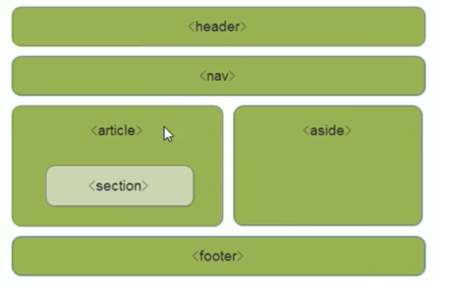
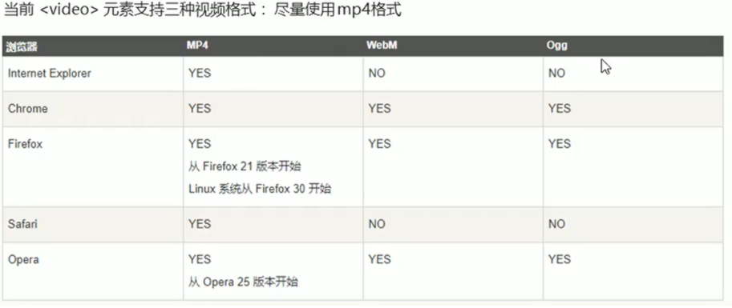
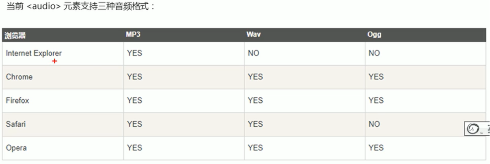
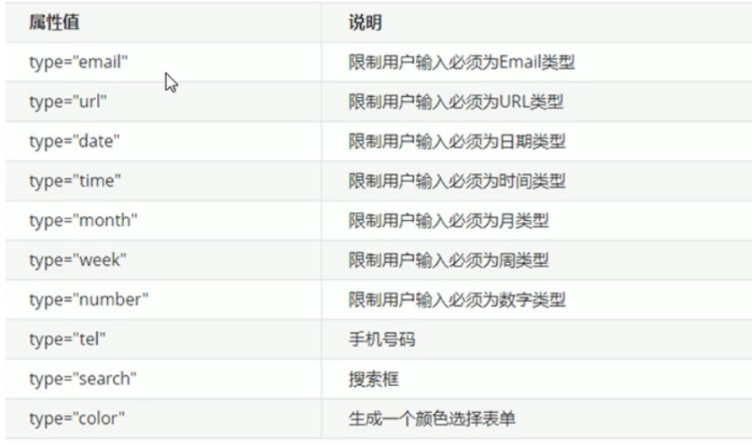
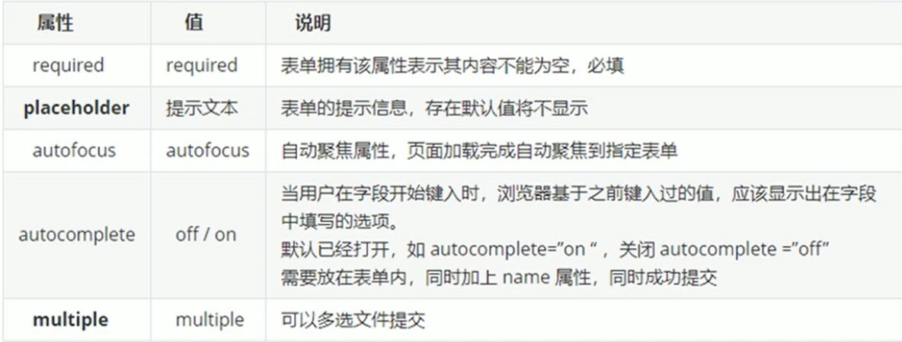

# 1. html5的新特性

## 1. H5新增语义化标签

- header：头部标签
- nav：导航标签
- article：内容标签
- section：定义文档某个区域
- aside：侧边栏标签
- footer：尾部标签



注意：

- 这种语义化标准主要针对搜索引擎
- 在IE9中，需要把这些元素转换为块级元素
- 移动端更喜欢使用这些标签

## 2. H5新增的多媒体标签

### 1. 视频`<video>`



```
<video src="文件地址" controls="controls">
	您的浏览器暂不支持viedo标签播放视频
</video>
```


```
// 兼容性写法
<video controls="controls">
	<source src="move.ogg" type="video/ogg">
	<source src="move.mp4" type="video/mp4">
	您的浏览器暂不支持viedo标签播放视频
</video>
```


| 属性     | 值       | 描述                                                         |
| -------- | -------- | ------------------------------------------------------------ |
| autoplay | autoplay | 如果出现该属性，则视频在就绪后马上播放。（谷歌浏览器需要添加muted来解决自动播放问题） |
| controls | controls | 如果出现该属性，则向用户显示控件，比如播放按钮。             |
| width    | *pixels* | 设置视频播放器的宽度。                                       |
| height   | *pixels* | 设置视频播放器的高度。                                       |
| loop     | loop     | 如果出现该属性，则当媒介文件完成播放后再次开始播放。         |
| preload  | preload  | 如果出现该属性，则视频在页面加载时进行加载，并预备播放。 如果使用 "autoplay"，则忽略该属性。 |
| src      | *url*    | 要播放的视频的 URL。                                         |
| poster   | imgurl   | 加载等待的画面图片                                           |
| muted    | muted    | 静音播放                                                     |

### 2. 音频`<audio>`

```
<audio src="地址" controls="controls"></audio>
```



```
<audio controls="controls">
  <source src="horse.ogg" type="audio/ogg">
  <source src="horse.mp3" type="audio/mpeg">
您的浏览器不支持 audio 元素。
</audio>
```

| 属性     | 值       | 描述                                                         |
| -------- | -------- | ------------------------------------------------------------ |
| autoplay | autoplay | 如果出现该属性，则音频在就绪后马上播放。                     |
| controls | controls | 如果出现该属性，则向用户显示控件，比如播放按钮。             |
| preload  | preload  | 如果出现该属性，则音频在页面加载时进行加载，并预备播放。 如果使用 "autoplay"，则忽略该属性。 |
| src      | *url*    | 要播放的音频的 URL。                                         |

## 3. H5新增input 类型



重点记住：number  tel   search

## 4. H5新增的表单属性



可以通过以下设置方式修改placeholder里面的字体颜色：

```
input::placeholder {
	color: pink;
}
```


