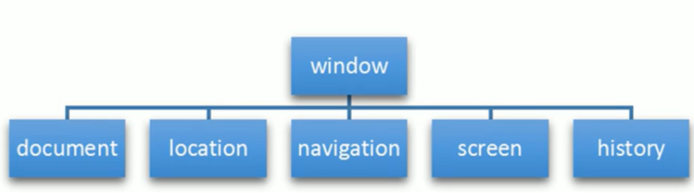
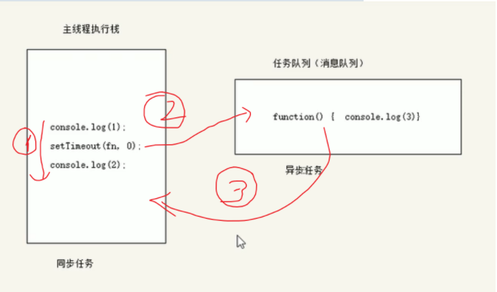
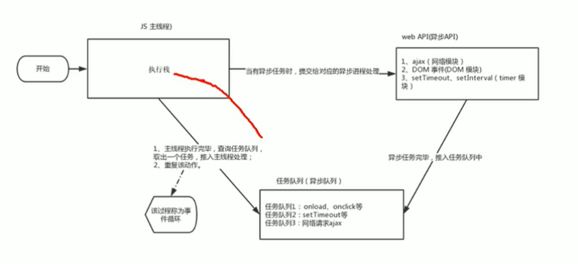
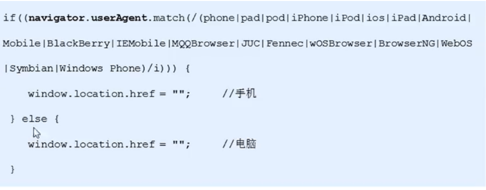

# 1.BOM概述

## 1.1什么是BOM

BOM（Browser Object Model）即浏览器对象模型    它提供了独立于内容而与浏览器窗口进行交互的对象   其核心对象是window

BOM缺乏标准   JS语法的标准化组织是ECMA    DOM的标准化组织是W3C  BOM是各大浏览器厂商自定义的

| DOM                               | BOM                                             |
| :-------------------------------- | :---------------------------------------------- |
| 文档对象模型                      | 浏览器对象模型                                  |
| DOM就是把[文档]当成一个对象来看待 | 把[浏览器]当做一个对象来看待                    |
| DOM的顶级对象是document           | BOM的顶级对象是window                           |
| DOM主要学习的是操作页面元素       | BOM学习的是浏览器窗口交互的一些对象             |
| DOM是W3C标准规范                  | BOM是浏览器厂商在各自浏览器上定义的  兼容性较差 |
|                                   |                                                 |

## 1.2BOM的构成

BOM比DOM更大  它包含了DOM



window  对象是浏览器的顶级对象  它具有双重角色

1.它是JS访问浏览器窗口的一个接口

2.它是一个全局对象   定义在全局作用域中的变量、函数都会变成window对象的属性和方法

在调用的时候可以省略window   前面学习的对话框都属于window对象方法   如alert()、prompt()等；

完整的写法是window.alert();

注意： window下的一个特殊属性window.name

例如：

var s = 10;   //这里定义一个全局变量

console.log(window.s);    //s会编程window对象的一个属性

var fn = function() {}      // 这个全局函数会变成window的一个方法

console.log(window.fn());

# 2.window 对象的常见事件

## 2.1窗口加载事件

### onload事件

window.onload = function() {}

或者     window.addEventListener('load',function(){});

window.onload   是窗口（页面）加载事件    当文档内容完全加载完成后会触发该事件（包括图像、脚本文件、css文件等），就调用的处理函数

注意：

1.有了window.onload  就可以将JS代码写到页面元素的上方  因为onload是等页面内容全部加载完毕，再去执行处理函数

2.window.onload 传统注册事件方式只能写一次   如果有多个事件   会以最后一个window.onload为准

3.如果使用addEventListener 则没有限制

### DOMContentLoaded事件

document.addEventListener('DOMContentLoaded',function(){})

DOMContentLoaded  事件触发时  仅当DOM加载完成   不包括样式表、图片、flash等

IE9以上才支持

如果页面的图片很多的话，从用户访问到onload触发可能需要很长的时间，交互效果就会很差   必然影响用户的体验   此时用DOMContentLoaded事件比较合适

## 2.2调整窗口大小事件

window.onresize = function(){}

window.addEventListener('resize',function(){});

window.onresize 是调整窗口大小加载事件  当触发就调用的处理函数

注意：

1.只要窗口大小发生像素变化  就会触发这个事件

2.我们经常利用这个事件完成响应式布局。    window.innerWidth  获取当前屏幕的宽度

# 3.定时器

## 3.1 setTimeout()定时器  只能调用一次

语法：

window.setTimeout(调用函数，[延迟的毫秒数]);
setTimeout() 方法用于设置一个定时器   该定时器在定时器到期后执行这个函数

注意：

1.window  可以省略

2.这个调用函数可以**直接写函数**，或者**写函数名** 或者**采取字符串'函数名()'**三种形式   第三种不推荐

3.延迟的毫秒数默认是0，如果写，必须是毫秒

4.因为定时器可能有很多  所以我们经常给定时器赋值一个标识符

例如：

var timeout1 = setTimeout(调用函数，[延迟的毫秒数]);

var timeout2 = setTimeout(调用函数，[延迟的毫秒数]);

## 3.2回调函数

###  1. 回调函数的特点：

1. 自己定义的
2. 我没有调用
3. 但是最终执行了

###  2. 常见的回调函数？

1. dom事件回调函数
2. 定时器回调函数
3. ajax请求回调函数
4. 生命周期回调函数

window.setTimeout(调用函数，[延迟的毫秒数]);

setTimeout()   这个调用函数我们也称为回调函数  callback

普通函数就是按照代码顺序直接调用

而这个函数，需要等待一定的时间  时间到了才去调用这个函数  因此称为回调函数

简单理解：  回调  就是回头调用的意思    上一件事干完  在回头调用这个函数

以前我们学习的   element.onclick = function() {}

或者element.addEventListener('click',fn);    里面的函数也是回调函数

## 3.3停止setTimeout()定时器

window.clearTimout(timeout ID)

clearTimout() 方法取消了先前通过调用setTimeout()建立的定时器

注意：

1.window可以省略

2.里面的参数就是定时器的标识符 （定时器的名字）

## 3.4 setInterval()  定时器    重复调用

window.setInterval(回调函数，[间隔的毫秒数]);

setInterval()方法重复调用一个函数   每隔一段时间  就去调用一次回调函数

注意：

1.window  可以省略

2.这个调用函数可以**直接写函数**，或者**写函数名** 或者**采取字符串'函数名()'**三种形式   第三种不推荐

3.延迟的毫秒数默认是0，如果写，必须是毫秒  表示每隔多长时间就自动调用这个函数。

4.因为定时器可能有很多  所以我们经常给定时器赋值一个标识符

## 3.5 停止setInterval()  定时器

window.clearInterval(intervalID);

clearInterval()  方法取消了先前调用setInterval()建立的定时器

注意：

1.window可以省略

2.里面的参数就是定时器的标识符

## 3.6 this  指向问题

一般情况下this的最终指向的是哪个调用它的对象

**1.全局作用域或者普通函数中this指向全局对象window  （注意定时器里面的this也指向window）**

console.log(this);    // 指向window

function fn(){

​	console.log(this);    // 指向window

}

fn();   // 这里相当于是window.fn()     这里的函数相当于window里面的一个方法

window.setTimeout(function(){

​	console.log(this);    // 指向window             

},1000)

**2.方法调用中谁调用this   就指向谁**

var o = {

​	sayHi: function() {

​		console.log(this);    // this 指向的是o这个对象

​	}

}

o.sayHi();

var btn = document.querySelector('button');

btn.onclick = function() {

​	console.log(this);    //  this指向的是btn这个按钮对象

}

btn.addEventListener('click',function(){

​	console.log(this);    // this指向的是btn这个按钮对象

})

**3. 构造函数中的this指向构造函数的实例**

function Fun() {

​	console.log(this);   // this指向的是fun这个实例对象

}

var fun = new Fun();

# 4.JS执行机制

## 4.1 JS是单线程

JS语言的一大特点就是单线程   也就是说  同一时间只能做一件事   这是因为JS这门脚本语言诞生的使命所致——JS是为处理页面中用户的交互、以及操作DOM而诞生的   比如我们对某个DOM元素进行添加和删除操作   不能同时进行， 应该先进行添加，之后在删除


这样带来的后果就是   多个任务需要排队执行   前一个任务执行结束  下一个任务才能执行  如果JS执行的时间过长  这样就会导致页面的渲染不连贯  导致页面渲染加载阻塞的感觉

## 4.2 同步和异步

为了解决这个问题  利用多核CPU的计算能力  HTML5提出了Web Worker标准  允许JS脚本创建多个线程  于是  JS里面出现了同步和异步

**同步任务**

同步任务都在主线程上执行   形成一个**执行栈**

**异步任务**

JS异步是通过回调函数实现的。

一般而言，异步任务有以下三种类型：
1.普通事件，如：click  resize等

2.资源加载：如：load  error等

3.定时器，包括setInterval    setTimeout等

异步任务相关回调函数添加到**任务队列**中   （任务队列也称为消息队列）

## 4.3 JS执行机制

1. 先执行执行栈中的同步任务。
2. 异步任务（回调函数）放入任务队列中
3. 一旦执行栈中的所有同步任务执行完毕，系统就会按次序读取任务队列中的异步任务，于是被读取的异步任务结束等待状态，进入执行栈，开始执行。

执行栈相当于主车道                                   任务队列相当于应急车道



## 4.4 事件循环




由于主线程不断的重复获得任务、执行任务、在获取任务、在执行，这种机制被称为**事件循环（event loop）**

# 5.location对象

## 5.1什么是location对象

window对象给我们提供了一个**location属性**用于**获取或设置窗体的URL**，并且可以用于**解析URL**。因为这个属性返回的是一个对象，所以我们将这个属性也称为**location对象**。

## 5.2URL

**统一资源定位符（uniform resource locator）**是互联网上标准资源的地址。互联网上的每个文件都有一个唯一的URL，它包含的信息指出文件的位置以及浏览器应该怎们处理它。

URL的一般语法：

```
protocol://host[:port]/path/[?query]#fragment

http://www.baidu.com/index.html?name=red&age=18#link
```

| 组成     | 说明                                                         |
| -------- | ------------------------------------------------------------ |
| protocol | 通信协议   常用的http,ftp,maito等                            |
| host     | 主机（域名）www.baidu.com                                    |
| port     | 端口号 可选   省略时使用方案默认端口  如http的默认端口是80   |
| path     | 路劲由0或者多个'/'符号隔开的字符串，一般用来表示主机上的一个目录或者文件地址 |
| query    | 参数  以键值对的形式  通过&符号分隔开来                      |
| fragment | 片段   #后面内容  常见于链接 锚点                            |

## 5.3location 对象的属性

| location 对象的属性 | 返回值                               |
| ------------------- | ------------------------------------ |
| location.href       | 获取或者设置整个URL                  |
| location.host       | 返回主机（域名）www.baidu.com        |
| location.port       | 返回端口号  如果没有写  返回空字符串 |
| location.pathname   | 返回路劲                             |
| location.search     | 返回参数                             |
| location.hash       | 返回片段  #后面内容  常见于链接锚点  |

## 5.4 location 对象的方法

| location对象方法   | 返回值                                                       |
| ------------------ | ------------------------------------------------------------ |
| location.assign()  | 跟href一样，可以跳转页面（也称为重定向页面）                 |
| location.replace() | 替换当前页面，因为不记录历史，所以不能后退页面               |
| location.reload()  | 重新加载页面，相当于书信按钮或者f5       如果参数为true,强制刷新相当于ctrl+f5 |

# 6.navigator 对象

navigator 对象包含有关浏览器的信息，他有很多属性，我们最常用的是userAgent，该属性可以返回由客户机发送服务的user-agent头部的值

下面前端代码可以判断用户用的哪个终端打开，实现跳转



# 7.history 对象

window 对象给我们提供了一个history 对象，与浏览器历史记录进行交互。该对象包含用户（在浏览器窗口中）访问过的URL

| history 对象方法  | 作用                                                       |
| ----------------- | ---------------------------------------------------------- |
| history.back()    | 后退功能                                                   |
| history.forward() | 前进功能                                                   |
| history.go(参数)  | 前进后退功能，参数如果是1 前进1个页面 如果是-1 后退1个页面 |

