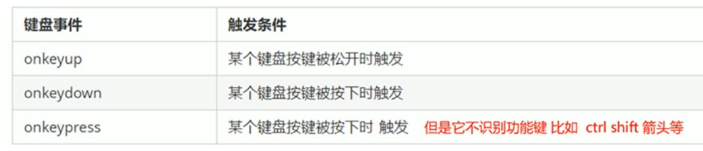

# 一、DOM简介

文档对象模型     是W3C组织推荐的处理可扩展标记语言（html和XML）的标准编程接口

W3C定义了一系列的DOM接口    通过这些DOM接口可以改变网页的内容、结构和样式

**重点**：我们使用DOM获取的元素是一个对象     所以称为文档对象模型

关于DOM操作   我们主要针对元素的操作   主要有创建、增删改查、属性操作、事件操作

## 1.1 DOM树

文档：一个页面就是一个文档，DOM中使用document表示

元素：页面中所有标签就是元素   DOM中使用element表示

节点：网页中所有的内容都是节点 （标签、属性、文本、注释等），DOM中使用node表示

DOM把以上内容都看成对象

# 二、获取元素

## 1.根据id获取element对象

语法：

var element = document.getElementById(id);

参数：

element是一个Element对象    如果当前文档中没有拥有这个id的元素则返回null

id是一个大小写敏感的字符串    代编了所要查找元素的唯一id

返回值：

返回一个匹配ID的DOM   Element对象  若没有找到   返回null

console.dir()    打印我们返回的元素对象  更好的查看里面的属性和方法

## 2.根据标签名返回element对象

语法：

var lis = document.getElementsByTagName('标签名');

返回值：

返回的是一个  匹配元素对象的集合   以伪数组的形式存储

没有匹配的情况下   返回的是一个空的伪数组

### 获取父元素中的子元素

注意：  父元素必须是一个单个对象（必须指明是哪一个元素对象） 获取的时候不包括父元素本身

例如：获取ol里面所有的li

var ol = document.getElementByTagNmae('ol');  // 第一步找到 包含li 标签的父元素伪数组

var li = ol[0].document.getElementByTagNmae('li'); //第二步  指明伪数组中包含 li 标签的  ol   在返回里面的li

实际开发中   我们一般先给父标签指明id属性  

然后根据id属性查找到该父标签   在查询该父标签中孩子元素

## 3.H5新增方法获取元素对象（IE9以上版本）

document.getElementByClassName('类名')；    //根据类名返回元素队象集合

注意：

返回的是一个对象集合

document.querySelector('选择器');     //根据指定的选择器返回第一个元素对象

选择器必须要加符号

例如：

类选择器：   .nav

id选择器：#da

document.querySelectorAll('选择器');      //根据指定的选择器返回一个集合

如果想要获取到该节点的儿子   可以这么做

var arr = document.querySelector('.casc');

var child = arr.document.querySelectorAll('dads'); 

## 4.获取特殊元素（body、html）

获取body元素

document.body;      // 返回body对象

获取html对象

document.documentElement      //返回html元素对象

# 三、事件基础

## 3.1事件概述

简单理解：触发--------相应机制

##  3.2事件三要素

1.事件源

事件源：事件是被谁触发的   

2.事件类型：如何触发    什么事件    例如：鼠标点击（onclick）鼠标经过  键盘按下

3.事件处理程序：通过一个函数赋值的方式

| 属性        | 当以下情况发生时，出现此事件   |
| ----------- | ------------------------------ |
| onabort     | 图像加载被中断                 |
| onblur      | 元素失去焦点                   |
| onchange    | 用户改变域的内容               |
| onclick     | 鼠标点击某个对象               |
| ondblclick  | 鼠标双击某个对象               |
| onerror     | 当加载文档或图像时发生某个错误 |
| onfocus     | 元素获得焦点                   |
| onkeydown   | 某个键盘的键被按下             |
| onkeypress  | 某个键盘的键被按下或按住       |
| onkeyup     | 某个键盘的键被松开             |
| onload      | 某个页面或图像被完成加载       |
| onmousedown | 某个鼠标按键被按下             |
| onmousemove | 鼠标被移动                     |
| onmouseout  | 鼠标从某元素移开               |
| onmouseover | 鼠标被移到某元素之上           |
| onmouseup   | 某个鼠标按键被松开             |
| onreset     | 重置按钮被点击                 |
| onresize    | 窗口或框架被调整尺寸           |
| onselect    | 文本被选定                     |
| onsubmit    | 提交按钮被点击                 |
| onunload    | 用户退出页面                   |

## 3.3操作元素

#### 1.改变元素内容

element.innerText       **不识别html标签**

从起始位置到终止位置的内容，但它去除html标签   **同时空格和换行也会去掉**

element.innerHTML     **识别html标签**

起始位置到终止位置的全部内容   包括html标签    **同时保留空格和换行**

## 2.改变元素的方法

#### 第一种：可以通过绑定事件  进行改变元素

例如：

btn.onclik = function()  {

​	div.innerText = '文本内容';

}

#### 第二种：直接在加载页面的时候就改变元素

例如：

1.获取元素

2.直接改变元素

var p = document.querySelector('p');

p.innerText = '文本内容';	

## 3.修改样式属性

### **element.style          //行内样式操作**

该方法适用于修改样式较少的情况     

注意：

JS里面的样式采用的是驼峰命名法      backgroundColor

JS修改style样式操作    产生的是行内样式    css权重较高+

1.获取元素

var div = document.querySelector('div');

2.注册事件    处理程序

div.onclick = function() {

​	this.style.bacgrondColor = 'red';

}

### element.className     // 类名样式操作

该方法适用于修改大量样式

1.先在css写要修改的样式   并起一个类名

2.在js里面修改该元素的类名就可以修改该属性的样式

className   会直接更改元素的类名    会覆盖原先的类名   所以如果想要保留原先的类   可以

这么做   e.className = '原先的类名 要修改的类名'

## 排他算法   给多个元素绑定事件

首先排除其他人   然后才设置自己的样式   这种排除其他人的思想我们称为排他思想

1.获取所有的元素

var btns = document.getElementsByTagName('button');

2.btns得到的是伪数组    

for(let i=0; i<btns.length;i++) {

​	btns[i].onclick = function() {

​	}

}

## 4.自定义属性的操作

### 1.获取属性值

element.属性   

element.getAttribute('属性')

**区别：**

element.属性      获取的是元素自带的属性值     内置属性值

element.getAttribute('属性')      主要获得的是程序员自定义的属性

自定义属性的方法：

/
 

index-x   就是自定义的属性

### 2.设置属性值

1.element.属性 = '值'   设置内置属性值

2.element.setAttribute('属性'，'值')   

区别：

element.属性    设置内置属性值

element.setAttribute('属性'，'值')      主要设置自定义的属性（标准）

获取类名   不是用.class   而是用 .className

### 3.移除属性   

div.removeAttribute('属性')

## 5.H5自定义属性

H5自定义属性  定义

data-index-first      data开头    用 -  连接单词进行命名

### 1.获取H5自定义属性的方法

1.兼容性获取

element.getAttribute('data-index');

2.H5新增方法

element.dataset.index      或者   element.dataset['index']     IE11长支持

element.dataset       这里获取的是一个集合       里面存放了所有的以data开头的自定义属性

如果是多个单词      要采用驼峰命名法

例如：

elemen.dataset.indexFirst;

# 四、节点操作

## 1.为什么学习节点操作

1.利用DOM提供的方法获取元素    逻辑性不强、繁琐

2.利用节点层级关系获取元素                     逻辑性强 但是兼容性较差

## 2.节点概述

一般来说   节点至少拥有nodeType（节点类型）、nodeName(节点名称)和nodeValue（节点值）这三个基本属性

元素节点     nodeType    为1

属性节点     nodeType    为2

文本节点     nodeType    为3（文本节点包含文字、空格、换行等）

实际开发中   节点操作主要操作的是元素节点

## 3.节点层级

### 1.父级节点

node.parentNode

parentNode 属性可以返回某节点的父节点    注意是 最近的一个父节点

如果指定的节点没有父节点则返回null

例如：

var arr = doucument.querySelector('.adsa');

var parent = arr.parentNode;      

### 2.子节点

**parentNode.childNodes(标准)**

parentNode.childNodes(标准)     返回包含指定节点的子节点的集合    该集合为及时更新的集合

返回值包含了所有的子节点     包括元素节点    文本节点等等

如果想要获得里面的元素节点   还需要专门处理    所以我们一般不提倡使用parentNode.childNodes(标准)

我们一般使用    **parentNode.children(非标准)**

返回所有的子元素节点     它只返回子元素节点   其余节点不返回

**获取第一个节点      最后一个节点**

parentNode.firstChild          parentNode.lastNode       

该方法返回的第一个节点    里面包含所有的节点   包括文本     空格之类的    找不到返回null

**获取第一个元素     最后一个元素     IE9以上版本才支持**

parentNode.firstElementChild      parentNode.lastElementChild      

**实际开发我们使用parentNode.children(非标准)来获取第一个元素节点    最后一个元素节点**

**parentNode.children[0]**          **parentNode.children(parentNode.children.length -1)**

### 3.兄弟节点

node.nextSibling          node.previousSibling    上一个节点

返回的是当前元素的下一个兄弟节点   找不到的则返回null     同样   也包含了所有的节点

node.nextElementSibling      node.previousElementSibling 

返回的是当前元素的下一个元素节点    同样   只有IE9以上版本才支持

如果要解决兼容性的问题     我们要自己封装一个兼容性的函数

## 4.创建节点

document.createElement('tagNmae')

document.createElement()    方法创建由tagNmae 指定的HTML元素    这些元素原先并不存在    是根据我们的需求动态生成的    所以我们也称为**动态创建元素节点**

## 5.添加节点

node.appendChild(child)     在父亲节点内部  最后添加一个节点

node.appendChild() 方法将一个节点添加到指定父节点的子节点列表末尾     类似于css里面的after   伪元素

node    是父级节点       child   是创建好的孩子节点

node.insertBefore(child,指定元素)     在父级节点里面指定的元素前面进行添加   类似于css里面的before  伪元素

## 6.删除节点

node.removeChild(child)

该方法删除的是node中的child的子节点   返回删除的子节点

## 7.复制节点

node.cloneNode()

该方法返回调用该方法的节点的一个副本     也称为克隆节点  拷贝节点

注意：

1.如果括号里面的参数为空或者为false   则是浅拷贝   只克隆复制节点本身   不复制里面的内容

2.如果括号里面的参数为true   则为深度拷贝  会复制节点本身以及里面所有的内容

     在a标签中添加javascript:;   链接就不会跳转了

## 8.三种动态创建元素的区别    重点

### 1.document.write()

是直接将内容写入页面的内容流     但是当文档流执行完毕后   会导致页面全部重绘    原先的内容全部没有了

### 2.document.node.innerHTML

是将内容写入某个DOM节点  不会导致页面全部重绘的问题 

在创建多个元素的时候    如果使用拼接字符串的方式的形式    效率极低

例如:

for(let i=0;i<1000;i++) {

​	document.body.innerHTML += '
sdasdasd
';

}

这样使用的话    效率低   因为   字符串不可变性   每次都要开辟一个新的空间进行赋值

如果采用数组转换成字符串的在创建元素   效率最高

例如：

var arr = [];

for(let i=0;i<1000;i++) {

​	arr.puch('
sdasdasd
');

}

document.body.innerHTML = arr.join('');

### 3.document.createElement()

使用document.createElement()   创建多个元素效率稍微低一点点     但是结构逻辑清晰

创建完后  需要在把创建好的节点插入进去

总结：不同的浏览器下   innerHTML效率要比creatElement高

# 五、事件高级

## 1.注册事件

### 1.1注册事件概述

给元素添加事件   称为注册事件 或者绑定事件

注册事件有两种方式：   传统方式      方法监听注册方式

**传统注册方式**

利用on开头的事件   onclick

</button onclick="alert('hi~')"></button>

btn.onclick = function() {}

特点：注册事件的**唯一性**

同一个元素同一个事件只能设置一个处理函数   最后注册的处理函数将会覆盖前面注册的处理函数

**方法监听注册方式**

W3C标准推荐的方式

addEventListener()  它是一个方法

IE9以前不支持此方法   可以使用attachEnent()代替（这个方法只能是IE9以前的版本才支持，IE9以上版本不支持该方法）

特点：同一个元素同一个事件可以注册多个监听器

按注册顺序依次执行

### 1.2 addEventListener() 事件监听方式

eventTarget.addEventListener(type,listener[,userCapture]) 

一个目标对象可以注册多个处理函数

eventTarget.addEventListener()方法将指定的监听器注册到eventTarget（目标对象）上，当该对象触发指定的事件时，就会执行事件监听函数

该方法接受的三个参数：
type：事件类型字符串  比如click、mouseover,注意这里的事件不带on

listener:事件处理函数，事件发生时，会调用该监听函数

useCapture:可选参数，是一个布尔值，默认时false。

### 1.3attachEnent()事件监听方式

eventTarget.attachEnent(eventNameWithOn, callback)

eventTarget.attachEnent()方法将指定的监听器注册到eventTarget（目标对象上），当该对象触发事件时，指定的回调函数就会被执行

该方法接受两个参数：
eventNameWithOn：事件类型字符串   比如onclick、onmouseover  这里需要带on

callback：事件处理函数，当目标触发事件回调函数时被调用

## 2.删除事件

### 1.传统注册方式

eventTarget.onclik = null;

例如：

div.onclick = function() {

​	alert(1);

​	div.onclick = null;

}

### 2.方法监听方式

1.eventTarget.removeEventListener(type,listener[, userCapture]);

例如：

div.addEventListener('click',fn) ;    **//注意  这里的事件函数调用不加小括号**

function fn() {

​	alert(1)

​	div.removeEventListener('click', fn);   **//同样这里的事件函数也不加小括号    删除事件**     

}

2.eventTarget.detachEvent(eventNameWithOn, callback)

例如：

div.attachEvent('onclick', fn);

function fn() {

​	alert(1);

​	div.detachEvent('click', fn);    **//删除事件**

}

## 3.DOM事件流

事件流描述的是从页面中接受事件的顺序

事件发生时会在元素节点之间按照特定的顺序传播，这个传播过程即DOM事件流

比如我们给一个div注册一个点击事件

DOM事件流分为3个阶段

1.捕获阶段

2.当前目标阶段

3.冒泡阶段

事件冒泡：IE最早提出   事件开始时由具体的元素接受   然后逐级向上传播到DOM最顶层节点的过程

事件捕获：网景最早提出   由DOM最顶层节点开始   然后逐级向下传播到最具体元素接受的过程

**注意：**

**1.JS代码中只能执行捕获或者冒泡其中一个阶段**

2.onclik和attachEvent只能得到冒泡阶段

3.addEventListener(type,listener[,userCapture]) 第三个参数如果是true，表示在事件捕获阶段调用事件处理程序；如果是false（不写这个参数默认是false），表示在事件冒泡阶段调用事件处理程序

4.实际开发中物品们很少使用事件捕获，我们更关注事件冒泡

5.有些事件是没有冒泡的，比如onblur、onfocus、onmouseenter、onmouseleave

例子：

div class='father'

​	div class='son'

捕获阶段调用程序    

var son = document.querySelector('.son');

var father =  document.querySelector('.father');

son.addEventListener('click',function(){

​	alert(1);

},true);

father.addEventListener('click',function(){

​	alert(2);

},true);

先显示    2   在显示1

var son = document.querySelector('.son');

var father =  document.querySelector('.father');

son.addEventListener('click',function(){

​	alert(1);

},false);

father.addEventListener('click',function(){

​	alert(2);

},false);

先显示    1   在显示2

## 4.什么是事件对象

eventTarget.onclick = function(event) {}

eventTarget.addEventListener('click',function(event){});

官方解释：event对象代表事件的状态，比如键盘按键的状态、鼠标的位置、鼠标按钮的状态

简单理解：事件发生后，跟事件相关的一系列信息数据的集合都会放在这个对象里面，这个对象就是事件对象event,它有很多属性和方法

比如：

1.谁绑定了这个事件

2.鼠标触发这个事件的话，会得到鼠标相关的信息，比如鼠标位置

3.键盘触发这个事件的话，会得到键盘相关的信息，如按了哪个键

注意：

这个event是个形参，系统帮我们设定为事件对象，不需要传递实参进去

当我们注册事件时，event对象就会被系统自动创建，并依次传递给事件监听器（事件处理函数）

### **兼容性处理**

1.标准浏览器中给方法传递参数，只需要定义形参e就可以得到

2.在IE6~8中，浏览器不会给方法传递参数，如果需要的话，需要到window.event中获取查找

解决的方法

eventTarget.onclick = function(e) {

​	e = e || window.event;

}

eventTarget.addEventListener('click',function(e){

​	e = e || window.event;

});

### 4.1事件对象的常见属性和方法

#### e.target  和this 的区别

e.target   返回的是触发事件的对象（元素）   this  返回的是绑定事件的对象（元素）

例子：

var div = document.querySelector('div');

div.addEventListener('click', function(e){

​	console.log(e.target);

​	console.log(this);

})

这里显示都是div这个对象

var ul = document.querySelector('ul');

ul.addEventListener('click', function(e){

​	console.log(e.target);

​	console.log(this);

})

这里给ul绑定了事件    所以this指就是ul这个对象

如果是ui里面的li触发了事件   则e.target这个指向li这个对象

#### currentTarget   和  this

currentTarget    该属性IE9以上版本支持   跟this很相似    这个方法返回的也是谁绑定了对象返回哪个对象

this不用考虑兼容性问题    我们一般都是用this

#### e.target兼容性问题

e.target   这个方法只能IE9以上才能使用

解决获取谁触发事件对象   可以这么做

div.onclik = function(e) {

​	e = e || window.event;

​	var target = e.target || e.srcElement;

​	console.log(target);

}

#### 阻止默认行为（事件）让链接不跳转  或者让提交按钮不提交

var a = document.querySelector('a');

a.addEventListener('click', function(e) {

​	//普通浏览器    e.preventDefault()   这是一个方法

​	e.preventDefault();

​	//低版本浏览器    使用    returnValue    这是一个属性

​	e.returnValue;

​	//我们还可以使用return false   也可以阻止默认行为   这个没有兼容性问题   

​	//特点：return   后面的代码不执行     **而且只限于传统的注册方式**      

​	使用addEventListener  事件监听函数注册的事件    return false不管用

​	return false;

​	alert(1);

})

## 5.阻止事件冒泡的两种方式

事件冒泡：开始时由最具体的元素接受，然后逐级向上传播到DOM最顶层节点

### 1.stopPropagation()  方法  标准写法 （普通浏览器）

Propagation传播的意思   阻止传播

例子：

var son = document.querySelector('.son');

son.addEventLisener('click', function(e){

​	//阻止冒泡

​	e.stopPropagation();  

​	//或者使用cancelBubble  属性来阻止冒泡

​	e.cancelBubble = true;

},false);

### 2.cancelBubble   属性   (IE9一下版本浏览器)

例子：兼容性写法

var son = document.getElementById('son');

son.onclick = function(e){

​	//阻止冒泡

​	if(e && e.stopPropagation){

​		e.stopPropagation();

​	}else {

​		window.event.cancelBubble = true;

​	}

})

## 6.事件委托

例如：

ul里面有多个li标签时  我们需要给每个li标签绑定事件    

以前的方法   我们是利用for循环给每个li注册绑定事件     但是这样访问DOM次数非常多   会延长整个页面的交互就绪事件

所以我们可以这么做

**事件委托**

事件委托也叫事件代理      在jQuery里面称为事件委派

**事件委托的原理**

不死每个子节点单独设置事件监听器    而是将事件监听器设置在其父节点上   然后利用事件冒泡原理影响设置每个子节点

上面的案例：给ul注册事件，然后利用事件对象的target来找到当前点击的li，因为点击li，事件会冒泡到ul上  ul有注册事件   就会触发事件监听器

**事件委托的作用**

我们只操作了一个DOM    很大程度上提高了程序的性能

例如：

var ul = document.querySelector('ul');

ul.addEventListener('click', function(e){

​	e.target.style.backgroundColor = 'pink' ;

},false)

## 7.常用的鼠标事件

### 1.禁止鼠标右键菜单

contextmenu  主要控制应该何时显示上下文菜单    主要用于程序员取消默认的上下文菜单

例如：

document.addEventListener('contextmenu',function(e){

​	e.preventDefault()；//阻止默认事件

});

### 2.禁止鼠标选中(selectstart  开始选中)

相当于选不中文本

document.addEventListener('selectstart',function(e){

​	e.preventDefault()；//阻止默认事件

});

## 8.鼠标事件对象

event对象代表事件的状态   跟事件相关的一系列信息的集合  现阶段我们主要用

鼠标事件对象**MouseEvent**和键盘事件对象**KeyboardEvent**

案例：

document.addEventListener('selectstart',function(e){

​	e.clientX;    

});

## 9.常用键盘事件

注意：

1.如果使用addEventListener  不需要加on

2.onkeypress和前面两个的区别   它不识别功能键   例如：ctrl shift  箭头等

3.三个事件的执行顺序是：keydown  >  keypress   >   keyup

## 10.键盘事件对象

| 键盘事件对象属性 | 说明                                                         |
| ---------------- | ------------------------------------------------------------ |
| key              | 返回的是按了哪个键 （有兼容性问题   有些浏览器不支持  不推荐） |
| keyCode          | 返回改键的ASCII值  （推荐使用）                              |

注意：

onkeydown和onkeyup  不区分大小写   onkeypress区分大小写。

在实际开发中   我们更多的是使用heydown和keyup   它能识别所有的键（包括功能键）

keypress 不识别功能键  但是keyCode属性能区分大小写    返回不同的ASCII值

