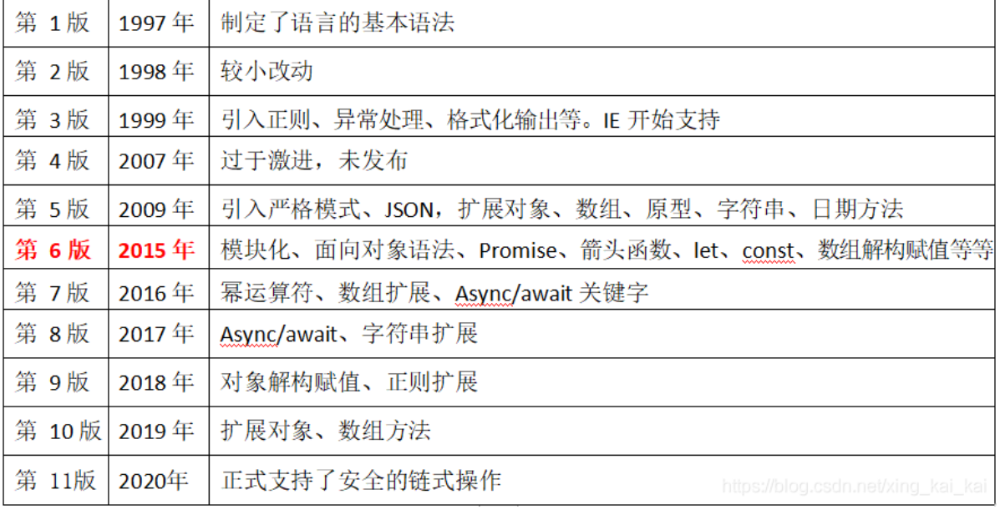
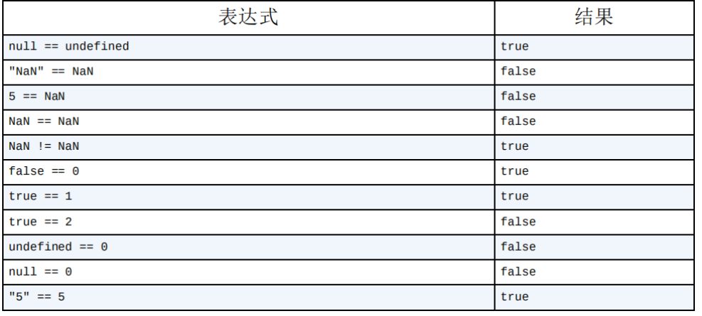
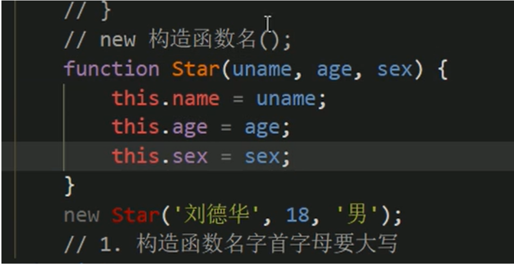
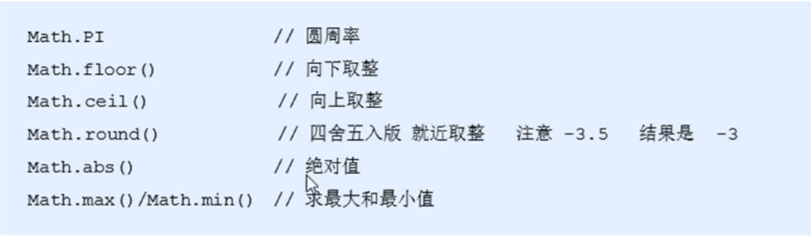

# 一、什么是JavaScript

## 1. JavaScript实现

​	完整的JavaScript实现包含三个部分：

​			1.核心（ECMASript）

​			2.文档对象模型（DOM）

​			3.浏览器对象模型（BOM）

### 1.1ECMASript

ECMASript只是对实现这个规范的所有方面的一门语言的称呼。JavaScript实现了ECMASript。

在基本的层面，它描述了这门语言如下部分：

- 语法
- 类型
- 语句
- 关键字
- 保留字
- 操作符
- 全局对象

**ECMASript版本**



**ECMASript符合性**


# 二、HTML中的JavaScript

## 1.js的书写位置

### （1）可以将js写在onclick属性中

<botton onclick="alert('hello');">hello</button>


### （2）可以将js写在超链接href中，

''<'a href="javascript:alert('hello');">''点我一下</a>''

虽然可以卸载标签的属性中，但是他们结构与行为耦合，不方便维护。

### （3）可以将js写在javascript标签中

### （4）可以将js代码写在外部js文件中，然后通过script标签引入

<script type="text/javascript" src="js/index.js"></script>

script标签一旦引入js文件了，里面不能写代码，里面的代码不执行

## 2.js的注释

### （1）多行注释

多行注释和c语言是一样的   

/*

​	这是一个js代码

*/

### （2）单行注释

//单行注释

# 三、语言基础

## 3.1 语法

### 3.1.1 严格区分大小写

### 3.1.2 标识符（就是变量、函数、函数参数的名称）

js中我们可以由我们自主明名的都可以称为标识符

例如：变量名、函数名、属性名都属于标识符

命名一个标识符需要遵守以下爱规则：

​	1.标识符中可以含有字母、数字、_、$

​	2.标识符不能以数字开头

​	3.标识符不能是ES中的关键字或保留字

​	4.标识符一般采用驼峰命名法

​					首字母小写    每个单词的开头字母大写  其余字母小写

​					helloWord        

js底层保存标识符时实际上是采用Unicode编码，

​			理论上将，所有utf-8中含有的内容都可以作为标识符

### 3.1.3 严格模式

ES5增加了严格模式（strict mode）的概念。严格模式是一种不同的JS解析和执行模型，ES3的一些不规范的写法在这种模式下会被处理，对于不安全的活动将抛出错误，要对整个脚本启用严格模式，在脚本开头加上这一行：

```
"use strict";
```

这句话是一个预处理指令。任何支持的JS引擎看到它都会切换到严格模式，只要把这个预处理指令放到函数体开头即可。

```
function fun(){
	"use strict";
	// 函数体
}
```

严格模式会影响到JS执行的很多方面。

## 3.2 变量

变量可以保存字面量，而且变量的值是可以改变的,   还可以对字面量进行描述

有三个关键字可以声明变量：var、let、const

其中var所有ES版本都可以使用，只有let和const在ES6更高级版本种使用

### 3.2.1 var关键字

var n;

n可以用来保存任何类型的值，不初始化的情况下，变量会保存一个特殊值Undefined（未定义）

#### 1. var声明作用域

   使用var操作符定义的变量会变成包含它的函数局部变量。例如下面的例子：在函数内使用var定义了一个变量，就意味着该变量在函数退出时被销毁。

```
function test(){

​	var n=2323；//局部变量

}
test();
console.log(n); // 出错
```

 这里，n变量是在函数内部使用var定义的，调用test()函数，就会创建这个n变量并给它赋值，调用之后变量随即被销毁，因此实例中最后一行会导致错误。

**在函数内定义变量时如果省去var操作符，可以创建一个全局变量：例如：**

```
function test() {

    n = 2323;//局部变量

}
test();
console.log(n); //2323
```

虽然可以通过省略var操作符定义全局变量，但是不推荐这样做，因为在局部作用域中定义的全局变量很难维护，也会造成困惑。在严格模式中，如果这样使用，会抛出**ReferenceError**


#### 2. var声明提升

所谓声明提升就是把所有变量声明都拉到函数作用域顶部。

使用var时，下面代码不会报错，是因为使用这个关键字声明的变量会自动提升到函数作用域顶部。

```
function test() {
    console.log(n);
    var n = 2323;
}

test(); // undefined
```

等价于

```
function test() {
    var n;
    console.log(n);
    var n = 2323;
}

test();  // undefined
```

可以反复多次使用var声明同一个变量也没有问题

```
function test(){
    var n=2323;
    var n=2753;
    var n=244;
    console.log(n);
}
test(); // 244
```


### 3.2.2 let声明（es6）

let和var的作用差不多，但有着非常重要的区别。最明显的区别就是： **let声明的作用域是块作用域，而var声明的范围是函数作用域**

```
if (true) {
    var n = 'Matt';
    console.log(n); // Matt 
}
console.log(n); // Matt
if (true) {
    let age = 26;
    console.log(age); // 26 
}
console.log(age); // ReferenceError: age没有定义
```

在这里，age变量之所以不能在if块外部被引用，是因为他的作用域仅限于该块内部。块作用域是函数作用域的子集，因此适用于var作用域限制同样也适用于let。


**let不允许同一个块作用域中出现冗余声明。出现会报错。**

```
var name;
var name;

let age;
let age; // SyntaxError 语法错误
```


JS引擎会记录用于变量声明的标识符及其所在的块作用域，因此嵌套使用相同的标识符不会报错，而这时因为同一个块中没有重复声明：

```
var name = 'Tom';
console.log(name); // Tom
if (true) {
    var name = 'xiaoming';
    console.log(name); // xiaoming
}


let age = 18;
console.log(age); // 18
if (true) {
    let age = 19;
    console.log(age); // 19
}
```


#### 1. 暂时性死区

let和var有一个很大的区别，就是let声明的变量不会在作用域种被提升。

```
// name会被提升 
console.log(name); // undefined 
var name = 'Matt'; 

// age不会被提升 
console.log(age); // ReferenceError：age没有定义
let age = 26;
```

在let声明之前的执行瞬间被称为“暂时性死区”

####  2. 全局声明

与var关键字不同，使用let在全局作用域中声明的变量不会成为window对象的属性（var声明的变量则会）

```
var name = 'Matt'; 
console.log(window.name); // 'Matt'

let age = 26; 
console.log(window.age); // undefined
```

不过，let声明仍然是全局作用域中发生的，相应变量会在页面的声明周期内存续。因此，为了避免SyntaxError，必须确保页面不会重复声明同一个变量。

####  3. 条件声明

在使用var声明变量时，由于声明会被提升，JS引擎会自动将多余的声明在作用域顶部合并为一个声明。因为let的作用域时块，所以不可能检查前面是否已经使用let声明过同名变量，同时也就不可能在没有声明的情况下声明它。

```
<script> 
    var name = 'Nicholas'; 
    let age = 26; 
 </script>
 
 <script> 
    // 假设脚本不确定页面中是否已经声明了同名变量 
    // 那它可以假设还没有声明过 
    var name = 'Matt'; 
    // 这里没问题，因为可以被作为一个提升声明来处理 
    // 不需要检查之前是否声明过同名变量 
    let age = 36; 
    // 如果age之前声明过，这里会报错 
</script> 
```

使用try/catch语句或typeof操作符也不能解决，因为条件块中let 
声明的作用域仅限于该块。 

```
<script> 
    let name = 'Nicholas'; 
    let age = 36; 
</script> 

<script> 
    // 假设脚本不确定页面中是否已经声明了同名变量 
    // 那它可以假设还没有声明过 
    if (typeof name === 'undefined') { 
    	let name; 
    }
    
    // name被限制在if {} 块的作用域内 
    // 因此这个赋值形同全局赋值 
    name = 'Matt'; 
    
    try (age) { 
    	// 如果age没有声明过，则会报错 
    }
    catch(error) { 
    	let age; 
    }
    
    // age被限制在catch {}块的作用域内 
    // 因此这个赋值形同全局赋值 
    age = 26; 
</script> 
```

为此，对于let这个新的ES6声明关键字，不能依赖条件声明模式。 
**注意 不能使用let进行条件式声明是件好事，因为条件声明是一种反模式，它让程序变得更难理解。如果你发现自己在使用这个模式，那一定有更好的替代方式。**

#### 4. for循环中的let声明

在let出现之前，for循环定义的迭代变量会渗透到循环体外部： 

```
for (var i = 0; i < 5; ++i) { 
// 循环逻辑 
}
console.log(i); // 5 
```

改成使用let之后，这个问题就消失了，因为迭代变量的作用域仅限于for循环块内部： 

```
for (let i = 0; i < 5; ++i) { 
// 循环逻辑 
}
console.log(i); // ReferenceError: i没有定义 
```

在使用var的时候，最常见的问题就是对迭代变量的奇特声明和修改：

```
for (var i = 0; i < 5; ++i) { 
	setTimeout(() => console.log(i), 0) 
}
// 你可能以为会输出0、1、2、3、4 
// 实际上会输出5、5、5、5、5 
```

之所以会这样，是因为在退出循环时，迭代变量保存的是导致循环退出的值：5。在之后执行超时逻辑时，所有的i都是同一个变量，因而输出的都是同一个最终值。而在使用let声明迭代变量时，JavaScript引擎在后台会为每个迭代循环声明一个新的迭代变量。每个setTimeout引用的都是不同的变量实例，所以console.log输出的是我们期望的值，也就是循环执行过程中每个迭代变量的值。 

```
for (let i = 0; i < 5; ++i) { 
	setTimeout(() => console.log(i), 0) 
}
// 会输出0、1、2、3、4 
```

### 3.2.3 const声明

​	const 的行为与let基本相同，唯一一个重要的区别是它声明变量时必须同时初始化变量，且尝试修改 const 声明变量会导致运行时错误。

```
const age = 24;
age = 36; // TypeError  给常量赋值


// const 也不允许重复声明
const name = 'Tom';
const name = 'XiaoMing'; // SyntaxError


// const 声明的作用域也是块
const name = 'Tom';
if ( true ) {
	const name = 'XiaoMing';
}
console.log(name); // Tom
```

const 声明的限制只适用于它指向的变量的引用。换句话说，如果 const 变量引用的是一个对象，那么修改这个对象内部的属性并不违反const的限制。

```
const person = {};
person.name = 'Tom';  // ok
```

即使JS引擎会为for循环中的let声明分别创建独立的变量实例，但是不能用const来声明迭代变量。（因为迭代变量会自增）

```
for(const i=0; i < 10; i++) {} // TypeError 给常量赋值
```


## 3.3 数据类型

分为6种**简单数据类型**（也成为原始类型）还有一个symbol（符号）时es6新加的

- Undefined   未定义

- boolean    布尔值

- string    字符串

- number     数值

- Null    空值

- object    对象

- symbol   符号


其中Undefined   、boolean    、string    、number     、Null    属于基本数据类型

还有一种**复杂数据类型**

- object    属于引用数据类型

### 3.3.1 typeof操作符

因为ES的类型系统时松散的，所以需要一种手段确定任意变量的数据类型。

typeof操作符就是来查看变量属于哪一种数据类型

- "undefined"表示值未定义； 

- "boolean"表示值为布尔值； 

- "string"表示值为字符串； 

- "number"表示值为数值； 

- "object"表示值为对象（而不是函数）或null； 
- "function"表示值为函数； 

- "symbol"表示值为符号。


下面是使用typeof操作符的例子： 

```
let message = "some string"; 

console.log(typeof message); // "string" 

console.log(typeof(message)); // "string" 

console.log(typeof 95); // "number"
```

注意：typeof是一个操作符而不是函数，所以不需要参数（也可以使用参数）

**在查询“null”时返回的是一个“object”。因为特殊值null会被认为是一个空对象的引用。**


### 3.3.2 Undefined类型

Undefined类型只要有一个值，就是undefined。当使用var和let声明变量但没有初始化时，就相当于给变量赋值undefined值。

```
let message;

console.log(message == undefined); // true
```

​	在这个例子中，变量message在声明的时候并未初始化。而在比较它和undefined的字面值时，两者是相等的。这个例子等同于：

```
let message = undefined;
console.log(message == undefined); // true
```

​	默认情况下，任何未经初始化的变量都会取得undefined值。

**目的：增加这个变量的目的在于为了区别null空对象指针和未初始化变量的区别**

undefined是一个假值

```
let message; // 这个变量被声明了，只是值为undefined 

// age没有声明 

if (message) { 

// 这个块不会执行 

} 

if (!message) { 

// 这个块会执行 

} 

if (age) { 

// 这里会报错 

}
```


### 3.3.3 Null类型

null类型同样只有一个值，即特殊值null。逻辑上讲，null值表示一个**空对象指针**，这也是给typeof传一个null会返回object的原因。

```
let car = null;
console.log(typeof car); // 'object'
```

在定义一个对象时，建议使用null来进行初始化，不要使用其他值，这样可以检查这个对象是不是null就可以知道这个变量是否后来被重新赋予一个对象的引用。

例如

```
if（car！=null）{

	//car是一个对象的引用

}
```

undefined是null派生来的，ECMA-262将它们定义为表面相等，如：

```
console.log（null==undefined）；//true
```

用等于操作符(==)比较 null 和 undefined 始终返回 true。但是要注意，这个操作符会为了比较而转换它的操作数。

null 和 undefined 的区别：

- 如前面的 undefined 永远不必显示的将变量值设置为undefined。但是 null 不是这样的。
- null 是一个空对象指针，例如，在定义一个对象时，当时没有对象可以保存，就要用null来填充改变量。

- null 是一个假值  

```
let message = null; 
let age; 

if (message) { 
// 这个块不会执行 
} 

if (!message) { 
// 这个块会执行
} 

if (age) { 
// 这个块不会执行 
} 

if (!age) { 
// 这个块会执行 
}
```


### 3.3.4 Boolean类型

Boolean有两个字面值：true、false      **区分大小写**     True 和 False 是有效的标识符，不是布尔值

这两个布尔值不同于数值，因此true！=1   false！=0，

要将其他类型的值转换成布尔值    使用特定的Boolean（）转型函数

| 数据类型  | 转换为true的值         | 转换为false的值 |
| --------- | ---------------------- | --------------- |
| Boolean   | true                   | false           |
| String    | 非空字符串             | ""（空字符串）  |
| Number    | 非零数值（包括无穷值） | 0、NaN          |
| Object    | 任意对象               | null            |
| Undefined | N/A（不存在）          | undefined       |


### 3.3.5 Number类型

Number类型使用IEEE 754格式表示整数和浮点数。

####  1. 整数

最基本的数值字面量格式是十进制整数，直接写出来即可：

let intNum = 55; // 整数

整数也可以用八进制（以8为基数）或十六进制（以16为基数）字面量 表示。对于八进制字面量，第一个数字必须是零（0），然后是相应的 八进制数字（数值0~7）。如果字面量中包含的数字超出了应有的范 围，就会忽略前缀的零，后面的数字序列会被当成十进制数，如下所 示：

let octalNum1 = 070; // 八进制的56 

let octalNum2 = 079; // 无效的八进制值，当成79处理 

let octalNum3 = 08; // 无效的八进制值，当成8处理

**八进制字面量在严格模式下是无效的**，会导致JavaScript引擎抛出语法错 误。 ECMAScript 2015或ES6中的八进制值通过前缀0o来表示；严格模式下，前缀0会被视为语法 错误，如果要表示八进制值，应该使用前缀0o。

十六进制    数值前缀0x（区分大小写）   十六进制数字（A~F）这里不区分大小写

正零和负零在所有条件下都被认为是等同的。

####  2. 浮点数

要定义浮点数，数值中必须要有小数点，而且小数点后面必须至少有一个数字。

因为存储浮点数使用的内存空间总是存储整数值的两倍，所以ES总是想法设法把浮点数转换成整数。

**所以在小数点后面没有数字的情况下，数值就会变成整数。**

let floatNum1 = 1.; // 小数点后面没有数字，当成整数1处理 

let floatNum2 = 10.0; // 小数点后面是零，当成整数10处理

**对于非常大和非常小的数值，浮点值可以用科学计数法表示**，例如

let floatNum = 3.125e7; // 等于31250000

**浮点值的精确度最高可达17位小数，但在算数计算中不准确。**

例如：0.1+0.2=0.300 000 000 000 000 04

```
if (a + b == 0.3) {// 别这么干！

 	console.log("You got 0.3."); 

}
```

**所以永远不要测试某个特定的浮点值**

####  3. 值的范围

ECMAScript可以表示的最小数值保存在 Number.MIN_VALUE 中， 这个值在多数浏览器中是5e-324；

可以表示的最大数值保存 在 Number.MAX_VALUE 中，这个值在多数浏览器中是1.797 693 134 862 315 7e+308。如果某个计算得到的数值结果超出了JavaScript可以表 示的范围，那么这个数值会被自动转换为一个特殊的 **Infinity**（无 穷）值。任何无法表示的负数以 **-Infinity**（负无穷大）表示，任何无法表示的正数以Infinity（正无穷大）表示。

使用Number.NEGATIVE_INFINITY和 Number.POSITIVE_INFINITY也可以获取正、负Infinity。没 错，这两个属性包含的值分别就是-Infinity和Infinity。

```
// 获取最大值
let max_value = Number.MAX_VALUE;
console.log(max_value);
```


####  4. NaN(Not a Number)

有一个特殊的数值，意思是“不是数值”，用于表示操作失败了（而不是抛出错误）

例如：用0除任意数值在其他语言中通常都会导致错误，从而中止代码执 行。但在ECMAScript中，

**0、+0或-0相除会返回NaN：**

```
console.log(0/0); // NaN 

console.log(-0/+0); // NaN
```

**如果分子是非0值，分母是有符号0或无符号0，则会返回Infinity 或-Infinity：**

```
console.log(5/0); // Infinity 

console.log(5/-0); // -Infinity
```

**任何涉及NaN的操作始终返回NaN（如NaN/10）**

**NaN不等于NaN在内的任何值,例如：**

```
console.log(NaN == NaN); // false
```

**ES提供了isNaN（）函数，**该函数接受一个参数，可以是任意数据类型，然后判断这个参数是不是“不是数值”

把一个参数传递给isNaN（）函数后，该函数会尝试把它转换成为数值。不是数值返回 true，是数值返回 false

```
console.log(isNaN(NaN)); // true 

console.log(isNaN(10)); // false，10是数值 

console.log(isNaN("10")); // false，可以转换为数值10 

console.log(isNaN("blue")); // true，不可以转换为数值 

console.log(isNaN(true)); // false，可以转换为数值1
```

注意 虽然不常见，但isNaN()可以用于测试对象。此时，首先会调用对象的valueOf()方法，然后再确定返回的值是否可以转换为数值。如果不能，再调用toString()方法，并测试其 返回值。这通常是ECMAScript内置函数和操作的工作方式。


####  5. 数值转换

**Number()、parseInt()和 parseFloat()这三个函数可以将非数值转换成数值**

##### Number()方法

Number()是转型函数，可用于任何数据类型。后两个函数主要用于将字符串转换为数值。

Number()基于如下规则进行转换

- 布尔值         true为1   false为0
- 数值             直接返回
- null              返回0
- 字符串
  - 如果字符串包含数值字符，包括数值字符前面带加、减号 的情况，则转换为一个十进制数值。因此，Number("1") 返回1，Number("123")返回123，Number("011")返回 11（忽略前面的零）。
  - 如果字符串包含有效的浮点值格式如"1.1"，则会转换为 相应的浮点值（同样，忽略前面的零）。
  - 如果字符串包含有效的十六进制格式如"0xf"，则会转换 为与该十六进制值对应的十进制整数值。 
  - 如果是空字符串（不包含字符），则返回0。 
  - 如果字符串包含除上述情况之外的其他字符，则返回 NaN。
- 对象         调用valueOf()方法，并按照上述规则转换返回的值。 如果转换结果是NaN，则调用toString()方法，再按照转换字符串的规则转换。

​      下面是一些代码示例：

```
let num1 = Number("Hello world!"); // NaN 
let num2 = Number(""); // 0 
let num3 = Number("000011"); // 11 
let num4 = Number(true); // 1
```


##### parseInt() 方法

考虑到用Number()函数转换字符串时相对复杂且有点反常规，通常在需要得到整数时可以优先使用parseInt()函数。parseInt()函数更专注于字符串是否包含数值模式。字符串最前面的空格会被忽略，从第一个非空格字符开始转换。如果第一个字符不是数值字符、加号或减号，parseInt()立即返回NaN。这意味着空字符串也会返回NaN（这一点跟Number()不一样，它返回0）。如果第一个字符是数值字符、加号或减号，则继续依次检测每个字符，直到字符串末尾，或碰到非数值字符。比如，"1234blue"会被转换为1234，因为"blue"会被完全忽略。类似地，"22.5"会被转换为22，因为小数点不是有效的整数字符。 

假设字符串中的第一个字符是数值字符，parseInt()函数也能识别不同的整数格式（十进制、八进制、十六进制）。换句话说，如果字符串以"0x"开头，就会被解释为十六进制整数。如果字符串以"0"开头，且紧跟着数值字符，在非严格模式下会被某些实现解释为八进制整数。 

下面几个转换示例有助于理解上述规则： 

```
let num1 = parseInt("1234blue"); // 1234 

let num2 = parseInt(""); // NaN 

let num3 = parseInt("0xA"); // 10，解释为十六进制整数 

let num4 = parseInt(22.5); // 22 

let num5 = parseInt("70"); // 70，解释为十进制值 

let num6 = parseInt("0xf"); // 15，解释为十六进制整数 
```

不同的数值格式很容易混淆，因此parseInt()也接收第二个参数，用于指定底数（进制数）。如果知道要解析的值是十六进制，那么可以传入16作为第二个参数，以便正确解析： 

```
let num = parseInt("0xAF", 16); // 175 
```

事实上，如果提供了十六进制参数，那么字符串前面的"0x"可以省 掉：

```
let num1 = parseInt("AF", 16); // 175 

let num2 = parseInt("AF"); // NaN 
```

在这个例子中，第一个转换是正确的，而第二个转换失败了。区别在于第一次传入了进制数作为参数，告诉parseInt()要解析的是一个十六进制字符串。而第二个转换检测到第一个字符就是非数值字符，随即自动停止并返回NaN。通过第二个参数，可以极大扩展转换后获得的结果类型。比如： 

```
let num1 = parseInt("10", 2); // 2，按二进制解析 

let num2 = parseInt("10", 8); // 8，按八进制解析 

let num3 = parseInt("10", 10); // 10，按十进制解析 

let num4 = parseInt("10", 16); // 16，按十六进制解析 
```

因为不传底数参数相当于让parseInt()自己决定如何解析，所以为避免解析出错，建议始终传给它第二个参数。 

**注意** 多数情况下解析的应该都是十进制数，此时第二个参数就要传入10。

##### parseFloat() 方法

parseFloat()函数的工作方式跟parseInt()函数类似，都是从位置0开始检测每个字符。同样，它也是解析到字符串末尾或者解析到一个无效的浮点数值字符为止。这意味着第一次出现的小数点是有效的，但第二次出现的小数点就无效了，此时字符串的剩余字符都会被忽略。因此，"22.34.5"将转换成22.34。 

parseFloat()函数的另一个不同之处在于，它始终忽略字符串开头的零。这个函数能识别前面讨论的所有浮点格式，以及十进制格式（开头的零始终被忽略）。十六进制数值始终会返回0。因为parseFloat()只解析十进制值，因此不能指定底数。最后，如果字符串表示整数（没有小数点或者小数点后面只有一个零），则parseFloat()返回整数。下面是几个示例： 

```
let num1 = parseFloat("1234blue"); // 1234，按整数解析 

let num2 = parseFloat("0xA"); // 0 

let num3 = parseFloat("22.5"); // 22.5 

let num4 = parseFloat("22.34.5"); // 22.34 

let num5 = parseFloat("0908.5"); // 908.5 

let num6 = parseFloat("3.125e7"); // 31250000 
```

### 3.3.6 String 类型

String（字符串）数据类型表示零或多个16位Unicode字符序列。字符串可以使用双引号（"）、单引号（'）或反引号（`）标示，因此下面的代码都是合法的：

```
let firstName = "John"; 

let lastName = 'Jacob'; 

let lastName = `Jingleheimerschmidt` 
```

跟某些语言中使用不同的引号会改变对字符串的解释方式不同，ECMAScript语法中表示字符串的引号没有区别。不过要注意的是，以某种引号作为字符串开头，必须仍然以该种引号作为字符串结尾。比如，下面的写法会导致语法错误： 

```
let firstName = 'Nicholas"; // 语法错误：开头和结尾的引号必须是同一种 
```

####  1. 字符字面量 

字符串数据类型包含一些字符字面量，用于表示非打印字符或有其 

他用途的字符，如下表所示： 

| 字面量   |                             含义                             |
| -------- | :----------------------------------------------------------: |
| \n       |                             换行                             |
| \t       |                             制表                             |
| \b       |                             退格                             |
| \r       |                             回车                             |
| \f       |                             换页                             |
| `\\`     |                         反斜杠（\）                          |
| `\'`     | 单引号（'），在字符串以单引号标示时使用，例如'He said, \'hey.\'' |
| `\"`     | 双引号（"），在字符串以双引号标示时使用，例如"He said, \"hey.\"" |
| \\`      | 反引号（\`），在字符串以反引号标示时使用，例如`He said, \`hey.\`` |
| \x*nn*   | 以十六进制编码*nn*表示的字符（其中*n*是十六进制数字0~F），例如\x41等于"A" |
| \u*nnnn* | 以十六进制编码*nnnn*表示的Unicode字符（其中*n*是十六进制数字0~F）， 例如\u03a3等于希腊字符"Σ" |

这些字符字面量可以出现在字符串中的任意位置，且可以作为单个字符被解释： 

```
let text = "This is the letter sigma: \u03a3."; 
```

在这个例子中，即使包含6个字符长的转义序列，变量text仍然是28个字符长。因为转义序列表示一个字符，所以只算一个字符。 

字符串的长度可以通过其length属性获取： 

```
console.log(text.length); // 28 
```

这个属性返回字符串中16位字符的个数。 

注意 如果字符串中包含双字节字符，那么length属性返回的值可能不是准确的字符数。第5章将具体讨论如何解决这个问题。 

####  2. 字符串的特点 

ECMAScript中的字符串是不可变的（immutable），意思是一旦创建，它们的值就不能变了。要修改某个变量中的字符串值，必须先销毁原始的字符串，然后将包含新值的另一个字符串保存到该变量，如下所示： 

```
let lang = "Java"; 

lang = lang + "Script";
```

 这里，变量lang一开始包含字符串"Java"。紧接着，lang被重新定义为包含"Java"和"Script"的组合，也就是"JavaScript"。整个过程首先会分配一个足够容纳10个字符的空间，然后填充上"Java"和"Script"。最后销毁原始的字符串"Java"和字符串"Script"，因为这两个字符串都没有用了。所有处理都是在后台发生的，而这也是一些早期的浏览器（如Firefox 1.0之前的版本和IE6.0）在拼接字符串时非常慢的原因。这些浏览器在后来的版本中都有针对性地解决了这个问题。 

####  3. 转换为字符串 

有两种方式把一个值转换为字符串。首先是使用几乎所有值都有的 toString()方法。这个方法唯一的用途就是返回当前值的字符串等价物。比如：

```
let age = 11; 

let ageAsString = age.toString(); // 字符串"11" 

let found = true; 

let foundAsString = found.toString(); // 字符串"true" 
```

toString()方法可见于数值、布尔值、对象和字符串值。（没错，字符串值也有toString()方法，该方法只是简单地返回自身的一个副本。）null和undefined值没有toString()方法。多数情况下，toString()不接收任何参数。不过，在对数值调用这个方法时，toString()可以接收一个底数参数，即以什么底数来输出数值的字符串表示。默认情况下，toString()返回数值的十进制字符串表示。而通过传入参数，可以得到数值的二进制、八进制、十六进制，或者其他任何有效基数的字符串表示，比如： 

```
let num = 10; 

console.log(num.toString()); // "10" 

console.log(num.toString(2)); // "1010" 

console.log(num.toString(8)); // "12" 

console.log(num.toString(10)); // "10" 

console.log(num.toString(16)); // "a" 
```

这个例子展示了传入底数参数时，toString()输出的字符串值也会随之改变。数值10可以输出为任意数值格式。注意，默认情况下（不传参数）的输出与传入参数10得到的结果相同。

如果你不确定一个值是不是null或undefined，可以使用String()转型函数，它始终会返回表示相应类型值的字符串。

String()函数遵循如下规则。 

- 如果值有toString()方法，则调用该方法（不传参数）并返回结果。 
- 如果值是null，返回"null"。 
- 如果值是undefined，返回"undefined"。 

下面看几个例子： 

```
let value1 = 10; 
let value2 = true; 
let value3 = null; 
let value4; 

console.log(String(value1)); // "10" 
console.log(String(value2)); // "true"
console.log(String(value3)); // "null" 
console.log(String(value4)); // "undefined" 
```

这里展示了将4个值转换为字符串的情况：一个数值、一个布尔值、一个null和一个undefined。数值和布尔值的转换结果与调用toString()相同。因为null和undefined没有toString()方法，所以String()方法就直接返回了这两个值的字面量文本。 

注意 用加号操作符给一个值加上一个空字符串""也可以将其转换为字符串（加号操作符本章后面会介绍）。 

####  4. 模板字面量 

ECMAScript 6新增了使用模板字面量定义字符串的能力。与使用单引号或双引号不同，模板字面量保留换行字符，可以跨行定义字符串：

```
let myMultiLineString = 'first line\nsecond line'; 

let myMultiLineTemplateLiteral = `first line 

second line`; 

console.log(myMultiLineString); 

// first line 

// second line" 

console.log(myMultiLineTemplateLiteral); 

// first line 

// second line 

console.log(myMultiLineString === myMultiLinetemplateLiteral); // true 
```

顾名思义，模板字面量在定义模板时特别有用，比如下面这个 

HTML模板： 

```
let pageHTML = ` 
<div> 
    <a href="#"> 
   		<span>Jake</span> 
    </a> 
</div>`; 
```

由于模板字面量会保持反引号内部的空格，因此在使用时要格外注意。格式正确的模板字符串可能会看起来缩进不当：

```
// 这个模板字面量在换行符之后有25个空格符 
let myTemplateLiteral = `first line 
						 second line`; 
console.log(myTemplateLiteral.length); // 47 

// 这个模板字面量以一个换行符开头 
let secondTemplateLiteral = ` 
first line 
second line`; 
console.log(secondTemplateLiteral[0] === '\n'); // true 

// 这个模板字面量没有意料之外的字符 
let thirdTemplateLiteral = `first line 
second line`; 
console.log(thirdTemplateLiteral); 
// first line 
// second line 
```

####  5. 字符串插值 

模板字面量最常用的一个特性是支持字符串插值，也就是可以在一个连续定义中插入一个或多个值。技术上讲，模板字面量不是字符串，而是一种特殊的JavaScript句法表达式，只不过求值后得到的是字符串。模板字面量在定义时立即求值并转换为字符串实例，任何插入的变量也会从它们最接近的作用域中取值。 

字符串插值通过在${}中使用一个JavaScript表达式实现： 

```
let value = 5; 
let exponent = 'second'; 

// 以前，字符串插值是这样实现的： 
let interpolatedString = 
	value + ' to the ' + exponent + ' power is ' + (value * value); 


// 现在，可以用模板字面量这样实现： 
let interpolatedTemplateLiteral = 
`${ value } to the ${ exponent } power is ${ value * value }`; 

console.log(interpolatedString); // 5 to the second power is 25 
console.log(interpolatedTemplateLiteral); // 5 to the second power is 25 
```

所有插入的值都会使用toString()强制转型为字符串，而且任何JavaScript表达式都可以用于插值。嵌套的模板字符串无须转义： 

```
console.log(`Hello, ${ `World` }!`); // Hello, World! 
```

将表达式转换为字符串时会调用toString()：

```
let foo = { toString: () => 'World' }; 
console.log(`Hello, ${ foo }!`); // Hello, World! 
```

在插值表达式中可以调用函数和方法： 

```
function capitalize(word) { 
	return `${ word[0].toUpperCase() }${ word.slice(1) }`; 
}
console.log(`${ capitalize('hello') }, ${ capitalize('world') }!`); // Hello, World! 
```

此外，模板也可以插入自己之前的值： 

```
let value = ''; 
function append() { 
    value = `${value}abc` 
    console.log(value); 
}

append(); // abc 
append(); // abcabc 
append(); // abcabcabc 
```

####  6. 模板字面量标签函数 

模板字面量也支持定义标签函数（tag function），而通过标签函数可以自定义插值行为。标签函数会接收被插值记号分隔后的模板和对每个表达式求值的结果。 

标签函数本身是一个常规函数，通过前缀到模板字面量来应用自定义行为，如下例所示。标签函数接收到的参数依次是原始字符串数组和对每个表达式求值的结果。这个函数的返回值是对模板字面量求值得到的字符串。 

最好通过一个例子来理解： 

```
let a = 6; 
let b = 9; 
function simpleTag(strings, aValExpression, bValExpression, sumExpression) { 
    console.log(strings); 
    console.log(aValExpression); 
    console.log(bValExpression); 
    console.log(sumExpression); 
    return 'foobar'; 
}

let untaggedResult = `${ a } + ${ b } = ${ a + b }`; 
let taggedResult = simpleTag`${ a } + ${ b } = ${ a + b }`; 

// ["", " + ", " = ", ""] 
// 6 
// 9 
// 15 

console.log(untaggedResult); // "6 + 9 = 15" 
console.log(taggedResult); // "foobar" 
```

因为表达式参数的数量是可变的，所以通常应该使用剩余操作符 （rest operator）将它们收集到一个数组中： 

```
let a = 6; 
let b = 9; 
function simpleTag(strings, ...expressions) { 
    console.log(strings); 
    for(const expression of expressions) { 
        console.log(expression); 
    }

	return 'foobar'; 
}

let taggedResult = simpleTag`${ a } + ${ b } = ${ a + b }`; 
// ["", " + ", " = ", ""] 
// 6 
// 9 
// 15 

console.log(taggedResult); // "foobar" 
```

对于有n个插值的模板字面量，传给标签函数的表达式参数的个数始终是 n，而传给标签函数的第一个参数所包含的字符串个数则始终是n+1。因此，如果你想把这些字符串和对表达式求值的结果拼接起来作为默认返回的字符串，可以这样做： 

```
let a = 6; 
let b = 9; 
function zipTag(strings, ...expressions) { 
    return strings[0] + 
            expressions.map((e, i) => `${e}${strings[i + 1]}`) 
            .join(''); 
}

let untaggedResult = `${ a } + ${ b } = ${ a + b }`; 
let taggedResult = zipTag`${ a } + ${ b } = ${ a + b }`; 

console.log(untaggedResult); // "6 + 9 = 15" 
console.log(taggedResult); // "6 + 9 = 15"
```

####  7. 原始字符串 

使用模板字面量也可以直接获取原始的模板字面量内容（如换行符或Unicode字符），而不是被转换后的字符表示。为此，可以使用默认的String.raw标签函数： 

```
// Unicode示例 
// \u00A9是版权符号 
console.log(`\u00A9`); // © 
console.log(String.raw`\u00A9`); // \u00A9 


// 换行符示例 
console.log(`first line\nsecond line`); 

// first line 
// second line 

console.log(String.raw`first line\nsecond line`); // "first line\nsecond line" 

// 对实际的换行符来说是不行的 
// 它们不会被转换成转义序列的形式 
console.log(`first line 
second line`); 
// first line 
// second line 

console.log(String.raw`first line 
second line`); 
// first line 
// second line 
```

另外，也可以通过标签函数的第一个参数，即字符串数组的.raw属性取得每个字符串的原始内容： 

```
function printRaw(strings) { 
    console.log('Actual characters:'); 
    for (const string of strings) { 
    	console.log(string); 
	}

	console.log('Escaped characters;'); 
    for (const rawString of strings.raw) { 
    	console.log(rawString); 
    } 
}

printRaw`\u00A9${ 'and' }\n`; 

// Actual characters: 
// © 
//（换行符） 
// Escaped characters: 
// \u00A9 
// \n
```


### 3.3.7 Symbol类型 

Symbol（符号）是ECMAScript 6新增的数据类型。符号是原始值，且符号实例是唯一、不可变的。符号的用途是确保对象属性使用唯一标识符，不会发生属性冲突的危险。尽管听起来跟私有属性有点类似，但符号并不是为了提供私有属性的行为才增加的（尤其是因为Object API提供了方法，可以更方便地发现符号属性）。相反，符号就是用来创建唯一记号，进而用作非字符串形式的对象属性。 

####  1. 符号的基本用法 

符号需要使用Symbol()函数初始化。因为符号本身是原始类型，所以typeof操作符对符号返回symbol。 

```
let sym = Symbol(); 
console.log(typeof sym); // symbol 
```

调用Symbol()函数时，也可以传入一个字符串参数作为对符号的描述（description），将来可以通过这个字符串来调试代码。但是，这个字符串参数与符号定义或标识完全无关： 

```
let genericSymbol = Symbol(); 
let otherGenericSymbol = Symbol(); 
let fooSymbol = Symbol('foo'); 
let otherFooSymbol = Symbol('foo'); 
console.log(genericSymbol == otherGenericSymbol); // false 
console.log(fooSymbol == otherFooSymbol); // false 
```

符号没有字面量语法，这也是它们发挥作用的关键。按照规范，你只要创建Symbol()实例并将其用作对象的新属性，就可以保证它不会覆盖已有的对象属性，无论是符号属性还是字符串属性。 

```
let genericSymbol = Symbol(); 
console.log(genericSymbol); // Symbol() 
let fooSymbol = Symbol('foo'); 
console.log(fooSymbol); // Symbol(foo);
```

最重要的是，Symbol()函数不能用作构造函数，与new关键字一起使用。这样做是为了避免创建符号包装对象，像使用Boolean、String或Number那样，它们都支持构造函数且可用于初始化包含原始值的包装对象： 

```
let myBoolean = new Boolean(); 
console.log(typeof myBoolean); // "object" 
let myString = new String(); 
console.log(typeof myString); // "object" 
let myNumber = new Number(); 
console.log(typeof myNumber); // "object" 
let mySymbol = new Symbol(); // TypeError: Symbol is not a constructor 
```

如果你确实想使用符号包装对象，可以借用Object()函数： 

```
let mySymbol = Symbol(); 
let myWrappedSymbol = Object(mySymbol); 
console.log(typeof myWrappedSymbol); // "object" 
```

####  2. 使用全局符号注册表 

如果运行时的不同部分需要共享和重用符号实例，那么可以用一个字符串作为键，在全局符号注册表中创建并重用符号。 

为此，需要使用Symbol.for()方法： 

```
let fooGlobalSymbol = Symbol.for('foo'); 

console.log(typeof fooGlobalSymbol); // symbol 
```

Symbol.for()对每个字符串键都执行幂等操作。第一次使用某个字符串调用时，它会检查全局运行时注册表，发现不存在对应的符号，于是就会生成一个新符号实例并添加到注册表中。后续使用相同字符串的调用同样会检查注册表，发现存在与该字符串对应的符号，然后就会返回该符号实例。 

```
let fooGlobalSymbol = Symbol.for('foo'); // 创建新符号 
let otherFooGlobalSymbol = Symbol.for('foo'); // 重用已有符号 
console.log(fooGlobalSymbol === otherFooGlobalSymbol); // true
```

即使采用相同的符号描述，在全局注册表中定义的符号跟使用Symbol()定义的符号也并不等同： 

```
let localSymbol = Symbol('foo'); 
let globalSymbol = Symbol.for('foo'); 

console.log(localSymbol === globalSymbol); // false 
```

**全局注册表中的符号必须使用字符串键来创建**，因此作为参数传给Symbol.for()的任何值都会被转换为字符串。此外，注册表中使用的键同时也会被用作符号描述。 

```
let emptyGlobalSymbol = Symbol.for(); 

console.log(emptyGlobalSymbol); // Symbol(undefined) 
```

还可以使用Symbol.keyFor()来查询全局注册表，这个方法接收符号，返回该全局符号对应的字符串键。如果查询的不是全局符号，则返回undefined。 

```
// 创建全局符号 
let s = Symbol.for('foo'); 
console.log(Symbol.keyFor(s)); // foo 

// 创建普通符号 
let s2 = Symbol('bar'); 
console.log(Symbol.keyFor(s2)); // undefined 
```

如果传给Symbol.keyFor()的不是字符串，则该方法抛出TypeError： 

```
Symbol.keyFor(123); // TypeError: 123 is not a symbol 
```

####  3. 使用符号作为属性 

凡是可以使用字符串或数值作为属性的地方，都可以使用符号。这就包括了对象字面量属性和 Object.defineProperty()/Object.defineProperties()定义的属性。对象字面量只能在计算属性语法中使用符号作为属性。 

```
let s1 = Symbol('foo'), 
    s2 = Symbol('bar'), 
    s3 = Symbol('baz'), 
    s4 = Symbol('qux');

let o = { 
	[s1]: 'foo val' 
};

// 这样也可以：o[s1] = 'foo val'; 

console.log(o); 
// {Symbol(foo): foo val} 

Object.defineProperty(o, s2, {value: 'bar val'}); 

console.log(o); 

// {Symbol(foo): foo val, Symbol(bar): bar val} 

Object.defineProperties(o, { 
    [s3]: {value: 'baz val'}, 
    [s4]: {value: 'qux val'} 
}); 

console.log(o); 
// {Symbol(foo): foo val, Symbol(bar): bar val, 
// Symbol(baz): baz val, Symbol(qux): qux val} 
```

类似于Object.getOwnPropertyNames()返回对象实例的常规属性数组，Object.getOwnPropertySymbols()返回对象实例的符号属性数组。这两个方法的返回值彼此互斥。Object.getOwnPropertyDescriptors()会返回同时包含常规和符号属性描述符的对象。Reflect.ownKeys()会返回两种类型的键： 

```
let s1 = Symbol('foo'), 
	s2 = Symbol('bar'); 

let o = { 
    [s1]: 'foo val', 
    [s2]: 'bar val', 
    baz: 'baz val', 
    qux: 'qux val' 
};

console.log(Object.getOwnPropertySymbols(o)); 
// [Symbol(foo), Symbol(bar)] 

console.log(Object.getOwnPropertyNames(o)); 
// ["baz", "qux"] 

console.log(Object.getOwnPropertyDescriptors(o)); 
// {baz: {...}, qux: {...}, Symbol(foo): {...}, Symbol(bar): {...}} 

console.log(Reflect.ownKeys(o)); 
// ["baz", "qux", Symbol(foo), Symbol(bar)] 
```

因为符号属性是对内存中符号的一个引用，所以直接创建并用作属性的符号不会丢失。但是，如果没有显式地保存对这些属性的引用，那么必须遍历对象的所有符号属性才能找到相应的属性键：

```
let o = { 
    [Symbol('foo')]: 'foo val', 
    [Symbol('bar')]: 'bar val' 
};

console.log(o); 
// {Symbol(foo): "foo val", Symbol(bar): "bar val"} 

let barSymbol = Object.getOwnPropertySymbols(o) 
				.find((symbol) => symbol.toString().match(/bar/)); 

console.log(barSymbol); 
// Symbol(bar) 
```

####  4. 常用内置符号 

ECMAScript 6也引入了一批常用内置符号（well-known symbol），用于暴露语言内部行为，开发者可以直接访问、重写或模拟这些行为。这些内置符号都以Symbol工厂函数字符串属性的形式存在。 

这些内置符号最重要的用途之一是重新定义它们，从而改变原生结构的行为。比如，我们知道for-of循环会在相关对象上使用Symbol.iterator属性，那么就可以通过在自定义对象上重新定义Symbol.iterator的值，来改变for-of在迭代该对象时的行为。 

这些内置符号也没有什么特别之处，它们就是全局函数Symbol的普通字符串属性，指向一个符号的实例。所有内置符号属性都是不可写、不可枚举、不可配置的。 

注意 在提到ECMAScript规范时，经常会引用符号在规范中的名称，前缀为@@。比如，@@iterator指的就是Symbol.iterator。 

####  5. Symbol.asyncIterator

根据ECMAScript规范，这个符号作为一个属性表示“一个方法，该方法返回对象默认的AsyncIterator。由for-await-of语句使用”。换句话说，这个符号表示实现异步迭代器API的函数。

for-await-of循环会利用这个函数执行异步迭代操作。循环时，它们会调用以Symbol.asyncIterator为键的函数，并期望这个函数会返回一个实现迭代器API的对象。很多时候，返回的对象是实现该API的AsyncGenerator： 

```
class Foo { 
	async *[Symbol.asyncIterator]() {} 
}

let f = new Foo(); 

console.log(f[Symbol.asyncIterator]()); 
// AsyncGenerator {<suspended>} 
```

技术上，这个由Symbol.asyncIterator函数生成的对象应该通过其next()方法陆续返回Promise实例。可以通过显式地调用next()方法返回，也可以隐式地通过异步生成器函数返回： 

```
class Emitter { 
    constructor(max) { 
        this.max = max; 
        this.asyncIdx = 0; 
	}

    async *[Symbol.asyncIterator]() { 
        while(this.asyncIdx < this.max) { 
        	yield new Promise((resolve) => resolve(this.asyncIdx++)); 
        } 
    } 
}

async function asyncCount() { 
    let emitter = new Emitter(5); 
    for await(const x of emitter) { 
    	console.log(x); 
    } 
}

asyncCount(); 

// 0 
// 1 
// 2 
// 3 
// 4
```

注意 Symbol.asyncIterator是ES2018规范定义的，因此只有版本非常新的浏览器支持它。关于异步迭代和for-await-of循环的细节。

####  6. Symbol.hasInstance

根据ECMAScript规范，这个符号作为一个属性表示“一个方法，该方法决定一个构造器对象是否认可一个对象是它的实例。由instanceof操作符使用”。instanceof操作符可以用来确定一个对象实例的原型链上是否有原型。instanceof的典型使用场景如下： 

```
function Foo() {} 
let f = new Foo(); 
console.log(f instanceof Foo); // true 

class Bar {} 
let b = new Bar(); 
console.log(b instanceof Bar); // true 
```

在ES6中，instanceof操作符会使用Symbol.hasInstance函数来确定关系。以Symbol.hasInstance为键的函数会执行同样的操作，只是操作数对调了一下： 

```
function Foo() {} 
let f = new Foo(); 
console.log(Foo[Symbol.hasInstance](f)); // true 

class Bar {} 
let b = new Bar(); 
console.log(Bar[Symbol.hasInstance](b)); // true 
```

这个属性定义在Function的原型上，因此默认在所有函数和类上都可以调用。由于instanceof操作符会在原型链上寻找这个属性定义，就跟在原型链上寻找其他属性一样，因此可以在继承的类上通过静态方法重新定义这个函数： 

```
class Bar {} 
class Baz extends Bar { 
    static [Symbol.hasInstance]() { 
   		return false; 
	} 
}

let b = new Baz(); 
console.log(Bar[Symbol.hasInstance](b)); // true 
console.log(b instanceof Bar); // true 
console.log(Baz[Symbol.hasInstance](b)); // false 
console.log(b instanceof Baz); // false
```


####  7.Symbol.isConcatSpreadable

根据ECMAScript规范，这个符号作为一个属性表示“一个布尔值，如果是true，则意味着对象应该用Array.prototype.concat()打平其数组元素”。ES6中的Array.prototype.concat()方法会根据接收到的对象类型选择如何将一个类数组对象拼接成数组实例。覆盖Symbol.isConcatSpreadable的值可以修改这个行为。

数组对象默认情况下会被打平到已有的数组，false或假值会导致整个对象被追加到数组末尾。类数组对象默认情况下会被追加到数组末尾，true或真值会导致这个类数组对象被打平到数组实例。其他不是类数组对象的对象在Symbol.isConcatSpreadable被设置为true的情况下将被忽略。 

```
let initial = ['foo']; 

let array = ['bar']; 
console.log(array[Symbol.isConcatSpreadable]); // undefined 
console.log(initial.concat(array)); // ['foo', 'bar'] 
array[Symbol.isConcatSpreadable] = false; 
console.log(initial.concat(array)); // ['foo', Array(1)] 

let arrayLikeObject = { length: 1, 0: 'baz' }; 
console.log(arrayLikeObject[Symbol.isConcatSpreadable]); // undefined 
console.log(initial.concat(arrayLikeObject)); // ['foo', {...}] 
arrayLikeObject[Symbol.isConcatSpreadable] = true; 
console.log(initial.concat(arrayLikeObject)); // ['foo', 'baz'] 

let otherObject = new Set().add('qux'); 
console.log(otherObject[Symbol.isConcatSpreadable]); // undefined 
console.log(initial.concat(otherObject)); // ['foo', Set(1)] 
otherObject[Symbol.isConcatSpreadable] = true; 
console.log(initial.concat(otherObject)); // ['foo'] 
```

#### 8. Symbol.iterator

根据ECMAScript规范，这个符号作为一个属性表示“一个方法，该方法返回对象默认的迭代器。由for-of语句使用”。换句话说，这个符号表示实现迭代器API的函数。 

for-of循环这样的语言结构会利用这个函数执行迭代操作。循环时，它们会调用以Symbol.iterator为键的函数，并默认这个函数会返回一个实现迭代器API的对象。很多时候，返回的对象是实现该API的Generator： 

```
class Foo { 
	*[Symbol.iterator]() {} 
}

let f = new Foo(); 

console.log(f[Symbol.iterator]()); 
// Generator {<suspended>} 
```

技术上，这个由Symbol.iterator函数生成的对象应该通过其next() 方法陆续返回值。可以通过显式地调用next()方法返回，也可以隐式地通过生成器函数返回： 

```
class Emitter { 
    constructor(max) { 
        this.max = max; 
        this.idx = 0; 
    }

    *[Symbol.iterator]() { 
        while(this.idx < this.max) { 
            yield this.idx++; 
        } 
    } 
}

function count() { 
    let emitter = new Emitter(5); 
    
    for (const x of emitter) { 
    	console.log(x); 
    } 
}

count(); 
// 0 
// 1 
// 2 
// 3 
// 4
```

注意 迭代器的相关内容将在第7章详细介绍。 

#### 9. Symbol.match

根据ECMAScript规范，这个符号作为一个属性表示“一个正则表达式方法，该方法用正则表达式去匹配字符串。由String.prototype.match()方法使用”。String.prototype.match()方法会使用以Symbol.match为键的函数来对正则表达式求值。正则表达式的原型上默认有这个函数的定义，因此所有正则表达式实例默认是这个String方法的有效参数：

```
console.log(RegExp.prototype[Symbol.match]); 
// f [Symbol.match]() { [native code] } 

console.log('foobar'.match(/bar/)); 
// ["bar", index: 3, input: "foobar", groups: undefined] 
```

给这个方法传入非正则表达式值会导致该值被转换为RegExp对象。如果想改变这种行为，让方法直接使用参数，则可以重新定义Symbol.match函数以取代默认对正则表达式求值的行为，从而让match()方法使用非正则表达式实例。Symbol.match函数接收一个参数，就是调用match()方法的字符串实例。返回的值没有限制： 

```
class FooMatcher { 
    static [Symbol.match](target) { 
    	return target.includes('foo'); 
    } 
}

console.log('foobar'.match(FooMatcher)); // true 
console.log('barbaz'.match(FooMatcher)); // false 

class StringMatcher { 
    constructor(str) { 
    	this.str = str; 
    }

    [Symbol.match](target) { 
    	return target.includes(this.str); 
    } 
}

console.log('foobar'.match(new StringMatcher('foo'))); // true 
console.log('barbaz'.match(new StringMatcher('qux'))); // false 
```

#### 10. Symbol.replace

根据ECMAScript规范，这个符号作为一个属性表示“一个正则表达式方法，该方法替换一个字符串中匹配的子串。 由String.prototype.replace()方法使用”。String.prototype.replace()方法会使用以Symbol.replace为键的函数来对正则表达式求值。正则表达式的原型上默认有这个函数的定义，因此所有正则表达式实例默认是这个String方法的有效参数： 

```
console.log(RegExp.prototype[Symbol.replace]); 
// f [Symbol.replace]() { [native code] } 

console.log('foobarbaz'.replace(/bar/, 'qux')); 
// 'fooquxbaz' 
```

给这个方法传入非正则表达式值会导致该值被转换为RegExp对象。如果想改变这种行为，让方法直接使用参数，可以重新定义Symbol.replace函数以取代默认对正则表达式求值的行为，从而让replace()方法使用非正则表达式实例。Symbol.replace函数接收两个参数，即调用replace()方法的字符串实例和替换字符串。返回的值没有限制： 

```
class FooReplacer { 
    static [Symbol.replace](target, replacement) { 
    	return target.split('foo').join(replacement); 
    } 
}

console.log('barfoobaz'.replace(FooReplacer, 'qux')); 
// "barquxbaz" 

class StringReplacer { 
    constructor(str) { 
    	this.str = str; 
    }

    [Symbol.replace](target, replacement) { 
    	return target.split(this.str).join(replacement); 
    } 
}

console.log('barfoobaz'.replace(new StringReplacer('foo'), 'qux')); 
// "barquxbaz" 
```

#### 11. Symbol.search

根据ECMAScript规范，这个符号作为一个属性表示“一个正则表达式方法，该方法返回字符串中匹配正则表达式的索引。由String.prototype.search()方法使用”。String.prototype.search()方法会使用以Symbol.search为键的函数来对正则表达式求值。正则表达式的原型上默认有这个函数的定义，因此所有正则表达式实例默认是这个String方法的有效参数：

```
console.log(RegExp.prototype[Symbol.search]); 
// f [Symbol.search]() { [native code] } 

console.log('foobar'.search(/bar/)); 
// 3 
```

给这个方法传入非正则表达式值会导致该值被转换为RegExp对象。如果想改变这种行为，让方法直接使用参数，可以重新定义Symbol.search函数以取代默认对正则表达式求值的行为，从而让search()方法使用非正则表达式实例。Symbol.search函数接收一个参数，就是调用match()方法的字符串实例。返回的值没有限制：

```
class FooSearcher { 
    static [Symbol.search](target) { 
    	return target.indexOf('foo'); 
    } 
}

console.log('foobar'.search(FooSearcher)); // 0 
console.log('barfoo'.search(FooSearcher)); // 3 
console.log('barbaz'.search(FooSearcher)); // -1 

class StringSearcher { 
    constructor(str) { 
    	this.str = str; 
    }

    [Symbol.search](target) { 
    	return target.indexOf(this.str); 
    } 
}

console.log('foobar'.search(new StringSearcher('foo'))); // 0 
console.log('barfoo'.search(new StringSearcher('foo'))); // 3 
console.log('barbaz'.search(new StringSearcher('qux'))); // -1
```

 

#### 12. Symbol.species

根据ECMAScript规范，这个符号作为一个属性表示“一个函数值，该函数作为创建派生对象的构造函数”。这个属性在内置类型中最常用，用于对内置类型实例方法的返回值暴露实例化派生对象的方法。用Symbol.species定义静态的获取器（getter）方法，可以覆盖新创建实例的原型定义： 

```
class Bar extends Array {} 
class Baz extends Array { 
    static get [Symbol.species]() { 
    	return Array; 
    } 
}

let bar = new Bar(); 
console.log(bar instanceof Array); // true 
console.log(bar instanceof Bar); // true 
bar = bar.concat('bar'); 
console.log(bar instanceof Array); // true 
console.log(bar instanceof Bar); // true 

let baz = new Baz(); 
console.log(baz instanceof Array); // true 
console.log(baz instanceof Baz); // true 
baz = baz.concat('baz'); 
console.log(baz instanceof Array); // true 
console.log(baz instanceof Baz); // false
```

 

#### 13. Symbol.split

根据ECMAScript规范，这个符号作为一个属性表示“一个正则表达式方法，该方法在匹配正则表达式的索引位置拆分字符串。由String.prototype.split()方法使用”。String.prototype.split()方法会使用以Symbol.split为键的函数来对正则表达式求值。正则表达式的原型上默认有这个函数的定义，因此所有正则表达式实例默认是这个String方法的有效参数：

```
console.log(RegExp.prototype[Symbol.split]); 
// f [Symbol.split]() { [native code] } 

console.log('foobarbaz'.split(/bar/)); 
// ['foo', 'baz'] 
```

给这个方法传入非正则表达式值会导致该值被转换为RegExp对象。如果想改变这种行为，让方法直接使用参数，可以重新定义Symbol.split函数以取代默认对正则表达式求值的行为，从而让split()方法使用非正则表达式实例。Symbol.split函数接收一个参数，就是调用match()方法的字符串实例。返回的值没有限制： 

```
class FooSplitter { 
    static [Symbol.split](target) { 
    	return target.split('foo'); 
    } 
}

console.log('barfoobaz'.split(FooSplitter)); 
// ["bar", "baz"] 

class StringSplitter { 
    constructor(str) { 
    	this.str = str; 
    }

    [Symbol.split](target) { 
    	return target.split(this.str); 
    } 
}

console.log('barfoobaz'.split(new StringSplitter('foo'))); 
// ["bar", "baz"] 
```

#### 14. Symbol.toPrimitive 

根据ECMAScript规范，这个符号作为一个属性表示“一个方法，该方法将对象转换为相应的原始值。由ToPrimitive抽象操作使用”。很多内置操作都会尝试强制将对象转换为原始值，包括字符串、数值和未指定的原始类型。对于一个自定义对象实例，通过在这个实例的Symbol.toPrimitive属性上定义一个函数可以改变默认行为。根据提供给这个函数的参数（string、number或default），可以控制返回的原始值： 

```
class Foo {} 
let foo = new Foo(); 

console.log(3 + foo); // "3[object Object]" 
console.log(3 - foo); // NaN 
console.log(String(foo)); // "[object Object]" 

class Bar { 
    constructor() { 
        this[Symbol.toPrimitive] = function(hint) { 
            switch (hint) { 
                case 'number': 
                	return 3; 
                case 'string':
                	return 'string bar'; 
                case 'default': 
                default: 
                	return 'default bar'; 
    		} 
    	} 
    } 
}

let bar = new Bar(); 

console.log(3 + bar); // "3default bar" 
console.log(3 - bar); // 0 
console.log(String(bar)); // "string bar" 
```

#### 15. Symbol.toStringTag

根据ECMAScript规范，这个符号作为一个属性表示“一个字符串，该字符串用于创建对象的默认字符串描述。由内置方法Object.prototype.toString()使用”。 

通过toString()方法获取对象标识时，会检索由Symbol.toStringTag指定的实例标识符，默认为"Object"。内置类型已经指定了这个值，但自定义类实例还需要明确定义： 

```
let s = new Set(); 

console.log(s); // Set(0) {} 
console.log(s.toString()); // [object Set] 
console.log(s[Symbol.toStringTag]); // Set 

class Foo {} 
let foo = new Foo(); 

console.log(foo); // Foo {} 
console.log(foo.toString()); // [object Object] 
console.log(foo[Symbol.toStringTag]); // undefined 

class Bar { 
    constructor() { 
    	this[Symbol.toStringTag] = 'Bar'; 
    } 
}

let bar = new Bar(); 

console.log(bar); // Bar {} 
console.log(bar.toString()); // [object Bar] 
console.log(bar[Symbol.toStringTag]); // Bar
```

#### 16. Symbol.unscopables

根据ECMAScript规范，这个符号作为一个属性表示“一个对象，该对象所有的以及继承的属性，都会从关联对象的with环境绑定中排除”。设置这个符号并让其映射对应属性的键值为true，就可以阻止该属性出现在with环境绑定中，如下例所示： 

```
let o = { foo: 'bar' }; 
    with (o) { 
    	console.log(foo); // bar 
    }

o[Symbol.unscopables] = { 
	foo: true 
};

with (o) { 
	console.log(foo); // ReferenceError 
} 
```

注意 不推荐使用with，因此也不推荐使用Symbol.unscopables。 

### 3.3.8 **Object**类型 

ECMAScript中的对象其实就是一组数据和功能的集合。对象通过new操作符后跟对象类型的名称来创建。开发者可以通过创建Object类型的实例来创建自己的对象，然后再给对象添加属性和方法： 

```
let o = new Object(); 
```

这个语法类似Java，但ECMAScript只要求在给构造函数提供参数时使用括号。如果没有参数，如上面的例子所示，那么完全可以省略括号（不推荐）： 

```
let o = new Object; // 合法，但不推荐 
```

Object的实例本身并不是很有用，但理解与它相关的概念非常重要。类似Java中的java.lang.Object，ECMAScript中的Object也是派生其他对象的基类。Object类型的所有属性和方法在派生的对象上同样存在。 

每个Object实例都有如下属性和方法。

- constructor：用于创建当前对象的函数。在前面的例子中，这个属性的值就是Object()函数。 
- hasOwnProperty(*propertyName*)：用于判断当前对象实例（不是原型）上是否存在给定的属性。要检查的属性名必须是字符串（如o.hasOwnProperty("name")）
- isPrototypeOf(*object*)：用于判断当前对象是否为另一个对象的原型。
- propertyIsEnumerable(*propertyName*)：用于判断给定的属性是否可以使用（本章稍后讨论的）for-in语句枚举。与hasOwnProperty()一样，属性名必须是字符串。 
- toLocaleString()：返回对象的字符串表示，该字符串反映对象所在的本地化执行环境。 
- toString()：返回对象的字符串表示。 
- valueOf()：返回对象对应的字符串、数值或布尔值表示。通常与toString()的返回值相同。 

因为在ECMAScript中Object是所有对象的基类，所以任何对象都有这些属性和方法。

注意 严格来讲，ECMA-262中对象的行为不一定适合JavaScript中的其他对象。比如浏览器环境中的BOM和DOM对象，都是由宿主环境定义和提供的宿主对象。而宿主对象不受ECMA-262约束，所以它们可能会也可能不会继承Object。

## 3.4 操作符

### 3.4.1 一元操作符

#### 	1. 递增/递减操作符（++ / --）

分为两个版本，前缀版和后缀版。

例如：++n; 前缀版。--n; 后缀版

**前缀版：**

```
let n = 28;
let m = --n + 3;

console.log(n); // 27
console.log(m); // 30

// 等价于如下代码
let n = 28;
n = n - 1;
let m = n + 3;
```

特点：

​	在语句中，先给使用++或者--的变量进行赋值在进行其他运算。

**后缀版**

```
let num1 = 2;
let num2 = 20;
let num3 = num1-- + num2;
let num4 = num1 + num2;

console.log(num3); // 22
console.log(num4); // 21

// 等价于如下代码
let num1 = 2;
let num2 = 20;
let num3 = num1 + num2;
num1 = num1 - 1;
let num4 = num1 + num2;
```

特点：

​	在语句中，先进行运算 在给 使用++或者--的变量进行赋值操作。

#### 2. 一元加/减

对于非数值，在进行加减运算的时候，则会执行Number()转型函数，转换成为数字在进行加减运算。

### 3.4.2 位运算符

####  数字位表示

有符号整数使用32位的前31位标识整数值。第32位表示数值的符号，如0表示正数，1表示负数。

正数：

​	就是第32位是0，剩下略过。

负数：

​	第32位是1，负值使用二补数的二进制编码存储的。一个数值的二补数通过一下3个步骤计算得到。

	1. 确定十进制负数的二进制表示（如：-18，先确定18的二进制表示）
	2. 找到数值的——补数（就是每个0变成1，1变成0。所谓取反）取反操作
	3. 给结果加1


####  1. 按位非 ~

按位非操作符使用波浪符(~)便是，作用是返回数值的补数。

```
let num1 = 25; // 二进制：0000 0000 0000 0000 0000 0000 0001 1001 （32位）
let num2 = ~num1; // 二进制：1111 1111 1111 1111 1111 1111 1110 0110
console.log(num2); // -26

```

按位非的效果相当于对数值取反减1。跟如下代码操作执行的结果相同。

```
let num1 = 25; 
let num2 = -num1 - 1; 
console.log(num2); // -26
```

#### 2. 按位与

按位与操作符使用(&)来表示。按位与就是将位个数的每一位对齐，然后使用（同1异0）的规则进行操作。

```
let result = 25 & 3;
console.log(result); // 1

// 25 = 0000 0000 0000 0000 0000 0000 0001 1001
// 3  = 0000 0000 0000 0000 0000 0000 0000 0011
```

#### 3. 按位或

按位或操作符号使用(|)表示。按位与就是将位个数的每一位对齐，然后使用（有一位是1就是1）的规则进行操作。

```
let result = 25 | 3;
console.log(result); // 27

// 25 = 0000 0000 0000 0000 0000 0000 0001 1001
// 3  = 0000 0000 0000 0000 0000 0000 0000 0011
```

#### 4. 按位异或

按位异或用脱字符(^)表示。按位异或就是将位个数的每一位都对齐，然后使用(只有在一个是1另一个是0的时候是0)。

| 第一个数的位 | 第二个数的位 | 结果 |
| ------------ | ------------ | ---- |
| 1            | 1            | 0    |
| 1            | 0            | 1    |
| 0            | 1            | 1    |
| 0            | 0            | 0    |

```
let result = 25 ^ 3;
console.log(result); // 26

// 25 = 0000 0000 0000 0000 0000 0000 0001 1001
// 3  = 0000 0000 0000 0000 0000 0000 0000 0011
```

#### 5. 有符号左移或者有符号右移

左移操作符使用(<<)表示，会按照指定的位数将数值的所有位向左移动。

**注意：左移或者右移会保留操作数值的符号**

例子：

```
let n = 2; // 等于二进制：10
let m = n << 5; // 等于二进制: 1000000,即十进制2^6=64

```

#### 6. 无符号右移(没有无符号左移)

无符号右移使用(>>>)，会将数值的所有32位都向右移。

没有无符号左移的原因：

数据在位运算的转换过程中，结果肯定是可逆的，就好比 1 + 2 = 3，我可以用 3 - 2 = 1，我可以得到最初的数，但是，如果存在无符号左移，那么符号位就会被替换到，无论从 1 替换成 0，还是从 0 替换成1，都将改变原有数值，无法被还原，所以根本不存在无符号左移。

```
let n = -2; // 等于二进制：1111 1111 1111 1111 1111 1111 1111 1110
let m = n >>> 5; // 等于二进制: 0000 0111 1111 1111 1111 1111 1111 1111,即十进制134217727
```

### 3.4.3 布尔操作符

####  1. 逻辑非

​	逻辑非使用(!)操作符表示，可以用给ECMAScript中的任何值，这个操作符始终返回布尔值。无论应用到什么数据类型。逻辑非操作符首先将操作数转换为布尔值，然后在对其取反

逻辑非操作符遵循如下规则：

- 如果操作数是对象，则返回false
- 如果操作数是空字符串，则返回true
- 如果操作数是非空字符串，则返回false
- 如果操作数是数值0，则返回true
- 如果操作数是非0数值(包含Infinity)，则返回false
- 如果操作数是null，则返回true
- 如果操作数是NaN，则返回true
- 如果操作数是undefined，则返回true

**技巧：**

​	**如果同时使用两个感叹号(!!)，相当于调用了转型函数Boolean()**

####  2. 逻辑与

逻辑与操作符由两个与符号(&&)表示，

| 第一个数的位 | 第二个数的位 | 结果  |
| ------------ | ------------ | ----- |
| true         | true         | true  |
| true         | false        | false |
| false        | true         | false |
| false        | false        | false |

​	逻辑与操作符可以用于任何类型的操作数。不限于布尔值。如果由操作数不是布尔值，则逻辑与并不一定会返回布尔值，而是遵循如下规则：

- 如果第一个操作数是对象，则返回第二个操作数。
- 如果第二个操作数是对象，则只有第一个操作数求值为true才会返回该对象
- 如果两个操作数都是对象，则返回第二个操作数
- 如果有一个操作数是null，则返回null
- 如果有一个操作数是NaN，则返回NaN
- 如果有一个操作数是undefined。则返回undefined

​       逻辑与操作符是一种短路操作符，意思就是如果第一个操作数决定了结果，那么永远不会对第二个操作数求值。

####  3. 逻辑或

 	逻辑或操作符由两个管道符(||)表示

| 第一个数的位 | 第二个数的位 | 结果  |
| ------------ | ------------ | ----- |
| true         | true         | true  |
| true         | false        | true  |
| false        | true         | true  |
| false        | false        | false |

​	与逻辑与类似，如果有一个操作数不是布尔值，那么逻辑或操作符也不一定返回布尔值。它遵循如下规则：

- 如果第一个操作数是对象，则返回第一个操作数。
- 如果第二个操作数求值为false，则返回第二个操作数
- 如果两个操作数都是对象，则返回第一个操作数
- 如果有两个操作数是null，则返回null
- 如果有两个操作数是NaN，则返回NaN
- 如果有两个操作数是undefined。则返回undefined

   同样与逻辑与类似，逻辑或操作符也具有短路的特性。只不过对逻辑或而言，第一个操作数求值为true，第二个操作数不会在被求值了。

### 3.4.4 乘性操作符

####  1. 乘法操作符

乘法操作符(*),用于表示两个数值的乘积。

乘法操作符在处理特殊值时也有一些特殊的行为：

- 如果操作数都是数值，则执行常规的乘法运算。如果不能用ESMAScript表示乘积，则返回Infinity或者-Infinity
- 如果有任一操作时NaN，则返回NaN
- 如果Infinity乘以0，则返回NaN
- 如果Infinity乘以非0的有限数值，则根据第二个操作数的符号返回Infinity或-Infinity
- 如果Infinity乘以Infinity，则返回Infinity
- 如果由不是数值的操作数，则先在后台用Number()将其转换为数值，然后在应用上述规则

####  2. 除法操作符

除法操作符由一个斜杠（/）表示，用于计算第一个操作数除以第二个操作数的商，比如： 

```
let result = 66 / 11; 
```

跟乘法操作符一样，除法操作符针对特殊值也有一些特殊的行为。

- 如果操作数都是数值，则执行常规的除法运算，即两个正值相除是正值，两个负值相除也是正值，符号不同的值相除得到负值。如果ECMAScript不能表示商，则返回Infinity或-Infinity。 
- 如果有任一操作数是NaN，则返回NaN。 
- 如果是Infinity除以Infinity，则返回NaN。 
- 如果是0除以0，则返回NaN。 
- 如果是非0的有限值除以0，则根据第一个操作数的符号返回Infinity或-Infinity。 
- 如果是Infinity除以任何数值，则根据第二个操作数的符号返回Infinity或-Infinity。 
- 如果有不是数值的操作数，则先在后台用Number()函数将其转换为数值，然后再应用上述规则。

####  3. 取模操作符 

取模（余数）操作符由一个百分比符号（%）表示，比如： 

```
let result = 26 % 5; // 等于1 
```

与其他乘性操作符一样，取模操作符对特殊值也有一些特殊的行为。

- 如果操作数是数值，则执行常规除法运算，返回余数。 
- 如果被除数是无限值，除数是有限值，则返回NaN。 
- 如果被除数是有限值，除数是0，则返回NaN。 
- 如果是Infinity除以Infinity，则返回NaN。 
- 如果被除数是有限值，除数是无限值，则返回被除数。 
- 如果被除数是0，除数不是0，则返回0。 
- 如果有不是数值的操作数，则先在后台用Number()函数将其转换为数值，然后再应用上述规则。

####  4. 指数操作符

ECMAScript 7新增了指数操作符，Math.pow()现在有了自己的操作符**，结果是一样的： 

```
console.log(Math.pow(3, 2); // 9 
console.log(3 ** 2); // 9 
console.log(Math.pow(16, 0.5); // 4 
console.log(16** 0.5); // 4 
```

不仅如此，指数操作符也有自己的指数赋值操作符**=，该操作符执行 

指数运算和结果的赋值操作： 

```
let squared = 3; 

squared **= 2; 

console.log(squared); // 9 

let sqrt = 16; 

sqrt **= 0.5; 

console.log(sqrt); // 4 
```

### 3.4.5 加性操作符

加性操作符，即加法和减法操作符，一般都是编程语言中最简单的操作符。不过，在ECMAScript中，这两个操作符拥有一些特殊的行为。与乘性操作符类似，加性操作符在后台会发生不同数据类型的转换。只不过对这两个操作符来说，转换规则不是那么直观。 

####  1. 加法操作符 

加法操作符（+）用于求两个数的和，比如： 

```
let result = 1 + 2; 
```

如果两个操作数都是数值，加法操作符执行加法运算并根据如下规则返回结果： 

- 如果有任一操作数是NaN，则返回NaN； 
- 如果是Infinity加Infinity，则返回Infinity； 
- 如果是-Infinity加-Infinity，则返回-Infinity； 
- 如果是Infinity加-Infinity，则返回NaN； 
- 如果是+0加+0，则返回+0； 
- 如果是-0加+0，则返回+0； 
- 如果是-0加-0，则返回-0。 

不过，如果有一个操作数是字符串，则要应用如下规则： 

- 如果两个操作数都是字符串，则将第二个字符串拼接到第一个字符串后面； 
- 如果只有一个操作数是字符串，则将另一个操作数转换为字符串，再将两个字符串拼接在一起。 

如果有任一操作数是对象、数值或布尔值，则调用它们的toString()方法以获取字符串，然后再应用前面的关于字符串的规则。对于undefined和null，则调用String()函数，分别获取"undefined"和"null"。 

看下面的例子： 

```
let result1 = 5 + 5; // 两个数值 
console.log(result1); // 10 
let result2 = 5 + "5"; // 一个数值和一个字符串 
console.log(result2); // "55"
```

以上代码展示了加法操作符的两种运算模式。正常情况下，5 + 5等于10（数值），如前两行代码所示。但是，如果将一个操作数改为字符串，比如"5"，则相加的结果就变成了"55"（原始字符串值），因为第一个操作数也会被转换为字符串。ECMAScript中最常犯的一个错误，就是忽略加法操作中涉及的数据类型。比如下面这个例子： 

```
let num1 = 5; 
let num2 = 10; 
let message = "The sum of 5 and 10 is " + num1 + num2; 
console.log(message); // "The sum of 5 and 10 is 510" 
```

这里，变量message中保存的是一个字符串，是执行两次加法操作之后的结果。有人可能会认为最终得到的字符串是"The sum of 5and 10 is 15"。可是，实际上得到的是"The sum of 5 and 10 is510"。这是因为每次加法运算都是独立完成的。第一次加法的操作数是一个字符串和一个数值（5），结果还是一个字符串。第二次加法仍然是用一个字符串去加一个数值（10），同样也会得到一个字符串。如果想真正执行数学计算，然后把结果追加到字符串末尾，只要使用一对括号即可： 

```
let num1 = 5; 
let num2 = 10; 
let message = "The sum of 5 and 10 is " + (num1 + num2); 
console.log(message); // "The sum of 5 and 10 is 15" 
```

在此，我们用括号把两个数值变量括了起来，意思是让解释器先执行两个数值的加法，然后再把结果追加给字符串。因此，最终得到的字符串变成了"The sum of 5 and 10 is 15"。

### 3.4.6 减法操作符 

减法操作符（-）也是使用很频繁的一种操作符，比如： 

```
let result = 2 - 1; 
```

与加法操作符一样，减法操作符也有一组规则用于处理ECMAScript中不同类型之间的转换。

- 如果两个操作数都是数值，则执行数学减法运算并返回结果。 
- 如果有任一操作数是NaN，则返回NaN。 
- 如果是Infinity减Infinity，则返回NaN。 
- 如果是-Infinity减-Infinity，则返回NaN。 
- 如果是Infinity减-Infinity，则返回Infinity。 
- 如果是-Infinity减Infinity，则返回-Infinity。 
- 如果是+0减+0，则返回+0。 
- 如果是+0减-0，则返回-0。 
- 如果是-0减-0，则返回+0。 
- 如果有任一操作数是字符串、布尔值、null或undefined，则先在后台使用Number()将其转换为数值，然后再根据前面的规则执行数学运算。如果转换结果是NaN，则减法计算的结果是NaN。 
- 如果有任一操作数是对象，则调用其valueOf()方法取得表示它的数值。如果该值是NaN，则减法计算的结果是NaN。如果对象没有valueOf()方法，则调用其toString()方法，然后再将得到的字符串转换为数值。 

以下示例演示了上面的规则： 

```
let result1 = 5 - true; // true被转换为1，所以结果是4 
let result2 = NaN - 1; // NaN 
let result3 = 5 - 3; // 2 
let result4 = 5 - ""; // ""被转换为0，所以结果是5 
let result5 = 5 - "2"; // "2"被转换为2，所以结果是3 
let result6 = 5 - null; // null被转换为0，所以结果是5 
```

### 3.4.7 关系操作符 

关系操作符执行比较两个值的操作，包括小于（<）、大于（>）、小于等于（<=）和大于等于（>=），用法跟数学课上学的一样。这几个操作符都返回布尔值，如下所示： 

```
let result1 = 5 > 3; // true 
let result2 = 5 < 3; // false 
```

与ECMAScript中的其他操作符一样，在将它们应用到不同数据类型时也会发生类型转换和其他行为。 

- 如果操作数都是数值，则执行数值比较。
- 如果操作数都是字符串，则逐个比较字符串中对应字符的编码。 
- 如果有任一操作数是数值，则将另一个操作数转换为数值，执行数值比较。 
- 如果有任一操作数是对象，则调用其valueOf()方法，取得结果后再根据前面的规则执行比较。如果没有valueOf()操作符，则调用toString()方法，取得结果后再根据前面的规则执行比较。 
- 如果有任一操作数是布尔值，则将其转换为数值再执行比较。

在使用关系操作符比较两个字符串时，会发生一个有趣的现象。很多人认为小于意味着“字母顺序靠前”，而大于意味着“字母顺序靠后”，实际上不是这么回事。对字符串而言，关系操作符会比较字符串中对应字符的编码，而这些编码是数值。比较完之后，会返回布尔值。问题的关键在于，大写字母的编码都小于小写字母的编码，因此以下这种情况就会发生： 

```
let result = "Brick" < "alphabet"; // true 
```

在这里，字符串"Brick"被认为小于字符串"alphabet"，因为字母B的编码是66，字母a的编码是97。要得到确实按字母顺序比较的结果，就必须把两者都转换为相同的大小写形式（全大写或全小写），然后再比较：

```
let result = "Brick".toLowerCase() < "alphabet".toLowerCase(); // false 
```

将两个操作数都转换为小写，就能保证按照字母表顺序判定"alphabet"在"Brick"前头。 

另一个奇怪的现象是在比较两个数值字符串的时候，比如下面这个例子：

```
let result = "23" < "3"; // true 
```

这里在比较字符串"23"和"3"时返回true。因为两个操作数都是字符串，所以会逐个比较它们的字符编码（字符"2"的编码是50，而字符"3"的编码是51）。不过，如果有一个操作数是数值，那么比较的结果就对了： 

```
let result = "23" < 3; // false
```

因为这次会将字符串"23"转换为数值23，然后再跟3比较，结果当然对了。只要是数值和字符串比较，字符串就会先被转换为数值，然后进行数值比较。对于数值字符串而言，这样能保证结果正确。但如果字符串不能转换成数值呢？比如下面这个例子： 

```
let result = "a" < 3; // 因为"a"会转换为NaN，所以结果是false 
```

因为字符"a"不能转换成任何有意义的数值，所以只能转换为NaN。这里有一个规则，即任何关系操作符在涉及比较NaN时都返回false。这样一来，下面的例子有趣了： 

```
let result1 = NaN < 3; // false 
let result2 = NaN >= 3; // false 
```

在大多数比较的场景中，如果一个值不小于另一个值，那就一定大于或等于它。但在比较NaN时，无论是小于还是大于等于，比较的结果都会返回false。

相等操作符 

判断两个变量是否相等是编程中最重要的操作之一。在比较字符串、数 

值和布尔值是否相等时，过程都很直观。但是在比较两个对象是否相等 

时，情形就比较复杂了。ECMAScript中的相等和不相等操作符，原本 

在比较之前会执行类型转换，但很快就有人质疑这种转换是否应该发 

生。最终，ECMAScript提供了两组操作符。第一组是等于和不等于， 

它们在比较之前执行转换。第二组是全等和不全等，它们在比较之前不 

执行转换。 

### 3.4.8 等于和不等于 

ECMAScript中的等于操作符用两个等于号（==）表示，如果操作数相等，则会返回true。不等于操作符用叹号和等于号（!=）表示，如果两个操作数不相等，则会返回true。这两个操作符都会先进行类型转换（通常称为强制类型转换）再确定操作数是否相等。

在转换操作数的类型时，相等和不相等操作符遵循如下规则。 

- 如果任一操作数是布尔值，则将其转换为数值再比较是否相等。false转换为0，true转换为1。 
- 如果一个操作数是字符串，另一个操作数是数值，则尝试将字符串转换为数值，再比较是否相等。 
- 如果一个操作数是对象，另一个操作数不是，则调用对象的valueOf()方法取得其原始值，再根据前面的规则进行比较。 

在进行比较时，这两个操作符会遵循如下规则。 

- null和undefined相等。 
- null和undefined不能转换为其他类型的值再进行比较。 
- 如果有任一操作数是NaN，则相等操作符返回false，不相等操作符返回true。记住：即使两个操作数都是NaN，相等操作符也返回false，因为按照规则，NaN不等于NaN。 
- 如果两个操作数都是对象，则比较它们是不是同一个对象。如果两个操作数都指向同一个对象，则相等操作符返回true。否则，两者不相等。 

下表总结了一些特殊情况及比较的结果。



### 3.4.9 全等和不全等 

全等和不全等操作符与相等和不相等操作符类似，只不过它们在比较相等时不转换操作数。全等操作符由3个等于号（===）表示，只有两个操作数在不转换的前提下相等才返回true，比如：

```
let result1 = ("55" == 55); // true，转换后相等 
let result2 = ("55" === 55); // false，不相等，因为数据类型不同 
```

在这个例子中，第一个比较使用相等操作符，比较的是字符串"55"和数值55。如前所述，因为字符串"55"会被转换为数值55，然后再与数值55进行比较，所以返回true。第二个比较使用全等操作符，因为没有转换，字符串和数值当然不能相等，所以返回false。 

不全等操作符用一个叹号和两个等于号（!==）表示，只有两个操作数在不转换的前提下不相等才返回true。比如： 

```
let result1 = ("55" != 55); // false，转换后相等 
let result2 = ("55" !== 55); // true，不相等，因为数据类型不同 
```

这一次，第一个比较使用不相等操作符，它会把字符串"55"转换为数值55，跟第二个操作数相等。既然转换后两个值相等，那就返回false。第二个比较使用不全等操作符。这时候可以这么问：“字符串55和数值55有区别吗？”答案是“有”（true）。 

另外，虽然null == undefined是true（因为这两个值类似），但null === undefined是false，因为它们不是相同的数据类型。 

注意 由于相等和不相等操作符存在类型转换问题，因此推荐使用全等和不全等操作符。这样有助于在代码中保持数据类型的完整性。 

### 3.4.10 条件操作符 

条件操作符是ECMAScript中用途最为广泛的操作符之一，语法跟Java中一样： 

```
variable = boolean_expression ? true_value : false_value; 
```

上面的代码执行了条件赋值操作，即根据条件表达式boolean_expression的值决定将哪个值赋给变量variable。如果boolean_expression是true，则赋值true_value；如果boolean_expression是false，则赋值false_value。比如：

```
let max = (num1 > num2) ? num1 : num2; 
```

在这个例子中，max将被赋予一个最大值。这个表达式的意思是，如果num1大于num2（条件表达式为true），则将num1赋给max。否则，将num2赋给max。 

### 3.4.10 赋值操作符 

简单赋值用等于号（=）表示，将右手边的值赋给左手边的变量，如下所示： 

```
let num = 10; 
```

复合赋值使用乘性、加性或位操作符后跟等于号（=）表示。这些赋值操作符是类似如下常见赋值操作的简写形式： 

```
let num = 10; 
num = num + 10; 
```

以上代码的第二行可以通过复合赋值来完成： 

```
let num = 10; 
num += 10; 
```

每个数学操作符以及其他一些操作符都有对应的复合赋值操作符： 

- 乘后赋值（*=） 
- 除后赋值（/=） 
- 取模后赋值（%=） 
- 加后赋值（+=） 
- 减后赋值（-=） 
- 左移后赋值（<<=） 
- 右移后赋值（>>=） 
- 无符号右移后赋值（>>>=） 

这些操作符仅仅是简写语法，使用它们不会提升性能。 

### 3.4.11 逗号操作符

逗号操作符可以用来在一条语句中执行多个操作，如下所示： 

```
let num1 = 1, num2 = 2, num3 = 3; 
```

在一条语句中同时声明多个变量是逗号操作符最常用的场景。不过，也可以使用逗号操作符来辅助赋值。在赋值时使用逗号操作符分隔值，最终会返回表达式中最后一个值： 

```
let num = (5, 1, 4, 8, 0); // num的值为0 
```

在这个例子中，num将被赋值为0，因为0是表达式中最后一项。逗号操作符的这种使用场景并不多见，但这种行为的确存在。

# 四、对象

## 1.利用字面量创建对象

对象字面量：{}  花括号里面包含了表达这个具体事物（对象） 的属性和方法

例如：

var obj = {

​    name: 'zhangsan',

​    age: 18,

​    sex: man,

​    fn: function() {

​    }

  }

## 2.利用Object创建对象

var obj = new Object(); // 创建一个空的对象

obj.name = 'zhangsan';

obj.age = 18 ;

obj.fn = function() {

}


## 3.利用构造函数创建对象

构造函数是用来创建对象的     

语法 ：

function 构造函数名() {

​	this.属性=值；

​	this.方法= function() {}

}

new 构造函数名();

注意：

1.构造函数首字母要大写



构造函数类似于Java里面的类     利用构造函数创建的对象称为对象的实例化

## 4.new关键字

在构造函数使用new关键字创建对象时   会执行四个步骤

1.在内存中创建一个新的对象

2.让this指向这个新的对象

3.执行构造函数里面的代码  给这个新对象添加属性和方法

4.返回这个新队形（所以构造函数里面不需要return）

## 5.遍历对象

一般使用for    in   遍历对象

for( var k in obj ) {

​	console.log(k); // k 变量   输出  得到的是  属性名

​	console.log(obj[k]); // obj[k]     得到的是属性值

}

在for in  循环里面   前端习惯写  k   或者   key   作为   变量

# 五、内置对象

JavaScript 中的对象分为三种 ： 自定义对象、内置对象、浏览器对象

前面两种对象是JS基础内容  属于ES   浏览器对象属于JS独有的

**内置对象**就是指js语言自带的一些对象   这些对象供开发者使用   并提供了一些常用的或者是最基本而必要的功能（属性和方法）

优点：可以帮助我们快速开发

JS提供了多个内置对象：Math、Date、Array、String等

## 1.Math对象

Math对象不是构造器（构造函数），它具有数学常数和函数的属性和方法  跟数学相关的运算 



### 1.random()随机数

查MDN

## 2.Date对象

Date对象跟Math对象不一样    Date是一个构造函数    所以需要使用的话   只能实例化后在使用

Date实例用来处理日期和时间

Date()构造函数的参数

如果括号里面有参数   就返回参数里面的时间。

1.  数字型参数   2021,4,01  或者是 字符串型   '2021-4-19 08:08:08'

   var date = new Date('2021-4-19 08:08:08')

### 1.Date总的毫秒数   （时间戳）

1. var date  = new Date();

   date.valueOf(); // 就是 我们现在的时间距离1970.1.1  总的毫秒数

   date.time(); // 获得当前时间距离 1970.1.1 总的毫秒数

2. var date = +new Date()  // 简单的写法   返回的也是总的毫秒数

3. Date.now();  //H5新增的   获得总的毫秒数的方法。

## 3.Array对象

创建数组对象两种方式

1.利用字面量进行创建

语法:

var arr = [];

2.利用构造函数实例化进行创建

var arr = new Array(); //创建一个空的数组

var arr = new Array(3); // 3表示数组长度

var arr = new Array(2，3); //2，3表示创建一个[2,3]的数组

注意：   Array带一个参数表示数组长度      两个及两个以上表示创建一个对应数组

### 检测是否为数组的方法

1.用 instanceof    运算符     

var arr = [];

var obj = {};

console.log(arr instanceof Array);

console.log(obj instanceof Array);

2.用Array.isArray(参数)     是H5新增的方法   ie9以上版本支持

### 添加删除数组元素的方法

push(参数1，参数2.....)     末尾添加一个或者多个元素   修改了原数组           返回值： 新的数组长度

pop()   删除数组最后一个元素   把数组长度-1    无参数   修改原数组               返回值：返回它删除元素的值

unshift(参数1，参数2....)    向数组开头添加一个或者更多的元素  修改原数组   返回值：新的数组长度

shift()  删除数组的第一个元素   数组长度-1  无参数    修改原数组                     返回值：第一个元素的值

### 反转数组

var arr = [1,2,3];

arr.reverse();

### 数组排序

var arr = [13,4,77,1,7];

arr.sort(function(a,b){

​	return a-b; // 升序

​	return b-a; // 降序

})

### indexOf(参数)查询数组元素    返回索引值

### lastIndexOf(参数1，索引值) 倒序查找数组元素   返回索引值

### 将数组转换成字符串的两种方式

1.toString()      将我们的数组转换成字符串      字符之间用逗号','分割

2.join(分隔符)     字符之间可以使用用户自己设定的分隔符

### concat()方法   连接两个数组或者多个数组    

特点：不影响原数组    返回值：一个新的数组

### slice(begin, end)    返回截取的新数组   

### splice(第几个开始，要删除的个数)  返回被删除项目的新数组    会影响原数组

## 4.基本包装类型

对象才有属性和方法   复杂数据类型才有   属性和方法

基本包装数据类型  ：就是把简单数据类型包装成复杂数据类型

例如：

var str = 'adasd';

console.log(str.length);

在js底层实现：

1.将简单数据类型包装成复杂数据类型

var temp = new String('adasd');

2.把临时变量的值   赋值给str

3.销毁临时变量temp

### 

###  