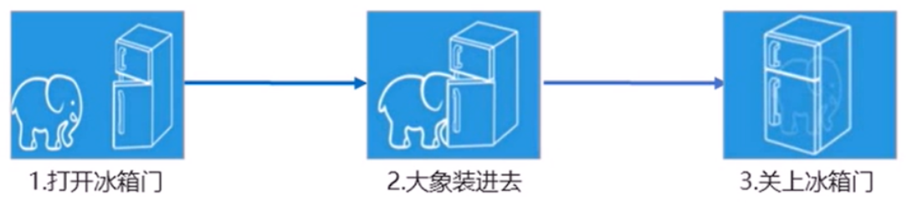

---
i
---

# 一、面向对象编程介绍

## 1.1 两大编程思想

### 1.面向过程编程POP(Procedural oriented programming)

**面向过程**就是分析解决问题所需要的步骤，然后用函数把这些步骤一步一步实现，使用的时候再一个一个的依次调用就可以了。

例子：  将大象装进冰箱，面向过程做法。



面向过程，就是按照我们分析好了的步骤，按照步骤解决问题。

### 2.面向对象编程 OOP (**Object Oriented Programming**)

**面向对象**是把事务分解成为一个个的对象，然后由对象之间分工与合作。

例子：将大象装进冰箱，面向对象做法

1.大象对象

- 进去

2.冰箱对象

- 打开
- 关闭

面向对象是以对象功能来划分问题，而不是步骤。

面向对象编程具有灵活、代码可复用、容易维护和开发的特点，更适合多人合作的大型项目。

面向对象的特性：

- 封装性
- 继承性
- 多态性

## 3. 面向过程和面向对象的对比

|      | 面向过程                                                     | 面向对象                                                     |
| ---- | ------------------------------------------------------------ | ------------------------------------------------------------ |
| 优点 | 性能方面比面向对象强，适合跟硬件联系很紧密的东西，例如单片机就采用的面向过程编程。 | 易维护、易复用、易扩展，由于面向对象由封装、继承、多态的特性，可以设计出低耦合的系统，是系统更加灵活、更加容易维护 |
| 缺点 | 没有面向对象易维护、易复用、易扩展                           | 性能比面向过程低                                             |

总结：  系统比较简单用面向过程来设计     大型系统用面向对象来实现。

# 二、ES中的类和对象

## 2.1 对象

对象是由**属性**和**方法**组成的

- 属性：事物的特征，在对象中用属性来表示
- 方法：事物的行为，在对象中用方法来表示

## 2.2 类 class

类抽象了对象的公共部分，它泛指某一大类（class）

对象特指某一个，通过类实例化一个具体的对象

## 2.3 创建类

语法：

class name {

​	//class  body

}

创建实例：

var xx = new name();

注意： 类必须使用new实例化对象

## 2.4 类中添加共有属性  constructor 构造函数    

constructor() 方法是类的构造函数（默认方法），**用于传递参数，返回实例对象，**通过new命令生成对象实例时，自动调用该方法。如果没有显示定义，类内部会自动给我们创建一个constructor().

1. 创建类 class  创建一个明星类

```
class Star {
	constructor(uname,age){
		this.name = name;
		this.age = age;
	}

}
```

2.利用类创建对象  new

```
var ldh = new Star('刘德华'，18)；

var zxy = new Star('张学友'，22)；

```

注意：

1. 通过clas 类关键字创建类，类名我们习惯性定义首字母大写。

2. 类里面有个constructor 函数，可以接受传递过来的参数，同时返回实例对象。

3. constructor 函数 只要new 生成实例时，就会自动调用这个函数，如果我们不写这个函数，类也会自动生成这个函数。
4. 生成实例new 不能省略
5. 最后注意语法规范，创建类   类名后面不要加小括号，生成实例   类名后面加小括号  构造函数不需要加function。

## 2.5 类中添加方法

语法：

```
class Person {
	constructor(name,age) {
		this.name = name;
		this.age = age;
	}
	say(参数) {
		console.log('hello!');
	}
}
```

注意：

1. 我们类里面所有的函数不需要写function

2. 多个函数方法之间不需要添加逗号分割

3. 在类中创建的方法可以传递参数

   # 三、类的继承

   ## 3.1 extends 继承

   继承：子类可以继承父类的一些属性和方法

   语法：

   ```
   //父类
   class Father{}
   //子类继承父类
   class Son extends Father {}
   ```

   ## 3.2 super 关键字

   super 关键字用于访问和调用对象父类上的函数。 可以调用**父类的构造函数**（父类的属性），也可以调用**父类的普通函数**（父类的方法）。

   ```
   class Father {
   	constructor(x,y) {
   		this.x = x;
   		this.y = y;
   	}
   	sum() {
   		console.log(this.x + this.y);
   	}
   }
   class son extends Father {
   	constructor(x,y) {
   		super(x,y);  //调用父类中的构造函数
   	}
   }
   ```

   ```
   class Father {
   	say() {
   		return '我是爸爸';
   	}
   }
   class Son extends Father {
   	say() {
   		//super.say() 调用父类的方法
   		super.say()+'的儿子';
   	}
   }
   	
   ```

   继承中的属性或者方法查找原则：就近原则

   1.继承中，如果实例化子类输出一个方法，先看子类有没有这个方法，如果有就先执行子类的

   2.继承中，如果子类里面没有，就去查找父类有没有这个方法，如果有，就执行父类的这个方法（就近原则）

```
// 父类
class Person {
	constructor(surname) {
		this.name = surname;
	}
}
// 子类继承父类
class Student extends Person {
	constructor(surname,firstname) {
		super(surname); // 调用父类的constructor(surname)
		this.firstname = firstname; //定义子类独有的属性
	}
}
```

注意：子类在constructor()构造函数中使用super，必须放在this前面（必须先调用父类的构造方法，在使用子类的构造方法）

## 2.6 使用类的注意事项

1. 在ES6 中类没有变量提升，所以必须先定义类，才能通过实例化对象
2. 类里面的共有属性和方法一定要加this使用。
3. 类里面的this指向问题
4. constructor 里面的this指向实例对象，方法里面的this指向这个方法的调度者

# 三、构造函数和原型

## 1.1 概述

ES6之前  对象不是基于类创建的  而是一种称为构造函数的特殊函数来定义对象和它们的特征。

## 1.2创建对象的三种方式

1. 对象自变量
2. new Object()
3. 自定义构造函数

## 1.3 构造函数

### 构造函数的特点：

1. 构造函数有原型对象prototype
2. 构造函数原型对象prototype 里面有constructor 指向构造函数本身
3. 构造函数可以通过原型对象添加方法
4. 构造函数创建的实例对象有`__proto__`原型指向  构造函数的原型对象

JavaScript的构造函数中可以添加一些成员。可以在构造函数本身上添加，也可以在构造函数内部的this上添加。通过这两种方式添加的成员，就分别称为**静态成员**和**实例成员**

### **静态成员：**

在构造函数本身添加的成员称为静态成员，**只能通过构造函数本身来访问**

### 实例成员：

在构造函数内部创建的对象成员称为实例成员，**只能通过实例化的对象来访问**

```
function Star(uname,age) {
	this.name = uname;   //实例成员
	this.age = age; //实例成员
	this.sing = function() {
		console.log('唱歌');
	}
}
var ldh = new Star('刘德华'，18);
只能通过实例化对象来访问实例成员。
Star.sex = '男';  //静态成员
console.log(Star.sex);//获取静态成员只能通过构造函数来访问   不能通过实例化对象来访问
```

### 构造函数的问题

存在浪费内存的问题：

```
function Star(uname,age) {
	this.name = uname;   
	this.age = age; 
	this.sing = function() {
		console.log('唱歌');
	}
}
var ldh = new Star('刘德华'，18);
Star.sex = '男';  
console.log(Star.sex);
```

每一次实例化对象的时候，都会在内存开辟一个对象的空间，里面都有一个sing这个函数空间，但是每一个对象中的sing这个函数都是一样的，造成了空间浪费。

## 1.4 构造函数原型 prototype 原型对象 作用：共享方法

构造函数通过原型分配的函数是所有对象所**共享的**。

JS规定，**每一个构造函数都有一个prototype属性**，指向另一个对象。注意这个prototype就是一个对象，这个对象的所有属性和方法，都会被构造函数所拥有。

我们可以把那些不变的方法，直接定义在prototype对象上，这样所有对象的实例就可以共享这些方法。

我们可以这么做：

```
function Star(uname,age) {
	this.name = uname;   
	this.age = age; 
	
}
Stat.prototype.sing = function() {
	console.log('唱歌');
}
var ldh = new Star('刘德华'，18);
Star.sex = '男';  

```

一般情况下，我们公共属性定义在构造函数里面，公共方法我们放在原型对象上。

## 1.5 对象原型`__proto__`

对象都会有一个属性`__proto__`指向构造函数prototype 原型对象，之所以我们对象可以用构造函数prototype原型对象的属性和方法，就是因为对象有`__proto__`原型的存在。

- `__proto__`对象原型和原型对象prototype 是等价的
- `__proto__`对象原型的意义在于为对象的查找机制提供一个方向，或者说一条线，但是它是一个非标准属性，因此在实际开发中，不可以使用这个属性，它只是内部指向原型对象prototype


## 1.6 constructor 构造函数

对象原型（`__proto__`）和构造函数原型对象（prototype）里面都有一个属性constructor 属性，constructor 我们称为构造函数，因为它指向构造函数本身。

constructor 主要用于记录该对象引用于哪个构造函数，它可以让原型对象重新指向原来的构造函数。

```
Star.prototype.sing = function() {
	console.log('我会唱歌');
}
Star.prototype.move = function() {
	console.log('我会拍戏');
}
当对象方法很多的情况下  我们可以把多个方法存在一个对象中
Star.prototype = {
	sing: function() {
		console.log('我会唱歌');
	},
	move: function() {
		console.log('我会拍戏');
	}
	
}
var ldh = new Star('刘德华',18);
console.log(Star.prototype); //获取构造函数原型对象
console.log(ldh.__proto__);  //获取对象原型
但是这样会带来一个问题  就是会把原来的对象里面的原型对象prototype覆盖了   
里面的constructor 属性就会消失  这时候就需要手动的把 constructor 指回原来的构造函数
Star.prototype = {
	constructor: Star,
	sing: function() {
		console.log('我会唱歌');
	},
	move: function() {
		console.log('我会拍戏');
	}
	
}
console.log(Star.prototype.constructor);

```

## 1.7 构造函数、实例、原型对象三者之间的关系


## 1.8 原型链


## 1.9 JavaScript 的成员查找机制（规则）

1. 当访问一个对象的属性（包括方法）时，首先查找这个对象自身有没有该属性
2. 如果没有就查找它的原型（也就是`__proto__`指向的prototype原型对象）
3. 如果还没有就查找原型对象的原型（Object的原型对象）
4. 依次类推一直找到Object为止(null)
5. `__proto__`对象原型的意义就在于为对象成员查找机制提供一个方向，或者说一条路线

## 1.10 原型对象this指向

### 1. 在构造函数中，里面this指向的是对象实例ldh

```
function Star(uname,age) {
	this.name = uname;   
	this.age = age; 
	
}
Stat.prototype.sing = function() {
	console.log('唱歌');
}
var ldh = new Star('刘德华'，18);

```

### 2. 原型对象函数里面的this 指向的也是 实例对象ldh

## 1.11 扩展内置对象

可以通过原型对象，对原来的内置对象进行扩展自定义的方法。比如给数组添加自定义求偶数和的功能。

注意：**数组和字符串内置对象不能给原型对象覆盖操作Array.prototype = {},只能是Array.prototype.xxx = function(){}的方式**

```javascript
Array.prototype.sum = function() {
	let sum = 0;
	for(let i=0;i<this.length;i++){
		sum+=this[i];
	}
	return sum;
}
```

# 四、ES6以前的继承方法

ES6之前并没有给我们提供extends继承，我们可以通过**构造函数+原型对象**模拟实现继承，被称为**组合继承**。

## 4.1 call()

通过这个函数，并且修改函数运行时的this指向

语法：

```
fun.call(thisArg, arg1, arg2...)
```

- thisArg :  之前调用函数this的指向对象
- arg1,arg2：传递其他参数

```
function fn(x,y) {
	console.log('hello');
	console.log(this);   //这里的this原先指向的是window   经过call函数之后指向o
	console.log(x+y);
}
var o = {
	name: 'sam';
}
fn.call(o,1,2);
```

## 4.2 借用构造函数继承父类型属性

核心原理： 通过call()把父类型的this指向子类型的this，这样就可以实现类型继承父类型的属性。

```
function Father(name,age) {
	this.name = name;
	this.age = age;
}
function Son((name,age) {
	Father.call(this,name,age);
}

```

## 4.3 借用原型对象继承父类型方法

```
function Father(name,age) {
	this.name = name;
	this.age = age;
}
Father.prototype = {
	console.log(1);
}
function Son((name,age) {
	Father.call(this,name,age);
}
//Son.prototype = Father.prototype;   这样直接赋值回有问题，如果修改了子原型对象，父原型对象
也会发生变化
Son.prototype = new Fater();
// 利用对象的形式修改了原型对象，这样父亲和儿子就区分开了  别忘了利用constructor  指回原来的构造函数
Son.prototype.constructor = Son;

```

# 五、类的本质

1. class的本质还是function
2. 类的所有方法都定义在类的prototype属性上
3. 类创建的实例，里面也有`__proto__`指向类的prototype原型对象
4. 所以ES6的类它的绝大多数功能，ES5都可以都到，新的class写法只是让对象原型的写法更加清晰、更加面向对象编程的语法而已。
5. 所以ES6的类其实就是语法糖
6. 语法糖：语法糖就是一种便捷写法，简单理解，有两种方法可以实现同样的功能，但是一种写法更加清晰、方便，那么这个方法就是语法糖。

# 六、ES5中新增的方法

## 6.1 ES5新增方法概述

主要包括：

- 数组方法
- 字符串方法
- 对象方法

## 6.2 数组方法

迭代（遍历方法）：forEach()、map()、filter()、some()、every();

map()类似forEach();     every()类似some

```
array.forEach(function(currentValue, index, arr))
```

- currentValue: 数组当前项的值
- index：数组当前项的索引
- arr：数组对象本身

```
array.filter(function(currentValue, index, arr))
```

- filter() 方法创建一个新的数组，新数组中的元素是通过检查数组中符合条件的所有元素，主要用于筛选数组
- 注意它直接返回的是一个新数组
- arr: 数组对象本身

```
array.some(function(currentValue, index, arr))
```

- some() 方法用于检测数组中的元素是否满足指定条件，通俗点  查找数组中有满足条件的元素
- 注意它返回值是布尔值   如果查找到这个元素 就返回true 找不到返回false
- 如果找到第一个满足条件的元素   终止循环  不在继续查找
- currentValue: 数组当前项的值
- index：数组当前项的索引
- arr：数组对象本身

**注意：  只有在some里面使用return  才能终止迭代 **         **forEach、filter、等不会使用return不会终止迭代** 

## 6.3 字符串方法

trim() 方法会从一个字符串的两端删除空白字符

```
str.trim()
```

trim方法不会影响字符串本身，它返回的是一个新的字符串

## 6.4 对象方法

Object.defineProperty() 定义对象中新属性或者修改原有的属性

```
Object.defineProperty(obj, prop, descriptor)
```

- obj：必须。目标对象

- prop：必须。需定义或者修改的属性的名字

- descriptor：必须。目标属性所拥有的特性{

  descriptor说明：以对象形式{}书写

  - value：设置属性的值。   默认undefined
  - writable：值是否可以重写。true/false   默认false
  - enumerable：目标属性是否可以被枚举。true/false  默认false   就是能不能被遍历
  - configurable：目标属性是否可以被删除或者是否可以再次修改特性  true/false  默认false

}

# 七、函数进阶

## 7.1 函数的定义方式

1. 函数声明方式 function 关键字 (命名函数)

```
function fn() {}
```

2. 函数表达式（匿名函数）

```
var fn = function() {}
```

3. new Function()

```
var fn = new Function('参数1','参数2','函数体')
```

- Function 里面参数都必须是字符串格式
- 第三种方式执行效率低  也不方便书写  因此较少使用
- 所有函数都是Function的实例（对象）
- 函数也属于对象


## 7.2 函数的调用方式

1. 普通函数
2. 对象的方法
3. 构造函数
4. 绑定事件函数
5. 定时器函数
6. 立即执行函数

## 7.3 函数内 this 的指向

这些this的指向   是当我们调用函数的时候确定的。调用方式的不同决定了this的指向不同

一般指向我们的调用者

| 调用方式     | this指向       |
| ------------ | -------------- |
| 普通函数     | window         |
| 构造函数调用 | 实例对象       |
| 对象方法调用 | 该方法所属对象 |
| 事件绑定方法 | 绑定事件对象   |
| 定时器函数   | window         |
| 立即执行函数 | window         |

### 1.改变函数内部this指向

JS为我们提供了一些函数方法帮我们处理函数内部this指向问题   常用的有 bind()、call()、apply()三种方法

主要应用场景：

1. call 经常做继承
2. apply 经常跟数组有关系   比如借助于数学对象实现数组最大值最小值
3. bind 不调用函数   但是还想改变this指向， 比如改变定时器内部this指向

####      1. call方法

call 第一个用途   可以调用函数   第二个可以改变函数内this指向

call 的主要用途是可以实现继承

通过这个函数，并且修改函数运行时的this指向

语法：

```
fun.call(thisArg, arg1, arg2...)
```

- thisArg :  之前调用函数this的指向对象
- arg1,arg2：传递其他参数

```
function fn(x,y) {
	console.log('hello');
	console.log(this);   //这里的this原先指向的是window   经过call函数之后指向o
	console.log(x+y);
}
var o = {
	name: 'sam';
}
fn.call(o,1,2);
```

####    2. apply 方法

apply() 方法调用一个函数。简单理解为调用函数的方式   但是它可以改变函数的this指向

```
fun.apply(thisArg, [argsArray])
```

- thisArg：在fun函数运行时指定的this值
- argsArray：传递的值，必须包含在数组里面
- 返回值就是函数的返回值，因为它就是调用函数

作用：

1. 也是调用函数   第二个可以改变函数内部的this指向

2. 但是它的参数必须是数组（伪数组）

3. apply 的主要应用   比如我们可以利用apply  借助于数学内置对象求最大值

   ```
   var arr = [1,5,8,55,7,9];
   var max = Math.max.apply(Math,arr);
   var min = Math.min.apply(Math,arr);
   ```

#### 3. bind 方法

bind()方法不会调用函数  但是能改变函数内部this指向

```
fun.bind(thisArg, arg1, arg2....)
```

- thisArg：在fun函数运行时指定的this值
- arg1, arg2：传递的参数
- 返回由指定的this值和初始化参数改造的原函数拷贝

作用：

1. 不会调用原来的函数    可以改变原来函数内部的this指向
2. 返回的是原函数改变this之后产生的新函数
3. 如果有的函数我们不需要立即调用，但是又想改变这个函数内部的this指向   此时用bind
4. 我们有一个按钮，当我们点击了之后，就禁用这个按钮，3秒钟之后开启这个按钮

```
var btn = document.querySelector('botton');
btn.onclick = function() {
	this.disabled = true;
	setTimeout(function() {
		this.disabled = false;  //这里的this被改变成btn了
	}.bind(this),2000);
}
```

# 八、严格模式

## 8.1 什么是严格模式


## 8.2 开启严格模式

严格模式可以应用到整个脚本或者个别函数中。因此在使用时，我们可以将严格模式分为**为脚本开启严格模式**和**为函数开启严格模式**

### 1. 为脚本开启严格模式

为整个脚本开启严格模式，需要在所有语句之前放一个特定语句"use strict"

```
<scrcpt>
	"use strict";
	.......
</scrcpt>
```

因为"use strict"加了引号  所以老版本浏览器会把它当作一行普通字符串而忽略

有的script基本是严格模式，有的script脚本是正常模式，这样不利于文件合并，所以可以将整个脚本文件放在一个立即执行的匿名函数中。这样独立创建一个作用域而不影响其他script脚本文件

```
<scrcpt>
	(function(){
		"use strict";
		.....
	})();
</scrcpt>
```

### 2. 为函数开启严格模式

要给某个函数开启严格模式，需要把"use strict";声明放在函数体所有语句之前

## 8.4 严格模式中的变化

### 1. 变量规定

- 在正常模式中，如果一个变量没有声明就赋值，默认是全局变量，严格模式禁止这种用法，变量都必须先用var命令声明，然后在使用
- 严谨删除已经声明变量，例如：delete x; 语法错误

### 2. 严格模式下 this 指向问题

- 以前在全局作用域下中this指向window
- 严格模式下全局作用域中函数this是undefined
- 以前构造函数时不加new也可以调用，当普通函数，this指向全局对象
- 严格模式下，如果构造函数不加new调用，this会报错
- new 实例化的构造函数指向创建的对象实例
- 定时器this还是指向window
- 事件、对象还是指向调用者

### 3. 函数变化

- 函数不能有重名的参数
- 函数必须声明在顶层 新版本的JS会引入“块级作用域”(ES6中引入)。为了与新版本接轨  不允许在非函数的代码块中声明函数   例如if{}  while{}  里面声明函数

# 九、高阶函数

## 9.1 什么是高阶函数

**高阶函数**就是对其他函数进行操作的函数   **它接受函数作为参数** 或 **将函数作为返回值输出**

```
//接受函数作为参数
<script>
	function fn(callback) {
		callback && callback();//前面的callback 表示如果有参数传递过来就是true才会执行callback()
	}
	fn(function(){alert('hi')})
</script>

//将函数作为返回值输出
<script>
	function fn() {
		return function() {}
	}
	fn( )
</script>
```

此时fn就是一个高阶函数

函数也是一个数据类型，同样也可以作为参数，传递给另外一个参数使用。最典型的就是作为回调函数

# 十、闭包

## 10.1 变量作用域

变量根据作用域的不同分为两种：全局变量和局部变量

1. 函数内部可以使用全局变量
2. 函数外部不可以使用局部变量
3. 当函数执行完毕，本作用域内的局部变量会销毁

## 10.2 什么是闭包

闭包（closure）指有权访问另一个函数作用域中变量的函数。

简单理解  一个作用域可以访问另外一个函数内部的局部变量

```
function fn() {
	var num = 10;
	function fun() {
		console.log(num);
	}
	fun();
}
fn(); // 这里fn就是一个闭包函数
```

## 10.3 闭包的作用

闭包的主要作用：  就是延申了变量的作用范围

```
function fn() {
	var num = 10;
	return function() {
		console.log(num);
	}
}
//这里函数外面作用域访问到了函数内部的数据
var f = fn();
f();

```

## 10.4 闭包应用-点击li打印当前索引号

```
<ul>
	<li><li>
	<li><li>
	<li><li>
	<li><li>
</ul>
<script>
	var lis = document.querySelector('ul').querySelectorAll('li');
	for(let i=0; i<lis.length; i++) {
		// 利用for循环创建4个立即执行函数
		// 立即执行函数也称为小闭包  因为立即执行函数里面的任何一个函数都可以使用它的i变量
		(function(i) {
			lis[i].onclick = function() {
				console.log(i);
			}
		})(i);
	}
</script>
```

## 10.5 闭包应用-定时器中的闭包

```
<script>
	var lis = document.querySelector('ul').querySelectorAll('li');
	for(let i=0; i<lis.length; i++) {
		// 利用for循环创建4个立即执行函数
		// 立即执行函数也称为小闭包  因为立即执行函数里面的任何一个函数都可以使用它的i变量
		(function(i) {
			setTimeout(function() {
				console.log(lis[i].innerHTML);
			},3000)
		})(i);
	}
</script>
```

## 10.6 计算打车价格

```
// 打车起步价13（3公里内），之后每多一公里增加5块钱，用户输入公里数就可以计算打车价格
// 如果有拥堵情况，总价格多收10块钱拥堵费
var car = (function(){
	var start = 13; // 起步价  局部变量
	var total = 0; // 总价 局部变量
	return {
		//正常的总价
		price: function(n) {
			if(n<=3) {
				total = start;
			} else {
				total = start + (n - 3) * 5;
			}
			return total;
		},
		// 拥堵之后的情况
		yd: function(flag) {
			return flag ? total + 10 : tatal;
		}
	}
})();
console.log(car.price(5)); //23
console.log(car.yd(true)); //33
```

## 10.7 闭包思考题

```
1.  输出的是什么
var name = 'this window';
var object = {
	name: 'this object',
	getNmaeFunc: function() {
		return function() {
			return this.name;
		};
	}
}
console.log(object.getNameFunc()());
答：
这道题相当于
var fun = object.getNameFunc();
fun = function() {
	return this.name;
};
然后又有第二个小括号   相当于调用了fun()函数
object.getNameFunc()() 等价于  fun()
而fun中的this是指向window的
所以打印输出 'this window'   这里没有产生闭包
```


```
2. 输出是什么
var name = 'this window';
var object = {
	name: 'this object',
	getNmaeFunc: function() {
		var that = this; //这个this指向的是object
		return function() {
			return that.name;
		};
	}
}
console.log(object.getNameFunc();());
答：
相当于
var fun = object.getNameFunc();
fun = function() {
	return that.name;
};
所以输出的是'this object'；   这里产生闭包了
```

# 十一、递归

## 11.1 利用递归求：根据id返回对应的数据对象

```
var data = [{
	id = 1,
	name = '家电',
	goods = [{
		id = 11,
		gname = '冰箱'
	},{
		id = 12,
		gname = '洗衣机'
	}]
},{
	id = 2,
	name = '手机'
}];
// 我们想要做输入一个id号，就可以返回的数据对象
// 1. 利用 forEach 去遍历里面的每一个对象
function getID(json, id) {
	var o = {};
	json.forEach(function(item) {
		if(item.id === id) {
			o = item;
		}
        // 想要goods里面的数据   必须先有goods这个数组  并且这个数组的长度不为0
        else if (item.goods && item.goods.length > 0) {
			o = getID(item.goods, id);
		}
	});
	return o;
}
console.log(getID(data, 2));
```

## 11.2 浅拷贝和深拷贝

1. 浅拷贝只是拷贝一层 更深层次对象级别的只拷贝引用
2. 深拷贝拷贝多层 每一级别的数据都会拷贝
3. Object.assign(target, sources);   es6新增方法可以浅拷贝

```
浅拷贝   更深层次对象只能拷贝地址   也就是说在拷贝的对象里面修改数据   原来的对象数据也会被修改
var obj = {
	id: 1,
	name: 'andy',
	msg: {
		age: 18
	}
};
var o = {};
// js原生浅拷贝  
for (var k in obj) {
	// k是属性名    obj[k] 属性值
	// o[k] 相当于 o.属性名
	o[k] = obj[k];
}

// ES6提供了一个新的方法进行浅拷贝
Object.assign(o, obj);

// 深拷贝
// 函数封装
function deepCopy(newobj, oldobj) {
	for(var k in oldobj) {
		//判断我们的属性值属于哪一种数据类型
		//1. 获取属性值
		var item = oldobj[k];
		//2. 判断这个值是否是数组    注意：这里不能先判断是否为对象   因为数组就是一个对象
		if(item instanceof Array) {
			newobj[k] = [];
			deepCopy(newobj[k], item);
		} else if (item instanceof Object) {
			// 3. 判断这个值是否为对象
			newobj[k] = {};
			deepCopy(newobj[k], item);
		} else {
			// 4. 属于简单数据类型
			newobj[k] = item;
		}
	}
}
```

# 十二、正则表达式

## 12.1 什么是正则表达式

正则表达式（Regular Expression） 是用于匹配字符串中字符组合的模式。在JS中，正则表达式也是对象


正则表达式通常用于x检索、替换那些符合某个模式（规则）的文本。

## 12.2 正则表达式特点

1. 灵活性、逻辑性和功能性非常强
2. 可以迅速的用极简单的方式达到字符串的复杂控制

## 12.3 正则表达式在JS中的使用

### 1. 创建正则表达式

1. 通过RegExp 对象的构造函数进行创建

   ```
   var 变量名 = new RegExp(/表达式/);
   ```

2. 通过字面量创建

   ```
   var 变量名 = /表达式/;
   ```

### 2. 测试正则表示test

test() 正则表达式方法，用于检测字符串是否符合该规则，该对象会返回true或false，其参数是测试字符串

```
regexobj.test(str)
```

1. `regexobj `是要写的正则表达式
2. str 我们要测试的文本
3. 就是检测str文本是否符合我们写的正则表达式规范

### 3. replace 替换

replace() 方法可以替换字符串操作，用来替换的参数可以是一个字符串或者是一个正则表达式

```
strObject.replace(regexp/substr,replacement)
```

1. 第一个参数：被替换的字符串 或者  正则表达式
2. 第二个参数：替换为的字符串
3. 返回值是一个替换完毕的新字符串

### 4. 正则表达式参数

```
/表达式/[switch]
```

switch（也称为修饰符）按照什么样的模式进行匹配 有三个值

- g：全局匹配
- i：忽略大小写
- gi：全局匹配+忽略大小写

```
div.innerHTML = text.value.replace(/激情|gay/g, '**');
```

# 十三、ES6新增语法

## 1. let

- let声明的变量只在所处的块级有效
- 在一个大括号中 使用let关键字声明的变量才具有块级作用域   var关键字不具有这个特性
- 防止循环变量变成全局变量
- 使用let关键字声明的变量没有变量提升
- let具有暂时性死区

```
var num = 10;
if (true) {
	console.log(num);  //因为这里使用let声明了num 对这个if块进行了绑定   所以这个打印会报错
	let num = 20;
}
```

经典面试题

```
var arr = [];
for (var i=0; i<2; i++) {
	arr[i] = function() {
		console.log(i);
	}
}
arr[0]();  //2
arr[1]();  //2
```

```
var arr = [];
for (let i=0; i<2; i++) {
	arr[i] = function() {
		console.log(i);
	}
}
arr[0]();  //0
arr[1]();  //1
```


图解：此题的关键点在于每次循环都会产生一个块级作用域，每个块级作用域中的变量都是不同的，函数执行时输出的是自己上一级(循环产生的块级作用域) 作用域下的i值

## 2. const

作用：声明常量，常量就是值（内存地址） 不能变化的量

- 具有块级作用域
- 声明常量时必须赋值
- 常量赋值后，值不能更改

```
//简单数据类型
const PI = 3.14;
PI = 5;//报错
//复杂数据类型   可以修改复杂数据类型里面的值 但是不能给复杂数据类型重新改变地址
const ary = [100,200];
ary[0] = 123; //可以被修改
ary = [1,2]; //报错

```

## 3. 解构赋值

ES6中允许从数组中提取值，按照对应位置，对变量赋值。对象也可以实现解构

### 数组解构

数组结构允许我们按照一一对应的关系从数组中提取值  然后将值赋值给变量

```
let [a,b,c] = [1,2,3];
console.log(a);
console.log(b);
console.log(c);
```

```
解构不成功 元素个数不一致    不成功赋值undefined
let [f] = [];
let [a,b] = [1]; 
```

### 对象解构

对象解构允许我们使用变量的名字匹配对象的属性   匹配成功后将对象的值赋值给变量

```
let person = {
	name: 'andy',
	age: 18
};
let { name, age } = person;
console.log(name); //'andy'
console.log(age); //18
```

```
let person = {
	name: 'andy',
	age: 18
};
let { name: myName, age: myAge } = person; //myName myAge 属于别名
console.log(myName); //'andy'
console.log(myAge); //18
```

# 十四、箭头函数

ES6中新增定义函数的方式

```
() => {}
const fn = () => {}
```

函数体中只有一句代码，且代码的执行结果就是返回值，可以省略大括号

```
function sum(num1,num2) {
	return num1 + num2;
}
const sum = (nu1, num2) => num1 + num2;
```

如果形参只有一个  可以省略小括号

```
function fn (v) {
	return v;	
}
const fn = v => v;
```

箭头函数不绑定this关键字，箭头函数中的this，指向的是**函数定义位置的上下文this**

```
const obj = {
	name: 'andy'
}
箭头函数不绑定this  箭头函数没有自己的this关键字
如果在箭头函数中使用this
this关键字将指向箭头函数定义位置中的this
funtion fn () {
	console.log(this);
	return () => {
		console.log(this)
	}
}
const resFn = fn.call(obj);
resFn();
```

**面试题**

```
var obj = {
	age: 20,
	say: () => {
		console.log(this.age)
	}
}
obj.say(); //undefined
因为对象不能产生作用域  所以这个this指向的就是window对象。
```

**剩余参数**   **rest参数**

剩余参数语法允许我们将一个不定数量的参数表示为一个数组。

箭头函数不能使用argument接受所有的参数   只能通过剩余参数的方式接受不定数量参数

```
function sum (first, ...args) {
	console.log(first);// 10
	console.log(args); //[20,30]
}
sum(10, 20, 30);
```

计算和

```
const sum = (...args) => {
	let total = 0;
	ars.forEach(item => total += item);
	return total;
}
console.log(sum(10, 20));
console.log(sum(10, 20, 30));
```

剩余参数和解构配合使用

```
let students = ['andy', 'zhangsan', 'lili'];
let [s1, ...s2] = students;
console.log(s1);//'andy'
console.log(s2); //['zhangsan', 'lili']
```

# 十五、ES6的内置对象扩展

Array 的扩展方法

## 扩展运算符（展开方法）

扩展运算符可以将数组或者对象转为用逗号分割的参数序列。

```
let ary = [1,2,3];
...ary   // 1,2,3
console.log(...ary); //1 2 3
console.log(1,2,3);
console.log()方法打印输出带有逗号分割符时   该方法会把逗号当成参数分隔符
```

```
//扩展运算符可以将数组拆分成为以逗号分隔的参数序列
let ary = ['a','b','c'];
// ...ary 等价于 'a','b','c'
console.log(...ary)
```

扩展运算符可以应用于合并数组

```
方法一：
let ary1 = [1,2,3];
let ary2 = [3,4,5];
let ary3 = [...ary1, ...ary2];
方法二
arry1.push(...ary2);    push方法可以在数组后面追加多个数组
```

将伪数组或者可遍历对象转换为真正的数组     

伪数组：无法直接调用数组方法或期望length属性有什么特殊的行为，不具有数组的push、pop等方法，但仍可以对真正数组遍历方法来遍历 它们。典型的伪数组有argument参数，还有像调用getElementByTagName之类的，它们都是返回NodeList对象属于伪数组，可以使用Array.prototype.slice.call(伪数组)将伪数组转换成真正的Array对象

```
let arg = document.querySelectorAll('div');
arg = [...arg]; 
```

## Array的扩展方法

### 构造函数方法：`Array.from()`

将伪数组或者可遍历对象转换为真正的数组    

方法还可以接受第二个参数，作用类似于数组的map方法，用来对每个元素进行处理，将处理后的值放入返回的数组

```
let arratLike = {
	'0': 1,
	'1': 2,
	length: 2
}
let arr = Array.from(arratLike, item => item*2); //[2,4]
```

### 实例方法：find()

用于找出第一个符合条件的数组成员，如果没有找到返回undefined

```
let ary = [{
	id: 1,
	name: 'zhangsan'
}, {
	id: 2,
	name: 'lisi'
}];
let target = ary.find( (item, index) => item.id == 2);
item为当前循环的值 index当前循环的索引
```

### 实例方法：`findIndex()`

用于找出第一个符合条件的数组成员的位置，如果没有找到返回-1

```
let ary = [1,2,3,4,5];
let index = ary.findIndex((value, index) => value > 9);
console.log(index); //2
```

### 实例方法： includes()

表示某个数组是否包含给定的值，返回布尔值

```
[1,2,3].includes(2) //true
[1,2,3].includes(5) //false
```

## String 的扩展方法

### 模板字符串

模板字符串中可以解析变量

```
let name = 'zhangsan';
let sayHello = `hello,my name if ${name}`; //hello,my name if zhangsan
```

模板字符串可以换行

```
let result = {
	name: 'zhangsan',
	age: 18,
	sex: 'nan'
}
let html = `<div>
	<span>&{result.name}</span>
	<span>&{result.age}</span>
	<span>&{result.sex}</span>
</div>`;
```

模板字符串中可以调用函数

```
const sayHello = function() {
	return 'hhhhhhh';
};
let greet = `${sayHello}  heihei`;
console.log(greet); //hhhhhhh   heihei
```

### 实例方法：`startsWidth() 和 endsWith()`

- `startsWidth()`：表示参数字符串是否在原字符串的头部，返回布尔值
- `endsWith()`: 表示参数字符串是否在原字符串的尾部，返回布尔值

```
let str = 'hello world';
str.startsWidth('hello'); //true
str.endsWith('world'); //true
```

### 实例方法： repeat()

repeat方法表示将原字符串重复n次，返回一个新的字符串

```
'x'.repeat(3)   //'xxx'
'hello'.repeat(2)  //'hellohello'
```

## Set 数据结构

ES6提供了新的数据解构Set，它类似于数组，但是成员的值都是唯一的，没有重复的值

Set本身是一个构造函数，用来生成Set数据结构

```
const s = new Set();
```

Set函数可以接受一个数据作为参数，用来初始化

```
const set = new Set([1,2,3,5,4,4]);
```

### 实例方法

- add(value)：添加某个值，返回Set结构本身   该方法是可以链式调用的   `e.add('a').add('d');`
- delete(value)：删除某个值，返回一个布尔值，表示是否删除成功
- has(value)：返回一个布尔值，表示该值是否为Set的成员
- clear()：清楚所有成员，没有返回值
- set.size：set数据结构长度

### 遍历

Set结构的实例与数组一样，也有forEach方法，用于对每个成员执行某种操作，没有返回值

```
s.forEach(value => console.log(value))
```

# 十六、Symbol 

## Symbol  基本使用

ES6引入了一种新的原始数据类型Symbol ，表示独一无二的值。它是JS的第七种数据类型，是一种类似于字符串的数据类型。

特点：

- Symbol 的值是唯一的，用来解决命名冲突的问题
- Symbol 值不能与其他数据进行运算
- Symbol 定义的对象属性不能使用for...in 循环遍历，但是可以使用`Reflect.ownKeys` 来获取对象的所有键名

## Symbol 的创建

### 函数创建

```
let s = Symbol();
let s1 = Symbol('a');
let s2 = Symbol('a');
console.log(s1 === s2);//false
```

注意：Symbol函数前不能使用new命令，否则会报错，因为生成的Symbol是一个原始类型的值，不是对象。

### 函数对象创建

```
let s = Symbol.for();
let s1 = Symbol.for('a');
let s2 = Symbol.for('a');
console.log(s1 === s2);//true	
```

## `Symbol.prototype.description`转换字符串

```
let s = Symbol('bos');
//如果我们将这个Symbol显示转换为字符串，即下面的语法
String(s);  //'Symbol('bos')'
s.toString(); //'Symbol('bos')'
//上面的方法不是很方便，ES2019提供了实例属性description，直接返回Symbol的描述
s.description;   // 'bos'
```

## 作为属性名的 Symbol

由于每一Symbol的值都是不相等的，这意味着Symbol值可以用来作为标识符，用于对象的属性名，就能保证不会出现同名的属性。这对于一个对象由多个模块构成的情况非常有用，能防止某一个键被不小心改写或覆盖。

```
let mySymbol = Symbol();

//第一种写法
let a = {};
a[mySymbol] = 'hello';

//第二种写法
let a = {
	[mySymbol]: 'hello'
}

//第三种写法
let a = {};
Object.defineProperty(a, mySymbol, { value: hello});

//以上写法都能得到同样的结果
a[mySymbol]  //'hello'
```

注意：Symbol 值作为对象属性名时，不可以使用点运算符

```
let mySymbol = Symbol();
let a = {};

a.mySymbol = 'hello';
a[mySymbol] // undefined
a['mySymbol']  // 'hello'
```

上述代码中，因为点运算符后面总是字符串，所以不会读取·mySymbol作为标识名所指代的那个值，导致a的属性名实际上是一个字符串，而不是一个Symbol 值

同理，在对象的内部，使用Symbol 值定义属性时，Symbol 值必须放在方括号中

```
let s = Symbol();

let obj = {
	[s]: function (arg) {...}
};

obj[s](123);
```

上面代码中，如果s不放在方括号中，该属性的键名就是字符串s，而不是s所代表的哪个Symbol 值

## 作为常量的Symbol 

Symbol 还可以定义一组常量，保证这组常量的值都是不想等的。

```
const log = {};
log.levels = {
	a: Symbol('debug'),
	b: Symbol('info'),
	c: Symbol('warn')
}
console.log(log.levels.a);
console.log(log.levels.b);
console.log(log.levels.c);
```

常量使用Symbol值最大的好处就是其他任何值都不可能有相同的值了，因此可以保证上面的switch语句会按设计的方式工作

还有一点需要注意，Symbol值作为属性名时，该属性还是公开属性，不是私有属性

## 内置 Symbol 值

除了定义自己使用的Symbol值以外，ES6还提供了11个内置Symbol值，指向语言内部使用的方法。

具体见api文档。

# 十七、迭代器

迭代器（Iterator) 是一种接口，为各种不同的数据结构提供统一的访问机制。任何数据结构只要部署Iterator接口，就可以完成遍历操作。

迭代器是对象的Symbol的一个属性，指向该对象的默认迭代器方法

1. ES6创造了一种新的遍历命令for...of循环，Iterator接口主要供for...of消费

2. 原生具备Iterator接口的数据结构（可用for...of遍历）

   - Array
   - Argument
   - Set
   - Map
   - String
   - TypedArray
   - NodeList

3. 工作原理

   - 创建一个指针对象，指向当前数据结构的起始位置
   - 第一次调用对象的next方法，指针自动指向数据结构的第一个成员
   - 接下来不断调用next方法，指针一直往后移动，直到指向最后一个成员
   - 每次调用next方法返回一个包含value和done属性的对象

   注意：需要自定义遍历数据的时候，要想到迭代器

```
let a = [1,2,3,4];
let iterator = a[Symbol.iterator]();
        
console.log( iterator.next());  
console.log( iterator.next());
console.log( iterator.next());
console.log( iterator.next());
console.log( iterator.next());
{value: 1, done: false}
{value: 2, done: false}
{value: 3, done: false}
{value: 4, done: false}
{value: undefined, done: true}

value表示每次取到的值，done判断后面还有没有值
```

## 迭代器应用  	自定义遍历数据

```
const obj = {
	name: '一班',
    stus: [
    	'xiaoming',
    	'xioahung',
    	'xiaotian'
    ],
    //迭代器
    [Symbol.iterator]() {
    	//索引变量
    	let index = 0;
    	let _this = this;
    	return {
    		next: function() {
    			if (index < _this.stus.length) {
					const result  = { value:_this.stus[index], done: false};
                    //下标自增
                    index++;
                    return result;
				} else {
					return { value:undefined, done: true};
				}
    		}
    	}
    }
}

//遍历这个对象    就是对stus进行遍历   自定义
for (let v of obj) {
	console.log(v);
}
```

# 十八、生成器

生成器函数是ES6提供的一种异步编程解决方案，语法行为与传统函数完全不同

```
//yield:函数的分隔符
//用next方法来控制函数执行
function * fun() {
	yield 'aaa';
	yield 'bbb';
	yield 'ccc';
}

let iterator = fun();
iterator.next();
iterator.next();
iterator.next();
iterator.next();

//因为有iterator迭代器  所以可以用for...of遍历
for(let v of fun()){
	console.log(v);
}
```

## 生成器参数

```
function * fun() {
	yield 'aaa';
	yield 'bbb';
	yield 'ccc';
}

let iterator = fun();
iterator.next();
//next可以传递参数    第二个next参数将作为第一个yield整体返回的结果
iterator.next('bbb');   
iterator.next();
iterator.next();
```

## 生成器实例

```
如果不采用生成器函数  采用原来的方式使用回调函数  会产生回调地狱
例如：
setTimeout(()={
	console.log(111);
	setTimeout(()={
		console.log(222);
		setTimeout(()={
			console.log(333)
		}, 3000);
	}, 2000);
}, 1000);
如果嵌套非常多的情况下不容易阅读书写等等

```

生成器解决回调地狱问题

```
function one () {
	setTimeout(()={
		console.log(111);
		iterator.next();
	}, 1000)
}
function two () {
	setTimeout(()={
		console.log(222);
		iterator.next();
	}, 2000)
}
function three () {
	setTimeout(()={
		console.log(333);
		iterator.next();
	}, 3000)
}
function * fun(){
	yield one();
	yield two();
	yield three();
}
//调用生成器函数
let iterator = fun();
iterator.next();
```

模拟获取   用户数据   订单数据    商品数据

```
function getUsers(){
	setTimeout(()={
		let data = '获取用户数据';
		iterator.next(data);
	}, 1000)
}
function getOrders(){
	setTimeout(()={
		let data = '获取订单数据';
		iterator.next(data);
	}, 1000)
}
function getGoods(){
	setTimeout(()={
		let data = '获取商品数据';
		iterator.next(data);
	}, 1000)
}
function * gen(){
	let users = yield getUsers();
	console.log(users);
	let orders = yield getOrders();
	console.log(orders);
	let goods = yield getGoods();
	console.log(goods);
}
let iterator = gen();
iterator.next();
```

# 十九、Promise

Promise是ES6引入的异步编程的新解决方案。语法上Promise是一个构造函数，

用来封装异步操作并可以获取其成功或失败的结果

1. Promise构造函数：`Promise(excutor){}`
2. `Promise.prototype.then` 方法
3. `Promise.prototype.catch`方法

## 实例化Promise 对象

```
//Promise对象有三个状态  ：成功、失败、初始化
//resolve是一个函数  它的作用是将promise对象的状态从'初始化'变为成功（即从pending变成resolved）
在异步操作成功时调用，并将异步操作的结果，作为参数传递出去；
//reject  是将promise对象的状态从未完成变成失败（即从pending变成rejected），
在异步操作失败时调用，并将异步操作报出的错误，作为参数传递出去。
const p = new Promise(function(resolve, reject){
	setTimeout(function(){
		let succeed = '数据读取成功';
		let err = '数据读取失败';
		if(true) {
			resolve(succeed);
		} else {
			reject(err);
		}
	}, 1000);
})

//调用Promise对象 then方法
//promise实例生成后  可以用then方法分别指定resolved状态和rejected状态的回调函数
//then 方法可以接受两个回调函数作为参数。
//第一个回调函数是promise对象的状态变成resolved时调用，
//第二个回调函数时promise对象状态变成rejected时调用。
//这两个函数都是可选的，不一定要提供。它们都接受promise对象传出的值作为参数
p.then(function(value){
	console.log(value);
}, function(reason){
	console.log(reason);
})
```

