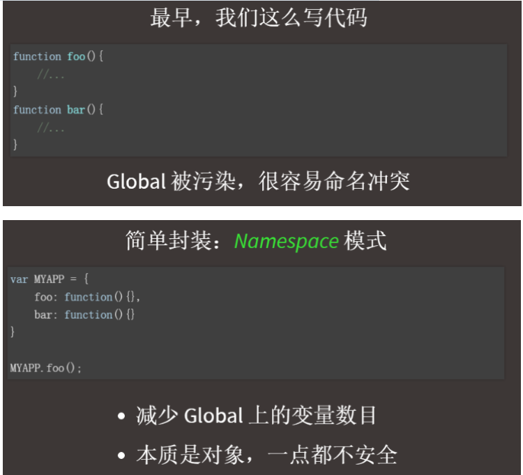

# 一、什么是模块/模块化

模块：将一个复杂的程序依据一定的规则（规范）封装成几个块（文件），并进行组合在一起。块的内部数据/实现是私有的，只是向外部暴露一些接口（方法）与外部其它模块通信

## 1. 模块的进化史




匿名闭包：IIFE模式用一个立即执行函数，全是看不到里面数据的。这是一个被称为 自执行匿名函数的设计模式，主要包含两部分。第一部分是包围在 `圆括号运算符` `()` 里的一个匿名函数，这个匿名函数拥有独立的词法作用域。这不仅避免了外界访问此 IIFE 中的变量，而且又不会污染全局作用域。

例如：jquery就是一个立即执行函数包裹的。


## 2. 为什么要模块化

1. 降低代码复杂度
2. 提高解耦

## 3. 模块化的好处

1. 避免命名冲突（减少命名空间污染）
2. 更好的分离，按需加载
3. 更高复用性
4. 高可维护性

## 4. 页面引入加载script


现实中的问题：

1. 请求过多
2. 依赖模糊
3. 难以维护

# 二、模块化规范

## 1. CommonJS

### 规范

#### 说明

官网：http://wiki.commonjs.org/wiki/Modules/1.1

1. 每一个文件都可以当作一个模块（JS文件）
2. 在服务器端：模块的加载是运行同步加载的
3. 在浏览器端：模块需要提前编译打包处理

#### 基本语法

暴露模块：

1. module.exports = value;
2. exports.xxx = value;

**问题：暴露的模块到底是什么？**

**答：是exports。module.exports在赋值前是一个空的对象{}，**

引入模块：

require(xxx)

1. 第三方模块：xxx为模块名
2. 自定义模块：xxx为模块文件路径

### 实现

服务器实现：Node.js

浏览器端实现：http://browserify.org/

Node和Browserify区别：

1. Node.js运行时动态加载模块（同步）
2. Browserify是在转译（编译）时就会加载打包（合并）require的模块

## 2. AMD（浏览器端）

### 规范

#### 说明

Asynchronous Module Definition(异步模块定义)

https://github.com/amdjs/amdjs-api/wiki/AMD

专门用于浏览器端, 模块的加载是异步的 

#### 基本语法

定义暴露模块

```
//定义没有依赖的模块
define(function(){
	return 模块
})

//定义有依赖的模块
define(['module1', 'module2'], function(m1, m2){
	return 模块
})

```

引入使用模块

```
require(['module1', 'module2'], function(m1, m2){
	使用m1/m2
})
```

### 实现(浏览器端)

Require.js

http://www.requirejs.cn/

http://www.ruanyifeng.com/blog/2012/11/require_js.html

## 3. CMD

### 规范

#### 说明

 Common Module Definition(通用模块定义)

https://seajs.github.io/seajs/docs/#intro

专门用于浏览器端, 模块的加载是异步的 

模块使用时才会加载执行

#### 基本语法

定义暴露模块

```
//定义没有依赖的模块
define(function(require, exports, module){
	exports.xxx = value
	module.exports = value
})

//定义有依赖的模块
define(function(require, exports, module){
	//引入依赖模块(同步)
	var module2 = require('./module2')
	//引入依赖模块(异步)
  	require.async('./module3', function (m3) {
    	
  	})
	//暴露模块
	exports.xxx = value
})


```

引入使用模块

```
define(function (require) {
	var m1 = require('./module1')
	var m4 = require('./module4')
	m1.show()
	m4.show()
})
```

### 实现(浏览器端)

Sea.js


## 4. ES6

# CommonJS-Node.js模块化教程

下方为实例。

1. 下载安装node.js
2. 创建项目结构

  ```
|-modules
  |-module1.js
  |-module2.js
  |-module3.js
|-app.js
|-package.json
  {
    "name": "commonJS-node",
    "version": "1.0.0"
  }
  ```

3. 下载第三方模块

  * npm install uniq --save    （从数组中就地删除所有重复项。并根据首个字符进行排序）

4. 模块化编码

  * module1.js

    ```
    module.exports = {
      foo() {
        console.log('moudle1 foo()')
      }
    }
    ```

  * module2.js

    ```
    module.exports = function () {
      console.log('module2()')
    }
    ```

  * module3.js

    ```
    exports.foo = function () {
      console.log('module3 foo()')
    }
    
    exports.bar = function () {
      console.log('module3 bar()')
    }
    ```

  * app.js 

    ```
    /**
      1. 定义暴露模块:
        module.exports = value;
        exports.xxx = value;
      2. 引入模块:
        var module = require(模块名或模块路径);
     */
    "use strict";
    //引用模块
    let module1 = require('./modules/module1')
    let module2 = require('./modules/module2')
    let module3 = require('./modules/module3')
    
    let uniq = require('uniq')
    let fs = require('fs')
    
    //使用模块
    module1.foo()
    module2()
    module3.foo()
    module3.bar()
    
    console.log(uniq([1, 3, 1, 4, 3]))
    
    fs.readFile('app.js', function (error, data) {
      console.log(data.toString())
    })
    ```

5. 通过node运行app.js

  * 命令: node app.js
  * 工具: 右键-->运行

# CommonJS-Browserify模块化使用教程

1. 创建项目结构

  ```
|-js
  |-dist //打包生成文件的目录
  |-src //源码所在的目录
    |-module1.js
    |-module2.js
    |-module3.js
    |-app.js //应用主源文件
|-index.html
|-package.json
  {
    "name": "browserify-test",
    "version": "1.0.0"
  }
  ```

2. 下载browserify

   下面两步都得做。

  * 全局: npm install browserify -g
  * 局部: npm install browserify --save-dev   （开发依赖）

3. 定义模块代码

  * module1.js

    ```
    module.exports = {
      foo() {
        console.log('moudle1 foo()')
      }
    }
    ```

  * module2.js

    ```
    module.exports = function () {
      console.log('module2()')
    }
    ```

  * module3.js

    ```
    exports.foo = function () {
      console.log('module3 foo()')
    }
    
    exports.bar = function () {
      console.log('module3 bar()')
    }
    ```

  * app.js (应用的主js)

    ```
    //引用模块
    let module1 = require('./module1')
    let module2 = require('./module2')
    let module3 = require('./module3')
    
    let uniq = require('uniq')
    
    //使用模块
    module1.foo()
    module2()
    module3.foo()
    module3.bar()
    
    console.log(uniq([1, 3, 1, 4, 3]))
    ```

* 打包处理js:

  * browserify 源文件 -o 输出文件
  * 实例：browserify js/src/app.js -o js/dist/bundle.js

* 页面使用引入:

  ```
  <script type="text/javascript" src="js/dist/bundle.js"></script> 
  ```

# AMD-require.js使用教程

1. 下载require.js, 并引入

  * 官网: http://www.requirejs.cn/
  * github : https://github.com/requirejs/requirejs
  * 将require.js导入项目: js/libs/require.js 

2. 创建项目结构

  ```
|-js
  |-libs
    |-require.js
  |-modules
    |-alerter.js
    |-dataService.js
  |-main.js
|-index.html
  ```

3. 定义require.js的模块代码

  * dataService.js

    ```
    define(function () {
      let msg = 'atguigu.com'
    
      function getMsg() {
        return msg.toUpperCase()
      }
    
      return {getMsg}
    })
    ```

  * alerter.js

    ```
    define(['dataService', 'jquery'], function (dataService, $) {
      let name = 'Tom2'
    
      function showMsg() {
        $('body').css('background', 'gray')
        alert(dataService.getMsg() + ', ' + name)
      }
    
      return {showMsg}
    })
    ```

4. 应用主(入口)js: main.js

  ```
(function () {
  //配置
  requirejs.config({
    //基本路径
    baseUrl: "js/",
    //模块标识名与模块路径映射
    paths: {
      "alerter": "modules/alerter",
      "dataService": "modules/dataService",
    }
  })
  
  //引入使用模块
  requirejs( ['alerter'], function(alerter) {
    alerter.showMsg()
  })
})()
  ```

5. 页面使用模块:

```
 // data-main 引入主模块
 <script data-main="js/main" src="js/libs/require.js"></script>
```

6. 使用第三方基于require.js的框架(jquery)

  * 将jquery的库文件导入到项目: 

    * js/libs/jquery-1.10.1.js

  * 在main.js中配置jquery路径

    ```
    paths: {
              'jquery': 'libs/jquery-1.10.1'
          }
    ```

  * 在alerter.js中使用jquery

    ```
    define(['dataService', 'jquery'], function (dataService, $) {
        var name = 'xfzhang'
        function showMsg() {
            $('body').css({background : 'red'})
            alert(name + ' '+dataService.getMsg())
        }
        return {showMsg}
    })
    ```

------------------------------------------------------------------------

7. 使用第三方不基于require.js的框架(angular)
   * 将angular.js导入项目
   * js/libs/angular.js

  * 在main.js中配置

    ```
    (function () {
      require.config({
        //基本路径
        baseUrl: "js/",
        //模块标识名与模块路径映射
        paths: {
          //第三方库
          'jquery' : './libs/jquery-1.10.1',
          'angular' : './libs/angular',
          //自定义模块
          "alerter": "./modules/alerter",
          "dataService": "./modules/dataService"
        },
        /*
         配置不兼容AMD的模块
         exports : 指定与相对应的模块名对应的模块对象
         */
        shim: {
          'angular' : {
            exports : 'angular'
          }
        }
      })
      //引入使用模块
      require( ['alerter', 'angular'], function(alerter, angular) {
        alerter.showMsg()
        console.log(angular);
      })
    })()
    ```

# CMD-sea.js简单使用教程

1. 下载sea.js, 并引入

  * 官网: https://seajs.github.io/seajs/docs/#intro
  * github : https://github.com/seajs/seajs
  * 将sea.js导入项目: js/libs/sea.js 

2. 创建项目结构

  ```
|-js
  |-libs
    |-sea.js
  |-modules
    |-module1.js
    |-module2.js
    |-module3.js
    |-module4.js
    |-main.js
|-index.html
  ```

3. 定义sea.js的模块代码

  * module1.js

    ```
    define(function (require, exports, module) {
      //内部变量数据
      var data = 'atguigu.com'
      //内部函数
      function show() {
        console.log('module1 show() ' + data)
      }
    
      //向外暴露
      exports.show = show
    })
    ```

  * module2.js

    ```
    define(function (require, exports, module) {
      module.exports = {
        msg: 'I Will Back'
      }
    })
    ```

  * module3.js

    ```
    define(function (require, exports, module) {
      const API_KEY = 'abc123'
      exports.API_KEY = API_KEY
    })
    ```

  * module4.js

    ```
    define(function (require, exports, module) {
      //引入依赖模块(同步)
      var module2 = require('./module2')
    
      function show() {
        console.log('module4 show() ' + module2.msg)
      }
    
      exports.show = show
      //引入依赖模块(异步)
      require.async('./module3', function (m3) {
        console.log('异步引入依赖模块3  ' + m3.API_KEY)
      })
    })
    ```

  * main.js : 主(入口)模块

    ```
    define(function (require) {
      var m1 = require('./module1')
      var m4 = require('./module4')
      m1.show()
      m4.show()
    })
    ```

4. index.html:

  ```
<!--
使用seajs:
  1. 引入sea.js库
  2. 如何定义导出模块 :
    define()
    exports
    module.exports
  3. 如何依赖模块:
    require()
  4. 如何使用模块:
    seajs.use()
-->
<script type="text/javascript" src="js/libs/sea.js"></script>
<script type="text/javascript">
  seajs.use('./js/modules/main')
</script>
  ```

# ES6-Babel-Browserify使用教程

1. 定义package.json文件

  ```
{
  "name" : "es6-babel-browserify",
  "version" : "1.0.0"
}
  ```

2. 安装babel-cli, babel-preset-es2015和browserify       （cli：command line interface   命令行接口）

  * npm install babel-cli browserify -g 
    * npm install babel-preset-es2015 --save-dev 
    * preset 预设(将es6转换成es5的所有插件打包)

3. 定义 .babelrc 文件   （rc：run control   表示运行时文件）

   ```
   {
    "presets": ["es2015"]
     }
   ```

4. 编码

  * js/src/module1.js  分别暴露

    ```
    export function foo() {
      console.log('module1 foo()');
    }
    export function bar() {
      console.log('module1 bar()');
    }
    export const DATA_ARR = [1, 3, 5, 1]
    ```

  * js/src/module2.js  统一暴露

    ```
    let data = 'module2 data'
    
    function fun1() {
      console.log('module2 fun1() ' + data);
    }
    
    function fun2() {
      console.log('module2 fun2() ' + data);
    }
    
    export {fun1, fun2}
    ```

  * js/src/module3.js    默认暴露

    ```
    export default {
      name: 'Tom',
      setName: function (name) {
        this.name = name
      }
    }
    ```

  * js/src/app.js

    ```
    import {foo, bar} from './module1'
    import {DATA_ARR} from './module1'
    import {fun1, fun2} from './module2'
    import person from './module3'
    
    import $ from 'jquery'
    
    $('body').css('background', 'red')
    
    foo()
    bar()
    console.log(DATA_ARR);
    fun1()
    fun2()
    
    person.setName('JACK')
    console.log(person.name);
    ```

5. 编译

  * 使用Babel将ES6编译为ES5代码(但包含CommonJS语法) : babel js/src -d js/lib
  * 使用Browserify编译js : browserify js/lib/app.js -o js/lib/bundle.js

6. 页面中引入测试

  ```
<script type="text/javascript" src="js/lib/bundle.js"></script>
  ```

7. 引入第三方模块(jQuery)
   1). 下载jQuery模块: 

   * npm install jquery@1 --save
     2). 在app.js中引入并使用

   ```
   import $ from 'jquery'
   $('body').css('background', 'red')
   ```


