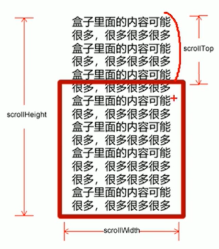
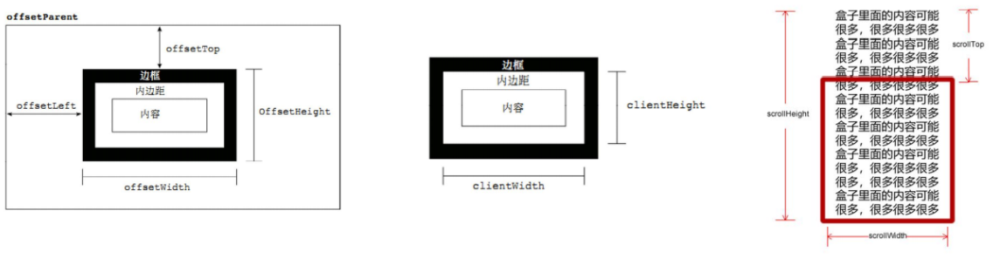

---

---

# 1.元素偏移量 offset 系列

## 1.1 offset 概述

offset 翻译过来就是偏移量，我们使用offset 系列相关属性可以动态的得到改元素的位置（偏移）、大小等。

- **获得元素距离带有定位元素的位置**
- **获得元素自身的大小**
- **注意：返回的数值不带单位**

offset 系列常用属性

| offset 系列属性      | 作用                                                        |
| -------------------- | ----------------------------------------------------------- |
| element.offsetParent | 返回作为该元素带有定位的父级元素 如果父级没有定位则返回body |
| element.offsetTop    | 返回元素相对带有定位父元素上方的偏移                        |
| element.offsetLeft   | 返回元素相对带有定位父元素左边框的偏移                      |
| element.offsetWidth  | 返回自身包括padding、边框、内容区的宽度，返回数值不带单位   |
| element.offsetHeight | 返回自身包括padding、边框、内容区的高度，返回数值不带单位   |

## 1.2 offset 和 style 区别

| offset                                         | style                                       |
| ---------------------------------------------- | ------------------------------------------- |
| offset 可以得到任意样式表中的样式值            | style 只能得到行内样式表中的样式值          |
| offset 系列获得的数值没有单位                  | style.width 获得的是带有单位的字符串        |
| offsetWidth 包含padding+border+width           | style.width 获得不包含padding和border的值   |
| offsetWidth 等属性是只读属性，只能获取不能赋值 | style.width 是可读写属性，可以获取和赋值    |
| **我们想要获取元素大小位置，用offset**         | **我们想要给元素更改值，则需要用style改变** |

# 2. 元素可视区 client 系列

client 翻译过来就是客户端，我们使用client 系列的相关属性来获取元素可视区的相关信息。通过client系列的相关属性可以动态的得到改元素的边框大小、元素大小等。

| client 系列属性      | 作用                                                         |
| -------------------- | ------------------------------------------------------------ |
| element.clientTop    | 返回上边框的大小                                             |
| element.clientLeft   | 返回元素左边框的大小                                         |
| element.clientWidth  | 返回自身包括padding、内容区的宽度、不包含边框，返回的数值不带单位 |
| element.clientHeight | 返回自身包括padding、内容区的宽度、不包含边框，返回的数值不带单位 |

client 系列  和offset 系列的区别  ：client 系列不包含边框   offset 系列包含边框

# 3. 立即执行函数

## 3.1 什么是立即执行函数

1.立即执行函数： 不需要调用，立马能够自己执行的函数

2.语法：

**( function( ) {}(参数 ) )**;         或者         **( function() {} (参数) )**;

**第二个括号可以传递参数**

3.立即执行函数的最大的作用就是： **独立的创建一个作用域，里面所有的变量都是局部变量，不会有命名冲突的问题**

## 案例： 淘宝flexible.js 源码分析

```
(function flexible(window, document) {
	//获取html的根元素
    var docEl = document.documentElement   
    //dpr 物理像素比 window.devicePixelRatio 获取当前浏览器的dpr  如果没有物理像素比则当成 1
    var dpr = window.devicePixelRatio || 1    

    // adjust body font size    设置我们body的字体大小
    function setBodyFontSize() {
    	// 如果页面在执行到这个函数的时候有body这个元素   就设置body的字体大小
        if (document.body) {
            document.body.style.fontSize = (12 * dpr) + 'px'
        } else {
        	// 如果页面没有body这个元素  则DOMContentLoaded 在页面加载完之后执行这个函数
            document.addEventListener('DOMContentLoaded', setBodyFontSize)
        }
    }
    setBodyFontSize();

    // set 1rem = viewWidth / 10   设置我们html元素的文字大小
    // docEl 表示html元素
    // rem  就是html这个元素的宽度的十分之一
    // 然后给html元素的字体大小设置为rem
    function setRemUnit() {
        var rem = docEl.clientWidth / 10
        docEl.style.fontSize = rem + 'px'
    }

    setRemUnit()

    // reset rem unit on page resize    当我们页面尺寸大小发生变化时，要重新设置rem的大小
    window.addEventListener('resize', setRemUnit)
    // pageshow 是我们重新加载页面时触发的事件
    window.addEventListener('pageshow', function(e) {
    	// e.persisted属性 返回true 就是说这个页面是从缓存中取过来的页面，需要重新计算一下rem的大小
        if (e.persisted) {
            setRemUnit()
        }
    })

    // detect 0.5px supports   有写移动端的浏览器不支持0.5像素的写法   这个区域解决这个问题
    if (dpr >= 2) {
        var fakeBody = document.createElement('body')
        var testElement = document.createElement('div')
        testElement.style.border = '.5px solid transparent'
        fakeBody.appendChild(testElement)
        docEl.appendChild(fakeBody)
        if (testElement.offsetHeight === 1) {
            docEl.classList.add('hairlines')
        }
        docEl.removeChild(fakeBody)
    }
}(window, document))
```

## pageshow 事件

下面三种情况都会触发 load 事件。

1. a标签的超链接
2. F5或者刷新按钮（强制刷新）
3. 前进后退按钮

但是 火狐中，有个特点：有"往返缓存"，这个缓存中不仅仅保存着页面数据，还保存了DOM和JavaScript的状态；实际上是将整个页面都保存在内存里了。

所以 此时 后退按钮就不能刷新页面了

此时可以使用pageshow 事件来触发，这个事件在页面显示时触发，无论页面是否来自缓存，在重新加载页面中，pageshow会在load事件触发后触发；根据事件对象的persisted 来判断是否缓存中的页面触发的pageshow事件，**注意这个事件给window添加**

# 4. 元素滚动 scroll 系列

## 4.1 元素 scroll 系列 属性

scroll 翻译过来就是滚动的意思   我们使用scroll系列相关属性可以动态的得到该元素的大小、滚动距离等。

| scroll 系列属性      | 作用                                           |
| -------------------- | ---------------------------------------------- |
| element.scrollTop    | 返回被卷上去的上侧距离，返回数值不带单位       |
| element.scrollLeft   | 返回被卷上去的左侧距离，返回数值不带单位       |
| element.scrollWidth  | 返回自身实际的宽度，不含边框，返回数值不带单位 |
| element.scrollHeight | 返回自身实际的高度，不含边框，返回数值不带单位 |



## 4.2 页面被卷去头部兼容性解决方案

获取被卷去头部的距离有一下几种写法：

1.声明了DTD （<!DOCTYPE html>）   使用document.documentElement.scrollTop      

document.documentElement   获取的是html标签

2.未声明DTD （<!DOCTYPE html>）   使用document.body.scrollTop

document.body    获取的是body标签

3.新方法window.pageYOffset 和 window.pageXOffset     IE9以上版本支持

```
function getScroll() {
 return {
 left: window.pageXOffset || document.documentElement.scrollLeft || document.body.scrollLeft||0,
 top: window.pageYOffset || document.documentElement.scrollTop || document.body.scrollTop || 0
 };
 } 
使用的时候 getScroll().left
```

# 5.三大系列总结

## 5.1 三大系列区别

| 三大系列大小对比    | 作用                                                         |
| ------------------- | ------------------------------------------------------------ |
| element.offsetWidth | 返回自身包含padding、边框、内容区的宽度，返回数值不带单位    |
| element.clientWidth | 返回自身包括padding、内容区的宽度，不含边框，返回数值不带单位 |
| element.scrollWidth | 返回自身实际的宽度，不含边框，返回数值不带单位               |



## 5.2 他们的主要用法

1. offset系列经常用于获取元素的位置   offsetLeft    offsetTop
2. client 经常用于获取元素大小  clientWidth  clientHeight
3. scroll 经常用于获取滚动距离   scrollTop   scrollLeft
4. **注意页面的滚动的距离通过window.pageXOffset获取**

# 6. mouseenter 和 mouseover 的区别

mouseenter 鼠标事件

当鼠标移动到元素上时就会触发mouseenter 事件

mouseenter 和 mouseover 的区别
1.**mouseover 鼠标经过自身盒子会触发，经过子盒子还会触发。mouseenter 只会经过自身盒子触发** 

2.原因：mouseenter 不会冒泡        mouseover 会发生冒泡    当子盒子得到mouseover 事件后会往上冒泡。

3.跟mouseenter  搭配  鼠标离开  mouseleave  同样不会冒泡。

# 6. 动画函数封装

## 6.1 动画实现原理

核心原理：通过定时器setInterval()不断移动盒子的位置

实现步骤：

1. 获取盒子当前的位置
2. 让盒子在当前位置加上1个移动距离
3. 利用定时器不断重复这个操作
4. 加一个结束定时器的条件
5. 注意此元素需要添加定位，才能使用element.style.left

## 6.2 动画函数封装

注意函数需要传递两个参数    **动画对象**和**移动的距离**

