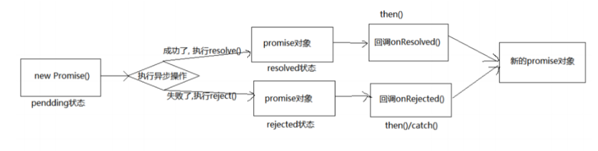

# 一、Promise 介绍与基本使用

## 1. Promise 是什么？

### 1.1 理解

1. 抽象表达：

   1）Promise 是一门新的技术（ES6规范）

   2）Promise 是JS中进行异步编程的新解决方案

   ​	  旧方案是单纯使用回调函数

2. 具体表达：

   1）从语法上说：Promise 是一个构造函数

   2）从功能上来说：promise对象是用来封装一个异步操作并可以获取其成功或者失败的结果值

### 1.2 promise 的状态改变

1. pending 变为 resolved
2. pending 变为 rejected

说明：promise状态只能是 pending 状态变为 resolved 或者 pending 状态 变为 rejected

并且一个 promise 对象只能改变一次

无论变为成功还是失败，都会有一个结果数据

成功的结果数据一般称为 value， 失败的结果数据一般称为 reason

### 1.3 promise 的基本流程



### 1.4 promise 的基本使用

####  1. 基本编码流程

```
// 1. 创建promise对象(pending状态)，指定执行器函数
const p = new Promise((resolve, reject)=>{
	// 2. 在执行器函数中启动异步任务
	setTimeout(()=>{
		// 3. 根据执行结果的不同进行不同处理
		// 3.1 如果执行成功了，调用resolve(),指定成功的value，变为resolved状态
		resolve('这里可以传递成功的值')
		
		// 3.2 如果执行失败了，调用reject(),指定失败的reason，变为rejected
		reject('传递失败的原因')
	},1000)
})

// 4) 能 promise 指定成功或失败的回调函数来获取成功的 vlaue 或失败的 reason
// p.then(value=>{},reason=>{});
p.then(
	value => { // 成功的回调函数 onResolved, 得到成功的 vlaue
		console.log('成功的 value: ', value)
	},
	reason => { // 失败的回调函数 onRejected, 得到失败的 reason
		console.log('失败的 reason: ', reason) 
	} 
);
```

####  2. promise 封装基于定时器的异步

```
function doDelay(time) {
	// 1. 创建 promise 对象
	return new Promise((resolve, reject) => {
        // 2. 启动异步任务
        console.log('启动异步任务')
        setTimeout(() => {
            console.log('延迟任务开始执行...')
            const time = Date.now() // 假设: 时间为奇数代表成功, 为偶数代表失败
            if (time %2=== 1) { // 成功了
            // 3. 1. 如果成功了, 调用 resolve()并传入成功的 value
            resolve('成功的数据 ' + time) } else { // 失败了
            // 3.2. 如果失败了, 调用 reject()并传入失败的 reason
            reject('失败的数据 ' + time) }
        }, time)
	})
}

const promise = doDelay(2000)
promise.then(
value => {
console.log('成功的 value: ', value)
},
reason => {
console.log('失败的 reason: ', reason)
},
)
```

####  3. promise 封装 ajax 异步请求

```
/**
 * 封装一个函数 sendAJAX 发送 GET AJAX 请求
 * 参数   URL
 * 返回结果 Promise 对象
 */
function sendAJAX(url){
    return new Promise((resolve, reject) => {
        const xhr = new XMLHttpRequest();
        xhr.responseType = 'json';
        xhr.open("GET", url);
        xhr.send();
        //处理结果
        xhr.onreadystatechange = function(){
            if(xhr.readyState === 4){
                //判断成功
                if(xhr.status >= 200 && xhr.status < 300){
                    //成功的结果
                    resolve(xhr.response);
                }else{
                    reject(xhr.status);
                }
            }
        }
    });
}
    
sendAJAX('https://api.apiopen.top/getJok')
.then(value => {
    console.log(value);
}, reason => {
    console.warn(reason);
});
```

####  4. util.promisify 方法

这样以后如果我们需要封装promise，就可以使用util.promisify 方法

```
/**
 * util.promisify 方法
 */
//引入 util 模块
const util = require('util');
//引入 fs 模块
const fs = require('fs');
//返回一个新的函数   这个函数返回的结果是一个promise对象
let mineReadFile = util.promisify(fs.readFile);

mineReadFile('./resource/content.txt').then(value=>{
    console.log(value.toString());
});
```


## 2. 为什么使用Promise？

### 2.1 指定回调函数的方式更加灵活

1. 旧的：必须在启动异步任务前指定
2. promise：启动异步任务 => 返回promise对象 => 给promise对象绑定回调函数（甚至可以在异步任务结束后指定/多个）

## 2.2 支持链式调用，可以解决回调地狱问题

1. 什么是回调地狱？

   回调函数嵌套调用，外部回调函数异步执行的结果是嵌套的回调执行的条件

2. 回调地狱的缺点？

   不便于阅读

   不便于异常处理

3. 解决方案？

   promise 链式调用

4. 终极解决方案？

   async/await

# 二、Promise API

## 1. API

###  1. 1 Promise 构造函数: Promise (excutor) {}

​	(1) executor 函数: 执行器 (resolve, reject) => {} 

​	(2) resolve 函数: 内部定义成功时我们调用的函数 value => {}

​	(3) reject 函数: 内部定义失败时我们调用的函数 reason => {}

说明: **executor 会在 Promise 内部立即同步调用,异步操作在执行器中执行(重点)** 

```
/* 
  (resolve, reject) => {}  这个参数交执行器函数，
  当实例化promise构造函数的时候，这个执行器函数会立即执行。
  
  */
let p = new Promise((resolve, reject) => {
  // 同步调用的
  console.log(111);
})

console.log(222);

// 执行结果为  111 222

```


### 1.2 Promise.prototype.then 方法: (onResolved, onRejected) => {}

​	(1) onResolved 函数: 成功的回调函数 (value) => {}

​	(2) onRejected 函数: 失败的回调函数 (reason) => {}

​	说明: 指定用于得到成功 value 的成功回调和用于得到失败 reason 的失败回调

​			  返回一个新的 promise 对象

### 1.3 Promise.prototype.catch 方法: (onRejected) => {}

​	(1) onRejected 函数: 失败的回调函数 (reason) => {}

​	说明: then()的语法糖, 相当于: then(undefined, onRejected)

### 1.4 Promise.resolve 方法: (value) => {}

​	(1) value: 成功的数据或 promise 对象

​	说明: 返回一个成功/失败的 promise 对象

```
let p1 = Promise.resolve(521);
//如果传入的参数为 非Promise类型的对象, 则返回的结果为成功promise对象
//如果传入的参数为 Promise 对象, 则参数的结果决定了 resolve 的结果
let p2 = Promise.resolve(new Promise((resolve, reject) => {
    // resolve('OK');
    reject('Error');
}));
// console.log(p2);
p2.catch(reason => {
    console.log(reason);
})
```


### 1.5 Promise.reject 方法: (reason) => {}

​	(1) reason: 失败的原因

​	说明: 返回一个失败的 promise 对象

### 1.6 Promise.all 方法: (promises) => {}

​	(1) promises: 包含 n 个 promise 的数组

​	说明: 返回一个新的 promise, 只有所有的 promise 都成功才成功, 只要有一个失败了就

​		 	 直接失败

```
let p1 = new Promise((resolve, reject) => {
    resolve('OK');
})
let p2 = Promise.reject('Error');
let p3 = Promise.resolve('Oh Yeah');

const result = Promise.all([p1, p2, p3]);

console.log(result);
```


### 1.7 Promise.race 方法: (promises) => {}

​	(1) promises: 包含 n 个 promise 的数组

​	说明: 返回一个新的 promise, 第一个完成的 promise 的结果状态就是最终的结果状态

```
let p1 = new Promise((resolve, reject) => {
    setTimeout(() => {
        resolve('OK');
    }, 1000);
})
let p2 = Promise.resolve('Success');
let p3 = Promise.resolve('Oh Yeah');

//调用
const result = Promise.race([p1, p2, p3]);

console.log(result);
```


##  2. promise 的几个关键问题

###  2.1 如何改变 promise 的状态?

​	(1) resolve(value): 如果当前是 pending 就会变为 resolved

​	(2) reject(reason): 如果当前是 pending 就会变为 rejected

​	(3) 抛出异常: 如果当前是 pending 就会变为 rejected

```
let p = new Promise((resolve, reject) => {
    //1. resolve 函数
    // resolve('ok'); // pending   => fulfilled (resolved)
    //2. reject 函数
    // reject("error");// pending  =>  rejected 
    //3. 抛出错误
    // throw '出问题了';
});

console.log(p);
```


### 2.2  一个 promise 指定多个成功/失败回调函数, 都会调用吗? 

当 promise **改变为对应状态时**都会调用

这里指定多个回调就是 .then方法

```
// 注意这里Promise实例对象的状态需要发生改变才会执行 后面多个回调函数
// 如果不改变这个实例对象的状态，后面的回调函数不会执行

let p = new Promise((resolve, reject) => {
    // resolve('OK');
});

///指定回调 - 1
p.then(value => {
    console.log(value);
});

//指定回调 - 2
p.then(value => {
    alert(value);
});
```


### 2.3 改变 promise 状态和指定回调函数谁先谁后?（重点）

​	(1) 都有可能, 正常情况下是先指定回调再改变状态, 但也可以先改状态再指定回调

​	(2) 如何先改状态再指定回调? 

​		① 在执行器中直接调用 resolve()/reject()

​		② 延迟更长时间才调用 then()

​	(3) 什么时候才能得到数据? 

​		① 如果先指定的回调, 那当状态发生改变时, 回调函数就会调用, 得到数据

​		② 如果先改变的状态, 那当指定回调时, 回调函数就会调用, 得到数据

```
// 改变 promise 状态和指定回调函数谁先谁后?
// 上面这个问题可以这么理解
// 是先执行 resolve 改变状态 还是 先执行 then 方法
// 两种情况都有可能
// 第一种可能：先执行 resolve 改变状态 在 执行 then 方法
// 当 executor 执行器函数 里面是一个同步任务时候 
let p = new Promise((reslove, reject) => {
  console.log('同步任务')
  reslove('ok');
})

let x = p.then(value => {
  console.log(value)
})

console.log(x)
// 输出结果：
//     同步任务
//     Promise { <pending> }
//     ok


// 第二种可能：先执行 then 方法 在 执行 resolve 改变状态
// 当 executor 执行器函数 里面是一个异步任务的时候

let p = new Promise((reslove, reject) => {
  setTimeout(() => {
    console.log('1')
    reslove('ok');
  }, 0)

})

let x = p.then(value => {
  console.log(value)
})

console.log(x)

// 执行结果：
// Promise { <pending> }
// 1
// ok
```


### 2.4 promise.then()返回的新 promise 的结果状态由什么决定?

​	(1) 简单表达: 由 then()指定的回调函数执行的结果决定

​	(2) 详细表达: 

​		① 如果抛出异常, 新 promise 变为 rejected, reason 为抛出的异常

​		② 如果返回的是非 promise 的任意值, 新 promise 变为 resolved, value 为返回的值

​		③ 如果返回的是另一个新 promise, 此 promise 的结果就会成为新 promise 的结果

```
let p = new Promise((resolve, reject) => {
    resolve('ok');
});
//执行 then 方法
let result = p.then(value => {
	//1. 如果不返回任何结果 result promise对象的状态是成功，结果值是undefined
    // console.log(value);
    //2. 抛出错误
    // throw '出了问题';
    //3. 返回结果是非 Promise 类型的对象  result对象的状态就是成功的，值由返回值决定
    // return 521;
    //4. 返回结果是 Promise 对象
    // 由这个返回的Promise对象的状态决定
    // 成功则result的状态就是成功 值就是'success'
    // 失败则result的状态就是失败 值就是'error'
    // return new Promise((resolve, reject) => {
    //     // resolve('success');
    //     reject('error');
    // });
}, reason => {
    console.warn(reason);
});

console.log(result);
```


### 2.5 promise 如何串连多个操作任务?

​	(1) promise 的 then()返回一个新的 promise, 可以开成 then()的链式调用

​	(2) 通过 then 的链式调用串连多个同步/异步任务

```
let p = new Promise((resolve, reject) => {
    setTimeout(() => {
        resolve('OK');
    }, 1000);
});

// .then返回是一个promise对象
// 这个返回的promise对象的状态由 返回值决定
// 成功：非promise对象
// 失败：返回一个状态是失败的 promise 对象或者 throw 抛出错误
p.then(value => {
    return new Promise((resolve, reject) => {
        resolve("success");
    });
}).then(value => {
    console.log(value);
}).then(value => {
    console.log(value);
})

// 输出结果：
// 值：success  状态：fulfilled  成功
// 值：undefined  状态：rejected   失败
```


### 2.6 promise 异常传透?

​	(1) 当使用 promise 的 then 链式调用时, 可以在最后指定失败的回调, 

​	(2) 前面任何操作出了异常, 都会传到最后失败的回调中处理

```
let p = new Promise((resolve, reject) => {
    setTimeout(() => {
        resolve('OK');
        // reject('Err');
    }, 1000);
});

p.then(value => {
    // console.log(111);
    throw '失败啦!';
}).then(value => {
    console.log(222);
}).then(value => {
    console.log(333);
}).catch(reason => {
    console.warn(reason);
});
```


### 2.7 中断 promise 链?

​	(1) 当使用 promise 的 then 链式调用时, 在中间中断, 不再调用后面的回调函数

​	(2) 办法: 在回调函数中返回一个 pendding 状态的 promise 对象

```
let p = new Promise((resolve, reject) => {
    setTimeout(() => {
        resolve('OK');
    }, 1000);
});
// 返回一个pending状态的promise对象
p.then(value => {
    console.log(111);
    //有且只有一个方式
    return new Promise(() => {});
}).then(value => {
    console.log(222);
}).then(value => {
    console.log(333);
}).catch(reason => {
    console.warn(reason);
});
```


# 三、Promise 自定义封装（手写promsie）


```
// Promise官方调用方法
<script>
    let p = new Promise((resolve, reject) => {
      resolve('ok');
    });
    //执行 then 方法
    let result = p.then(value => {
      console.log(value);
    }, reason => {
      console.warn(reason);
    });

</script>
```

 自己声明Promise函数

```


// 第一步  声明 Promise 构造函数
function Promise(executer) {

}

Promise.prototype.then = function (onResolved, onRejected) {

};
```


```
// 第二步  搭建resolve 和 reject
function Promise(executer) {
  // 同步调用执行器函数 executer
  function resolve(data) {
    
  }
  function reject(data) {
    
  }
  executer(resolve, reject);
}

Promise.prototype.then = function (onResolved, onRejected) {

};
```


```
// 第三步  完善resolve  reject
function Promise(executer) {
  // 添加属性
  this.PromiseState = 'pending';
  this.PromiseResult = null;

  const self = this; // 接受this的参数一般有 that _this
  // 同步调用执行器函数 executer
  function resolve(data) {
    // 注意这里的this指向  这里的this指向的是window
    // 1. 修改对象的状态
    self.PromiseState = 'fulfilled';
    // 2. 设置对象结果的值
    self.PromiseResult = data
  }
  function reject(data) {
    // 注意这里的this指向  这里的this指向的是window
    // 1. 修改对象的状态
    self.PromiseState = 'rejected';
    // 2. 设置对象结果的值
    self.PromiseResult = data
  }
  executer(resolve, reject);
}

Promise.prototype.then = function (onResolved, onRejected) {

};
```


```
// 第四步  添加抛出异常更改状态
// 更改promise状态的三种方式：
// 1. 调用resolve
// 2. 调用reject
// 3. 抛出异常 throw

function Promise(executer) {
  // 添加属性
  this.PromiseState = 'pending';
  this.PromiseResult = null;

  const self = this; // 接受this的参数一般有 that _this
  // 同步调用执行器函数 executer
  function resolve(data) {
    // 注意这里的this指向  这里的this指向的是window
    // 1. 修改对象的状态
    self.PromiseState = 'fulfilled';
    // 2. 设置对象结果的值
    self.PromiseResult = data
  }
  function reject(data) {
    // 注意这里的this指向  这里的this指向的是window
    // 1. 修改对象的状态
    self.PromiseState = 'rejected';
    // 2. 设置对象结果的值
    self.PromiseResult = data
  }
  try {
    executer(resolve, reject);
  } catch (error) {
    console.log(error)
  }

}

Promise.prototype.then = function (onResolved, onRejected) {

};
```


```
// 第五步
// 由于promise的状态只能改变一次
// 所以需要在执行resolve、reject函数里面的业务逻辑的时候
// 判断当前的状态是否是pending
// 如果不是 pending 证明已经更改过一遍了  后面代码不需要在执行

function Promise(executer) {
  // 添加属性
  this.PromiseState = 'pending';
  this.PromiseResult = null;

  const self = this; // 接受this的参数一般有 that _this
  // 同步调用执行器函数 executer
  function resolve(data) {
    if (self.PromiseState !== 'pending') return;
    // 注意这里的this指向  这里的this指向的是window
    // 1. 修改对象的状态
    self.PromiseState = 'fulfilled';
    // 2. 设置对象结果的值
    self.PromiseResult = data
  }
  function reject(data) {
    if (self.PromiseState !== 'pending') return;
    // 注意这里的this指向  这里的this指向的是window
    // 1. 修改对象的状态
    self.PromiseState = 'rejected';
    // 2. 设置对象结果的值
    self.PromiseResult = data
  }
  try {
    executer(resolve, reject);
  } catch (error) {
    console.log(error)
  }

}

Promise.prototype.then = function (onResolved, onRejected) {

};
```


```
// 第六步
// 完善then方法  
// Promise 实例对象中执行的是 同步代码
function Promise(executer) {
  // 添加属性
  this.PromiseState = 'pending';
  this.PromiseResult = null;

  const self = this; // 接受this的参数一般有 that _this
  // 同步调用执行器函数 executer
  function resolve(data) {
    if (self.PromiseState !== 'pending') return;
    // 注意这里的this指向  这里的this指向的是window
    // 1. 修改对象的状态
    self.PromiseState = 'fulfilled';
    // 2. 设置对象结果的值
    self.PromiseResult = data
  }
  function reject(data) {
    if (self.PromiseState !== 'pending') return;
    // 注意这里的this指向  这里的this指向的是window
    // 1. 修改对象的状态
    self.PromiseState = 'rejected';
    // 2. 设置对象结果的值
    self.PromiseResult = data
  }
  try {
    executer(resolve, reject);
  } catch (error) {
    console.log(error)
  }

}

Promise.prototype.then = function (onResolved, onRejected) {
  // 根据 PromiseState 的状态值来决定调用哪个回调函数
  // 这里的this指向的就是promise实例对象
  if (this.PromiseState === 'fulfilled') {
    onResolved(this.PromiseResult);
  }
  if (this.PromiseState === 'rejected') {
    onRejected(this.PromiseResult);
  }
};
```


```
// 第六步
// 完善then方法  Promise实例对象中执行的是异步任务
/* 1. 由于是异步任务  所以先执行then方法
	  在then方法中不能直接就执行成功或者失败的回调  因为这个时候promise对象的状态是pending
	  所以这个时候是保存这两个回调函数
	  this.callback = {xxxxxxxx}
   2. 在更改状态的时候在调用这两个函数
   	  当promise状态改变之后 调用对应的then方法中的回调函数
        if (self.callback.onResolved) {
          self.callback.onResolved(data);
        }
*/
function Promise(executer) {
  // 添加属性
  this.PromiseState = 'pending';
  this.PromiseResult = null;
  // 保存callback
  this.callback = {};

  const self = this; // 接受this的参数一般有 that _this
  // 同步调用执行器函数 executer
  function resolve(data) {
    if (self.PromiseState !== 'pending') return;
    // 注意这里的this指向  这里的this指向的是window
    // 1. 修改对象的状态
    self.PromiseState = 'fulfilled';
    // 2. 设置对象结果的值
    self.PromiseResult = data

    // 3. 当promise状态改变之后 调用对应的then方法中的回调函数
    if (self.callback.onResolved) {
      self.callback.onResolved(data);
    }
  }
  function reject(data) {
    if (self.PromiseState !== 'pending') return;
    // 注意这里的this指向  这里的this指向的是window
    // 1. 修改对象的状态
    self.PromiseState = 'rejected';
    // 2. 设置对象结果的值
    self.PromiseResult = data

    // 3. 当promise状态改变之后 调用对应的then方法中的回调函数
    if (self.callback.onRejected) {
      self.callback.onRejected(data);
    }
  }
  try {
    executer(resolve, reject);
  } catch (error) {
    console.log(error)
  }

}

Promise.prototype.then = function (onResolved, onRejected) {

  // Promise构造函数中任务是同步任务
  // 根据 PromiseState 的状态值来决定调用哪个回调函数
  // 这里的this指向的就是promise实例对象
  if (this.PromiseState === 'fulfilled') {
    onResolved(this.PromiseResult);
  }
  if (this.PromiseState === 'rejected') {
    onRejected(this.PromiseResult);
  }

  // Promise构造函数中任务是异步任务
  // 在执行异步任务的时候 因为不能直接执行 所以需要对回调函数进行保存
  // 在异步任务结束完成之后  在执行回调函数
  if (this.PromiseState === 'pending') {
    this.callback = {
      onResolved,
      onRejected
    }
  }
};
```


```
// 第七步
// 第六步存在的问题
// 当多次调用 then 方法的时候 只会执行最后一次调用
// 因为最后一次调用then方法会把前面的callback完全覆盖
// 所以我们需要将这个callback改成一个数组
// 执行callbacks时候需要使用遍历挨个执行即可
function Promise(executer) {
  // 添加属性
  this.PromiseState = 'pending';
  this.PromiseResult = null;
  // 保存callback
  this.callbacks = [];

  const self = this; // 接受this的参数一般有 that _this
  // 同步调用执行器函数 executer
  function resolve(data) {
    if (self.PromiseState !== 'pending') return;
    // 注意这里的this指向  这里的this指向的是window
    // 1. 修改对象的状态
    self.PromiseState = 'fulfilled';
    // 2. 设置对象结果的值
    self.PromiseResult = data

    // 3. 当promise状态改变之后 调用对应的then方法中的回调函数
    self.callbacks.forEach(item => {
      item.onResolved(data);
    })

  }
  function reject(data) {
    if (self.PromiseState !== 'pending') return;
    // 注意这里的this指向  这里的this指向的是window
    // 1. 修改对象的状态
    self.PromiseState = 'rejected';
    // 2. 设置对象结果的值
    self.PromiseResult = data

    // 3. 当promise状态改变之后 调用对应的then方法中的回调函数
    self.callbacks.forEach(item => {
      item.onRejected(data);
    })
  }
  try {
    executer(resolve, reject);
  } catch (error) {
    console.log(error)
  }

}

Promise.prototype.then = function (onResolved, onRejected) {

  // Promise构造函数中任务是同步任务
  // 根据 PromiseState 的状态值来决定调用哪个回调函数
  // 这里的this指向的就是promise实例对象
  if (this.PromiseState === 'fulfilled') {
    onResolved(this.PromiseResult);
  }
  if (this.PromiseState === 'rejected') {
    onRejected(this.PromiseResult);
  }

  // Promise构造函数中任务是异步任务
  // 在执行异步任务的时候 因为不能直接执行 所以需要对回调函数进行保存
  // 在异步任务结束完成之后  在执行回调函数
  if (this.PromiseState === 'pending') {
    this.callbacks.push({
      onResolved,
      onRejected
    });
  }
};
```


```
// 第八步  完善同步任务的 then方法返回一个Promise对象

// then方法执行返回一个promise对象
// 1. 返回结果不是promise对象  
//    返回的promise对象状态是成功
//    返回的promise对象结果是返回的值
// 2. 返回的结果是promise对象
//    返回的状态由返回的promise对象决定
//    返回的结果是由返回的promise对象的结果
// 3. throw 抛出错误
//    返回的promise对象状态是rejected
//    返回的promise对象结果是 throw 抛出的错误
function Promise(executer) {
  // 添加属性
  this.PromiseState = 'pending';
  this.PromiseResult = null;
  // 保存callback
  this.callbacks = [];

  const self = this; // 接受this的参数一般有 that _this
  // 同步调用执行器函数 executer
  function resolve(data) {
    if (self.PromiseState !== 'pending') return;
    // 注意这里的this指向  这里的this指向的是window
    // 1. 修改对象的状态
    self.PromiseState = 'fulfilled';
    // 2. 设置对象结果的值
    self.PromiseResult = data

    // 3. 当promise状态改变之后 调用对应的then方法中的回调函数
    self.callbacks.forEach(item => {
      item.onResolved(data);
    })

  }
  function reject(data) {
    if (self.PromiseState !== 'pending') return;
    // 注意这里的this指向  这里的this指向的是window
    // 1. 修改对象的状态
    self.PromiseState = 'rejected';
    // 2. 设置对象结果的值
    self.PromiseResult = data

    // 3. 当promise状态改变之后 调用对应的then方法中的回调函数
    self.callbacks.forEach(item => {
      item.onRejected(data);
    })
  }

  try {
    executer(resolve, reject);
  } catch (error) {
    console.log(error)
  }

}

Promise.prototype.then = function (onResolved, onRejected) {
  // Promise构造函数中任务是同步任务
  // 根据 PromiseState 的状态值来决定调用哪个回调函数
  // 这里的this指向的就是promise实例对象
  return new Promise((resolve, reject) => {
    
    try {
      if (this.PromiseState === 'fulfilled') {
        // onResolved 这个函数返回的结果
        const result = onResolved(this.PromiseResult);

        if (result instanceof Promise) {
          result.then(v => {
            resolve(v);
          }, r => {
            reject(r);
          })
        } else {
          resolve(result);
        }
      }
      if (this.PromiseState === 'rejected') {
        const result = onRejected(this.PromiseResult);
        if (result instanceof Promise) {
          result.then(v => {
            resolve(v);
          }, r => {
            reject(r);
          })
        } else {
          reject(result);
        }
      }
    } catch (error) {
      reject(error);
    }


    // Promise构造函数中任务是异步任务
    // 在执行异步任务的时候 因为不能直接执行 所以需要对回调函数进行保存
    // 在异步任务结束完成之后  在执行回调函数

    if (this.PromiseState === 'pending') {
      this.callbacks.push({
        onResolved,
        onRejected
      });
    }
  })

};
```


```
// 第九步  完善then方法中 异步操作
function Promise(executer) {
  // 添加属性
  this.PromiseState = 'pending';
  this.PromiseResult = null;
  // 保存callback
  this.callbacks = [];

  const self = this; // 接受this的参数一般有 that _this
  // 同步调用执行器函数 executer
  function resolve(data) {
    if (self.PromiseState !== 'pending') return;
    // 注意这里的this指向  这里的this指向的是window
    // 1. 修改对象的状态
    self.PromiseState = 'fulfilled';
    // 2. 设置对象结果的值
    self.PromiseResult = data

    // 3. 当promise状态改变之后 调用对应的then方法中的回调函数
    self.callbacks.forEach(item => {
      item.onResolved(data);
    })

  }
  function reject(data) {
    if (self.PromiseState !== 'pending') return;
    // 注意这里的this指向  这里的this指向的是window
    // 1. 修改对象的状态
    self.PromiseState = 'rejected';
    // 2. 设置对象结果的值
    self.PromiseResult = data

    // 3. 当promise状态改变之后 调用对应的then方法中的回调函数
    self.callbacks.forEach(item => {
      item.onRejected(data);
    })
  }

  try {
    executer(resolve, reject);
  } catch (error) {
    console.log(error)
  }

}

Promise.prototype.then = function (onResolved, onRejected) {
  // Promise构造函数中任务是同步任务
  // 根据 PromiseState 的状态值来决定调用哪个回调函数
  // 这里的this指向的就是promise实例对象
  const self = this;
  return new Promise((resolve, reject) => {


    if (this.PromiseState === 'fulfilled') {
      try {
        // onResolved 这个函数返回的结果
        const result = onResolved(this.PromiseResult);

        if (result instanceof Promise) {
          result.then(v => {
            resolve(v);
          }, r => {
            reject(r);
          })
        } else {
          resolve(result);
        }
      } catch (error) {
        reject(error);
      }

    }

    if (this.PromiseState === 'rejected') {
      try {
        const result = onRejected(this.PromiseResult);
        if (result instanceof Promise) {
          result.then(v => {
            resolve(v);
          }, r => {
            reject(r);
          })
        } else {
          resolve(result);
        }
      } catch (error) {
        reject(error);
      }

    }

    // Promise构造函数中任务是异步任务
    // 在执行异步任务的时候 因为不能直接执行 所以需要对回调函数进行保存
    // 在异步任务结束完成之后  在执行回调函数

    if (this.PromiseState === 'pending') {
      this.callbacks.push({
        onResolved: function () {
          try {
            const result = onResolved(self.PromiseResult);
            if (result instanceof Promise) {
              result.then(v => {
                resolve(v);
              }, r => {
                reject(r);
              })
            } else {
              resolve(result);
            }
          } catch (error) {
            reject(error);
          }
        },
        onRejected: function () {
          try {
            const result = onRejected(self.PromiseResult);
            if (result instanceof Promise) {
              result.then(v => {
                resolve(v);
              }, r => {
                reject(r);
              })
            } else {
              resolve(result);
            }
          } catch (error) {
            reject(error);
          }
        }
      });
    }
  })

};
```


```
// 第十步  优化 then 方法  封装callbac函数
function Promise(executer) {
  // 添加属性
  this.PromiseState = 'pending';
  this.PromiseResult = null;
  // 保存callback
  this.callbacks = [];

  const self = this; // 接受this的参数一般有 that _this
  // 同步调用执行器函数 executer
  function resolve(data) {
    if (self.PromiseState !== 'pending') return;
    // 注意这里的this指向  这里的this指向的是window
    // 1. 修改对象的状态
    self.PromiseState = 'fulfilled';
    // 2. 设置对象结果的值
    self.PromiseResult = data

    // 3. 当promise状态改变之后 调用对应的then方法中的回调函数
    self.callbacks.forEach(item => {
      item.onResolved(data);
    })

  }
  function reject(data) {
    if (self.PromiseState !== 'pending') return;
    // 注意这里的this指向  这里的this指向的是window
    // 1. 修改对象的状态
    self.PromiseState = 'rejected';
    // 2. 设置对象结果的值
    self.PromiseResult = data

    // 3. 当promise状态改变之后 调用对应的then方法中的回调函数
    self.callbacks.forEach(item => {
      item.onRejected(data);
    })
  }

  try {
    executer(resolve, reject);
  } catch (error) {
    console.log(error)
  }

}

Promise.prototype.then = function (onResolved, onRejected) {
  // Promise构造函数中任务是同步任务
  // 根据 PromiseState 的状态值来决定调用哪个回调函数
  // 这里的this指向的就是promise实例对象
  const self = this;
  return new Promise((resolve, reject) => {
    function callback(type) {
      try {
        // onResolved 这个函数返回的结果
        const result = type(self.PromiseResult);

        if (result instanceof Promise) {
          result.then(v => {
            resolve(v);
          }, r => {
            reject(r);
          })
        } else {
          resolve(result);
        }
      } catch (error) {
        reject(error);
      }
    }

    if (this.PromiseState === 'fulfilled') {
      callback(onResolved);

    }

    if (this.PromiseState === 'rejected') {
      callback(onRejected);

    }

    // Promise构造函数中任务是异步任务
    // 在执行异步任务的时候 因为不能直接执行 所以需要对回调函数进行保存
    // 在异步任务结束完成之后  在执行回调函数

    if (this.PromiseState === 'pending') {
      this.callbacks.push({
        onResolved: function () {
          callback(onResolved);
        },
        onRejected: function () {
          callback(onRejected);
        }
      });
    }
  })

};
```


```
// 第十一步  完成 catch 方法
// 声明 Promise 构造函数
function Promise(executer) {
  // 添加属性
  this.PromiseState = 'pending';
  this.PromiseResult = null;
  // 保存callback
  this.callbacks = [];

  const self = this; // 接受this的参数一般有 that _this
  // 同步调用执行器函数 executer
  function resolve(data) {
    if (self.PromiseState !== 'pending') return;
    // 注意这里的this指向  这里的this指向的是window
    // 1. 修改对象的状态
    self.PromiseState = 'fulfilled';
    // 2. 设置对象结果的值
    self.PromiseResult = data

    // 3. 当promise状态改变之后 调用对应的then方法中的回调函数
    self.callbacks.forEach(item => {
      item.onResolved(data);
    })

  }
  function reject(data) {
    if (self.PromiseState !== 'pending') return;
    // 注意这里的this指向  这里的this指向的是window
    // 1. 修改对象的状态
    self.PromiseState = 'rejected';
    // 2. 设置对象结果的值
    self.PromiseResult = data

    // 3. 当promise状态改变之后 调用对应的then方法中的回调函数
    self.callbacks.forEach(item => {
      item.onRejected(data);
    })
  }

  try {
    executer(resolve, reject);
  } catch (error) {
    console.log(error)
  }

}

// 声明 then 方法
Promise.prototype.then = function (onResolved, onRejected) {
  // Promise构造函数中任务是同步任务
  // 根据 PromiseState 的状态值来决定调用哪个回调函数
  // 这里的this指向的就是promise实例对象
  const self = this;
  // 异常穿透
  if (typeof onRejected !== 'function') {
    onRejected = reason => { throw reason; }
  }
  if (typeof onResolved !== 'function') {
    onResolved = value => value;
  }
  return new Promise((resolve, reject) => {
    function callback(type) {
      try {
        // onResolved 这个函数返回的结果
        const result = type(self.PromiseResult);

        if (result instanceof Promise) {
          result.then(v => {
            resolve(v);
          }, r => {
            reject(r);
          })
        } else {
          resolve(result);
        }
      } catch (error) {
        reject(error);
      }
    }

    if (this.PromiseState === 'fulfilled') {
      callback(onResolved);

    }

    if (this.PromiseState === 'rejected') {
      callback(onRejected);

    }

    // Promise构造函数中任务是异步任务
    // 在执行异步任务的时候 因为不能直接执行 所以需要对回调函数进行保存
    // 在异步任务结束完成之后  在执行回调函数

    if (this.PromiseState === 'pending') {
      this.callbacks.push({
        onResolved: function () {
          callback(onResolved);
        },
        onRejected: function () {
          callback(onRejected);
        }
      });
    }
  })

};

// 封装 cath 方法 和 异常穿透
Promise.prototype.catch = function (onRejected) {
  return this.then(undefined, onRejected);
}
```


# 四、async 与 await

