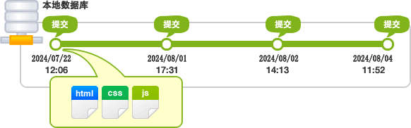
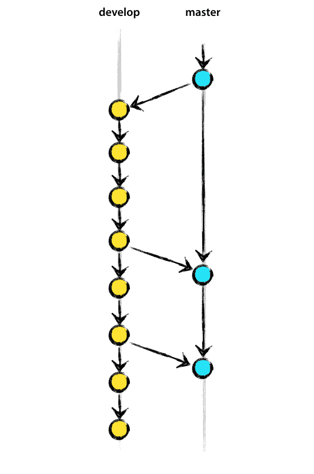
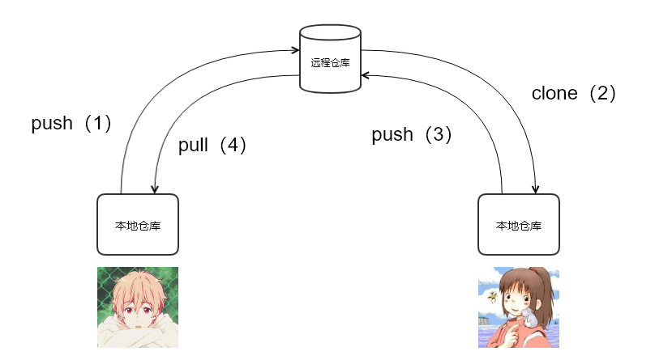
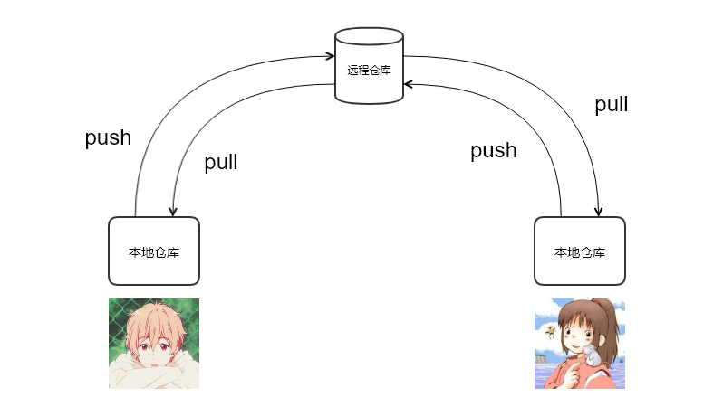
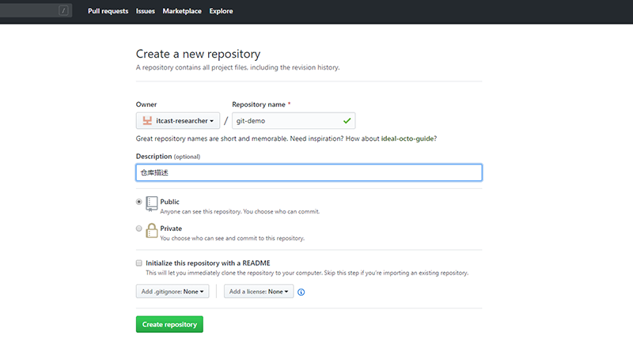
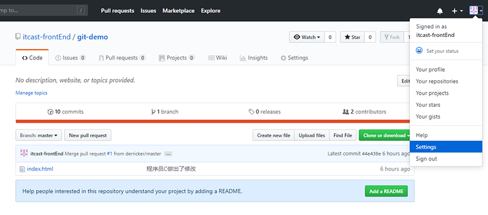

## 1. Git基础

### 1.1 版本管理

#### 1.1.1 什么是版本管理

版本管理是一种记录文件变化的方式，以便将来查阅特定版本的文件内容。


#### 1.1.2 人为维护文档版本的问题

1. 文档数量多且命名不清晰导致文档版本混乱

2. 每次编辑文档需要复制，不方便

3. 多人同时编辑同一个文档，容易产生覆盖


### 1.2 Git 是什么

Git是一个版本管理控制系统（缩写VCS），它可以在任何时间点，将文档的状态作为更新记录保存起来，也可以在任何时间点，将更新记录恢复回来。


### 1.3 Git 安装

[下载地址](https://git-scm.com/downloads) 

在安装的过程中，所有选项使用默认值即可。


### 1.4 Git 基本工作流程

| git仓库          | 暂存区             | 工作目录            |
| ---------------- | ------------------ | ------------------- |
| 用于存放提交记录 | 临时存放被修改文件 | 被Git管理的项目目录 |


### 1.5 Git 的使用

#### 1.5.1 Git 使用前配置

在使用 git 前，需要告诉 git 你是谁，在向 git 仓库中提交时需要用到。

1. 配置提交人姓名：`git config --global user.name 提交人姓名`
2. 配置提交人姓名：`git config --global user.email 提交人邮箱` 
3. 查看git配置信息：`git config --list`   

**注意**

1. 如果要对配置信息进行修改，重复上述命令即可。

2. 配置只需要执行一次。

#### 1.5.2 提交步骤

1. `git init` 初始化git仓库
2. `git status` 查看文件状态
3. `git add 文件列表` 追踪文件
4. `git commit -m 提交说明`  向仓库中提交代码
5. `git log` 查看提交记录

#### 1.5.3 撤销

- 用暂存区中的文件覆盖工作目录中的文件： `git checkout 文件`

- 将文件从暂存区中删除： `git rm --cached 文件`
- 将 git 仓库中指定的更新记录恢复出来，并且覆盖暂存区和工作目录：`git rest --hard commitID` 


## 2. Git进阶

### 2.1 分支

为了便于理解，大家暂时可以认为分支就是当前工作目录中代码的一份副本。

使用分支，可以让我们从开发主线上分离出来，以免影响开发主线。


#### 2.1.1 分支细分

1. 主分支（master）：第一次向 git 仓库中提交更新记录时自动产生的一个分支。

   

   

   

2. 、开发分支（develop）：作为开发的分支，基于 master 分支创建。

   

   

3. 功能分支（feature）：作为开发具体功能的分支，基于开发分支创建

   

   

**功能分支 -> 开发分支 -> 主分支**

#### 2.1.2 分支命令

- `git branch` 查看分支
- `git branch 分支名称` 创建分支
- `git checkout 分支名称` 切换分支
- `git merge A`分支 合并分支   （A分支合并到当前处于的分支）
- `git branch -d 分支名称` 删除分支（分支被合并后才允许删除）（-D 强制删除）
- `git branch -D` 分支名称   如果分支没有合并到主分支    还想删除   需要使用D进行删除


### 2.2 暂时保存更改

在git中，可以暂时提取分支上所有的改动并存储，让开发人员得到一个干净的工作副本，临时转向其他工作。

使用场景：分支临时切换

- 存储临时改动：`git stash`
- 恢复改动：`git stash pop`

## 3. Github

在版本控制系统中，大约90%的操作都是在本地仓库中进行的：暂存，提交，查看状态或者历史记录等等。除此之外，如果仅仅只有你一个人在这个项目里工作，你永远没有机会需要设置一个远程仓库。

只有当你需要和你的开发团队共享数据时，设置一个远程仓库才有意义。你可以把它想象成一个 “文件管理服务器”，利用这个服务器可以与开发团队的其他成员进行数据交换。

### 3.1 注册

1. 访问[github](https://github.com/)首页，点击 Sign up 连接。（注册）

   

2. 填写用户名、邮箱地址、GitHub登陆密码

   

3. 选择计划

   

4. 填写 GitHub 问题

   

5. 验证邮箱

   

6. GitHub 个人中心

   


### 3.2 多人协作开发流程

- A在自己的计算机中创建本地仓库
- A在github中创建远程仓库
- A将本地仓库推送到远程仓库
- B克隆远程仓库到本地进行开发
- B将本地仓库中开发的内容推送到远程仓库
- A将远程仓库中的最新内容拉去到本地






### 3.3 创建仓库

1. 填写仓库基本信息

   

2. 将本地仓库推送到远程仓库

   

   1. git push 远程仓库地址 分支名称

   2. git push 远程仓库地址别名 分支名称

   3. git push -u 远程仓库地址别名 分支名称

       -u 记住推送地址及分支，下次推送只需要输入git push即可

   4. git push -u origin login     表示将本地分支推送到gitHub中login（gitHub仓库中不存在login分支）分支中
   
   5. git remote add 远程仓库地址别名 远程仓库地址         //为远端仓库地址起一个别名
   
   6. git 变更远程仓库及在本地的别名
   
       方法一：删除后重新添加
   
       ```
       git remote rm origin // origin为远程仓库在本地的别名，下同
       git remote add origin <url>
       ```
   
       方法二：直接修改
   
       ```
       git remote origin set-url <url>
       ```

### 3.4 拉取操作

#### 3.4.1 克隆仓库

克隆远端数据仓库到本地：`git clone 仓库地址`

#### 3.4.2 拉取远程仓库中最新的版本

拉取远程仓库中最新的版本：`git pull 远程仓库地址 分支名称`

### pull和clone的区别：

clone是本地没有仓库，克隆服务器上仓库到本地，pull是本地已经有仓库了，拉取服务器上最新版本到本地主机上。如果服务器上的版本高于本地仓库的版本，此时本地仓库是不能向远程仓库中进行提交的，本地仓库必须先拉取服务器中的内容到本地仓库，然后在向远程仓库进行提交。

### 3.5 解决冲突

在多人同时开发一个项目时，如果两个人修改了同一个文件的同一个地方，就会发生冲突。冲突需要人为解决。

1. 发生冲突的一方使用pull拉取最新版本到本地。

2. ```
   <<<<<<< HEAD
   程序员A第一次，提交测试冲突，我是程序员B做出修改第一次提交。
   =======
   程序员A第一次，提交测试冲突，测试冲突第二次提交
   >>>>>>> caaf803a25f9ef04ce49e038b014d24964e057fe
   
   //删除掉没有用的信息
   程序员A第一次，提交测试冲突，我是程序员B做出修改第一次提交。
   程序员A第一次，提交测试冲突，测试冲突第二次提交
   ```

3. 将修改好的文件保存至本地仓库中，然后提交至服务器仓库即可。

### 3.6 跨团队协作

1. 程序员 C fork仓库
2. 程序员 C 将仓库克隆在本地进行修改
3. 程序员 C 将仓库推送到远程
4. 程序员 C 发起pull reqest
5. 原仓库作者审核
6. 原仓库作者合并代码
7. 在切换账号时，需要删除本地存储的账号密码，在控制面板中的凭据管理中找到github账号进行删除

### 3.7 ssh免登陆

https协议仓库地址：https://github.com/itcast-frontEnd/git-demo.git


生成秘钥：`ssh-keygen`

秘钥存储目录：C:\Users\用户\\.ssh

公钥名称：id_rsa.pub

私钥名称：id_rsa




### 3.8 GIT忽略清单

将不需要被git管理的文件名字添加到此文件中，在执行git命令的时候，git就会忽略这些文件。

git忽略清单文件名称：**.gitignore**

在.gitignore文件中添加不需要提交git仓库的的文件夹或者文件的名称。

将工作目录中的文件全部添加到暂存区：`git add .` 或者 `git add 文件1 文件2 文件3`

### 3.9 添加仓库说明文件

只需要创建一个readme.md文件，然后在提交至服务器仓库即可。


