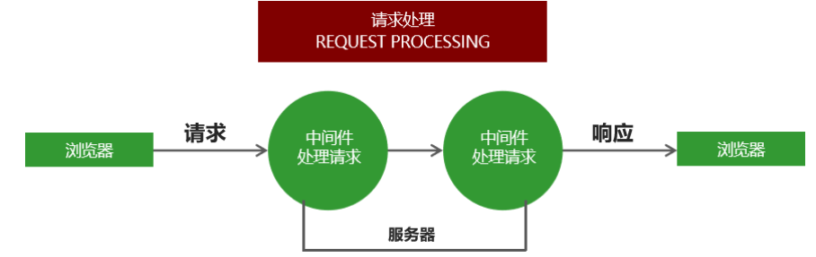

# 一、Express框架简介及初体验

## 1.1 Express框架是什么 

Express是一个基于Node平台的web应用开发框架，它提供了一系列的强大特性，帮助你创建各种Web应用。我们可以使用 npm install express 命令进行下载。

## 1.2 Express框架特性 

- 提供了方便简洁的路由定义方式
- 对获取HTTP请求参数进行了简化处理
- 对模板引擎支持程度高，方便渲染动态HTML页面
- 提供了中间件机制有效控制HTTP请求
- 拥有大量第三方中间件对功能进行扩展

## 1.3 原生Node.js与Express框架对比之路由

```
 app.on('request', (req, res) => {
     // 获取客户端的请求路径
     let { pathname } = url.parse(req.url);
     // 对请求路径进行判断 不同的路径地址响应不同的内容
     if (pathname == '/' || pathname == 'index') {
        res.end('欢迎来到首页');
     } else if (pathname == '/list') {
        res.end('欢迎来到列表页页');
     } else if (pathname == '/about') {
        res.end('欢迎来到关于我们页面')
     } else {
        res.end('抱歉, 您访问的页面出游了');
     }
 });

```


```
 // 当客户端以get方式访问/时
 app.get('/', (req, res) => {
     // 对客户端做出响应
     res.send('Hello Express');
 });

 // 当客户端以post方式访问/add路由时
 app.post('/add', (req, res) => {
    res.send('使用post方式请求了/add路由');
 });

```

## 1.4 原生Node.js与Express框架对比之获取请求参数

```
 app.on('request', (req, res) => {
    // 获取GET参数
    let {query} = url.parse(req.url, true);
    // 获取POST参数
    let postData = '';
    req.on('data', (chunk) => {
        postData += chunk;
    });
    req.on('end', () => {
        console.log(querystring.parse(postData)
    })); 
 });

```


```
 app.get('/', (req, res) => {
    // 获取GET参数
    console.log(req.query);
 });

 app.post('/', (req, res) => {
    // 获取POST参数
    console.log(req.body);
 }) 

```

## 1.5 Express初体验

使用Express框架创建web服务器及其简单，调用express模块返回的函数即可。

```
// 引入express框架
const express = require('express');
// 创建网站服务器
const app = express();

app.get('/' , (req, res) => {
	// send()
	// 1. send方法内部会检测响应内容的类型
	// 2. send方法会自动设置http状态码
	// 3. send方法会帮我们自动设置响应的内容类型及编码
	res.send('Hello. Express');
})

app.get('/list', (req, res) => {
	res.send({name: '张三', age: 20})
})

// 监听端口
app.listen(3000);
console.log('网站服务器启动成功');

```


#  二、Express中间件

## 2.1 什么是中间件

中间件就是一堆方法，可以接收客户端发来的请求、可以对请求做出响应，也可以将请求继续交给下一个中间件继续处理。



中间件主要由两部分构成，中间件方法以及请求处理函数。
中间件方法由Express提供，负责拦截请求，请求处理函数由开发人员提供，负责处理请求。

例如：路由管理就是一个中间件

```
 app.get('请求路径', '处理函数')   // 接收并处理get请求
 app.post('请求路径', '处理函数')  // 接收并处理post请求

```

可以针对同一个请求设置多个中间件，对同一个请求进行多次处理。
默认情况下，请求从上到下依次匹配中间件，一旦匹配成功，终止匹配。
可以调用next方法将请求的控制权交给下一个中间件，直到遇到结束请求的中间件。

```
 // 默认情况下  中间件执行结束  终止匹配  可以使用next方法  匹配下一个get方法
 app.get('/request', (req, res, next) => {
     req.name = "张三";
     next();
 });
 app.get('/request', (req, res) => {
     res.send(req.name);
 });

```

## 2.2 app.use中间件用法（不区分get或者post请求方式）

app.use 匹配所有的请求方式，可以直接传入请求处理函数，代表接收所有的请求。

```
// 只要用户发送请求  全部接受
app.use((req, res, next) => {
     console.log(req.url);
     next();
 });

```


app.use 第一个参数也可以传入请求地址，代表不论什么请求方式，只要是这个请求地址就接收这个请求。


```
 app.use('/admin', (req, res, next) => {
     console.log(req.url);
     next();
 });

```

## 2.3 中间件应用

1. 路由保护，客户端在访问需要登录的页面时，可以先使用中间件判断用户登录状态，用户如果未登录，则拦截请求，直接响应，禁止用户进入需要登录的页面。
2. 网站维护公告，在所有路由的最上面定义接收所有请求的中间件，直接为客户端做出响应，网站正在维护中。
3. 自定义404页面

```
// 引入express框架
const express = require('express');
// 创建网站服务器
const app = express();

// 网站公告
// app.use((req, res, next) => {
// 	res.send('当前网站正在维护...')
// })

app.use('/admin', (req, res, next) => {
	// 用户没有登录
	let isLogin = true;
	// 如果用户登录
	if (isLogin) {
		// 让请求继续向下执行
		next()
	}else {
		// 如果用户没有登录 直接对客户端做出响应
		res.send('您还没有登录 不能访问/admin这个页面')
	}
})

app.get('/admin', (req, res) => {
	res.send('您已经登录 可以访问当前页面')
})

app.use((req, res, next) => {
	// 为客户端响应404状态码以及提示信息
	res.status(404).send('当前访问的页面是不存在的')
})

// 监听端口
app.listen(3000);
console.log('网站服务器启动成功');
```


## 2.4 错误处理中间件

在程序执行的过程中，不可避免的会出现一些无法预料的错误，比如文件读取失败，数据库连接失败。
错误处理中间件是一个集中处理错误的地方。

```
//err 错误对象  req 请求对象  res  响应对象  next方法
// 错误处理中间件只能捕获同步错误
app.use((err, req, res, next) => {
 	 // 可以链式调用  status设置状态码
     res.status(500).send('服务器发生未知错误');
 })

```


当程序出现错误时，调用next()方法，并且将错误信息通过参数的形式传递给next()方法，即可触发错误处理中间件。

```
//如果想要捕获异步错误信息   需要调用next方法
app.get("/", (req, res, next) => {
     fs.readFile("/file-does-not-exist", (err, data) => {
         if (err) {
            next(err);
         }
     });
});

```

## 2.5 捕获错误

在node.js中，异步API的错误信息都是通过回调函数获取的，支持Promise对象的异步API发生错误可以通过catch方法捕获。
异步函数执行如果发生错误要如何捕获错误呢？

try catch 可以捕获异步函数以及其他同步代码在执行过程中发生的错误，但是不能其他类型的API发生的错误。

```
 // 程序如果出错  触发next方法   抛出错误将错误信息交给错误处理中间件
 // 这样如果出错  不会因为错误造成程序运行异常  增加了程序的健壮性
 app.get("/", async (req, res, next) => {
     try {
         await User.find({name: '张三'})
     }catch(ex) {
         next(ex);
     }
 });

```


#  三、Express框架请求处理

## 2.1 构建模块化路由

 构建模块化路由基础代码

```
// 导入express模块
const express = require('express') 
 // 创建路由对象
 const home = express.Router();
 // 将路由和请求路径进行匹配
 app.use('/home', home);
  // 在home路由下继续创建路由
 home.get('/index', () => {
          // 浏览器地址栏中填写 /home/index  可以访问/home/index界面
         res.send('欢迎来到博客展示页面');
 });
```


## 2.2建立模块化路由

```
 // home.js
 const home = express.Router(); 
 home.get('/index', () => {
     res.send('欢迎来到博客展示页面');
 });
 将home作为模块成员进行导出
 module.exports = home;

```


```
 // admin.js
 const admin = express.Router();
 admin.get('/index', () => {
     res.send('欢迎来到博客管理页面');
 });
 module.exports = admin;

```


```
 // app.js
 //将home.js模块和admin.js都引入app.js
 返回值是路由对象
 const home = require('./route/home.js');
 const admin = require('./route/admin.js');
 app.use('/home', home);
 app.use('/admin', admin);

```


## 2.3 GET参数的获取

Express框架中使用req.query即可获取GET参数，框架内部会将GET参数转换为对象并返回。

```
 // 接收地址栏中问号后面的参数
 // 例如: http://localhost:3000/?name=zhangsan&age=30
 app.get('/', (req, res) => {
 	// 使用req.query方法   返回get请求的参数
    console.log(req.query); // {"name": "zhangsan", "age": "30"}
 });

```


## 2.4 POST参数的获取

Express中接收post请求参数需要借助第三方包 body-parser。

Express框架为了精巧，将一些方法封装了框架，如果需要使用，只需要去引入对应的模块即可。

```
// 1.首先在npm命令行工具中使用npm install body-parser

// 引入body-parser模块
 const bodyParser = require('body-parser');
 // 配置body-parser模块
 // 使用app.use中间件拦截所有请求
 // 调用bodyParser.urlencoded方法对请求进行处理
 // 方法内部会检测请求中是否包含了请求参数  如果包含  会接收请求参数
 // 并且将参数转换为对象类型  然后为req对象添加一个body属性  并且将值赋值给了req.body属性
 // 然后调用next方法  将请求控制权交给下一个中间件
 // 后面中间件就可以使用req.body拿到这个请求参数
 // 当extended参数值为false时  在方法的内部会使用querystring这个系统模块对参数的格式进行处理
 // 当extended参数值为true时  在方法的内部使用一个叫做qs的第三方模块对请求参数进行处理
 // qs模块也能将参数格式进行处理
 app.use(bodyParser.urlencoded({ extended: false }));
 // 接收请求
 app.post('/add', (req, res) => {
    // 接收请求参数
    console.log(req.body);
 }) 

```


```javascript

```

新版本中body-parser以弃用  **不需要安装和引入body-parser了，要记得一定在引入路由之前配置**

```
//原来的用法
var express = require('express')
var bodyParser = require('body-parser')
 
var app = express()
 
// parse application/x-www-form-urlencoded
app.use(bodyParser.urlencoded({ extended: false }))
 
// parse application/json
app.use(bodyParser.json())
 
app.use(function (req, res) {
  res.setHeader('Content-Type', 'text/plain')
  res.write('you posted:\n')
  res.end(JSON.stringify(req.body, null, 2))
})

```

现已弃用，可以直接调用express

```

// parse application/x-www-form-urlencoded
app.use(express.urlencoded({ extended: false }))
 
// parse application/json
app.use(express.json())


app.use(router)

```


## 2.6 app.use中间件进一步讲解

在app.use方法中使用一个函数的调用

这样做的好处：这样调用fn的同时，可以向fn内部传递一些额外的参数，在请求处理函数的内部可以根据这个参数改变请求处理函数的行为。

```
// 引入express框架
const express = require('express');
const bodyParser = require('body-parser');
// 创建网站服务器
const app = express();

// 这样做的好处：这样调用fn的同时 可以向fn内部传递一些额外的参数 
// 在请求处理函数的内部可以根据这个参数改变请求处理函数的行为
app.use(fn ({a: 2}))

function fn (obj) {
	return function (req, res, next) {
		if (obj.a == 1) {
			console.log(req.url)
		}else {
			console.log(req.method)
		}
		next()
	}
}

app.get('/', (req, res) => {
	// 接收post请求参数
	res.send('ok')
})

// 端口监听
app.listen(3000);
```


## 2.7 Express路由参数

```
 // 在定义路由时，可以显示的定义传递哪些参数
 // 在请求地址的后面，以冒号的形式进行分隔
 app.get('/find/:id/:name/:sex', (req, res) => { 
 	// 使用req.params属性得到请求参数  params属性的值是一个对象  对象中存储的就是路由参数
     console.log(req.params); // {id: 123} 
 });

```


```
// 在浏览器中请求参数不用以?id=12等等形式进行分隔了  请求参数直接写在请求地址的后面
localhost:3000/find/123/zhangsan/nan

```

## 2.8 静态资源的处理

通过Express内置的express.static可以方便地托管静态文件，例如img、CSS、JavaScript 文件等。


```
//使用app.use中间件拦截所有请求 然后将请求交给express.static这个方法 
//并且将静态资源的目录交给这个方法  在该方法内部  会判断发来的请求是否是 静态资源请求
//如果是静态资源请求  直接将对应的静态资源相应给请求  
//如果不是静态资源请求   方法内部会调用next方法  转交控制权  交给下一个中间件
app.use(express.static('public')); // 这个路径最好使用绝对路径

// 还可以添加一个虚拟路径   每次访问使用/static/对应的文件目录即可
app.use('/static',express.static('public')); // 这个路径最好使用绝对路径

```

现在，public 目录下面的文件就可以访问了。

- http://localhost:3000/images/kitten.jpg
- http://localhost:3000/css/style.css
- http://localhost:3000/js/app.js
- http://localhost:3000/images/bg.png
- http://localhost:3000/hello.html 

#  四、express-art-template模板引擎

## 模板引擎

express框架支持多种模板引擎

- 为了使art-template模板引擎能够更好的和Express框架配合，模板引擎官方在原art-template模板引擎的基础上封装了express-art-template。

  

- 使用的时候需要写在两个模块，使用npm install art-template express-art-template命令进行安装。

  下载多个模块时，只需要使用空格隔开即可。

```
  // 当渲染后缀为art的模板时 使用express-art-template
  // 当前代码的意思是告诉express框架我们使用的是什么模板引擎
  // 第一个参数是模板的后缀  第二个参数是要使用的模板引擎  
  // 使用express-art-template模板引擎渲染后缀为.art的模板文件
 app.engine('art', require('express-art-template'));
  // 设置模板文件存放目录。
  // 下面这行代码的意思是 当前配置项的名字是views 第二个参数是模板的位置信息  填写绝对路径
 app.set('views', path.join(__dirname, 'views'));
  // 设置模板的默认后缀
  // 渲染模板时不写后缀 默认拼接art后缀  
  // 第一个参数表示 当前配置项的名称是view engine 第二个参数是后缀的名字
 app.set('view engine', 'art');
 app.get('/', (req, res) => {
     // 渲染模板
     // 由于上方已经配置了相应的配置项，所以只需要传递模板名称即可
     // 内部会帮助我们拼接模板所在的位置，会帮助我们拼接模板的后缀
     // 会帮助art-template哪一个模板和哪一个数据进行拼接
     // 最后会将拼接好的结果相应给客户端
     res.render('index',向模板传递的数据);
 }); 

```


```
const express = require('express');
const path = require('path');
const app = express();

// 1.告诉express框架使用什么模板引擎渲染什么后缀的模板文件
//  第一个参数：模板后缀
//  第二个参数：使用的模板引擎
app.engine('art', require('express-art-template'))
// 2.告诉express框架模板存放的位置是什么
// 这里的路径一样，推荐使用绝对路径
app.set('views', path.join(__dirname, 'views'))
// 3.告诉express框架模板的默认后缀是什么
app.set('view engine', 'art');

app.get('/index', (req, res) => {
	// 1. 拼接模板路径
	// 2. 拼接模板后缀
	// 3. 哪一个模板和哪一个数据进行拼接
	// 4. 将拼接结果响应给了客户端
	res.render('index', {
		msg: 'message'
	})
});

app.get('/list', (req, res) => {
	res.render('list', {
		msg: 'list page'
	})
})


// 端口监听
app.listen(3000);
```


## app.locals 对象（使用场景：当多个模板都需要查询相同数据使用下面的方法）

将变量设置到app.locals对象下面，这个数据在所有的模板中都可以获取到。

 

```
app.locals.users = [{
     name: '张三',
     age: 20
 },{
     name: '李四',
     age: 20
}]
```


```
const express = require('express');
const path = require('path');
const app = express();
// 模板配置
app.engine('art', require('express-art-template'))
app.set('views', path.join(__dirname, 'views'))
app.set('view engine', 'art');

app.locals.users = [{
	name: 'zhangsan',
	age: 20
},{
	name: '李四',
	age: 30
}]

app.get('/index', (req, res) => {
	res.render('index', {
		msg: '首页'
	})
});

app.get('/list', (req, res) => {
	res.render('list', {
		msg: '列表页'
	});
})


// 端口监听
app.listen(3000);
```


