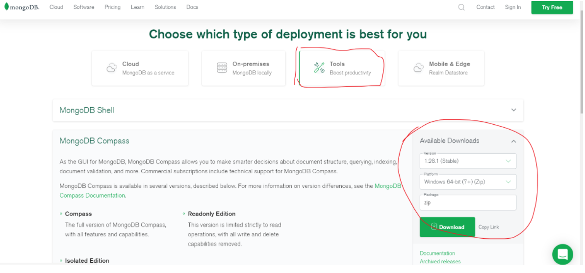

# 一.数据库概述及环境搭建

## 1.1 MongoDB数据库下载安装

下载地址：https://www.mongodb.com/download-center/community

## 1.2下载MongoDB可视化软件

MongoDB可视化操作软件，是使用图形界面操作数据库的一种方式。

在tool工具中下载



## 1.3 数据库相关概念

在一个数据库软件中可以包含多个数据仓库，在每个数据仓库中可以包含多个数据集合，每个数据集合中可以包含多条文档（具体的数据）。

| **术语**   | **解释说明**                                             |
| ---------- | -------------------------------------------------------- |
| database   | 数据库，mongoDB数据库软件中可以建立多个数据库            |
| collection | 集合，一组数据的集合，可以理解为JavaScript中的数组       |
| document   | 文档，一条具体的数据，可以理解为JavaScript中的对象       |
| field      | 字段，文档中的属性名称，可以理解为JavaScript中的对象属性 |

## 1.4 Mongoose第三方包

- 使用Node.js操作MongoDB数据库需要依赖Node.js第三方包mongoose
- 使用npm install mongoose命令下载

## 1.5启动MongoDB

net stop mongodb     停止mongodb服务

在命令行工具中运行net start mongoDB即可启动MongoDB，否则MongoDB将无法连接。

## 1.6数据库连接

使用mongoose提供的connect方法即可连接数据库。

```
 //mongoose里面有一个connect方法  使用来创建数据库连接的
 //里面的参数是数据库的地址和数据库的名字  如果没有这个数据库  mongodb会帮我们创建这个数据库
 //connect方法返回的是一个promise对象
 //所以可以在后面跟.then和.catch方法
 mongoose.connect('mongodb://localhost/databaseName')
     .then(() => console.log('数据库连接成功'))
     .catch(err => console.log('数据库连接失败', err));

```

## 1.7创建数据库

在MongoDB中不需要显式创建数据库，如果正在使用的数据库不存在，MongoDB会自动创建。

# 二、MongoDB增删改查操作

## 2.1 创建集合

创建集合分为两步，一是对对集合设定规则，二是创建集合，创建mongoose.Schema构造函数的实例即可创建集合。

```
  // 设定集合规则
 const courseSchema = new mongoose.Schema({
     name: String,
     author: String,
     isPublished: Boolean
 });
  // 创建集合并应用规则
 const Course = mongoose.model('Course', courseSchema); // courses

```

虽然这里创建了应用规则  但是并没有创建数据库  需要往里面添加数据

## 2.2 创建文档

创建文档实际上就是向集合中插入数据。
分为两步：
创建集合实例。
调用实例对象下的save方法将数据保存到数据库中。

```
  // 创建集合实例
 const course = new Course({
     name: 'Node.js course',
     author: '黑马讲师',
     tags: ['node', 'backend'],
     isPublished: true
 });
  // 将数据保存到数据库中
 course.save();

```

```
 // 引入mongoose第三方模块 用来操作数据库
const mongoose = require('mongoose');
// 数据库连接
mongoose.connect('mongodb://localhost/playground', { useNewUrlParser: true})
	// 连接成功
	.then(() => console.log('数据库连接成功'))
	// 连接失败
	.catch(err => console.log(err, '数据库连接失败'));

// 创建集合规则
const courseSchema = new mongoose.Schema({
	name: String,
	author: String,
	isPublished: Boolean
});

// 使用规则创建集合
// 1.集合名称
// 2.集合规则
// 3.model方法返回一个构造函数  使用Course来接受这个构造函数
const Course = mongoose.model('Course', courseSchema) // courses

// 创建文档
// 实例化Course
const course = new Course({
	name: 'node.js基础',s
	author: '黑马讲师',
	isPublished: true
});

// 保存文档
// 将文档插入到数据库中
course.save();
```

## 2.3 创建文档的另一种方式

有两种接受异步API的方式

```
// 第一种是通过回调函数的方式
Course.create({name: 'JavaScript基础', author: '黑马讲师', isPublish: true}, (err, doc) => { 
     //  错误对象
    console.log(err)
     //  当前插入的文档
    console.log(doc)
});

```

```
//第二种是通过promise对象方式
Course.create({name: 'JavaScript基础', author: '黑马讲师', isPublish: true})
      .then(doc => console.log(doc))
      .catch(err => console.log(err))

```

## 2.4向mongoDB数据库导入数据

第一步

找到mongodb数据库的安装目录，将安装目录下的bin目录放置在环境变量中。

第二步

mongoimport –d 数据库名称 –c 集合名称 --file 要导入的数据文件（注意file前面是两个短横线）

## 2.5 查询文档

### 1. 查询所有文档

```
//  根据条件查找文档（条件为空则查找所有文档）
//  course构造函数find方法就是用来查询文档的
//  find方法返回promise对象  所以在方法后面可以通过链式调用的方式  
//  通过调用then方法来获取查询结果
Course.find().then(result => console.log(result))

```

```
//  查询结果result实际上是一个数组   里面是一个个的对象

//  find方法返回的是文档集合
[{
    _id: 5c0917ed37ec9b03c07cf95f,
    name: 'node.js基础',
    author: '黑马讲师‘
},{
     _id: 5c09dea28acfb814980ff827,
     name: 'Javascript',
     author: '黑马讲师‘
}]

```

### 2. 根据条件查询文档

```
// 通过_id字段查找文档
// find方法查询结果不管有多少数据  都是一个数组
// User.find({_id: '5c09f267aeb04b22f8460968'}).then(result => console.log(result))
```


```
//  根据条件查找文档
//  findOne方法可以传递一个json对象作为查找条件
//  findOne方法返回的是一个对象  不是一个数组   默认返回的是第一个文档
Course.findOne({name: 'node.js基础'}).then(result => console.log(result))
```


```
// 返回文档
 {
    _id: 5c0917ed37ec9b03c07cf95f,
    name: 'node.js基础',
    author: '黑马讲师‘
}

```


```
//  匹配大于 小于
//  这句代码的意思是  返回一个age大于不等于20   小于不等于 50 的文档
User.find({age: {$gt: 20, $lt: 50}}).then(result => console.log(result))

```


```
 //  匹配包含
 //  查询用户集合中hobbies中包含'敲代码' 的文档
 User.find({hobbies: {$in: ['敲代码']}}).then(result => console.log(result))

```


```
//  选择要查询的字段   
User.find().select('name email').then(result => console.log(result))

//  默认情况下会显示id字段   如果不想输出   可以在该字段前面添加-    -id
//  该代码的意思是    查询name   email   不包含_id字段的  字段
User.find().select('name email -_id').then(result => console.log(result))
```


```
 // 将数据按照年龄进行升序排序
 User.find().sort('age').then(result => console.log(result))
 
 // 将数据按照年龄进行降序排列
 User.find().sort('-age').then(result => console.log(result))

```


```
 //  skip 跳过多少条数据  limit 限制查询数量
 //  这行代码的意思是   跳过前两个文档    只显示两个文档
 //  一般在分页的情况使用
 User.find().skip(2).limit(2).then(result => console.log(result))

```

## 2.6删除文档


```
 // 删除单个
 // 如果查询条件包含多个文档  会将第一个文档进行删除
 // 同样返回的promise对象  所以可以使用then方法拿到结果   
 // 返回的是删除的文档
Course.findOneAndDelete({查询条件}).then(result => console.log(result))

// 下面这行代码的意思是  查询_id = 5c09f267aeb04b22f8460968  并且删除
// 返回删除的文档
User.findOneAndDelete({_id: '5c09f267aeb04b22f8460968'}).then(result => 
```


```
 // 删除多个
 // 返回结果是一个对象   有两个参数 n 表示删除文档的个数  ok  如果是1表示删除成功
User.deleteMany({查询条件}).then(result => console.log(result))

```


## 2.7 更新文档


```
// 更新单个
// 返回结果是一个对象  对象包含  是否更新成功的信息
User.updateOne({查询条件}, {要修改的值}).then(result => console.log(result))

// 将查询到name等于李四的文档   然后将age改成120  name改成 李狗蛋
User.updateOne({name: '李四'}, {age: 120, name: '李狗蛋'}).then(result => console.log(result))
```


```
// 更新多个
User.updateMany({查询条件}, {要更改的值}).then(result => console.log(result))

将所有文档的age更新成300
User.updateMany({}, {age: 300}).then(result => console.log(result))
```

## 2.8 mongoose验证

在创建集合规则时，可以设置当前字段的验证规则，验证失败就则输入插入失败。

1. required: true 必传字段

下面这两个方法主要针对字符串

1. minlength：3 字符串最小长度
2. maxlength: 20 字符串最大长度

下面这个两个方法主要针对数值

1. min: 2 数值最小为2
2. max: 100 数值最大为100
3. enum: ['html', 'css', 'javascript', 'node.js']
4. trim: true 去除字符串两边的空格
5. validate: 自定义验证器
6. default: 默认值

获取错误信息：error.errors['字段名称'].message


```
const postSchema = new mongoose.Schema({
	title: {
		type: String,
		// 必选字段  '请传入文章标题'表示出错提示
		required: [true, '请传入文章标题'],
		// 字符串的最小长度
		minlength: [2, '文章长度不能小于2'],
		// 字符串的最大长度
		maxlength: [5, '文章长度最大不能超过5'],
		// 去除字符串两边的空格
		trim: true
	},
	age: {
		type: Number,
		// 数字的最小范围
		min: 18,
		// 数字的最大范围
		max: 100
	},
	publishDate: {
		type: Date,
		// 默认值  获取当前时间
		default: Date.now
	},
	category: {
		type: String,
		// 枚举 列举出当前字段可以拥有的值
		enum: {
			values: ['html', 'css', 'javascript', 'node.js'],
			message: '分类名称要在一定的范围内才可以'
		}
	},
	author: {
		type: String,
		//自定义验证器
		validate: {
			validator: v => {
				// 返回布尔值
				// true 验证成功
				// false 验证失败
				// v 要验证的值
				return v && v.length > 4
			},
			// 自定义错误信息
			message: '传入的值不符合验证规则'
		}
	}
});
```

如何获取错误信息

```
const Post = mongoose.model('Post', postSchema);

Post.create({title:'aa', age: 60, category: 'java', author: 'bd'})
	.then(result => console.log(result))
	.catch(error => {
		// 获取错误信息对象
		const err = error.errors;
		// 循环错误信息对象
		for (var attr in err) {
			// 将错误信息打印到控制台中
			console.log(err[attr]['message']);
		}
	})
```

## 2.9集合关联

通常不同集合的数据之间是有关系的，例如文章信息和用户信息存储在不同集合中，但文章是某个用户发表的，要查询文章的所有信息包括发表用户，就需要用到集合关联。

- 使用id对集合进行关联
- 使用populate方法进行关联集合查询

### 1. 集合关联实现

```
// 用户集合
const User = mongoose.model('User', new mongoose.Schema({ name: { type: String } })); 
// 文章集合
const Post = mongoose.model('Post', new mongoose.Schema({
    title: { type: String },
    // 使用ID将文章集合和作者集合进行关联
    // mongoose.Schema.Types.ObjectId  表示mongodb数据库里面默认_id值  
    // mongoose.Schema.Types.ObjectId  是一个默认写法
    // ref属性表示  要和哪个集合进行关联
    author: { type: mongoose.Schema.Types.ObjectId, ref: 'User' }
}));
//联合查询
//结果返回title 还有用户信息集合  
Post.find()
	  // populate方法表示  查找关联集合的信息
      .populate('author')
      .then((err, result) => console.log(result));

```


## 2.10案例：用户信息增删改查

1. 搭建网站服务器，实现客户端与服务器端的通信
2. 连接数据库，创建用户集合，向集合中插入文档
3. 当用户访问/list时，将所有用户信息查询出来
4. 将用户信息和表格HTML进行拼接并将拼接结果响应回客户端
5. 当用户访问/add时，呈现表单页面，并实现添加用户信息功能
6. 当用户访问/modify时，呈现修改页面，并实现修改用户信息功能
7. 当用户访问/delete时，实现用户删除功能

这里有一个项目案例   自行查找


# 三、注意事项

## lean属性的作用：

转换mongoose查询结果类型，从MongooseDocuments转换为JS Object，从而便于我们修改查询结果。

mongoose查询：

Model.findOne({});
Model.save();
以上2种查询返回的数据实际上是MongooseDocuments对象（mongoose自己封装的一个对象），并且这个对象会对数据进行实时查询以保证其符合预定义的model。所以添加其它model中没有的属性时是无法添加成功的。

要想添加成功有2种方法：

查询时添加lean，
Model.findOne({}).lean();
Model.findOne({lean:true},function(err,result){});
Model.findOne({}).lean().exec(function(err,result){});
将查询结果转为object，查询结果result.toObject();


