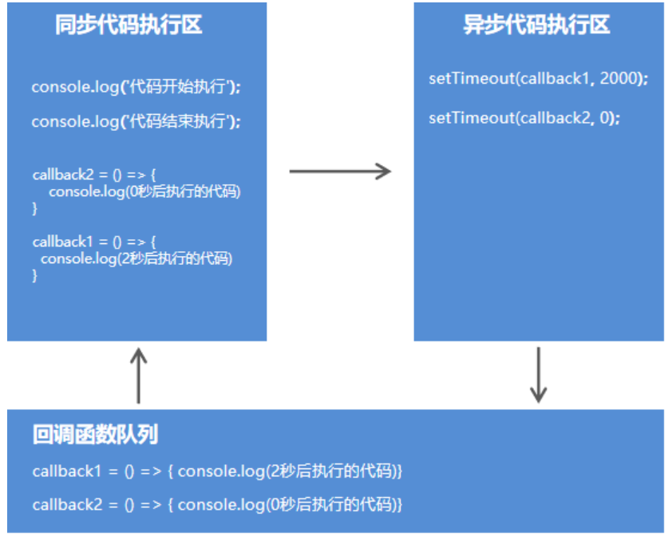

# 一、Node概述

## 1. node是什么

node是一个基于Chrome V8引擎的JavaScript代码运行环境。

**运行环境**

浏览器（软件）能够运行JavaScript代码，浏览器就是JavaScript代码的运行环境
Node（软件）能够运行JavaScript代码，Node就是JavaScript代码的运行环境

## 2. Node.js全局对象global

在浏览器中全局对象是window，在Node中全局对象是global。

Node中全局对象下有以下方法，可以在任何地方使用，global可以省略。

- console.log()     在控制台中输出
- setTimeout()     设置超时定时器
- clearTimeout()  清除超时时定时器
- setInterval()      设置间歇定时器
- clearInterval()   清除间歇定时器

## 3. Node.js模块化开发

### 2.1 JavaScript开发弊端

JavaScript在使用时存在两大问题，**文件依赖**和**命名冲突**。

### 2.2 软件中的模块化开发

一个功能就是一个模块，多个模块可以组成一个完整应用，抽离一个模块不会影响其他功能的运行。

### 2.3Node.js 中模块化开发规范

- Node.js规定一个JavaScript文件就是一个模块，模块**内部定义的变量和函数**默认情况下在外部无法得到
- 模块内部可以使用exports对象进行成员导出，使用require方法导入其他模块

### 2.4 模块成员导出

```say
//在模块内部定义变量
let version = 1.0;
//在模块内部定义方法
const sayHello = name => { console.log("hello")};
//向模块外部导出数据
exports.version = version;
exports.sayHello = sayHello;
```

### 2.5 模块成员导入

```
  // b.js
  // 在b.js模块中导入模块a
 let a = require('./b.js');
  // 输出b模块中的version变量
 console.log(a.version);
  // 调用b模块中的sayHi方法 并输出其返回值
 console.log(a.sayHi('黑马讲师')); 

```

### 2.6 模块成员导出的另一种方式

```
module.exports.version = version;
module.exports.sayHi = sayHi;

```

**exports是module.exports的别名(地址引用关系)，导出对象最终以module.exports为准**

### 2.7 模块导出的两种方式的练习和区别

默认情况下 exports和module.exports指向的是同一个对象。

如果给exports和module.exports分别指向不同的对象，require得到的对象是module.exports对象，所以以module.exports为准。

## 4. 怎样使用Node执行js文件

```
1.进入文件目录
2.node 文件名.js   执行文件
```


# 二、 系统模块

## 1. 什么是系统模块

Node运行环境提供的API. 因为这些API都是以模块化的方式进行开发的, 所以我们又称Node运行环境提供的API为系统模块

## 2. 系统模块fs 文件操作

f：file文件，s：system系统，文件操作系统

### 1. 读取文件操作

**第一步：导入文件操作模块fs**

```
const fs = require('fs');
```

**第二步：读取文件**

```
fs.readFile('文件路径/文件名称'[,'文件编码'], callback);

```

注意callback是一个回调函数，因为文件读写是硬盘在读写文件，读写文件操作是需要时间的，所以这里不用参数，而是使用一个回调函数。

### 2. 写入文件操作

**语法**

```

fs.writeFile('文件路径/文件名称', '数据', callback);

```

```
 const content = '<h3>正在使用fs.writeFile写入文件内容</h3>';
 fs.writeFile('../index.html', content, err => {
   if (err != null) { 
       console.log(err);
       return;
   }
   console.log('文件写入成功');
 });

```

### 3. 系统模块path路径操作

#### 1. 为什么需要路径拼接

- 因为不同的擦欧总系统的分隔符不一致
- windows上/ \都可以
- linux上是/

#### 2.路径拼接语法

```
path.join('路径', '路径', ...)

```

```
  // 导入path模块
 const path = require('path');
  // 路径拼接
 let finialPath = path.join('itcast', 'a', 'b', 'c.css');
  // 输出结果 itcast\a\b\c.css
 console.log(finialPath);

```

#### 3. 相对路径和绝对路径

- 大多数情况下使用绝对路径，因为相对路径有时候相对的是命令行工具的当前工作目录
- 在读取文件或者设置文件路径时都会选择绝对路径
- 使用__dirname（注意这里是两个下划线）获取当前文件所在的绝对路径

```
const fs = require('fs');
const path = require('path');

console.log(__dirname);
console.log(path.join(__dirname, '01.helloworld.js'))

fs.readFile(path.join(__dirname, '01.helloworld.js'), 'utf8', (err, doc) => {
	console.log(err)
	console.log(doc)
});
```

总结：

- 在文件读写中使用相对路径（是相对命令行工具的当前工作目录）
- 在require中使用相对路径（是相对当前文件的相对路径）
- 所以一般require中可以使用相对路径，而在读取文件操作中使用绝对路径

## 3. 第三方模块

### 1.什么是第三方模块

别人写好的、具有特定功能的、我们能直接使用的模块即第三方模块，由于第三方模块通常都是由多个文件组成并且被放置在一个文件夹中，所以又名包。

**第三方模块有两种存在形式：**

- 以js文件的形式存在，提供实现项目具体功能的API接口。
- 以命令行工具形式存在，辅助项目开发

### 2. 获取第三方模块

npm (node package manager) ： node的第三方模块管理工具

- 下载：npm install 模块名称 -s   或者  --save   //加s或者不加s都可以   加s语义更加明确
- 卸载：npm unintall package 模块名称

全局安装与本地安装

- 命令行工具：全局安装
- 库文件：本地安装

### 3.  第三方模块 nodemon

nodemon是一个命令行工具，用以辅助项目开发。
在Node.js中，每次修改文件都要在命令行工具中重新执行该文件，非常繁琐。

**使用步骤：**

- 使用npm install nodemon -g 下载它
- 在命令行工具中用nodemon命令替代node命令执行文件

### 4. 第三方模块 nrm（切换默认下载第三方模块地址）

nrm ( npm registry manager )：npm下载地址切换工具

npm默认的下载地址在国外，国内下载速度慢

**使用步骤**

- 使用npm install nrm –g 下载它
- 查询可用下载地址列表 nrm ls
- 切换npm下载地址 nrm use 下载地址名称

### 5. 第三方模块 Gulp（机械化操作编写任务）

基于node平台开发的前端构建工具
将机械化操作编写成任务, 想要执行机械化操作时执行一个命令行命令任务就能自动执行了
用机器代替手工，提高开发效率。

#### 1. Gulp可以做什么

- 项目上线，HTML、CSS、JS文件压缩合并
- 语法转换（es6、less ...）
- 公共文件抽离
- 修改文件浏览器自动刷新

#### 2.Gulp使用

- 使用npm install gulp下载gulp库文件
- 在项目根目录下建立gulpfile.js文件
- 重构项目的文件夹结构 src目录放置源代码文件 dist目录放置构建后文件
- 在gulpfile.js文件中编写任务.
- 在命令行工具中执行gulp任务

#### 3. Gulp中提供的方法

- gulp.src()：获取任务要处理的文件
- gulp.dest()：输出文件
- gulp.task()：建立gulp任务
- gulp.watch()：监控文件的变化

```
 const gulp = require('gulp');
  // 使用gulp.task()方法建立任务
 gulp.task('first', () => {
    // 获取要处理的文件
    gulp.src('./src/css/base.css') 
    // 将处理后的文件输出到dist目录
    .pipe(gulp.dest('./dist/css'));
 });

```

#### 4.9 Gulp插件

- gulp-htmlmin ：html文件压缩
- gulp-csso ：压缩css
- gulp-babel ：JavaScript语法转化
- gulp-less: less语法转化
- gulp-uglify ：压缩混淆JavaScript
- gulp-file-include 公共文件包含
- browsersync 浏览器实时同步

```
// 引用gulp模块
const gulp = require('gulp');
const htmlmin = require('gulp-htmlmin');
const fileinclude = require('gulp-file-include');
const less = require('gulp-less');
const csso = require('gulp-csso');
const babel = require('gulp-babel');
const uglify = require('gulp-uglify');
// 使用gulp.task建立任务
// 1.任务的名称
// 2.任务的回调函数
gulp.task('first', () => {
	console.log('我们人生中的第一个gulp任务执行了');
	// 1.使用gulp.src获取要处理的文件
	gulp.src('./src/css/base.css')
		.pipe(gulp.dest('dist/css'));
});

// html任务
// 1.html文件中代码的压缩操作
// 2.抽取html文件中的公共代码
gulp.task('htmlmin', () => {
	gulp.src('./src/*.html')
		.pipe(fileinclude())
		// 压缩html文件中的代码
		.pipe(htmlmin({ collapseWhitespace: true }))
		.pipe(gulp.dest('dist'));
});

// css任务
// 1.less语法转换
// 2.css代码压缩
gulp.task('cssmin', () => {
	// 选择css目录下的所有less文件以及css文件
	gulp.src(['./src/css/*.less', './src/css/*.css'])
		// 将less语法转换为css语法
		.pipe(less())
		// 将css代码进行压缩
		.pipe(csso())
		// 将处理的结果进行输出
		.pipe(gulp.dest('dist/css'))
});

// js任务
// 1.es6代码转换
// 2.代码压缩
gulp.task('jsmin', () => {
	gulp.src('./src/js/*.js')
		.pipe(babel({
			// 它可以判断当前代码的运行环境 将代码转换为当前运行环境所支持的代码
            presets: ['@babel/env']
        }))
        .pipe(uglify())
        .pipe(gulp.dest('dist/js'))
});

// 复制文件夹
gulp.task('copy', () => {

	gulp.src('./src/images/*')
		.pipe(gulp.dest('dist/images'));

	gulp.src('./src/lib/*')
		.pipe(gulp.dest('dist/lib'))
});

// 构建任务
// 构建一组任务   可以一次执行多个任务
gulp.task('default', ['htmlmin', 'cssmin', 'jsmin', 'copy']);
```

## 4. package.json文件

### 1. node_modules文件夹的问题

- 文件夹以及文件过多过碎，当我们将项目整体拷贝给别人的别人的时候，传输速度会很慢很慢。
- 复杂的模块依赖关系需要被记录，确保模块的版本和当前保持一致，否则当前项目运行报错

解决办法：

**生成package.json文件，就不用一次传输给别人大量的依赖文件夹，只用传输一个项目描述依赖，接收方执行这个依赖文件，就会在npm网站上自动下载对应的依赖**

 package.json文件的作用

项目描述文件，记录了当前项目信息，例如项目名称、版本、作者、github地址、当前项目依赖了哪些第三方模块等。
使用npm init -y命令生成。

```
生成package.json文件流程
1.创建description文件夹
2.使用npm工具进入description文件夹内
3.使用npm init -y命令生成

package.json文件内容
{
  "name": "description", //项目名称
  "version": "1.0.0",  //项目版本
  "description": "",  //项目描述
  "main": "index.js", //项目的主模块文件
  "scripts": {
    "test": "echo \"Error: no test specified\" && exit 1",  //命令的别名
    "build": "nodemon app.js"  //命令行的一个别名   nodemon app.js 的别名就是build  每次执行
    							//build就可以
  },
  "keywords": [], //关键字  描述项目
  "author": "",  //项目的作者
  "license": "ISC",  //项目遵循的协议
  //记录第三方模块的信息
  "dependencies": {
    "formidable": "^1.2.1",
    "mime": "^2.3.1"
  },
  
  "devDependencies": {
    "gulp": "^3.9.1"
  }
}

```

**接收方如何加载依赖**

```
在npm工具中输入
npm install    //下载所有依赖    默认会找devDependencies这个选项，根据这个依赖描述来下载第三方模块
```

### 2. 项目依赖

- 在项目的开发阶段和线上运营阶段，都需要依赖的第三方包，称为项目依赖
- 使用npm install 包名命令下载的文件会默认被添加到 package.json 文件的 dependencies 字段中
- 完整命令是npm install 包名 --save    简写是   npm install 包名 -S 或者npm install 包名 
- -S 是 --save的缩写

```
 {
    "dependencies": {
        "jquery": "^3.3.1“
    }
 } 

```

### 3.开发依赖

- 在项目的开发阶段需要依赖，线上运营阶段不需要依赖的第三方包，称为开发依赖

- 使用npm install 包名 --save-dev    或者   npm install 包名 -D命令将包添加到package.json文件的devDependencies字段中

  -D是--save-dev的缩写

```
 {
    "devDependencies": {
        "gulp": "^3.9.1“
    }
 } 

```

### 4. package-lock.json文件的作用

-  锁定包的版本，确保再次下载时不会因为包版本不同而产生问题

- 加快下载速度，因为该文件中已经记录了项目所依赖第三方包的树状结构和包的下载地址，重新安装时只需下

  载即可，不需要做额外的工作

## 5.Node.js中模块加载机制

### 5.1 模块查找规则-当模块拥有路径但没有后缀时

```
require('./find.js');
require('./find');

```

1. require方法根据模块路径查找模块，如果是完整路径，直接引入模块。
2. 如果模块后缀省略，先找同名JS文件再找同名JS文件夹
3. 如果找到了同名文件夹，找文件夹中的index.js
4. 如果文件夹中没有index.js就会去当前文件夹中的package.json文件中查找main选项中的入口文件
5. 如果找指定的入口文件不存在或者没有指定入口文件就会报错，模块没有被找到

### 5.2 模块查找规则-当模块没有路径且没有后缀时

```
require('find');

```

1. Node.js会假设它是系统模块
2. Node.js会去node_modules文件夹中
3. 首先看是否有该名字的JS文件
4. 再看是否有该名字的文件夹
5. 如果是文件夹看里面是否有index.js
6. 如果没有index.js查看该文件夹中的package.json中的main选项确定模块入口文件
   否则找不到报错

# 三、服务器基本概念

## 3.1 网站的组成

网站应用程序主要分为两大部分：客户端和服务器端。
客户端：在浏览器中运行的部分，就是用户看到并与之交互的界面程序。使用HTML、CSS、JavaScript构建。
服务器端：在服务器中运行的部分，负责存储数据和处理应用逻辑。

## 3.2 Node网站服务器 

能够提供网站访问服务的机器就是网站服务器，它能够接收客户端的请求，能够对请求做出响应。

## 3.3  IP地址

互联网中设备的唯一标识。
IP是Internet Protocol Address的简写，代表互联网协议地址.

## 3.4 域名

由于IP地址难于记忆，所以产生了域名的概念，所谓域名就是平时上网所使用的网址。
http://www.itheima.com  =>  http://124.165.219.100/
虽然在地址栏中输入的是网址, 但是最终还是会将域名转换为ip才能访问到指定的网站服务器。

## 3.5 端口

端口是计算机与外界通讯交流的出口，用来区分服务器电脑中提供的不同的服务。

## 3.6 URL

统一资源定位符，又叫URL（Uniform Resource Locator），是专为标识Internet网上资源位置而设的一种编址方式，我们平时所说的网页地址指的即是URL。

URL的组成

传输协议://服务器IP或域名:端口/资源所在位置标识

http://www.itcast.cn/news/20181018/09152238514.html

http：超文本传输协议，提供了一种发布和接收HTML页面的方法。

# 四、创建WEB服务器

```
  // 引用系统模块
 const http = require('http');
  // 创建web服务器
 const app = http.createServer();
  // 当客户端发送请求的时候
 app.on('request', (req, res) => {
        //  响应
       res.end('<h1>hi, user</h1>');
 });
  // 监听3000端口
 app.listen(3000);
 console.log('服务器已启动，监听3000端口，请访问 localhost:3000')

```

# 五、HTTP协议

## 5.1 HTTP协议的概念

超文本传输协议（英文：HyperText Transfer Protocol，缩写：HTTP）规定了如何从网站服务器传输超文本到本地浏览器，它基于客户端服务器架构工作，是客户端（用户）和服务器端（网站）请求和应答的标准。

## 5.2 报文

在HTTP请求和响应的过程中传递的数据块就叫报文，包括要传送的数据和一些附加信息，并且要遵守规定好的格式。

## 5.3 请求报文

### 1. 请求方式 （Request Method）

- GET     请求数据
- POST   发送数据

### 2. 请求地址 （Request URL）

```
 app.on('request', (req, res) => {
     req.headers  // 获取请求报文
     req.url      // 获取请求地址
     req.method   // 获取请求方法
 });

```

## 5.4 响应报文

### 1. HTTP状态码

- 200 请求成功
- 404 请求的资源没有被找到
- 500 服务器端错误
- 400 客户端请求有语法错误

### 2. 内容类型

- text/html
- text/css
- application/javascript
- image/jpeg
- application/json

```
 app.on('request', (req, res) => {
     // 设置响应报文
     res.writeHead(200, {         'Content-Type': 'text/html;charset=utf8‘
     });
 });

```

## 5.5 HTTP请求与响应处理

### 5.1 请求参数

客户端向服务器端发送请求时，有时需要携带一些客户信息，客户信息需要通过请求参数的形式传递到服务器端，比如登录操作。

### 5.2 GET请求参数

- 参数被放置在浏览器地址栏中，例如：http://localhost:3000/?name=zhangsan&age=20
- 参数获取需要借助系统模块url，url模块用来处理url地址

```
 const http = require('http');
 // 导入url系统模块 用于处理url地址
 const url = require('url');
 const app = http.createServer();
 app.on('request', (req, res) => {
     // 将url路径的各个部分解析出来并返回对象
         // true 代表将参数解析为对象格式
     let {query} = url.parse(req.url, true);
     console.log(query);
 });
 app.listen(3000);

```

### 5.3 POST请求参数

- 参数被放置在请求体中进行传输
- 获取POST参数需要使用data事件和end事件
- 使用querystring系统模块将参数转换为对象格式

```
 // 导入系统模块querystring 用于将HTTP参数转换为对象格式
 const querystring = require('querystring');
 app.on('request', (req, res) => {
 	 //post 参数是通过事件的方式接受的
     let postData = '';
     // 监听参数传输事件
     // 当请求参数传递的时候触发data事件
     // 第一个data是事件名称   第二个参数是一个事件处理函数
     // chunk使用来接受每次发过来的参数   然后进行字符串的拼接
     req.on('data', (chunk) => postData += chunk;);
     // 监听参数传输完毕事件
     // 当参数传递完毕的时候触发end事件 
     req.on('end', () => { 
         console.log(querystring.parse(postData)); 
     }); 
 });

```

### 5.4 路由

http://localhost:3000/index
http://localhost:3000/login
路由是指客户端请求地址与服务器端程序代码的对应关系。简单的说，就是请求什么响应什么。

```
  // 1.引入系统模块HTTP
 const http = require("http");
 
 // 引入url模块  用来处理url地址
 const url =require("url");
 
  // 导入系统模块querystring 用于将HTTP参数转换为对象格式  POST请求方式中使用
 const querystring = require('querystring');
 
 // 2.创建网站服务器
 const app = http.createServer();

 // 3.为网站服务器对象添加请求事件
 // 当客户端发来请求的时候
 // 第一个参数request是事件名称   
 // 第二个参数是一个事件处理函数  当有请求过来的时候就会来处理这个函数 
 app.on('request', (req, res) => {
 	 // 4.实现路由功能
 	 // 4.1获取客户端的请求方式
 	 const method = req.method.toLowerCase();  //toLowerCase()是将字符串转换成为小写的一个方法
 	 
 	 // 4.2获取客户端的请求地址
     const pathname = url.parse(req.url).pathname;
     
     // 4.3设置请求报文的格式与编码
     res.writeHead(200, {
     	'content-type': 'text/html;charset=utf8'
     });
     
     //如果请求方式是get请求 
     if(method == 'get'){
     	//获取参数
     	// 将url路径的各个部分解析出来并返回对象
        // true 代表将参数解析为对象格式
     	let {query} = url.parse(req.url, true);
    	console.log(query);
     	
     	//跳转界面
     	if (pathname == '/' || pathname == '/index') {
			res.end('欢迎来到首页')
		}else if (pathname == '/list') {
			res.end('欢迎来到列表页')
		}else {
			res.end('您访问的页面不存在')
		}
		
     }
     //如果请求方式post方式
     else if(method == 'post'){
     	//获取参数
     	let postData = '';
     	// 监听参数传输事件
     	// chunk用来接受参数  然后进行字符串的拼接
     	req.on('data', (chunk) => postData += chunk;);
     	// 监听参数传输完毕事件
    	req.on('end', () => { 
    		//使用后querystring.parse方法将字符串转换为对象
        	console.log(querystring.parse(postData)); 
     	}); 
     	
     	
     	if (pathname == '/' || pathname == '/index') {
			res.end('欢迎来到首页')
		}else if (pathname == '/list') {
			res.end('欢迎来到列表页')
		}else {
			res.end('您访问的页面不存在')
		}
		
     }
 });

// 5.设置监听端口号
app.listen(3000);
console.log('服务器启动成功')
```

### 5.5静态资源

服务器端不需要处理，可以直接响应给客户端的资源就是静态资源，例如CSS、JavaScript、image文件。

例如：http://www.itcast.cn/images/logo.png

### 5.6动态资源

相同的请求地址不同的响应资源，这种资源就是动态资源。

http://www.itcast.cn/article?id=1
http://www.itcast.cn/article?id=2

```
const http = require('http');
const url = require('url');
const path = require('path');
const fs = require('fs');
const mime = require('mime');

const app = http.createServer();

app.on('request', (req, res) => {
	// 获取用户的请求路径
	let pathname = url.parse(req.url).pathname;

	//判断用户请求地址是不是空   默认情况下使用default.html页面
	pathname = pathname == '/' ? '/default.html' : pathname;

	// 将用户的请求路径转换为实际的服务器硬盘路径
	let realPath = path.join(__dirname, 'public' + pathname);

	//使用mime模块读取到文件的类型
	let type = mime.getType(realPath)

	// 读取文件
	fs.readFile(realPath, (error, result) => {
		// 如果文件读取失败
		if (error != null) {
			res.writeHead(404, {
				'content-type': 'text/html;charset=utf8'
			})
			res.end('文件读取失败');
			return;
		}qing
		
		res.writeHead(200, {
			/*	这里是文件读取成功的情况，不能将文件类型写死
			  	虽然这里不指定请求报文的文件格式  浏览器也能正常显示  
			  	但是一些低版本浏览器会出现一些问题  所以这里需要指定文件的类型
				但是不可以将类型写死  需要引用mime模块  
				使用后mime模块用来得到文件的类型
				然后给content-type赋值
			*/
			'content-type': type
		})

		res.end(result);
	});
});

app.listen(3000);
console.log('服务器启动成功')
```


### 5.7客户端请求途径

| 1. GET方式          | 2. POST方式  |
| ------------------- | ------------ |
| 浏览器地址栏        | Form表单提交 |
| link标签的href属性  |              |
| script标签的src属性 |              |
| img标签的src属性    |              |
| Form表单提交        |              |

# 六、Node.js异步编程

## 6.1 同步API, 异步API

```
 // 路径拼接
 const public = path.join(__dirname, 'public');
 // 请求地址解析
 const urlObj = url.parse(req.url);
 // 读取文件
 fs.readFile('./demo.txt', 'utf8', (err, result) => {
     console.log(result);
 });

```

同步API：只有当前API执行完成后，才能继续执行下一个API

```
console.log('before'); 
console.log('after');

```

异步API：当前API的执行不会阻塞后续代码的执行

```
console.log('before');
setTimeout(
   () => { console.log('last');
}, 2000);
console.log('after');

```

##  6.2 同步API, 异步API的区别（ 获取返回值 ）

同步API可以从返回值中拿到API执行的结果, 但是异步API是不可以的

```
    // 同步
  function sum (n1, n2) { 
      return n1 + n2;
  } 
  const result = sum (10, 20);

```

```
    // 异步
  function getMsg () { 
      setTimeout(function () { 
          return { msg: 'Hello Node.js' }
      }, 2000);
  }
  const msg = getMsg ();

```

## 6.3 回调函数

自己定义函数让别人去调用。

```
  // getData函数定义
 function getData (callback) {}
  // getData函数调用
 getData (() => {});

```

## 6.4 使用回调函数获取异步API执行结果

```
function getMsg (callback) {
    setTimeout(function () {
        callback ({ msg: 'Hello Node.js' })
    }, 2000);
}
getMsg (function (msg) { 
    console.log(msg);
});

```

## 6.5 同步API, 异步API的区别（代码执行顺序）

同步API从上到下依次执行，前面代码会阻塞后面代码的执行

```
for (var i = 0; i < 100000; i++) { 
    console.log(i);
}
console.log('for循环后面的代码');

```

异步API不会等待API执行完成后再向下执行代码

```
console.log('代码开始执行'); 
setTimeout(() => { console.log('2秒后执行的代码')}, 2000);
setTimeout(() => { console.log('"0秒"后执行的代码')}, 0); 
console.log('代码结束执行');

```

## 6.6 代码执行顺序分析

```
console.log('代码开始执行');
setTimeout(() => {
    console.log('2秒后执行的代码');
}, 2000); 
setTimeout(() => {
    console.log('"0秒"后执行的代码');
}, 0);
console.log('代码结束执行');

```



## 6.7 Node.js中的异步API

```
fs.readFile('./demo.txt', (err, result) => {});
```

```
var server = http.createServer();
server.on('request', (req, res) => {});
```

如果异步API后面代码的执行依赖当前异步API的执行结果，但实际上后续代码在执行的时候异步API还没有返回结果，这个问题要怎么解决呢？

```
fs.readFile('./demo.txt', (err, result) => {});
console.log('文件读取结果');
```

需求：依次读取A文件、B文件、C文件

## 6.8 最开始的解决方案  （存在回调地狱的问题）

回调函数：

​		回调函数就是等一件事处理完毕后再去调用的函数，这里有三个回调函数

```
const fs = require('fs');

//回调地狱
fs.readFile('./1.txt', 'utf8', (err, result1) => {
	console.log(result1)
	fs.readFile('./2.txt', 'utf8', (err, result2) => {
		console.log(result2)
		fs.readFile('./3.txt', 'utf8', (err, result3) => {
			console.log(result3)
		})
	})
});
```

回调地狱：

​		就是多个回调函数层层嵌套最后导致不停的首行缩进，代码极难维护的问题。

## 6.9 使用promise解决回调地狱的问题

promise的出现就是为了解决回调地狱的问题。

```
const fs = require('fs');

//promise是一个构造函数   需要new创建promise对象
//promise有两个参数  resolve和reject  这两个参数都是回调函数
//resolve是事件处理成功以后调用的
//reject是事件处理失败以后调用的
let promise = new Promise((resolve, reject) => {

	fs.readFile('./100.txt', 'utf8', (err, result) => {

		if (err != null) {
			reject(err);
		}else {
			resolve(result);
		}

	});

});

//在promise外面调用  then是处理成功之后的事件
//catch是处理事件异常的函数
promise.then((result) => {
	 console.log(result);
})
.catch((err)=> {
	console.log(err);
})
```

下面演示使用promise解决回调地狱的问题

```
const fs = require('fs');

//回调地狱
// fs.readFile('./1.txt', 'utf8', (err, result1) => {
// 	console.log(result1)
// 	fs.readFile('./2.txt', 'utf8', (err, result2) => {
// 		console.log(result2)
// 		fs.readFile('./3.txt', 'utf8', (err, result3) => {
// 			console.log(result3)
// 		})
// 	})
// });


//要想在外面使用promise  需要在外面封装一个函数  通过返回promise对象进行调用
function p1 () {
	return new Promise ((resolve, reject) => {
		fs.readFile('./1.txt', 'utf8', (err, result) => {
			//事件处理失败调用reject
			if(err != null){
				reject(err);
			}
			//事件处理成功调用resolve
            else 
				resolve(result);
		})
	});
}

function p2 () {
	return new Promise ((resolve, reject) => {
		fs.readFile('./2.txt', 'utf8', (err, result) => {
			resolve(result)
		})
	});
}

function p3 () {
	return new Promise ((resolve, reject) => {
		fs.readFile('./3.txt', 'utf8', (err, result) => {
			resolve(result)
		})
	});
}

.then方法相当于在promise对象中调用resolve()
p1().then((r1)=> {
	console.log(r1);
	//通过返回p2第二个promise对象来进行顺序执行操作
	return p2();
})
.then((r2)=> {
	console.log(r2);
	return p3();
})
.then((r3) => {
	console.log(r3)
})

```

## 6.9 异步函数(重点)

异步函数是异步编程语法的终极解决方案，它可以让我们将异步代码写成同步的形式，让代码不再有回调函数嵌套，使代码变得清晰明了。

语法

```
const fn = async () => {};
```

```
async function fn () {}
```

**async关键字**

1. 普通函数定义前加async关键字 普通函数变成异步函数

2. 异步函数默认返回promise对象

3. 在异步函数内部使用return关键字进行结果返回 结果会被包裹的promise对象中 return关键字代替了resolve方法

4. 在异步函数内部使用throw关键字抛出程序异常

5. 调用异步函数再链式调用then方法获取异步函数执行结果

6. 调用异步函数再链式调用catch方法获取异步函数执行的错误信息

**await关键字**

1. await关键字只能出现在异步函数中
2. **await promise:**await后面只能写promise对象 写其他类型的API是不不可以的

3. await关键字可是暂停异步函数向下执行 直到promise返回结果


```
// 1.在普通函数定义的前面加上async关键字 普通函数就变成了异步函数
// 2.异步函数默认的返回值是promise对象
// 3.在异步函数内部使用throw关键字进行错误的抛出
// 
// await关键字
// 1.它只能出现在异步函数中
// 2.await promise 它可以暂停异步函数的执行 等待promise对象返回结果后再向下执行函数

// async function fn () {
// 	throw '发生了一些错误';
// 	return 123;
// }

// // console.log(fn ())
// fn ().then(function (data) {
// 	console.log(data);
// }).catch(function (err){
// 	console.log(err);
// })

async function p1 () {
	return 'p1';
}

async function p2 () {
	return 'p2';
}

async function p3 () {
	return 'p3';
}

async function run () {
	let r1 = await p1()
	let r2 = await p2()
	let r3 = await p3()
	console.log(r1)
	console.log(r2)
	console.log(r3)
}

run();
```

```
const fs = require('fs');
// 改造现有异步函数api 让其返回promise对象 从而支持异步函数语法
const promisify = require('util').promisify;
// 调用promisify方法改造现有异步API 让其返回promise对象
const readFile = promisify(fs.readFile);

async function run () {
	let r1 = await readFile('./1.txt', 'utf8')
	let r2 = await readFile('./2.txt', 'utf8')
	let r3 = await readFile('./3.txt', 'utf8')
	console.log(r1)
	console.log(r2)
	console.log(r3)
}

run();

```


