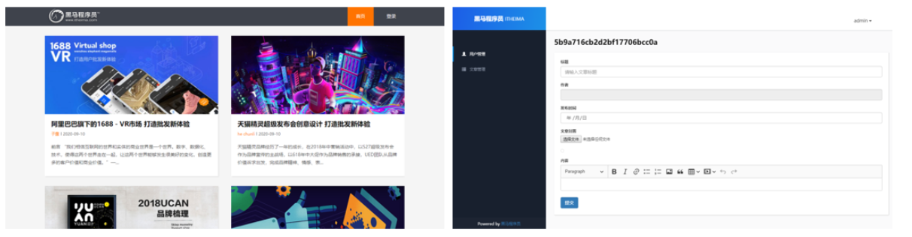

# 一、项目环境搭建

## 1.1 项目介绍

多人博客管理系统

1. 博客内容展示
2. 博客管理功能



## 1.2 案例初始化 

1. 建立项目所需文件夹

- public 静态资源
- model 数据库操作
- route 路由
- views 模板

2. 初始化项目描述文件
   npm init -y

3. 下载项目所需第三方模块
   npm install express mongoose art-template express-art-template

4. 创建网站服务器

5. 构建模块化路由

6. 构建博客管理页面模板

## 1.3 art模板中css、js等静态资源外链的问题

```
在浏览器地址栏中http://localhost:8080/admin/login
浏览器的请求地址时http://localhost:8080/admin   login浏览器认为是一个文件
```


```
//login.art文件
//这里的地址是一个相对路径
//相对的是浏览器请求路径的
//也就是http://localhost:8080/admin
//所以这里外链静态资源时需要使用绝对路径
//在路径的最前面加上/表示服务器的绝对路径
<head>
    <meta charset="UTF-8">
    <title>用户登录</title>
    <link rel="stylesheet" href="lib/bootstrap/css/bootstrap.min.css">
    <link rel="stylesheet" href="css/base.css">
</head>
```


## 1.4 模板优化 抽离公告区域


# 二、项目功能实现


# 三、 项目包含的知识点

## 3.1 密码加密 bcrypt

哈希加密是单程加密方式：1234 => abcd
在加密的密码中加入随机字符串可以增加密码被破解的难度。

```
// 导入bcrypt模块
const bcrypt = require('bcrypt');
// 生成随机字符串 gen => generate 生成 salt 盐
let salt = await bcrypt.genSalt(10);
// 使用随机字符串对密码进行加密
let pass = await bcrypt.hash('明文密码', salt);

```


```
// 密码比对
let isEqual = await bcrypt.compare('明文密码', '加密密码');

```


bcrypt依赖的其他环境

1. python 2.x 

   安装python 需要配置环境变量

2. node-gyp

    npm install -g node-gyp

3. windows-build-tools
   npm install --global --production windows-build-tools

## 3.2 cookie与session

cookie：浏览器在电脑硬盘中开辟的一块空间，主要供服务器端存储数据。

- cookie中的数据是以域名的形式进行区分的。
- cookie中的数据是有过期时间的，超过时间数据会被浏览器自动删除。
- cookie中的数据会随着请求被自动发送到服务器端。


session：实际上就是一个对象，存储在服务器端的内存中，在session对象中也可以存储多条数据，每一条数据都有一个sessionid做为唯一标识。


​		在第一次登录的过程中，客户端向服务器端发送邮箱地址和密码，服务器验证通过后，生成sessionId，并且可以在session中可以存储用户个人信息，然后服务器将sessionId发送给客户端，客户端将发来的sessionId存储在cookie中。

​		当第二次登录时，客户端将cookie发送给服务器端，服务器端拿到客户端发送过来的sessionId在服务器端查找sessionId，如果可以找到，说明用户是登录过的，没有找到，说明用户没有登录过。

​		只有用户是登录状态，才可以相应只有用户登录后才能获取到的数据，如果不是登录状态，给一些错误提示即可。

​		cookie实际上是客户端发送给服务器端验证身份的标识，每次客户端访问服务器端时，都需要发送cookie以验证自己的身份标识。

​		服务器端色session就是记录客户端身份信息的对象。	


在node.js中需要借助express-session实现session功能。

```
// 1.引入express-session模块
// 模块返回一个方法  
// 这个方法会为请求对象添加一个session属性   这个属性的值是一个对象 
// 当用户身份验证成功后会保存用户信息  在向session对象中存储数据时  会生成 sessionID
// 这个sessionID是当前存储数据的唯一标识   然后将sessionID存储在客户端中cookie中
// 当再一次访问服务器时  该方法会拿到客户端发送过来的cookie  并从cookie中提取sessionID
// 根据sessioID从cookie中找到用户信息  之后服务器端就知道访问服务器端的客户端的身份是谁
const session = require('express-session');
// secret 密钥  服务器端使用密钥进行加密和解密
// secret这个密钥可以是任意一个值
app.use(session({ secret: 'secret key' }));

```

## 3.3 Joi 

JavaScript对象的规则描述语言和验证器。

```
const Joi = require('joi');
//schema 验证规则
const schema = {
	//Joi.string()表示username只能是字符串类型的
	//alphanum表示username只能表示字母字符串或者是数字字符串 不能包含_#$等等字符
	//min、max表示字符串的最大值、最小值
	//required表示usename是一个必选属性
	//error属性里面是一个Error对象 Error对象里面可以指定错误的信息
    username: Joi.string().alphanum().min(3).max(30).required().error(new Error(‘错误信息’)),
    
    //regex正则规则  表示使用regex验证password
    password: Joi.string().regex(/^[a-zA-Z0-9]{3,30}$/),
    
    //[Joi.string(), Joi.number()] 是一个数组  表示既可以是一个字母字符串  或者是数字字符串
    access_token: [Joi.string(), Joi.number()],
    
    //integer表示birthyear必须是一个整数
    birthyear: Joi.number().integer().min(1900).max(2013),
    
    //email()表示email必须满足邮件的格式
    email: Joi.string().email()
};

//第一个参数表示需要验证的参数   第二个参数表述验证规则
//该方法返回一个promise对象
//如果验证通过   返回这个验证对象  
//验证失败  返回错误信息
Joi.validate({ username: 'abc', birthyear: 1994 }, schema);

```


## 3.4 formidable 

作用：解析表单，支持get请求参数，post请求参数、文件上传。

```
 // 引入formidable模块
 const formidable = require('formidable');
 // 创建表单解析对象
 const form = new formidable.IncomingForm();
 // 设置文件上传路径
 form.uploadDir = "/my/dir";
 // 是否保留表单上传文件的扩展名
 form.keepExtensions = false;
 // 对表单进行解析
 form.parse(req, (err, fields, files) => {
     // fields 存储普通请求参数
         // files 存储上传的文件信息
 });

```

