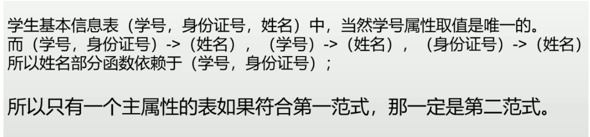
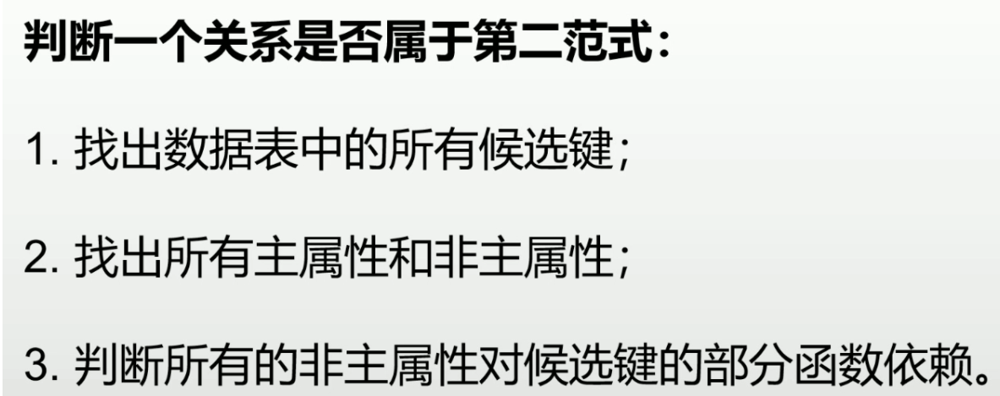

# 基本概念：

闭包：R(A,B,C)，F={A->B,B->C}     A+={A,B,C}  就是求能求出所有元素的最小组合

这个A就是一个候选码，组成候选码的属性就是主属性，其他属性就是非主属性。

在判断范式的时候，如果不属于2NF那么就不用在往下判断了，直接就是1NF

# 一、 第一范式(1NF)

第一范式是最基本的范式，符合数据表的原子性。

简单的说，**就是每一个元素都不可分割。**

- 表中的同一列的类型相同
- 一个列名只能对应到一列
- 并且每一列都不可分
- 行的上下关系互不影响

# 二、第二范式(2NF)

2NF是在1NF的基础之上，消除了非主属性对于主属性的部分函数依赖。

**简单的说，就是不存在非主属性对候选码的部分依赖**

# 三、第三范式(3NF)

第三范式就是表中的所有数据元素不但要能唯一的被主关键字所标识，而且他们之间还必须**相互独立**，不存在其他的函数关系。

**在符合第二范式的基础上，不存在非主属性对候选码的传递依赖**

所谓传递依赖，指的是如果存在"A->B->C"的决定关系，则C传递函数依赖于A。

# 四、BCNF

消除主属性对主键 ( 候选码 ) 的部分与传递依赖

**不存在对主属性对候选码的部分和传递依赖**

